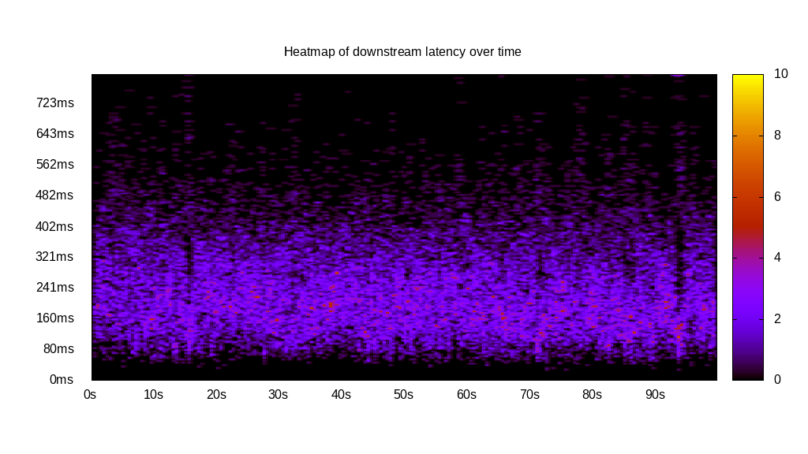
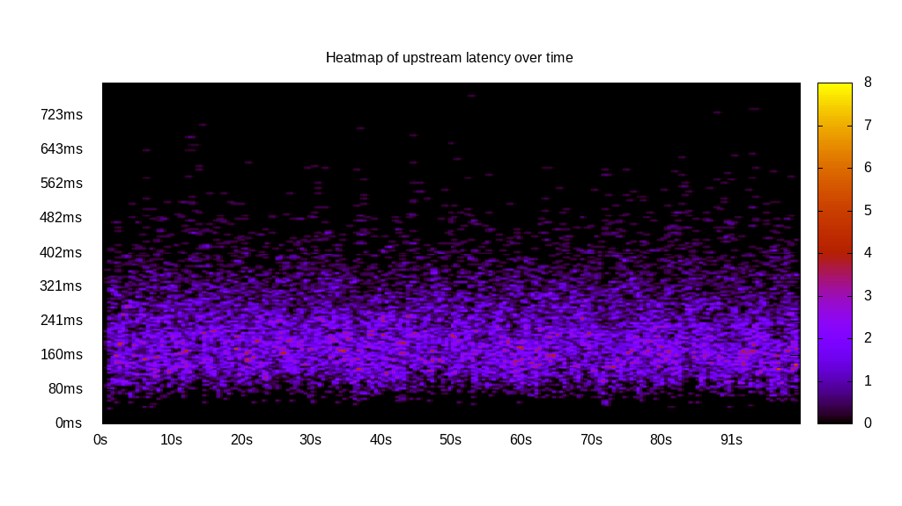
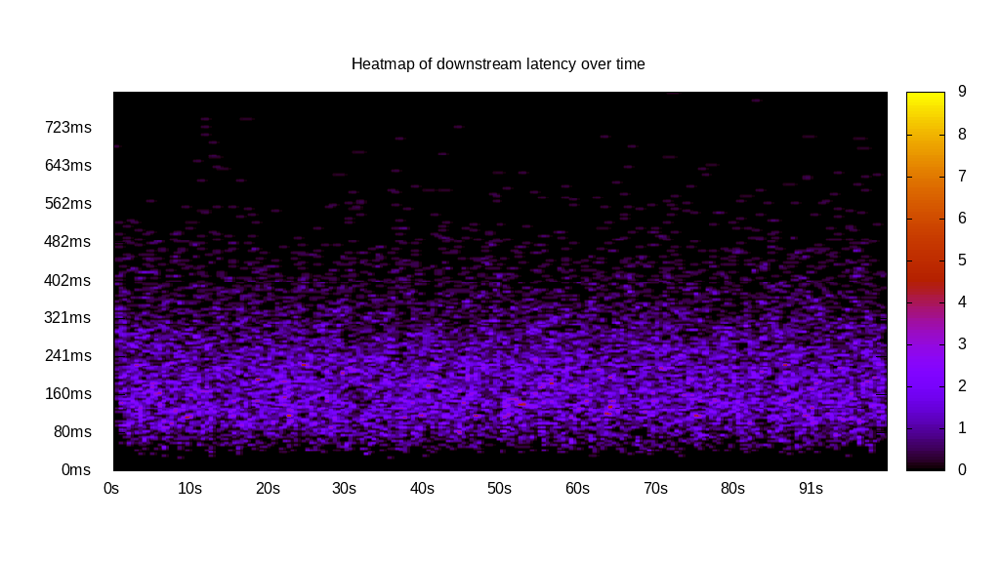
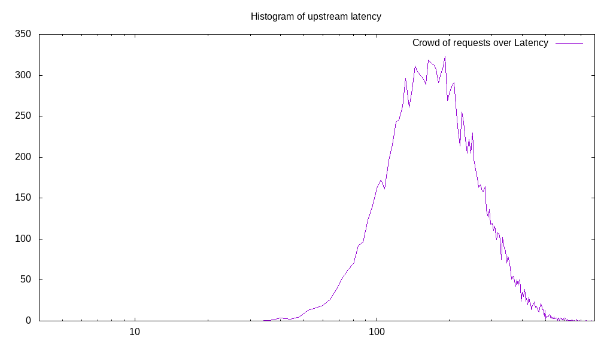
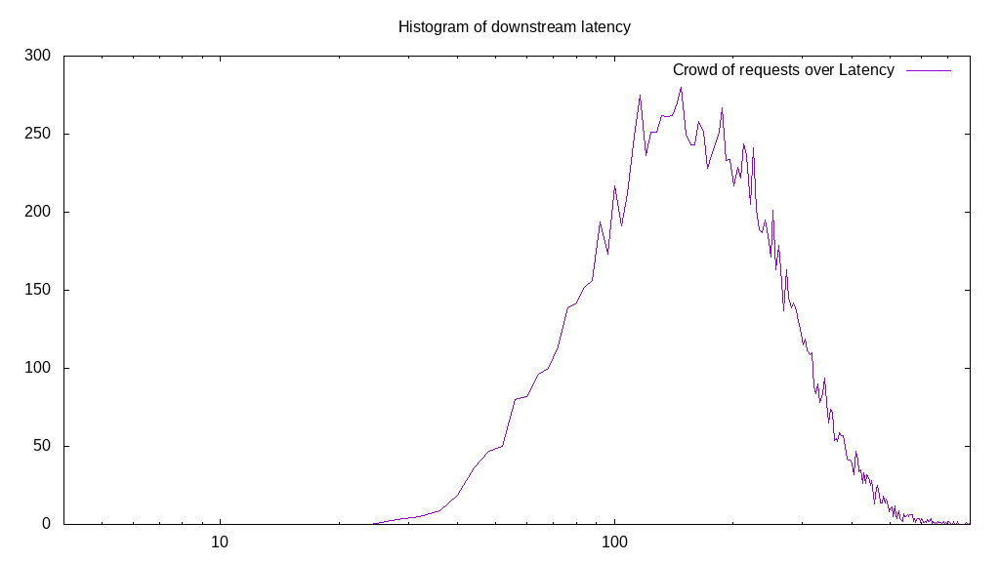

# Latency benchmark report. Crowd is 64

## Populate workload

## Object Size is 32.00kiB

### PUT Latency in ms over time

Evolution of PUT Latency over time

| Parameter | Value |
| --- | --- |
| Y Coordinate | PUT Latency in ms |
| X Coordinate | time in s since begining of workload |

### PUT Latency distribution in ms

Distribution of the PUT Latency in ms

| Parameter | Value |
| --- | --- |
| Y Coordinate | Number of PUT |
| X Coordinate | Latency in ms |
| Server volume | 3552.781MiB|
| Server bandwidth | 11.843MiB/s |
| Server time | 300.00s |
| Server load | 63.91 |
| Server responses | 113689PUT |
| Server IOps | 378.96PUT/s |
| Client bandwidth | 0.185MiB/s |
| Client volume | 55.512MiB|
| Client time | 19173.59s |
| Client IOps |  5.93PUT/s  |
| Client Latency | 168.65ms/PUT |
| Client Limbo | 0.41ms/PUT |
| Crowd time | 19199.94s |
| Crowd efficiency | 99.86% |
| Highest Latency | 791.96ms |
| 95th percentile Latency | 305.53ms |
| 68th percentile Latency | 192.96ms |
| 50th percentile Latency | 160.80ms |
| 32nd percentile Latency | 132.66ms |
| 5th percentile Latency | 84.42ms |
| Lowest Latency | 28.14ms |

## Read workload

## Object Size is 32.00kiB

### GET Latency in ms over time

Evolution of GET Latency over time

| Parameter | Value |
| --- | --- |
| Y Coordinate | GET Latency in ms |
| X Coordinate | time in s since begining of workload |

### GET Latency distribution in ms

Distribution of the GET Latency in ms

| Parameter | Value |
| --- | --- |
| Y Coordinate | Number of GET |
| X Coordinate | Latency in ms |
| Server volume | 824.469MiB|
| Server bandwidth | 8.215MiB/s |
| Server time | 100.36s |
| Server load | 63.54 |
| Server responses | 26383GET |
| Server IOps | 262.89GET/s |
| Client bandwidth | 0.128MiB/s |
| Client volume | 12.882MiB|
| Client time | 6376.39s |
| Client IOps |  4.14GET/s  |
| Client Latency | 241.69ms/GET |
| Client Limbo | 0.72ms/GET |
| Crowd time | 6422.78s |
| Crowd efficiency | 99.28% |
| Highest Latency | 800.00ms |
| 95th percentile Latency | 454.27ms |
| 68th percentile Latency | 281.41ms |
| 50th percentile Latency | 225.13ms |
| 32nd percentile Latency | 180.90ms |
| 5th percentile Latency | 96.48ms |
| Lowest Latency | 28.14ms |

## Mixed workload

## Object Size is 32.00kiB

### PUT Latency in ms over time

Evolution of PUT Latency over time

| Parameter | Value |
| --- | --- |
| Y Coordinate | PUT Latency in ms |
| X Coordinate | time in s since begining of workload |

### GET Latency in ms over time

Evolution of GET Latency over time

| Parameter | Value |
| --- | --- |
| Y Coordinate | GET Latency in ms |
| X Coordinate | time in s since begining of workload |

### PUT Latency distribution in ms

Distribution of the PUT Latency in ms

| Parameter | Value |
| --- | --- |
| Y Coordinate | Number of PUT |
| X Coordinate | Latency in ms |
| Server volume | 469.250MiB|
| Server bandwidth | 4.661MiB/s |
| Server time | 100.68s |
| Server load | 32.12 |
| Server responses | 15016PUT |
| Server IOps | 149.14PUT/s |
| Client bandwidth | 0.073MiB/s |
| Client volume | 7.332MiB|
| Client time | 3233.38s |
| Client IOps |  4.64PUT/s  |
| Client Latency | 215.33ms/PUT |
| Client Limbo | 50.16ms/PUT |
| Crowd time | 6443.58s |
| Crowd efficiency | 50.18% |
| Highest Latency | 771.86ms |
| 95th percentile Latency | 389.95ms |
| 68th percentile Latency | 245.23ms |
| 50th percentile Latency | 205.03ms |
| 32nd percentile Latency | 168.84ms |
| 5th percentile Latency | 100.50ms |
| Lowest Latency | 36.18ms |

### GET Latency distribution in ms

Distribution of the GET Latency in ms

| Parameter | Value |
| --- | --- |
| Y Coordinate | Number of GET |
| X Coordinate | Latency in ms |
| Server volume | 467.969MiB|
| Server bandwidth | 4.648MiB/s |
| Server time | 100.68s |
| Server load | 31.41 |
| Server responses | 14975GET |
| Server IOps | 148.74GET/s |
| Client bandwidth | 0.073MiB/s |
| Client volume | 7.312MiB|
| Client time | 3162.70s |
| Client IOps |  4.73GET/s  |
| Client Latency | 211.20ms/GET |
| Client Limbo | 51.26ms/GET |
| Crowd time | 6443.58s |
| Crowd efficiency | 49.08% |
| Highest Latency | 800.00ms |
| 95th percentile Latency | 410.05ms |
| 68th percentile Latency | 249.25ms |
| 50th percentile Latency | 196.98ms |
| 32nd percentile Latency | 152.76ms |
| 5th percentile Latency | 80.40ms |
| Lowest Latency | 28.14ms |

## Cleanup workload

## Object Size is 32.00kiB

### DELETE Latency in ms over time

Evolution of DELETE Latency over time

| Parameter | Value |
| --- | --- |
| Y Coordinate | DELETE Latency in ms |
| X Coordinate | time in s since begining of workload |

### DELETE Latency distribution in ms

Distribution of the DELETE Latency in ms

| Parameter | Value |
| --- | --- |
| Y Coordinate | Number of DELETE |
| X Coordinate | Latency in ms |
| Server volume | 3553.031MiB|
| Server bandwidth | 13.569MiB/s |
| Server time | 261.85s |
| Server load | 63.65 |
| Server responses | 113697DELETE |
| Server IOps | 434.21DELETE/s |
| Client bandwidth | 0.212MiB/s |
| Client volume | 55.516MiB|
| Client time | 16665.70s |
| Client IOps |  6.82DELETE/s  |
| Client Latency | 146.58ms/DELETE |
| Client Limbo | 1.45ms/DELETE |
| Crowd time | 16758.34s |
| Crowd efficiency | 99.45% |
| Highest Latency | 703.52ms |
| 95th percentile Latency | 277.39ms |
| 68th percentile Latency | 168.84ms |
| 50th percentile Latency | 136.68ms |
| 32nd percentile Latency | 112.56ms |
| 5th percentile Latency | 72.36ms |
| Lowest Latency | 12.06ms |

