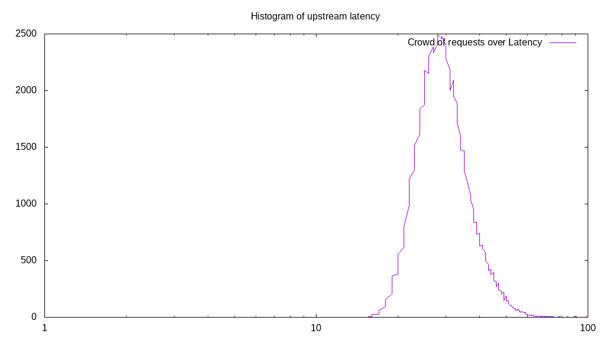
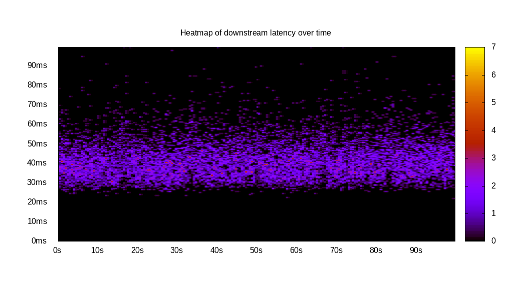
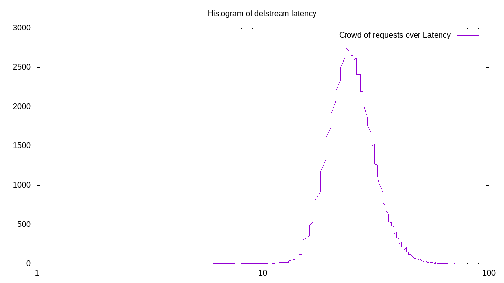

# Latency benchmark report. Crowd is 8

## Populate workload

## Object Size is 32.00kiB

### PUT Latency in ms over time

Evolution of PUT Latency over time

| Parameter | Value |
| --- | --- |
| Y Coordinate | PUT Latency in ms |
| X Coordinate | time in s since begining of workload |

### PUT Latency distribution in ms

Distribution of the PUT Latency in ms

| Parameter | Value |
| --- | --- |
| Y Coordinate | Number of PUT |
| X Coordinate | Latency in ms |
| Server volume | 2344.781MiB|
| Server bandwidth | 7.816MiB/s |
| Server time | 300.00s |
| Server load | 7.96 |
| Server responses | 75033PUT |
| Server IOps | 250.11PUT/s |
| Client bandwidth | 0.977MiB/s |
| Client volume | 293.098MiB|
| Client time | 2388.65s |
| Client IOps |  31.41PUT/s  |
| Client Latency | 31.83ms/PUT |
| Client Limbo | 1.42ms/PUT |
| Crowd time | 2399.99s |
| Crowd efficiency | 99.53% |
| Highest Latency | 114.78ms |
| 95th percentile Latency | 47.93ms |
| 68th percentile Latency | 35.32ms |
| 50th percentile Latency | 31.53ms |
| 32nd percentile Latency | 29.01ms |
| 5th percentile Latency | 22.70ms |
| Lowest Latency | 15.14ms |

## Read workload

## Object Size is 32.00kiB

### GET Latency in ms over time

Evolution of GET Latency over time

| Parameter | Value |
| --- | --- |
| Y Coordinate | GET Latency in ms |
| X Coordinate | time in s since begining of workload |

### GET Latency distribution in ms

Distribution of the GET Latency in ms

| Parameter | Value |
| --- | --- |
| Y Coordinate | Number of GET |
| X Coordinate | Latency in ms |
| Server volume | 609.375MiB|
| Server bandwidth | 6.092MiB/s |
| Server time | 100.02s |
| Server load | 7.96 |
| Server responses | 19500GET |
| Server IOps | 194.96GET/s |
| Client bandwidth | 0.762MiB/s |
| Client volume | 76.172MiB|
| Client time | 796.38s |
| Client IOps |  24.49GET/s  |
| Client Latency | 40.84ms/GET |
| Client Limbo | 0.47ms/GET |
| Crowd time | 800.17s |
| Crowd efficiency | 99.53% |
| Highest Latency | 237.13ms |
| 95th percentile Latency | 59.28ms |
| 68th percentile Latency | 44.15ms |
| 50th percentile Latency | 40.36ms |
| 32nd percentile Latency | 36.58ms |
| 5th percentile Latency | 30.27ms |
| Lowest Latency | 21.44ms |

## Mixed workload

## Object Size is 32.00kiB

### PUT Latency in ms over time

Evolution of PUT Latency over time

| Parameter | Value |
| --- | --- |
| Y Coordinate | PUT Latency in ms |
| X Coordinate | time in s since begining of workload |

### GET Latency in ms over time

Evolution of GET Latency over time

| Parameter | Value |
| --- | --- |
| Y Coordinate | GET Latency in ms |
| X Coordinate | time in s since begining of workload |

### PUT Latency distribution in ms

Distribution of the PUT Latency in ms

| Parameter | Value |
| --- | --- |
| Y Coordinate | Number of PUT |
| X Coordinate | Latency in ms |
| Server volume | 313.188MiB|
| Server bandwidth | 3.130MiB/s |
| Server time | 100.05s |
| Server load | 3.75 |
| Server responses | 10022PUT |
| Server IOps | 100.17PUT/s |
| Client bandwidth | 0.391MiB/s |
| Client volume | 39.148MiB|
| Client time | 375.60s |
| Client IOps |  26.68PUT/s  |
| Client Latency | 37.48ms/PUT |
| Client Limbo | 53.10ms/PUT |
| Crowd time | 800.38s |
| Crowd efficiency | 46.93% |
| Highest Latency | 206.85ms |
| 95th percentile Latency | 56.76ms |
| 68th percentile Latency | 41.62ms |
| 50th percentile Latency | 37.84ms |
| 32nd percentile Latency | 32.79ms |
| 5th percentile Latency | 25.23ms |
| Lowest Latency | 17.66ms |

### GET Latency distribution in ms

Distribution of the GET Latency in ms

| Parameter | Value |
| --- | --- |
| Y Coordinate | Number of GET |
| X Coordinate | Latency in ms |
| Server volume | 312.531MiB|
| Server bandwidth | 3.124MiB/s |
| Server time | 100.05s |
| Server load | 4.21 |
| Server responses | 10001GET |
| Server IOps | 99.96GET/s |
| Client bandwidth | 0.390MiB/s |
| Client volume | 39.066MiB|
| Client time | 421.10s |
| Client IOps |  23.75GET/s  |
| Client Latency | 42.11ms/GET |
| Client Limbo | 47.41ms/GET |
| Crowd time | 800.38s |
| Crowd efficiency | 52.61% |
| Highest Latency | 221.99ms |
| 95th percentile Latency | 60.54ms |
| 68th percentile Latency | 46.67ms |
| 50th percentile Latency | 41.62ms |
| 32nd percentile Latency | 37.84ms |
| 5th percentile Latency | 31.53ms |
| Lowest Latency | 21.44ms |

## Cleanup workload

## Object Size is 32.00kiB

### DELETE Latency in ms over time

Evolution of DELETE Latency over time

| Parameter | Value |
| --- | --- |
| Y Coordinate | DELETE Latency in ms |
| X Coordinate | time in s since begining of workload |

### DELETE Latency distribution in ms

Distribution of the DELETE Latency in ms

| Parameter | Value |
| --- | --- |
| Y Coordinate | Number of DELETE |
| X Coordinate | Latency in ms |
| Server volume | 2345.031MiB|
| Server bandwidth | 9.150MiB/s |
| Server time | 256.29s |
| Server load | 7.93 |
| Server responses | 75041DELETE |
| Server IOps | 292.80DELETE/s |
| Client bandwidth | 1.144MiB/s |
| Client volume | 293.129MiB|
| Client time | 2032.88s |
| Client IOps |  36.91DELETE/s  |
| Client Latency | 27.09ms/DELETE |
| Client Limbo | 2.18ms/DELETE |
| Crowd time | 2050.33s |
| Crowd efficiency | 99.15% |
| Highest Latency | 251.00ms |
| 95th percentile Latency | 40.36ms |
| 68th percentile Latency | 30.27ms |
| 50th percentile Latency | 27.75ms |
| 32nd percentile Latency | 25.23ms |
| 5th percentile Latency | 18.92ms |
| Lowest Latency | 6.31ms |

