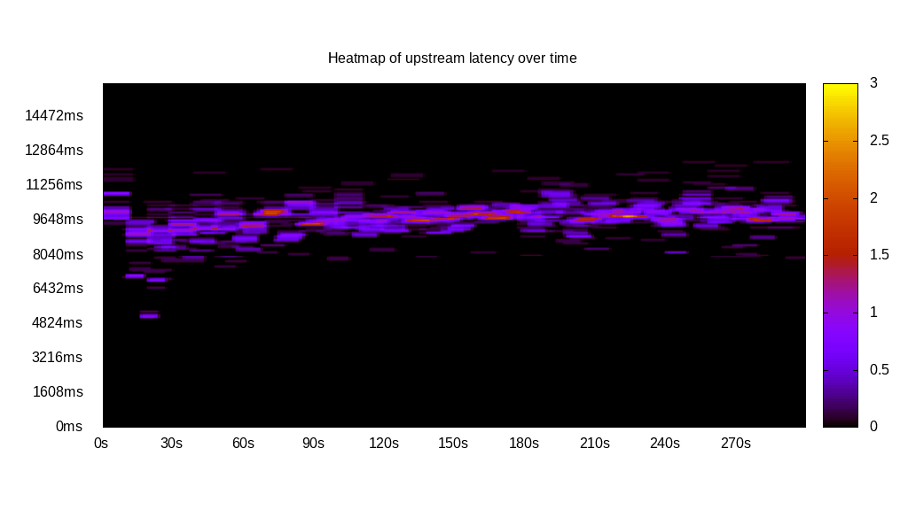
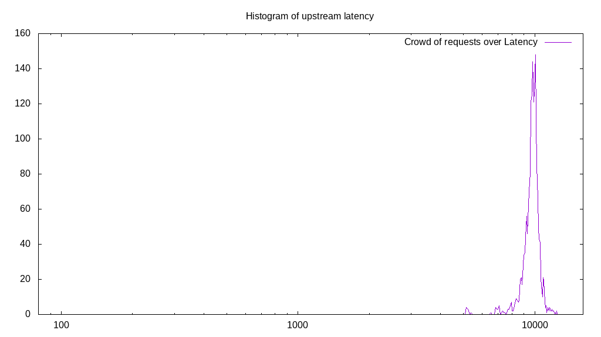
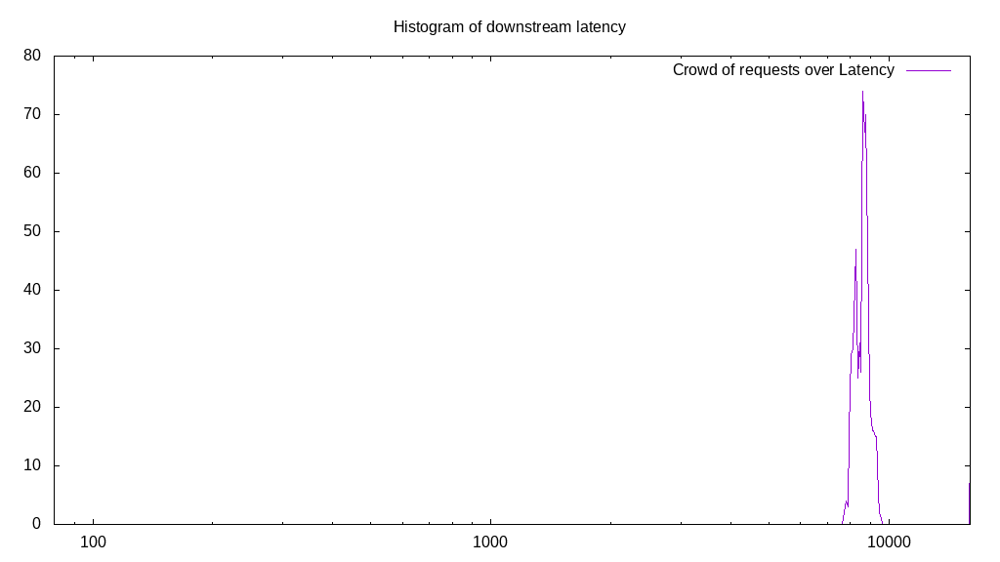
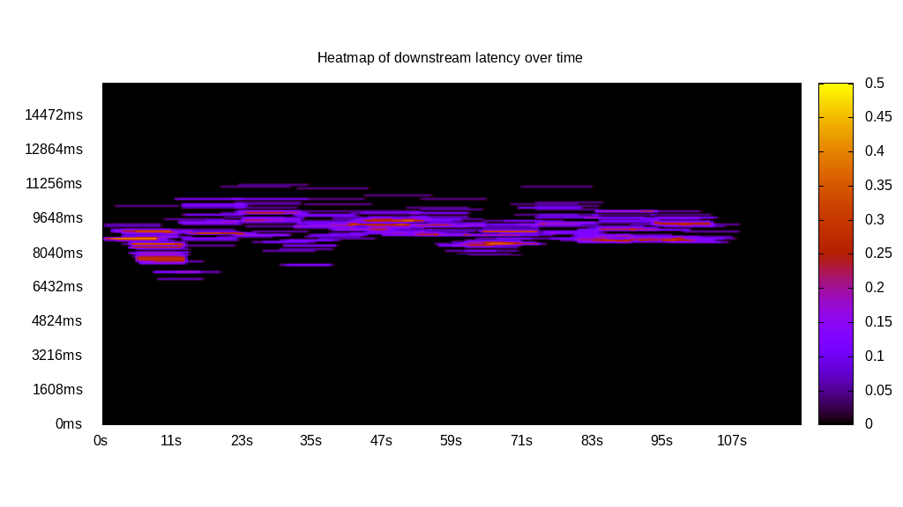
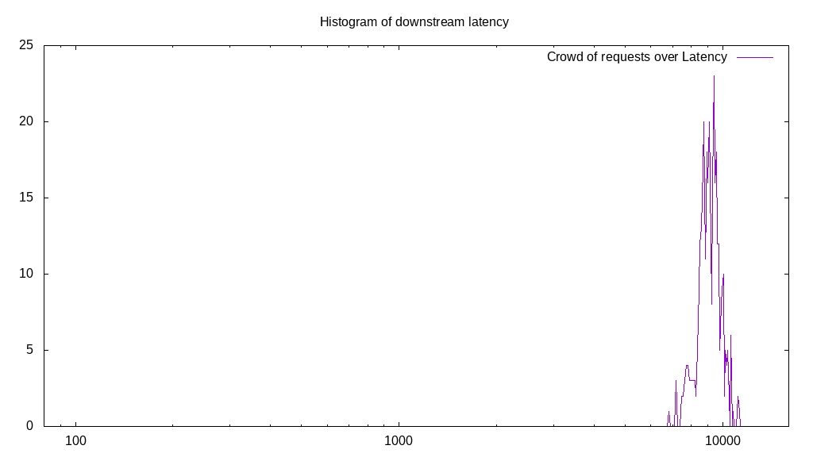
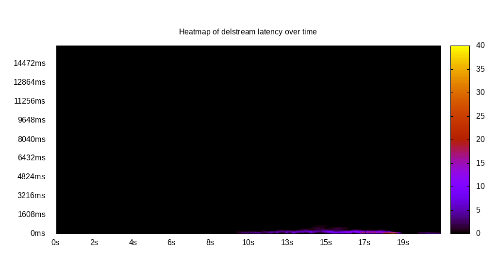

# Latency benchmark report. Crowd is 64

## Populate workload

## Object Size is 32768.00kiB

### PUT Latency in ms over time

Evolution of PUT Latency over time

| Parameter | Value |
| --- | --- |
| Y Coordinate | PUT Latency in ms |
| X Coordinate | time in s since begining of workload |

### PUT Latency distribution in ms

Distribution of the PUT Latency in ms

| Parameter | Value |
| --- | --- |
| Y Coordinate | Number of PUT |
| X Coordinate | Latency in ms |
| Server volume | 61536.000MiB|
| Server bandwidth | 205.974MiB/s |
| Server time | 298.76s |
| Server load | 62.78 |
| Server responses | 1923PUT |
| Server IOps | 6.44PUT/s |
| Client bandwidth | 3.218MiB/s |
| Client volume | 961.500MiB|
| Client time | 18757.10s |
| Client IOps |  0.10PUT/s  |
| Client Latency | 9754.08ms/PUT |
| Client Limbo | 5.68ms/PUT |
| Crowd time | 19120.38s |
| Crowd efficiency | 98.10% |
| Highest Latency | 12381.91ms |
| 95th percentile Latency | 10773.87ms |
| 68th percentile Latency | 10130.65ms |
| 50th percentile Latency | 9889.45ms |
| 32nd percentile Latency | 9728.64ms |
| 5th percentile Latency | 8683.42ms |
| Lowest Latency | 5145.73ms |

## Read workload

## Object Size is 32768.00kiB

### GET Latency in ms over time

Evolution of GET Latency over time

| Parameter | Value |
| --- | --- |
| Y Coordinate | GET Latency in ms |
| X Coordinate | time in s since begining of workload |

### GET Latency distribution in ms

Distribution of the GET Latency in ms

| Parameter | Value |
| --- | --- |
| Y Coordinate | Number of GET |
| X Coordinate | Latency in ms |
| Server volume | 20416.000MiB|
| Server bandwidth | 191.793MiB/s |
| Server time | 106.45s |
| Server load | 53.55 |
| Server responses | 638GET |
| Server IOps | 5.99GET/s |
| Client bandwidth | 2.997MiB/s |
| Client volume | 319.000MiB|
| Client time | 5700.58s |
| Client IOps |  0.11GET/s  |
| Client Latency | 8935.08ms/GET |
| Client Limbo | 17.38ms/GET |
| Crowd time | 6812.67s |
| Crowd efficiency | 83.68% |
| Highest Latency | 16000.00ms |
| 95th percentile Latency | 9407.04ms |
| 68th percentile Latency | 8844.22ms |
| 50th percentile Latency | 8683.42ms |
| 32nd percentile Latency | 8522.61ms |
| 5th percentile Latency | 8120.60ms |
| Lowest Latency | 7718.59ms |

## Mixed workload

## Object Size is 32768.00kiB

### PUT Latency in ms over time

Evolution of PUT Latency over time

| Parameter | Value |
| --- | --- |
| Y Coordinate | PUT Latency in ms |
| X Coordinate | time in s since begining of workload |

### GET Latency in ms over time

Evolution of GET Latency over time

| Parameter | Value |
| --- | --- |
| Y Coordinate | GET Latency in ms |
| X Coordinate | time in s since begining of workload |

### PUT Latency distribution in ms

Distribution of the PUT Latency in ms

| Parameter | Value |
| --- | --- |
| Y Coordinate | Number of PUT |
| X Coordinate | Latency in ms |
| Server volume | 9984.000MiB|
| Server bandwidth | 84.140MiB/s |
| Server time | 118.66s |
| Server load | 25.68 |
| Server responses | 312PUT |
| Server IOps | 2.63PUT/s |
| Client bandwidth | 1.315MiB/s |
| Client volume | 156.000MiB|
| Client time | 3047.49s |
| Client IOps |  0.10PUT/s  |
| Client Latency | 9767.61ms/PUT |
| Client Limbo | 71.04ms/PUT |
| Crowd time | 7594.24s |
| Crowd efficiency | 40.13% |
| Highest Latency | 16000.00ms |
| 95th percentile Latency | 11015.08ms |
| 68th percentile Latency | 10211.06ms |
| 50th percentile Latency | 9648.24ms |
| 32nd percentile Latency | 9407.04ms |
| 5th percentile Latency | 8844.22ms |
| Lowest Latency | 7718.59ms |

### GET Latency distribution in ms

Distribution of the GET Latency in ms

| Parameter | Value |
| --- | --- |
| Y Coordinate | Number of GET |
| X Coordinate | Latency in ms |
| Server volume | 11488.000MiB|
| Server bandwidth | 96.814MiB/s |
| Server time | 118.66s |
| Server load | 27.68 |
| Server responses | 359GET |
| Server IOps | 3.03GET/s |
| Client bandwidth | 1.513MiB/s |
| Client volume | 179.500MiB|
| Client time | 3284.33s |
| Client IOps |  0.11GET/s  |
| Client Latency | 9148.55ms/GET |
| Client Limbo | 67.34ms/GET |
| Crowd time | 7594.24s |
| Crowd efficiency | 43.25% |
| Highest Latency | 11256.28ms |
| 95th percentile Latency | 10452.26ms |
| 68th percentile Latency | 9567.84ms |
| 50th percentile Latency | 9246.23ms |
| 32nd percentile Latency | 8924.62ms |
| 5th percentile Latency | 7879.40ms |
| Lowest Latency | 6834.17ms |

## Cleanup workload

## Object Size is 32768.00kiB

### DELETE Latency in ms over time

Evolution of DELETE Latency over time

| Parameter | Value |
| --- | --- |
| Y Coordinate | DELETE Latency in ms |
| X Coordinate | time in s since begining of workload |

### DELETE Latency distribution in ms

Distribution of the DELETE Latency in ms

| Parameter | Value |
| --- | --- |
| Y Coordinate | Number of DELETE |
| X Coordinate | Latency in ms |
| Server volume | 61824.000MiB|
| Server bandwidth | 2861.030MiB/s |
| Server time | 21.61s |
| Server load | 12.67 |
| Server responses | 1932DELETE |
| Server IOps | 89.41DELETE/s |
| Client bandwidth | 44.704MiB/s |
| Client volume | 966.000MiB|
| Client time | 273.82s |
| Client IOps |  7.06DELETE/s  |
| Client Latency | 141.73ms/DELETE |
| Client Limbo | 17.33ms/DELETE |
| Crowd time | 1382.98s |
| Crowd efficiency | 19.80% |
| Highest Latency | 723.62ms |
| 95th percentile Latency | 402.01ms |
| 68th percentile Latency | 241.21ms |
| 50th percentile Latency | 241.21ms |
| 32nd percentile Latency | 160.80ms |
| 5th percentile Latency | 80.40ms |
| Lowest Latency | 80.40ms |

