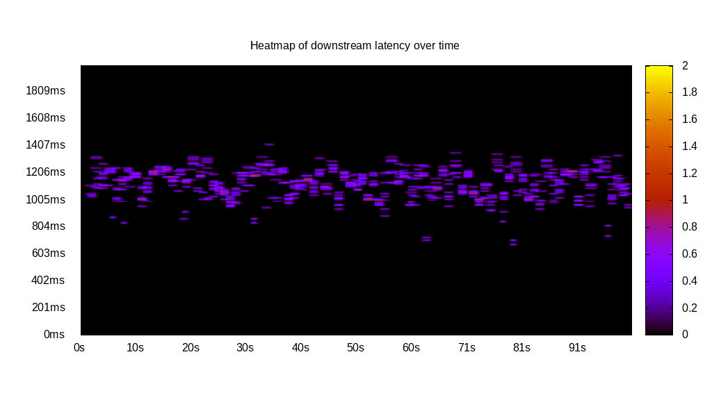
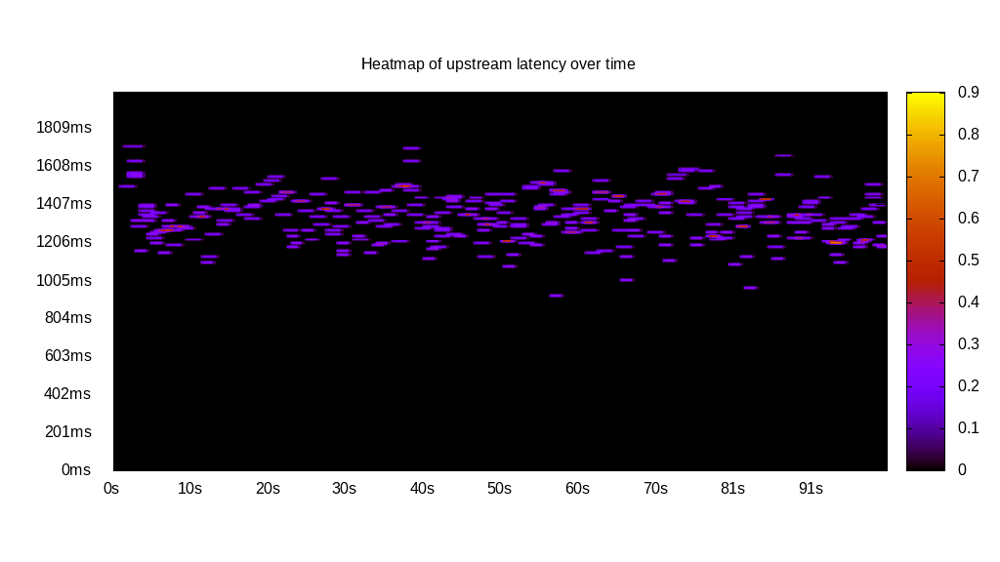
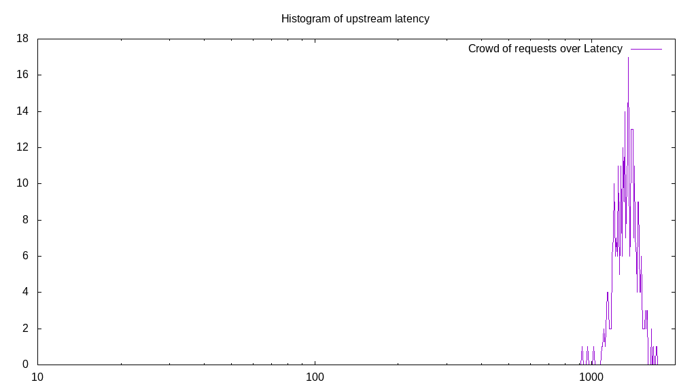
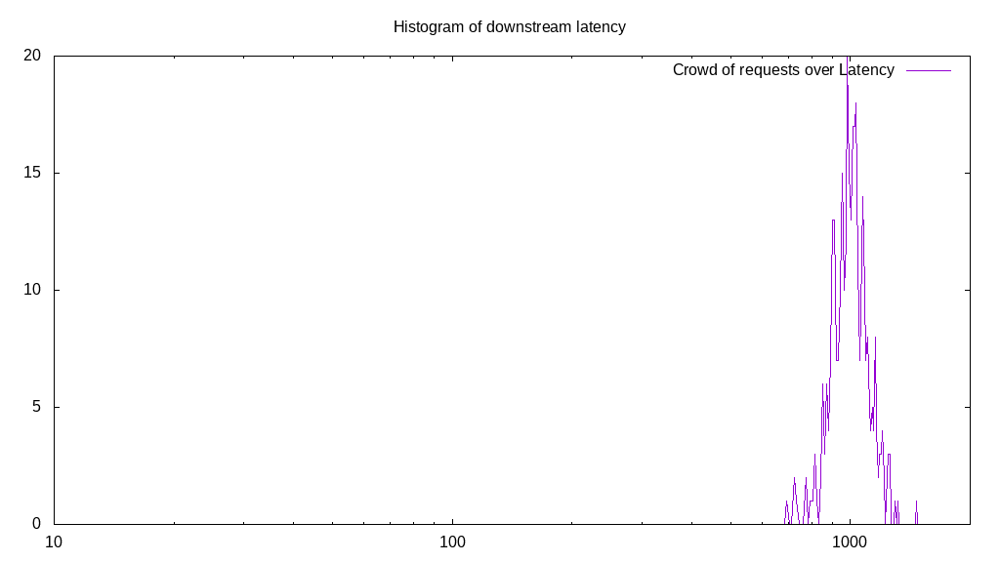
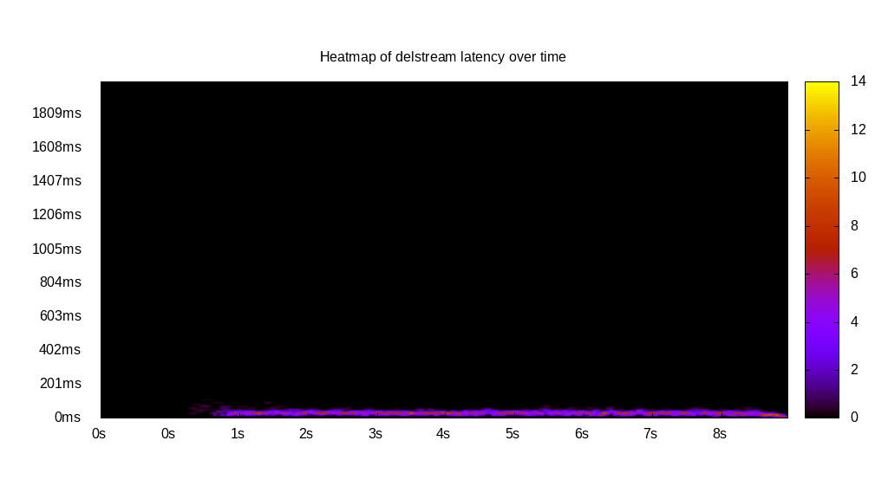

# Latency benchmark report. Crowd is 8

## Populate workload

## Object Size is 32768.00kiB

### PUT Latency in ms over time

Evolution of PUT Latency over time

| Parameter | Value |
| --- | --- |
| Y Coordinate | PUT Latency in ms |
| X Coordinate | time in s since begining of workload |

### PUT Latency distribution in ms

Distribution of the PUT Latency in ms

| Parameter | Value |
| --- | --- |
| Y Coordinate | Number of PUT |
| X Coordinate | Latency in ms |
| Server volume | 66560.000MiB|
| Server bandwidth | 221.894MiB/s |
| Server time | 299.96s |
| Server load | 7.98 |
| Server responses | 2080PUT |
| Server IOps | 6.93PUT/s |
| Client bandwidth | 27.737MiB/s |
| Client volume | 8320.000MiB|
| Client time | 2394.93s |
| Client IOps |  0.87PUT/s  |
| Client Latency | 1151.41ms/PUT |
| Client Limbo | 0.60ms/PUT |
| Crowd time | 2399.70s |
| Crowd efficiency | 99.80% |
| Highest Latency | 1588.50ms |
| 95th percentile Latency | 1389.94ms |
| 68th percentile Latency | 1225.91ms |
| 50th percentile Latency | 1156.84ms |
| 32nd percentile Latency | 1105.05ms |
| 5th percentile Latency | 932.38ms |
| Lowest Latency | 630.22ms |

## Read workload

## Object Size is 32768.00kiB

### GET Latency in ms over time

Evolution of GET Latency over time

| Parameter | Value |
| --- | --- |
| Y Coordinate | GET Latency in ms |
| X Coordinate | time in s since begining of workload |

### GET Latency distribution in ms

Distribution of the GET Latency in ms

| Parameter | Value |
| --- | --- |
| Y Coordinate | Number of GET |
| X Coordinate | Latency in ms |
| Server volume | 22336.000MiB|
| Server bandwidth | 221.022MiB/s |
| Server time | 101.06s |
| Server load | 7.82 |
| Server responses | 698GET |
| Server IOps | 6.91GET/s |
| Client bandwidth | 27.628MiB/s |
| Client volume | 2792.000MiB|
| Client time | 789.78s |
| Client IOps |  0.88GET/s  |
| Client Latency | 1131.50ms/GET |
| Client Limbo | 2.33ms/GET |
| Crowd time | 808.46s |
| Crowd efficiency | 97.69% |
| Highest Latency | 1415.84ms |
| 95th percentile Latency | 1294.97ms |
| 68th percentile Latency | 1200.01ms |
| 50th percentile Latency | 1148.21ms |
| 32nd percentile Latency | 1096.41ms |
| 5th percentile Latency | 975.55ms |
| Lowest Latency | 673.39ms |

## Mixed workload

## Object Size is 32768.00kiB

### PUT Latency in ms over time

Evolution of PUT Latency over time

| Parameter | Value |
| --- | --- |
| Y Coordinate | PUT Latency in ms |
| X Coordinate | time in s since begining of workload |

### GET Latency in ms over time

Evolution of GET Latency over time

| Parameter | Value |
| --- | --- |
| Y Coordinate | GET Latency in ms |
| X Coordinate | time in s since begining of workload |

### PUT Latency distribution in ms

Distribution of the PUT Latency in ms

| Parameter | Value |
| --- | --- |
| Y Coordinate | Number of PUT |
| X Coordinate | Latency in ms |
| Server volume | 10624.000MiB|
| Server bandwidth | 105.420MiB/s |
| Server time | 100.78s |
| Server load | 4.43 |
| Server responses | 332PUT |
| Server IOps | 3.29PUT/s |
| Client bandwidth | 13.177MiB/s |
| Client volume | 1328.000MiB|
| Client time | 446.80s |
| Client IOps |  0.74PUT/s  |
| Client Latency | 1345.79ms/PUT |
| Client Limbo | 44.93ms/PUT |
| Crowd time | 806.22s |
| Crowd efficiency | 55.42% |
| Highest Latency | 1718.00ms |
| 95th percentile Latency | 1553.97ms |
| 68th percentile Latency | 1407.21ms |
| 50th percentile Latency | 1355.41ms |
| 32nd percentile Latency | 1303.61ms |
| 5th percentile Latency | 1156.84ms |
| Lowest Latency | 932.38ms |

### GET Latency distribution in ms

Distribution of the GET Latency in ms

| Parameter | Value |
| --- | --- |
| Y Coordinate | Number of GET |
| X Coordinate | Latency in ms |
| Server volume | 11136.000MiB|
| Server bandwidth | 110.500MiB/s |
| Server time | 100.78s |
| Server load | 3.50 |
| Server responses | 348GET |
| Server IOps | 3.45GET/s |
| Client bandwidth | 13.813MiB/s |
| Client volume | 1392.000MiB|
| Client time | 352.51s |
| Client IOps |  0.99GET/s  |
| Client Latency | 1012.95ms/GET |
| Client Limbo | 56.71ms/GET |
| Crowd time | 806.22s |
| Crowd efficiency | 43.72% |
| Highest Latency | 1459.01ms |
| 95th percentile Latency | 1208.64ms |
| 68th percentile Latency | 1061.88ms |
| 50th percentile Latency | 1018.71ms |
| 32nd percentile Latency | 975.55ms |
| 5th percentile Latency | 863.32ms |
| Lowest Latency | 699.29ms |

## Cleanup workload

## Object Size is 32768.00kiB

### DELETE Latency in ms over time

Evolution of DELETE Latency over time

| Parameter | Value |
| --- | --- |
| Y Coordinate | DELETE Latency in ms |
| X Coordinate | time in s since begining of workload |

### DELETE Latency distribution in ms

Distribution of the DELETE Latency in ms

| Parameter | Value |
| --- | --- |
| Y Coordinate | Number of DELETE |
| X Coordinate | Latency in ms |
| Server volume | 66816.000MiB|
| Server bandwidth | 6801.995MiB/s |
| Server time | 9.82s |
| Server load | 6.55 |
| Server responses | 2088DELETE |
| Server IOps | 212.56DELETE/s |
| Client bandwidth | 850.249MiB/s |
| Client volume | 8352.000MiB|
| Client time | 64.31s |
| Client IOps |  32.47DELETE/s  |
| Client Latency | 30.80ms/DELETE |
| Client Limbo | 1.78ms/DELETE |
| Crowd time | 78.58s |
| Crowd efficiency | 81.84% |
| Highest Latency | 112.23ms |
| 95th percentile Latency | 51.80ms |
| 68th percentile Latency | 43.17ms |
| 50th percentile Latency | 34.53ms |
| 32nd percentile Latency | 34.53ms |
| 5th percentile Latency | 25.90ms |
| Lowest Latency | 8.63ms |

