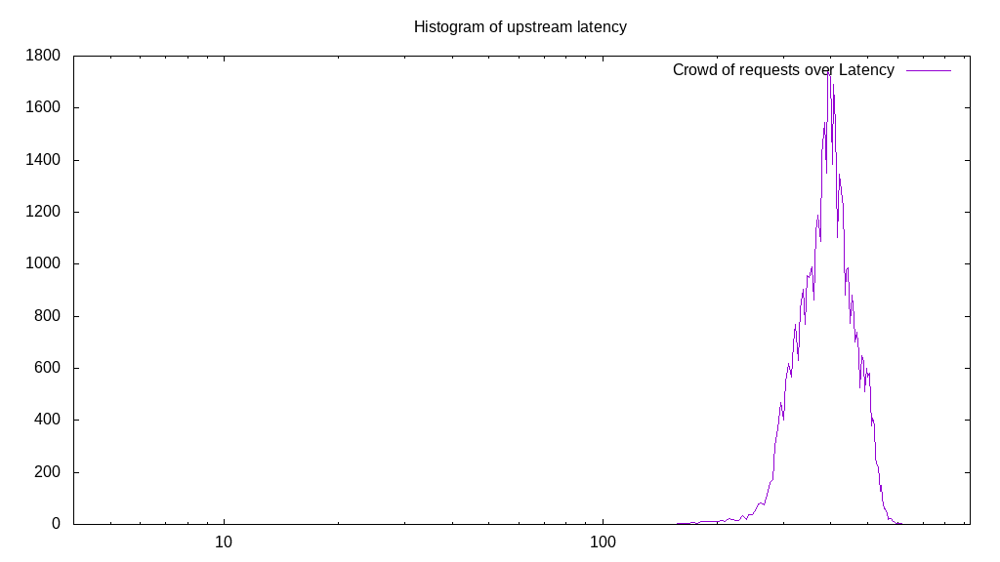

# Latency benchmark report. Crowd is 64

## Populate workload

## Object Size is 1.00kiB

### PUT Latency in ms over time

Evolution of PUT Latency over time

| Parameter | Value |
| --- | --- |
| Y Coordinate | PUT Latency in ms |
| X Coordinate | time in s since begining of workload |

### PUT Latency distribution in ms

Distribution of the PUT Latency in ms

| Parameter | Value |
| --- | --- |
| Y Coordinate | Number of PUT |
| X Coordinate | Latency in ms |
| Workload duration | 300.00s |
| Workload volume | 46.282MiB|
| Workload bandwidth | 0.154MiB/s |
| Client time spent | 12298.07s |
| C.time/W.duration | 40.99 |
| Request count | 47393PUT |
| Request per second (avg.) | 157.98PUT/s |
| Highest Latency | 632.94ms |
| 95th percentile Latency | 515.73ms |
| 68th percentile Latency | 436.03ms |
| 50th percentile Latency | 403.21ms |
| 32nd percentile Latency | 379.76ms |
| 5th percentile Latency | 304.75ms |
| Lowest Latency | 135.96ms |

## Read workload

## Object Size is 1.00kiB

### GET Latency in ms over time

Evolution of GET Latency over time

| Parameter | Value |
| --- | --- |
| Y Coordinate | GET Latency in ms |
| X Coordinate | time in s since begining of workload |

### GET Latency distribution in ms

Distribution of the GET Latency in ms

| Parameter | Value |
| --- | --- |
| Y Coordinate | Number of GET |
| X Coordinate | Latency in ms |
| Workload duration | 100.44s |
| Workload volume | 8.833MiB|
| Workload bandwidth | 0.088MiB/s |
| Client time spent | 3849.81s |
| C.time/W.duration | 38.33 |
| Request count | 9045GET |
| Request per second (avg.) | 90.05GET/s |
| Highest Latency | 933.00ms |
| 95th percentile Latency | 806.41ms |
| 68th percentile Latency | 726.71ms |
| 50th percentile Latency | 698.58ms |
| 32nd percentile Latency | 679.82ms |
| 5th percentile Latency | 609.50ms |
| Lowest Latency | 473.53ms |

## Mixed workload

## Object Size is 1.00kiB

### PUT Latency in ms over time

Evolution of PUT Latency over time

| Parameter | Value |
| --- | --- |
| Y Coordinate | PUT Latency in ms |
| X Coordinate | time in s since begining of workload |

### GET Latency in ms over time

Evolution of GET Latency over time

| Parameter | Value |
| --- | --- |
| Y Coordinate | GET Latency in ms |
| X Coordinate | time in s since begining of workload |

### PUT Latency distribution in ms

Distribution of the PUT Latency in ms

| Parameter | Value |
| --- | --- |
| Y Coordinate | Number of PUT |
| X Coordinate | Latency in ms |
| Workload duration | 100.70s |
| Workload volume | 5.596MiB|
| Workload bandwidth | 0.056MiB/s |
| Client time spent | 1605.49s |
| C.time/W.duration | 15.94 |
| Request count | 5730PUT |
| Request per second (avg.) | 56.90PUT/s |
| Highest Latency | 604.81ms |
| 95th percentile Latency | 520.42ms |
| 68th percentile Latency | 450.09ms |
| 50th percentile Latency | 431.34ms |
| 32nd percentile Latency | 412.58ms |
| 5th percentile Latency | 365.70ms |
| Lowest Latency | 285.99ms |

### GET Latency distribution in ms

Distribution of the GET Latency in ms

| Parameter | Value |
| --- | --- |
| Y Coordinate | Number of GET |
| X Coordinate | Latency in ms |
| Workload duration | 100.70s |
| Workload volume | 5.538MiB|
| Workload bandwidth | 0.055MiB/s |
| Client time spent | 2324.15s |
| C.time/W.duration | 23.08 |
| Request count | 5671GET |
| Request per second (avg.) | 56.31GET/s |
| Highest Latency | 918.93ms |
| 95th percentile Latency | 797.04ms |
| 68th percentile Latency | 717.33ms |
| 50th percentile Latency | 689.20ms |
| 32nd percentile Latency | 665.76ms |
| 5th percentile Latency | 595.43ms |
| Lowest Latency | 473.53ms |

## Cleanup workload

## Object Size is 1.00kiB

### DELETE Latency in ms over time

Evolution of DELETE Latency over time

| Parameter | Value |
| --- | --- |
| Y Coordinate | DELETE Latency in ms |
| X Coordinate | time in s since begining of workload |

### DELETE Latency distribution in ms

Distribution of the DELETE Latency in ms

| Parameter | Value |
| --- | --- |
| Y Coordinate | Number of DELETE |
| X Coordinate | Latency in ms |
| Workload duration | 289.36s |
| Workload volume | 46.290MiB|
| Workload bandwidth | 0.160MiB/s |
| Client time spent | 11317.43s |
| C.time/W.duration | 39.11 |
| Request count | 47401DELETE |
| Request per second (avg.) | 163.82DELETE/s |
| Highest Latency | 647.01ms |
| 95th percentile Latency | 473.53ms |
| 68th percentile Latency | 412.58ms |
| 50th percentile Latency | 389.14ms |
| 32nd percentile Latency | 365.70ms |
| 5th percentile Latency | 309.44ms |
| Lowest Latency | 60.95ms |

