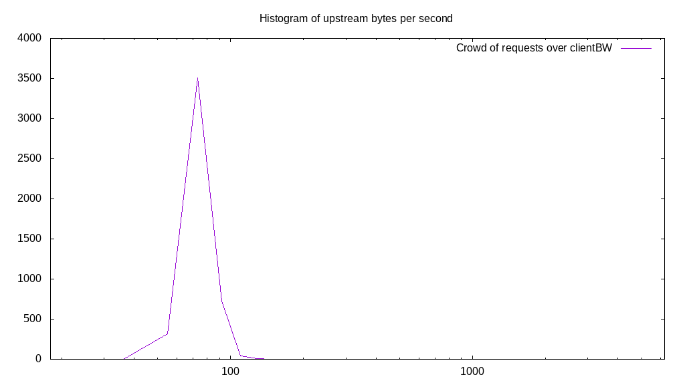
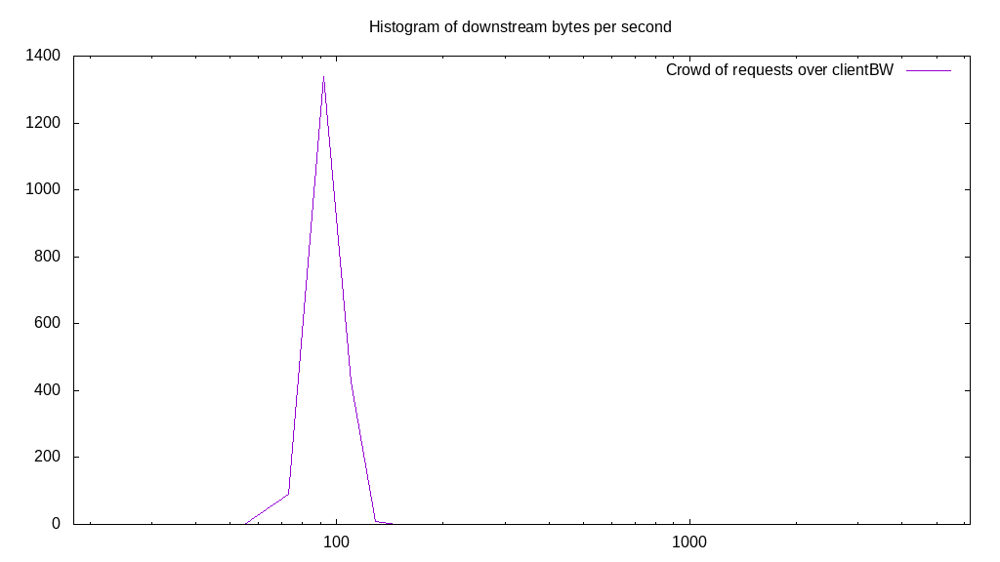
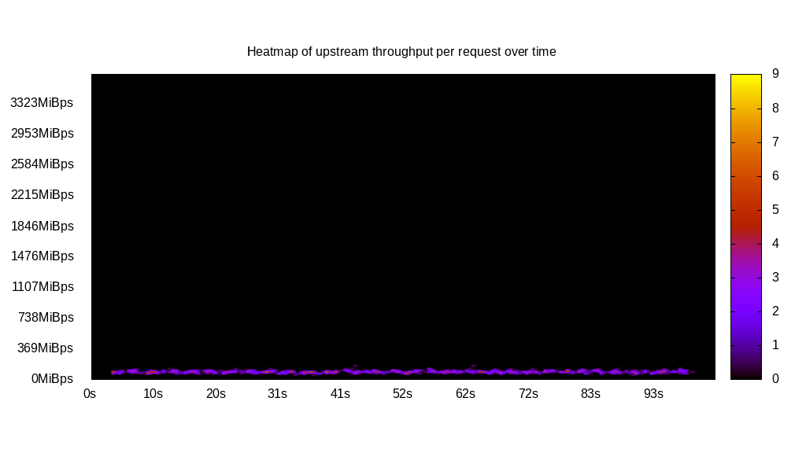
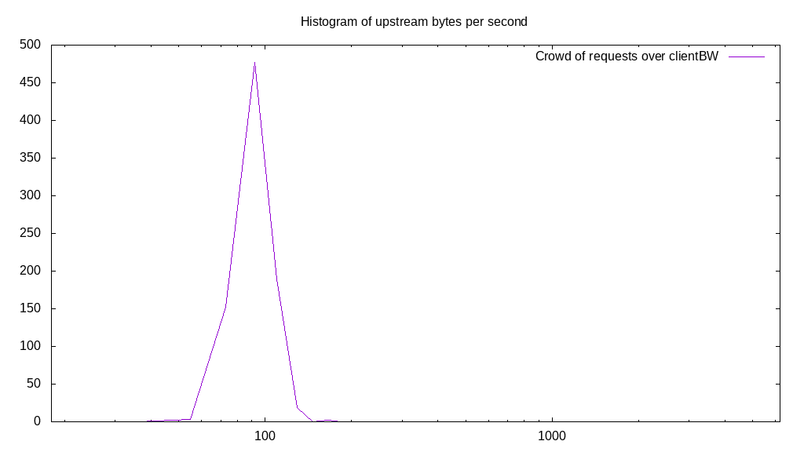
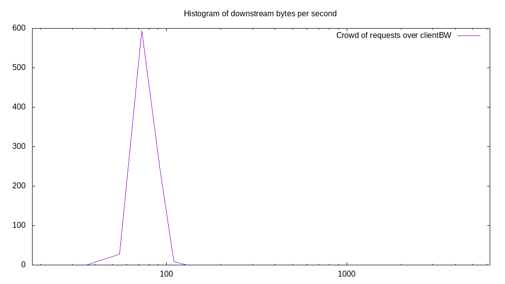
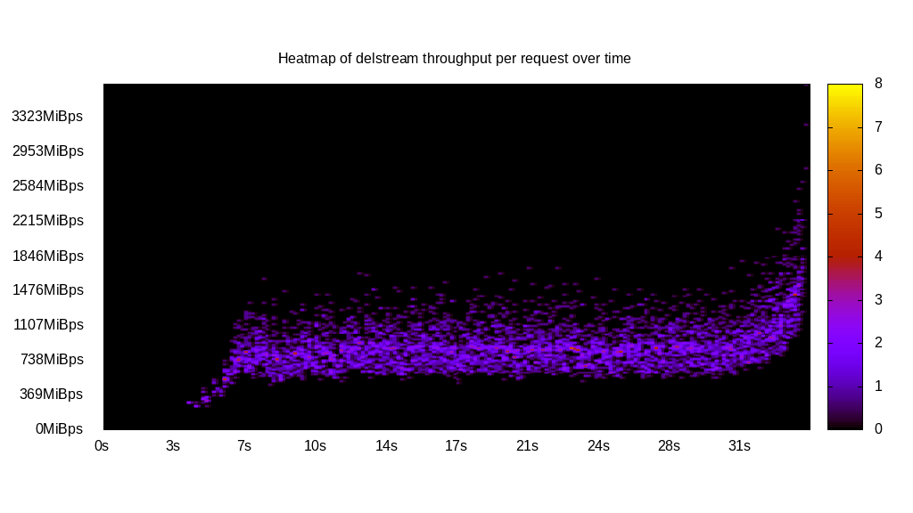
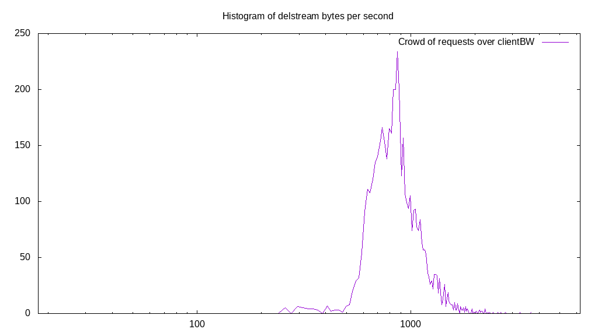

# Client bandwidth benchmark report. Crowd is 64

## Populate workload

## Object Size is 10240.00kiB

### PUT Client bandwidth in B over time

Evolution of PUT Client bandwidth over time

| Parameter | Value |
| --- | --- |
| Y Coordinate | PUT Client bandwidth in B |
| X Coordinate | time in s since begining of workload |

### PUT Client bandwidth distribution in B

Distribution of the PUT Client bandwidth in B

| Parameter | Value |
| --- | --- |
| Y Coordinate | Number of PUT |
| X Coordinate | Client bandwidth in B |
| Workload duration | 299.92s |
| Workload volume | 46000.000MiB|
| Workload bandwidth | 153.372MiB/s |
| Client time spent | 12722685.16s |
| C.time/W.duration | 42419.70 |
| Request count | 4600PUT |
| Request per second (avg.) | 15.34PUT/s |
| Highest Client bandwidth | 4437243.06B |
| 95th percentile Client bandwidth | 3327932.29B |
| 68th percentile Client bandwidth | 2773276.91B |
| 50th percentile Client bandwidth | 2773276.91B |
| 32nd percentile Client bandwidth | 2773276.91B |
| 5th percentile Client bandwidth | 2218621.53B |
| Lowest Client bandwidth | 1663966.15B |

## Read workload

## Object Size is 10240.00kiB

### GET Client bandwidth in B over time

Evolution of GET Client bandwidth over time

| Parameter | Value |
| --- | --- |
| Y Coordinate | GET Client bandwidth in B |
| X Coordinate | time in s since begining of workload |

### GET Client bandwidth distribution in B

Distribution of the GET Client bandwidth in B

| Parameter | Value |
| --- | --- |
| Y Coordinate | Number of GET |
| X Coordinate | Client bandwidth in B |
| Workload duration | 105.73s |
| Workload volume | 18650.000MiB|
| Workload bandwidth | 176.386MiB/s |
| Client time spent | 5548217.79s |
| C.time/W.duration | 52473.36 |
| Request count | 1865GET |
| Request per second (avg.) | 17.64GET/s |
| Highest Client bandwidth | 3882587.68B |
| 95th percentile Client bandwidth | 3882587.68B |
| 68th percentile Client bandwidth | 3327932.29B |
| 50th percentile Client bandwidth | 3327932.29B |
| 32nd percentile Client bandwidth | 3327932.29B |
| 5th percentile Client bandwidth | 3327932.29B |
| Lowest Client bandwidth | 2218621.53B |

## Mixed workload

## Object Size is 10240.00kiB

### PUT Client bandwidth in B over time

Evolution of PUT Client bandwidth over time

| Parameter | Value |
| --- | --- |
| Y Coordinate | PUT Client bandwidth in B |
| X Coordinate | time in s since begining of workload |

### GET Client bandwidth in B over time

Evolution of GET Client bandwidth over time

| Parameter | Value |
| --- | --- |
| Y Coordinate | GET Client bandwidth in B |
| X Coordinate | time in s since begining of workload |

### PUT Client bandwidth distribution in B

Distribution of the PUT Client bandwidth in B

| Parameter | Value |
| --- | --- |
| Y Coordinate | Number of PUT |
| X Coordinate | Client bandwidth in B |
| Workload duration | 103.52s |
| Workload volume | 8430.000MiB|
| Workload bandwidth | 81.437MiB/s |
| Client time spent | 2453795.41s |
| C.time/W.duration | 23704.50 |
| Request count | 843PUT |
| Request per second (avg.) | 8.14PUT/s |
| Highest Client bandwidth | 4991898.44B |
| 95th percentile Client bandwidth | 3882587.68B |
| 68th percentile Client bandwidth | 3327932.29B |
| 50th percentile Client bandwidth | 3327932.29B |
| 32nd percentile Client bandwidth | 3327932.29B |
| 5th percentile Client bandwidth | 2773276.91B |
| Lowest Client bandwidth | 1663966.15B |

### GET Client bandwidth distribution in B

Distribution of the GET Client bandwidth in B

| Parameter | Value |
| --- | --- |
| Y Coordinate | Number of GET |
| X Coordinate | Client bandwidth in B |
| Workload duration | 103.52s |
| Workload volume | 8740.000MiB|
| Workload bandwidth | 84.431MiB/s |
| Client time spent | 2069973.89s |
| C.time/W.duration | 19996.66 |
| Request count | 874GET |
| Request per second (avg.) | 8.44GET/s |
| Highest Client bandwidth | 3327932.29B |
| 95th percentile Client bandwidth | 3327932.29B |
| 68th percentile Client bandwidth | 2773276.91B |
| 50th percentile Client bandwidth | 2773276.91B |
| 32nd percentile Client bandwidth | 2773276.91B |
| 5th percentile Client bandwidth | 2773276.91B |
| Lowest Client bandwidth | 1663966.15B |

## Cleanup workload

## Object Size is 10240.00kiB

### DELETE Client bandwidth in B over time

Evolution of DELETE Client bandwidth over time

| Parameter | Value |
| --- | --- |
| Y Coordinate | DELETE Client bandwidth in B |
| X Coordinate | time in s since begining of workload |

### DELETE Client bandwidth distribution in B

Distribution of the DELETE Client bandwidth in B

| Parameter | Value |
| --- | --- |
| Y Coordinate | Number of DELETE |
| X Coordinate | Client bandwidth in B |
| Workload duration | 35.13s |
| Workload volume | 46080.000MiB|
| Workload bandwidth | 1311.849MiB/s |
| Client time spent | 104035600.72s |
| C.time/W.duration | 2961783.32 |
| Request count | 4608DELETE |
| Request per second (avg.) | 131.18DELETE/s |
| Highest Client bandwidth | 110376421.05B |
| 95th percentile Client bandwidth | 42153809.05B |
| 68th percentile Client bandwidth | 29396735.26B |
| 50th percentile Client bandwidth | 26623458.34B |
| 32nd percentile Client bandwidth | 23850181.43B |
| 5th percentile Client bandwidth | 18858282.99B |
| Lowest Client bandwidth | 7765175.35B |

