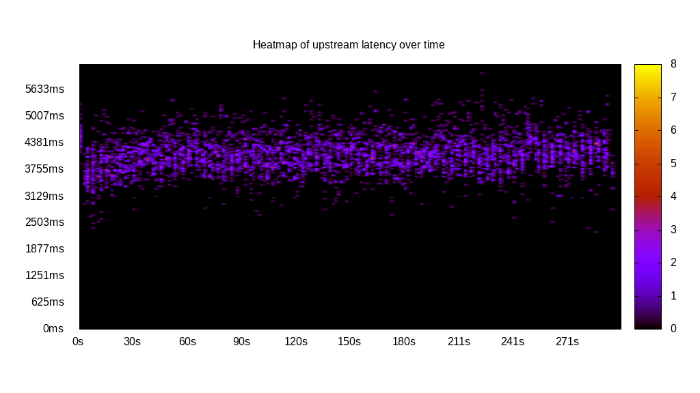
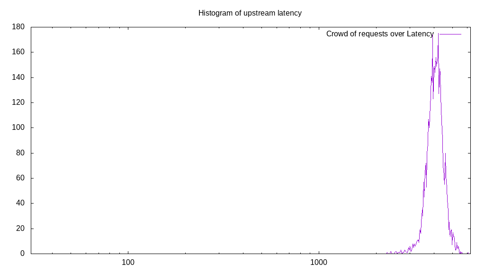
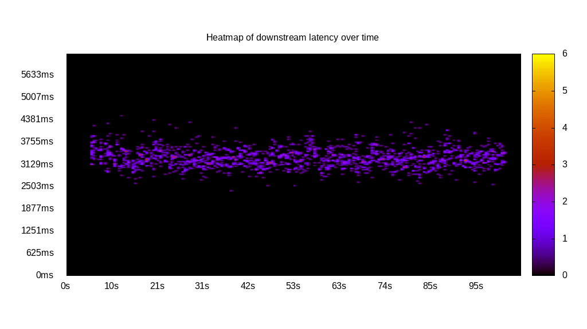
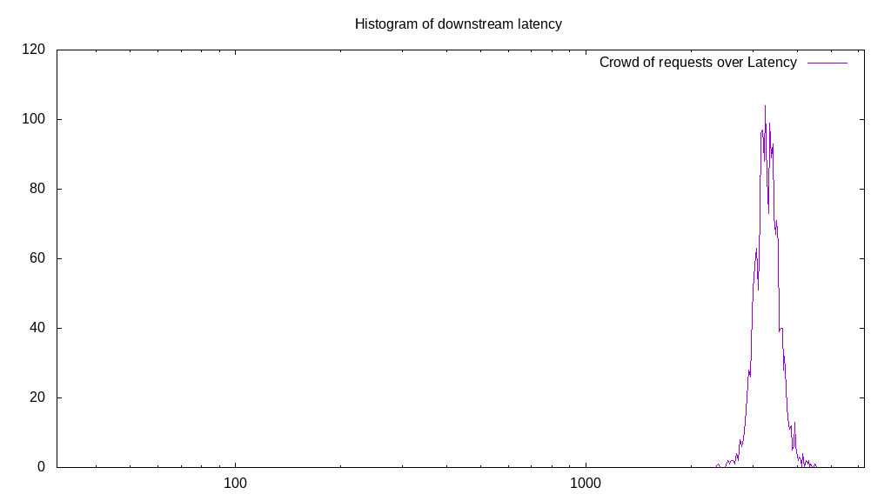
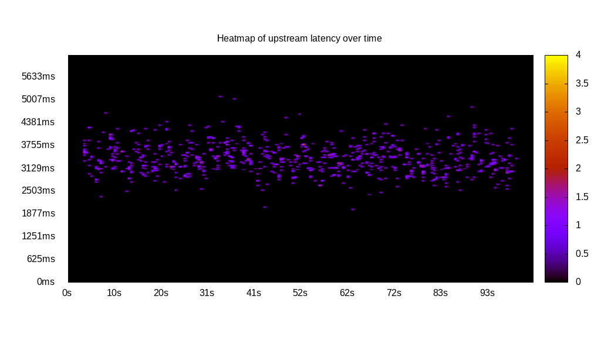
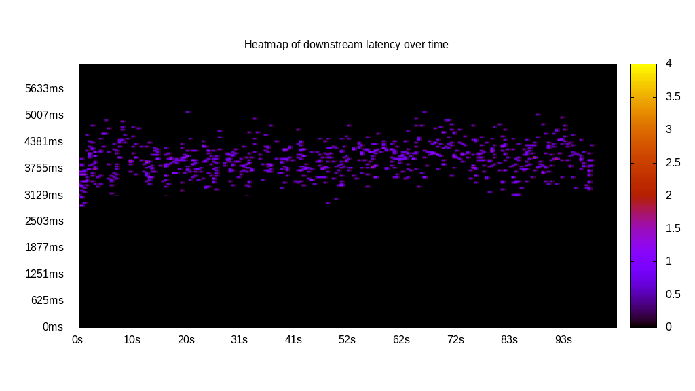
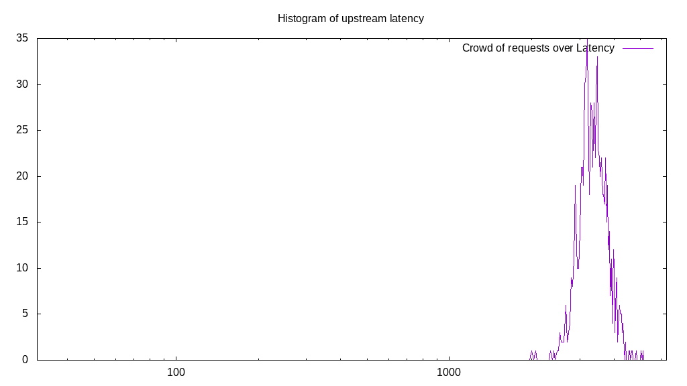
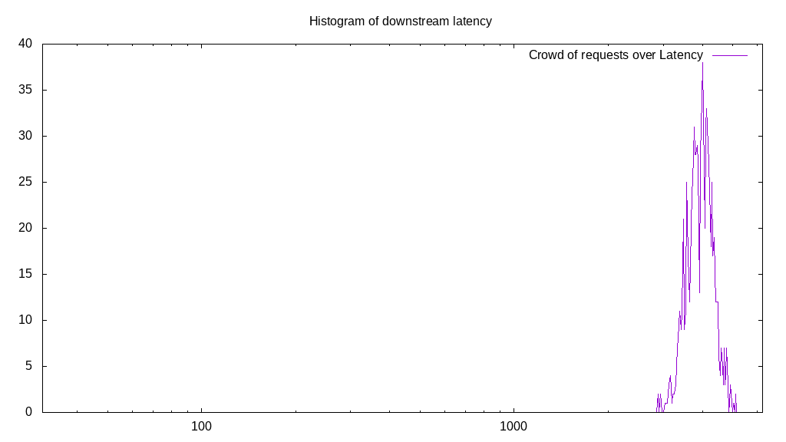
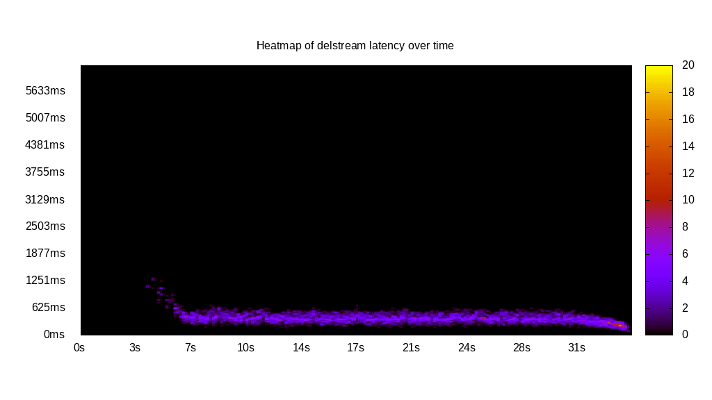
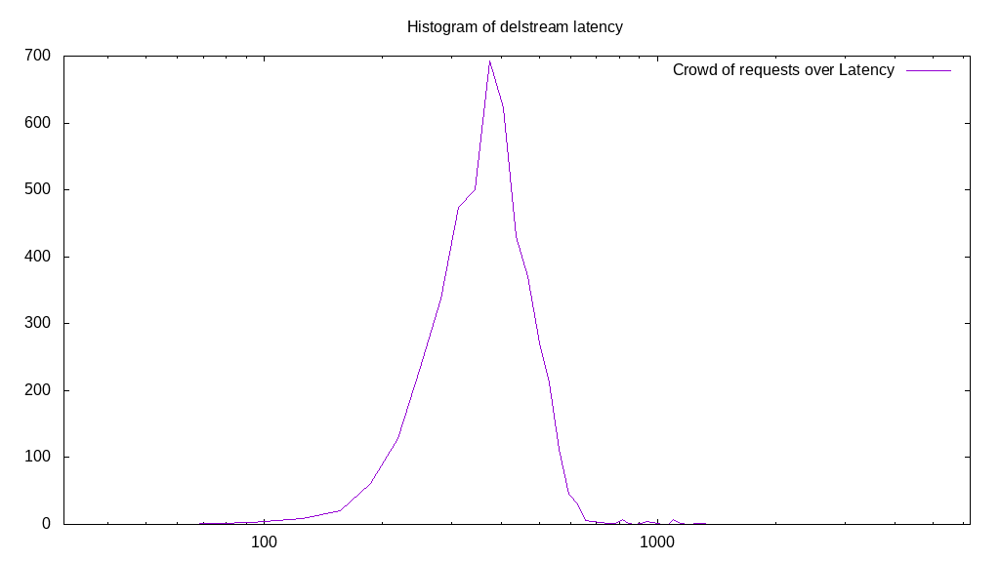

# Latency benchmark report. Crowd is 64

## Populate workload

## Object Size is 10240.00kiB

### PUT Latency in ms over time

Evolution of PUT Latency over time

| Parameter | Value |
| --- | --- |
| Y Coordinate | PUT Latency in ms |
| X Coordinate | time in s since begining of workload |

### PUT Latency distribution in ms

Distribution of the PUT Latency in ms

| Parameter | Value |
| --- | --- |
| Y Coordinate | Number of PUT |
| X Coordinate | Latency in ms |
| Workload duration | 299.92s |
| Workload volume | 46000.000MiB|
| Workload bandwidth | 153.372MiB/s |
| Client time spent | 11133.41s |
| C.time/W.duration | 37.12 |
| Request count | 4600PUT |
| Request per second (avg.) | 15.34PUT/s |
| Highest Latency | 6040.22ms |
| 95th percentile Latency | 4819.66ms |
| 68th percentile Latency | 4318.91ms |
| 50th percentile Latency | 4131.14ms |
| 32nd percentile Latency | 3974.65ms |
| 5th percentile Latency | 3536.50ms |
| Lowest Latency | 2284.64ms |

## Read workload

## Object Size is 10240.00kiB

### GET Latency in ms over time

Evolution of GET Latency over time

| Parameter | Value |
| --- | --- |
| Y Coordinate | GET Latency in ms |
| X Coordinate | time in s since begining of workload |

### GET Latency distribution in ms

Distribution of the GET Latency in ms

| Parameter | Value |
| --- | --- |
| Y Coordinate | Number of GET |
| X Coordinate | Latency in ms |
| Workload duration | 105.73s |
| Workload volume | 18650.000MiB|
| Workload bandwidth | 176.386MiB/s |
| Client time spent | 3802.02s |
| C.time/W.duration | 35.96 |
| Request count | 1865GET |
| Request per second (avg.) | 17.64GET/s |
| Highest Latency | 4506.69ms |
| 95th percentile Latency | 3786.87ms |
| 68th percentile Latency | 3442.61ms |
| 50th percentile Latency | 3348.72ms |
| 32nd percentile Latency | 3223.54ms |
| 5th percentile Latency | 2941.87ms |
| Lowest Latency | 2378.53ms |

## Mixed workload

## Object Size is 10240.00kiB

### PUT Latency in ms over time

Evolution of PUT Latency over time

| Parameter | Value |
| --- | --- |
| Y Coordinate | PUT Latency in ms |
| X Coordinate | time in s since begining of workload |

### GET Latency in ms over time

Evolution of GET Latency over time

| Parameter | Value |
| --- | --- |
| Y Coordinate | GET Latency in ms |
| X Coordinate | time in s since begining of workload |

### PUT Latency distribution in ms

Distribution of the PUT Latency in ms

| Parameter | Value |
| --- | --- |
| Y Coordinate | Number of PUT |
| X Coordinate | Latency in ms |
| Workload duration | 103.52s |
| Workload volume | 8430.000MiB|
| Workload bandwidth | 81.437MiB/s |
| Client time spent | 1788.78s |
| C.time/W.duration | 17.28 |
| Request count | 843PUT |
| Request per second (avg.) | 8.14PUT/s |
| Highest Latency | 5101.33ms |
| 95th percentile Latency | 4131.14ms |
| 68th percentile Latency | 3599.10ms |
| 50th percentile Latency | 3411.32ms |
| 32nd percentile Latency | 3223.54ms |
| 5th percentile Latency | 2847.98ms |
| Lowest Latency | 2002.97ms |

### GET Latency distribution in ms

Distribution of the GET Latency in ms

| Parameter | Value |
| --- | --- |
| Y Coordinate | Number of GET |
| X Coordinate | Latency in ms |
| Workload duration | 103.52s |
| Workload volume | 8740.000MiB|
| Workload bandwidth | 84.431MiB/s |
| Client time spent | 2065.82s |
| C.time/W.duration | 19.96 |
| Request count | 874GET |
| Request per second (avg.) | 8.44GET/s |
| Highest Latency | 5101.33ms |
| 95th percentile Latency | 4631.88ms |
| 68th percentile Latency | 4162.43ms |
| 50th percentile Latency | 4005.95ms |
| 32nd percentile Latency | 3818.17ms |
| 5th percentile Latency | 3411.32ms |
| Lowest Latency | 2879.28ms |

## Cleanup workload

## Object Size is 10240.00kiB

### DELETE Latency in ms over time

Evolution of DELETE Latency over time

| Parameter | Value |
| --- | --- |
| Y Coordinate | DELETE Latency in ms |
| X Coordinate | time in s since begining of workload |

### DELETE Latency distribution in ms

Distribution of the DELETE Latency in ms

| Parameter | Value |
| --- | --- |
| Y Coordinate | Number of DELETE |
| X Coordinate | Latency in ms |
| Workload duration | 35.13s |
| Workload volume | 46080.000MiB|
| Workload bandwidth | 1311.849MiB/s |
| Client time spent | 1463.99s |
| C.time/W.duration | 41.68 |
| Request count | 4608DELETE |
| Request per second (avg.) | 131.18DELETE/s |
| Highest Latency | 1314.45ms |
| 95th percentile Latency | 594.63ms |
| 68th percentile Latency | 469.45ms |
| 50th percentile Latency | 406.85ms |
| 32nd percentile Latency | 375.56ms |
| 5th percentile Latency | 281.67ms |
| Lowest Latency | 93.89ms |

