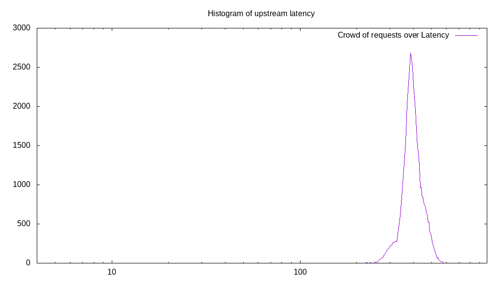
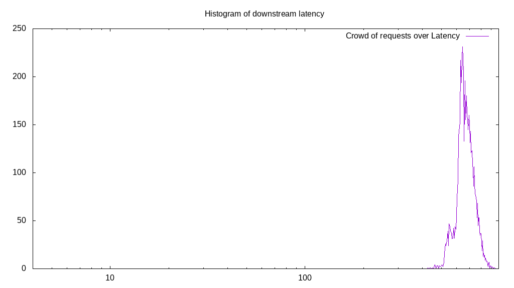

# Latency benchmark report. Crowd is 64

## Populate workload

## Object Size is 1.00kiB

### PUT Latency in ms over time

Evolution of PUT Latency over time

| Parameter | Value |
| --- | --- |
| Y Coordinate | PUT Latency in ms |
| X Coordinate | time in s since begining of workload |

### PUT Latency distribution in ms

Distribution of the PUT Latency in ms

| Parameter | Value |
| --- | --- |
| Y Coordinate | Number of PUT |
| X Coordinate | Latency in ms |
| Workload duration | 299.99s |
| Workload volume | 46.252MiB|
| Workload bandwidth | 0.154MiB/s |
| Client time spent | 12156.54s |
| C.time/W.duration | 40.52 |
| Request count | 47362PUT |
| Request per second (avg.) | 157.88PUT/s |
| Highest Latency | 614.39ms |
| 95th percentile Latency | 495.48ms |
| 68th percentile Latency | 421.16ms |
| 50th percentile Latency | 401.34ms |
| 32nd percentile Latency | 386.47ms |
| 5th percentile Latency | 331.97ms |
| Lowest Latency | 113.96ms |

## Read workload

## Object Size is 1.00kiB

### GET Latency in ms over time

Evolution of GET Latency over time

| Parameter | Value |
| --- | --- |
| Y Coordinate | GET Latency in ms |
| X Coordinate | time in s since begining of workload |

### GET Latency distribution in ms

Distribution of the GET Latency in ms

| Parameter | Value |
| --- | --- |
| Y Coordinate | Number of GET |
| X Coordinate | Latency in ms |
| Workload duration | 100.41s |
| Workload volume | 8.970MiB|
| Workload bandwidth | 0.089MiB/s |
| Client time spent | 3919.09s |
| C.time/W.duration | 39.03 |
| Request count | 9185GET |
| Request per second (avg.) | 91.48GET/s |
| Highest Latency | 986.00ms |
| 95th percentile Latency | 812.58ms |
| 68th percentile Latency | 713.49ms |
| 50th percentile Latency | 688.71ms |
| 32nd percentile Latency | 673.85ms |
| 5th percentile Latency | 579.71ms |
| Lowest Latency | 440.97ms |

## Mixed workload

## Object Size is 1.00kiB

### PUT Latency in ms over time

Evolution of PUT Latency over time

| Parameter | Value |
| --- | --- |
| Y Coordinate | PUT Latency in ms |
| X Coordinate | time in s since begining of workload |

### GET Latency in ms over time

Evolution of GET Latency over time

| Parameter | Value |
| --- | --- |
| Y Coordinate | GET Latency in ms |
| X Coordinate | time in s since begining of workload |

### PUT Latency distribution in ms

Distribution of the PUT Latency in ms

| Parameter | Value |
| --- | --- |
| Y Coordinate | Number of PUT |
| X Coordinate | Latency in ms |
| Workload duration | 100.72s |
| Workload volume | 5.508MiB|
| Workload bandwidth | 0.055MiB/s |
| Client time spent | 1611.09s |
| C.time/W.duration | 16.00 |
| Request count | 5640PUT |
| Request per second (avg.) | 56.00PUT/s |
| Highest Latency | 639.17ms |
| 95th percentile Latency | 545.03ms |
| 68th percentile Latency | 465.75ms |
| 50th percentile Latency | 440.97ms |
| 32nd percentile Latency | 416.20ms |
| 5th percentile Latency | 356.74ms |
| Lowest Latency | 277.47ms |

### GET Latency distribution in ms

Distribution of the GET Latency in ms

| Parameter | Value |
| --- | --- |
| Y Coordinate | Number of GET |
| X Coordinate | Latency in ms |
| Workload duration | 100.72s |
| Workload volume | 5.632MiB|
| Workload bandwidth | 0.056MiB/s |
| Client time spent | 2361.25s |
| C.time/W.duration | 23.44 |
| Request count | 5767GET |
| Request per second (avg.) | 57.26GET/s |
| Highest Latency | 941.41ms |
| 95th percentile Latency | 797.72ms |
| 68th percentile Latency | 708.53ms |
| 50th percentile Latency | 673.85ms |
| 32nd percentile Latency | 644.12ms |
| 5th percentile Latency | 564.84ms |
| Lowest Latency | 426.11ms |

## Cleanup workload

## Object Size is 1.00kiB

### DELETE Latency in ms over time

Evolution of DELETE Latency over time

| Parameter | Value |
| --- | --- |
| Y Coordinate | DELETE Latency in ms |
| X Coordinate | time in s since begining of workload |

### DELETE Latency distribution in ms

Distribution of the DELETE Latency in ms

| Parameter | Value |
| --- | --- |
| Y Coordinate | Number of DELETE |
| X Coordinate | Latency in ms |
| Workload duration | 285.63s |
| Workload volume | 46.260MiB|
| Workload bandwidth | 0.162MiB/s |
| Client time spent | 11924.57s |
| C.time/W.duration | 41.75 |
| Request count | 47370DELETE |
| Request per second (avg.) | 165.84DELETE/s |
| Highest Latency | 629.26ms |
| 95th percentile Latency | 485.57ms |
| 68th percentile Latency | 416.20ms |
| 50th percentile Latency | 386.47ms |
| 32nd percentile Latency | 356.74ms |
| 5th percentile Latency | 287.38ms |
| Lowest Latency | 74.32ms |

