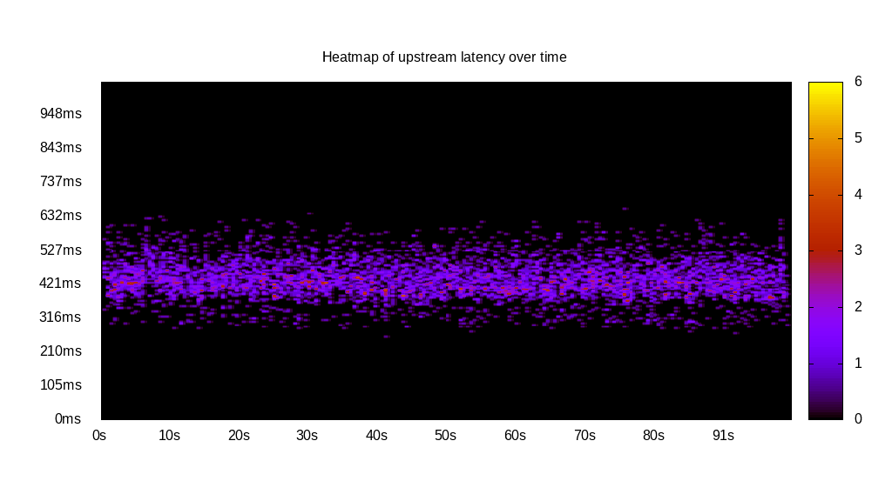

# Latency benchmark report. Crowd is 64

## Populate workload

## Object Size is 1.00kiB

### PUT Latency in ms over time

Evolution of PUT Latency over time

| Parameter | Value |
| --- | --- |
| Y Coordinate | PUT Latency in ms |
| X Coordinate | time in s since begining of workload |

### PUT Latency distribution in ms

Distribution of the PUT Latency in ms

| Parameter | Value |
| --- | --- |
| Y Coordinate | Number of PUT |
| X Coordinate | Latency in ms |
| Workload duration | 300.00s |
| Workload volume | 46.192MiB|
| Workload bandwidth | 0.154MiB/s |
| Client time spent | 11776.73s |
| C.time/W.duration | 39.26 |
| Request count | 47301PUT |
| Request per second (avg.) | 157.67PUT/s |
| Highest Latency | 606.21ms |
| 95th percentile Latency | 495.51ms |
| 68th percentile Latency | 421.71ms |
| 50th percentile Latency | 400.62ms |
| 32nd percentile Latency | 384.81ms |
| 5th percentile Latency | 332.10ms |
| Lowest Latency | 158.14ms |

## Read workload

## Object Size is 1.00kiB

### GET Latency in ms over time

Evolution of GET Latency over time

| Parameter | Value |
| --- | --- |
| Y Coordinate | GET Latency in ms |
| X Coordinate | time in s since begining of workload |

### GET Latency distribution in ms

Distribution of the GET Latency in ms

| Parameter | Value |
| --- | --- |
| Y Coordinate | Number of GET |
| X Coordinate | Latency in ms |
| Workload duration | 100.42s |
| Workload volume | 9.021MiB|
| Workload bandwidth | 0.090MiB/s |
| Client time spent | 3741.44s |
| C.time/W.duration | 37.26 |
| Request count | 9237GET |
| Request per second (avg.) | 91.98GET/s |
| Highest Latency | 1049.00ms |
| 95th percentile Latency | 806.52ms |
| 68th percentile Latency | 706.36ms |
| 50th percentile Latency | 680.01ms |
| 32nd percentile Latency | 669.46ms |
| 5th percentile Latency | 574.58ms |
| Lowest Latency | 448.07ms |

## Mixed workload

## Object Size is 1.00kiB

### PUT Latency in ms over time

Evolution of PUT Latency over time

| Parameter | Value |
| --- | --- |
| Y Coordinate | PUT Latency in ms |
| X Coordinate | time in s since begining of workload |

### GET Latency in ms over time

Evolution of GET Latency over time

| Parameter | Value |
| --- | --- |
| Y Coordinate | GET Latency in ms |
| X Coordinate | time in s since begining of workload |

### PUT Latency distribution in ms

Distribution of the PUT Latency in ms

| Parameter | Value |
| --- | --- |
| Y Coordinate | Number of PUT |
| X Coordinate | Latency in ms |
| Workload duration | 100.67s |
| Workload volume | 5.426MiB|
| Workload bandwidth | 0.054MiB/s |
| Client time spent | 1545.98s |
| C.time/W.duration | 15.36 |
| Request count | 5556PUT |
| Request per second (avg.) | 55.19PUT/s |
| Highest Latency | 658.92ms |
| 95th percentile Latency | 548.22ms |
| 68th percentile Latency | 463.88ms |
| 50th percentile Latency | 437.52ms |
| 32nd percentile Latency | 416.44ms |
| 5th percentile Latency | 353.18ms |
| Lowest Latency | 258.30ms |

### GET Latency distribution in ms

Distribution of the GET Latency in ms

| Parameter | Value |
| --- | --- |
| Y Coordinate | Number of GET |
| X Coordinate | Latency in ms |
| Workload duration | 100.67s |
| Workload volume | 5.695MiB|
| Workload bandwidth | 0.057MiB/s |
| Client time spent | 2419.76s |
| C.time/W.duration | 24.04 |
| Request count | 5832GET |
| Request per second (avg.) | 57.93GET/s |
| Highest Latency | 996.29ms |
| 95th percentile Latency | 801.25ms |
| 68th percentile Latency | 706.36ms |
| 50th percentile Latency | 674.73ms |
| 32nd percentile Latency | 648.38ms |
| 5th percentile Latency | 564.04ms |
| Lowest Latency | 432.25ms |

## Cleanup workload

## Object Size is 1.00kiB

### DELETE Latency in ms over time

Evolution of DELETE Latency over time

| Parameter | Value |
| --- | --- |
| Y Coordinate | DELETE Latency in ms |
| X Coordinate | time in s since begining of workload |

### DELETE Latency distribution in ms

Distribution of the DELETE Latency in ms

| Parameter | Value |
| --- | --- |
| Y Coordinate | Number of DELETE |
| X Coordinate | Latency in ms |
| Workload duration | 284.27s |
| Workload volume | 46.200MiB|
| Workload bandwidth | 0.163MiB/s |
| Client time spent | 11850.12s |
| C.time/W.duration | 41.69 |
| Request count | 47309DELETE |
| Request per second (avg.) | 166.42DELETE/s |
| Highest Latency | 637.83ms |
| 95th percentile Latency | 484.96ms |
| 68th percentile Latency | 416.44ms |
| 50th percentile Latency | 384.81ms |
| 32nd percentile Latency | 353.18ms |
| 5th percentile Latency | 284.65ms |
| Lowest Latency | 21.09ms |

