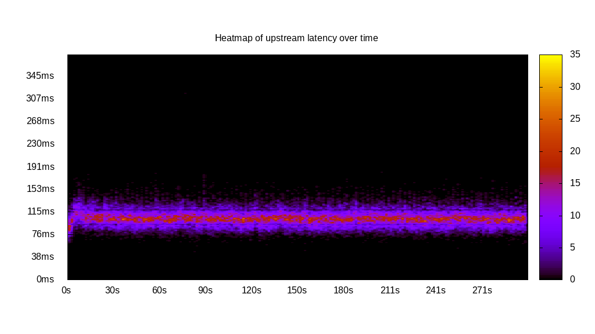
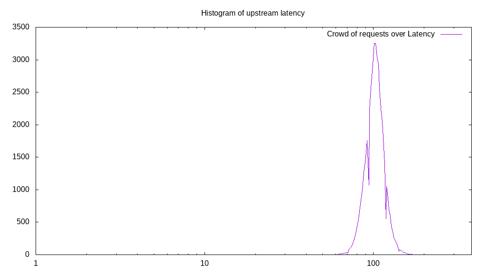
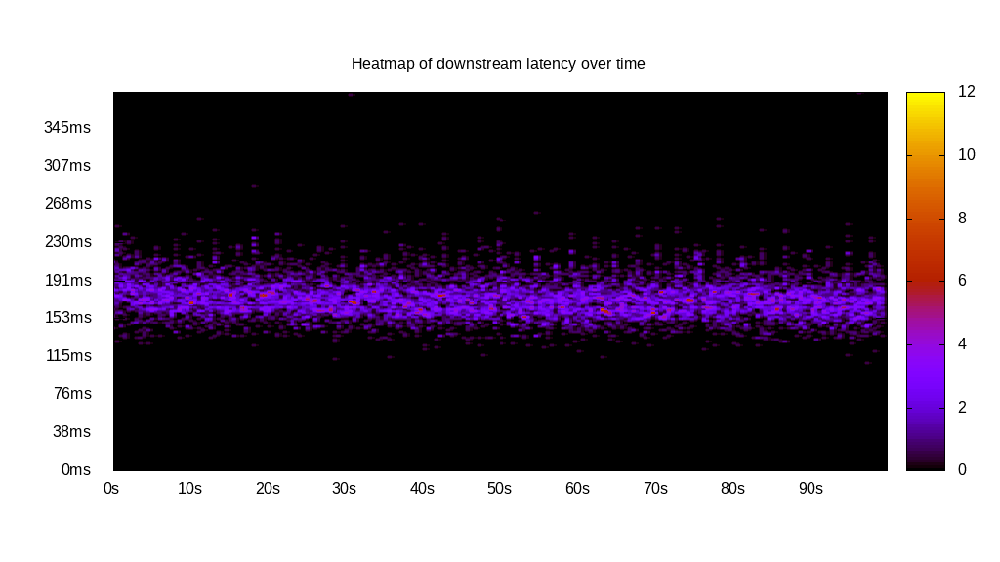
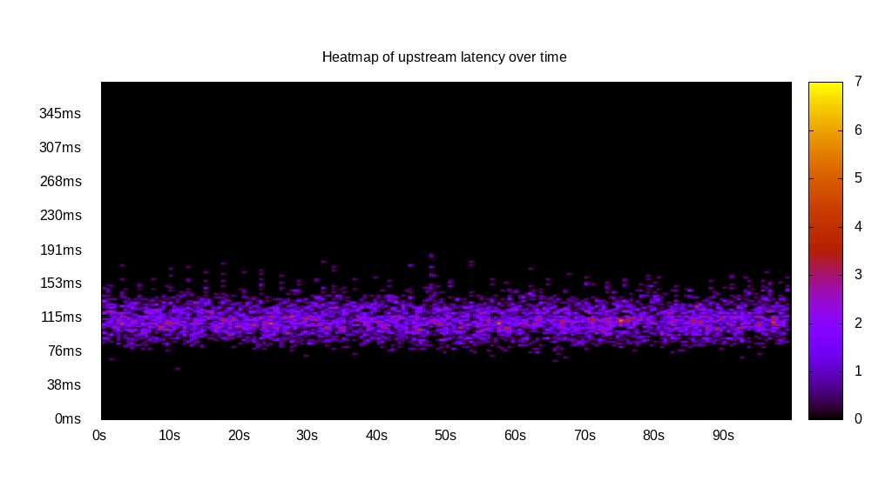
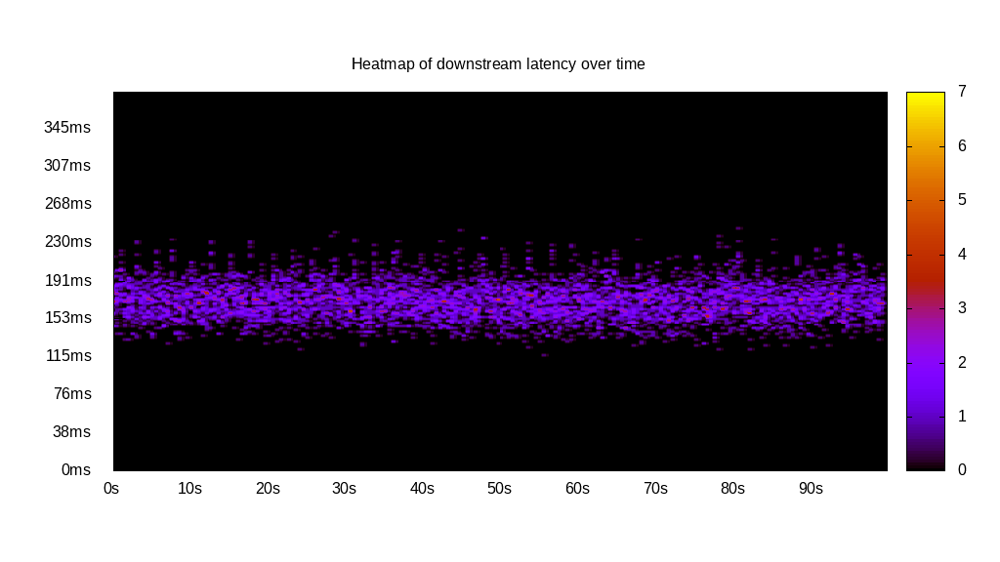
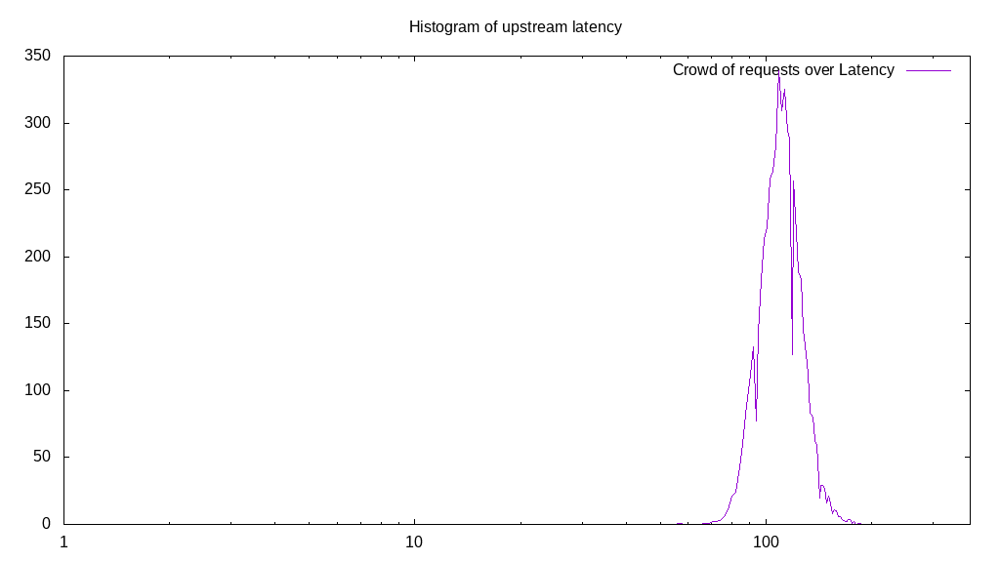
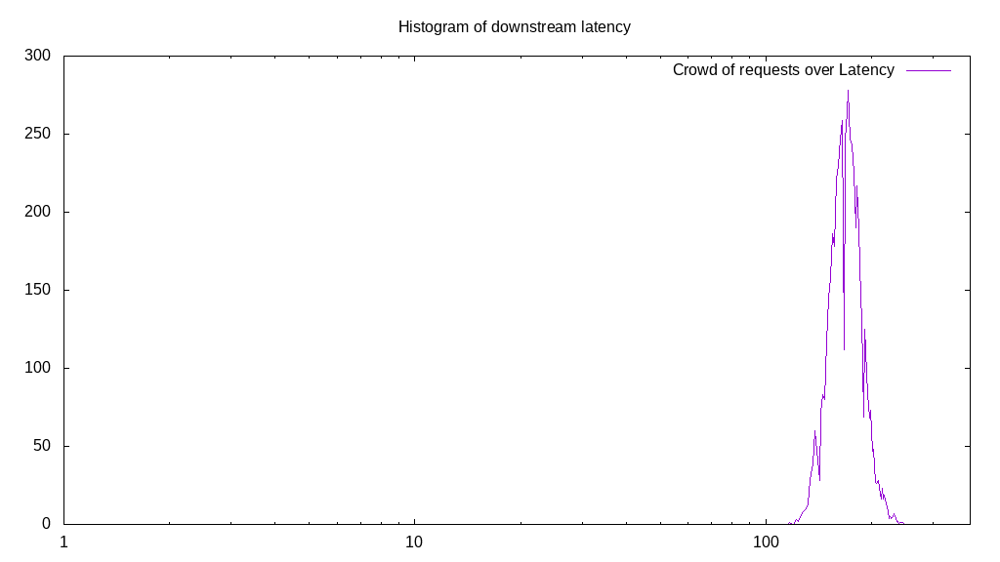
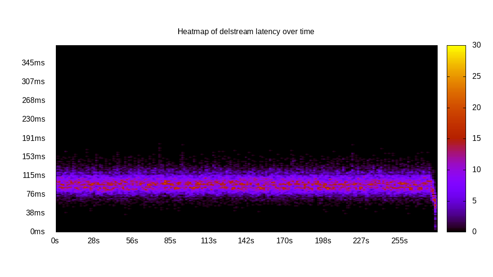
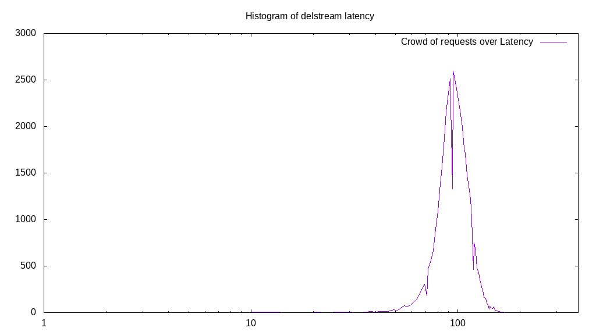

# Latency benchmark report. Crowd is 16

## Populate workload

## Object Size is 0.03kiB

### PUT Latency in ms over time

Evolution of PUT Latency over time

| Parameter | Value |
| --- | --- |
| Y Coordinate | PUT Latency in ms |
| X Coordinate | time in s since begining of workload |

### PUT Latency distribution in ms

Distribution of the PUT Latency in ms

| Parameter | Value |
| --- | --- |
| Y Coordinate | Number of PUT |
| X Coordinate | Latency in ms |
| Workload duration | 300.00s |
| Workload volume | 1.382MiB|
| Workload bandwidth | 0.005MiB/s |
| Client time spent | 3004.53s |
| C.time/W.duration | 10.02 |
| Request count | 45278PUT |
| Request per second (avg.) | 150.93PUT/s |
| Highest Latency | 316.73ms |
| 95th percentile Latency | 128.61ms |
| 68th percentile Latency | 111.34ms |
| 50th percentile Latency | 105.58ms |
| 32nd percentile Latency | 101.74ms |
| 5th percentile Latency | 86.38ms |
| Lowest Latency | 47.99ms |

## Read workload

## Object Size is 0.03kiB

### GET Latency in ms over time

Evolution of GET Latency over time

| Parameter | Value |
| --- | --- |
| Y Coordinate | GET Latency in ms |
| X Coordinate | time in s since begining of workload |

### GET Latency distribution in ms

Distribution of the GET Latency in ms

| Parameter | Value |
| --- | --- |
| Y Coordinate | Number of GET |
| X Coordinate | Latency in ms |
| Workload duration | 100.11s |
| Workload volume | 0.277MiB|
| Workload bandwidth | 0.003MiB/s |
| Client time spent | 988.22s |
| C.time/W.duration | 9.87 |
| Request count | 9092GET |
| Request per second (avg.) | 90.82GET/s |
| Highest Latency | 382.00ms |
| 95th percentile Latency | 209.24ms |
| 68th percentile Latency | 182.36ms |
| 50th percentile Latency | 174.68ms |
| 32nd percentile Latency | 167.01ms |
| 5th percentile Latency | 149.73ms |
| Lowest Latency | 109.42ms |

## Mixed workload

## Object Size is 0.03kiB

### PUT Latency in ms over time

Evolution of PUT Latency over time

| Parameter | Value |
| --- | --- |
| Y Coordinate | PUT Latency in ms |
| X Coordinate | time in s since begining of workload |

### GET Latency in ms over time

Evolution of GET Latency over time

| Parameter | Value |
| --- | --- |
| Y Coordinate | GET Latency in ms |
| X Coordinate | time in s since begining of workload |

### PUT Latency distribution in ms

Distribution of the PUT Latency in ms

| Parameter | Value |
| --- | --- |
| Y Coordinate | Number of PUT |
| X Coordinate | Latency in ms |
| Workload duration | 100.18s |
| Workload volume | 0.170MiB|
| Workload bandwidth | 0.002MiB/s |
| Client time spent | 396.89s |
| C.time/W.duration | 3.96 |
| Request count | 5568PUT |
| Request per second (avg.) | 55.58PUT/s |
| Highest Latency | 186.20ms |
| 95th percentile Latency | 142.05ms |
| 68th percentile Latency | 120.93ms |
| 50th percentile Latency | 113.26ms |
| 32nd percentile Latency | 107.50ms |
| 5th percentile Latency | 92.14ms |
| Lowest Latency | 57.59ms |

### GET Latency distribution in ms

Distribution of the GET Latency in ms

| Parameter | Value |
| --- | --- |
| Y Coordinate | Number of GET |
| X Coordinate | Latency in ms |
| Workload duration | 100.18s |
| Workload volume | 0.170MiB|
| Workload bandwidth | 0.002MiB/s |
| Client time spent | 584.35s |
| C.time/W.duration | 5.83 |
| Request count | 5573GET |
| Request per second (avg.) | 55.63GET/s |
| Highest Latency | 245.71ms |
| 95th percentile Latency | 205.40ms |
| 68th percentile Latency | 180.44ms |
| 50th percentile Latency | 172.76ms |
| 32nd percentile Latency | 165.09ms |
| 5th percentile Latency | 145.89ms |
| Lowest Latency | 117.10ms |

## Cleanup workload

## Object Size is 0.03kiB

### DELETE Latency in ms over time

Evolution of DELETE Latency over time

| Parameter | Value |
| --- | --- |
| Y Coordinate | DELETE Latency in ms |
| X Coordinate | time in s since begining of workload |

### DELETE Latency distribution in ms

Distribution of the DELETE Latency in ms

| Parameter | Value |
| --- | --- |
| Y Coordinate | Number of DELETE |
| X Coordinate | Latency in ms |
| Workload duration | 282.74s |
| Workload volume | 1.382MiB|
| Workload bandwidth | 0.005MiB/s |
| Client time spent | 2979.96s |
| C.time/W.duration | 10.54 |
| Request count | 45286DELETE |
| Request per second (avg.) | 160.17DELETE/s |
| Highest Latency | 180.44ms |
| 95th percentile Latency | 126.69ms |
| 68th percentile Latency | 107.50ms |
| 50th percentile Latency | 99.82ms |
| 32nd percentile Latency | 92.14ms |
| 5th percentile Latency | 76.78ms |
| Lowest Latency | 5.76ms |

