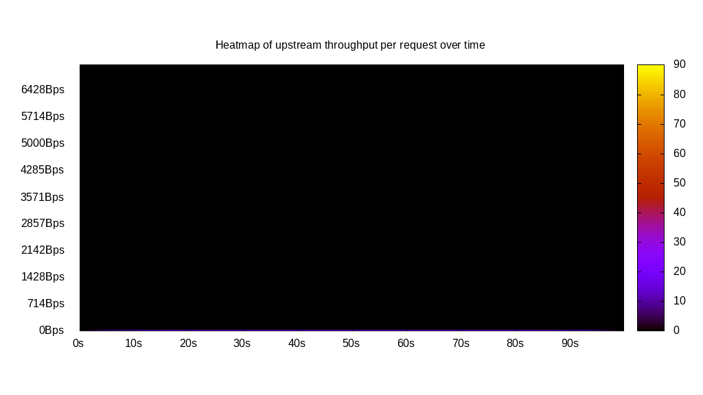
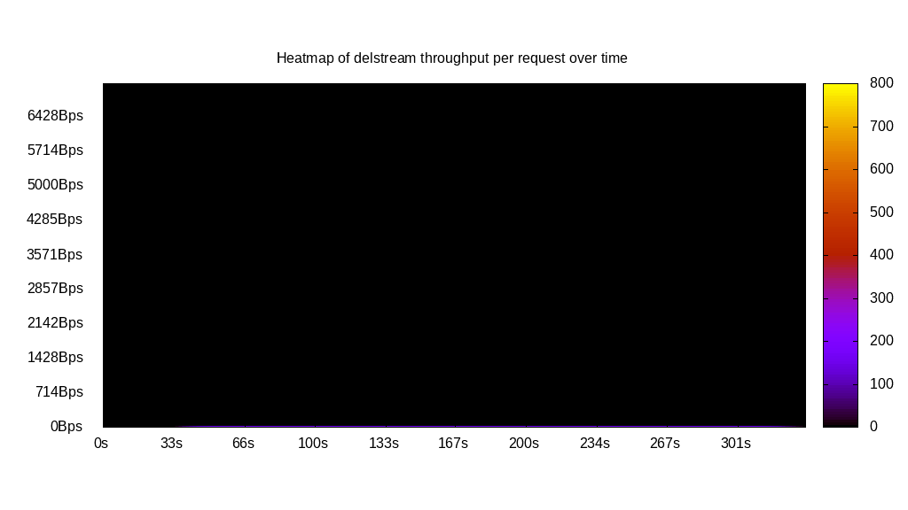

# Client bandwidth benchmark report. Crowd is 5000

## Populate workload

## Object Size is 0.00kiB

### PUT Client bandwidth in B over time

Evolution of PUT Client bandwidth over time

| Parameter | Value |
| --- | --- |
| Y Coordinate | PUT Client bandwidth in B |
| X Coordinate | time in s since begining of workload |

### PUT Client bandwidth distribution in B

Distribution of the PUT Client bandwidth in B

| Parameter | Value |
| --- | --- |
| Y Coordinate | Number of PUT |
| X Coordinate | Client bandwidth in B |
| Server volume | 0.000MiB|
| Server bandwidth | 0.000MiB/s |
| Server time | 300.00s |
| Server load | 4881.99 |
| Server responses | 126838PUT |
| Server IOps | 422.80PUT/s |
| Client bandwidth | 0.000MiB/s |
| Client volume | 0.000MiB|
| Client time | 1464583.82s |
| Client IOps |  0.09PUT/s  |
| Client Latency | 11546.89ms/PUT |
| Client Limbo | 7.08ms/PUT |
| Crowd time | 1499985.00s |
| Crowd efficiency | 97.64% |
| Highest Client bandwidth | 35.71B |
| 95th percentile Client bandwidth | 35.71B |
| 68th percentile Client bandwidth | 35.71B |
| 50th percentile Client bandwidth | 35.71B |
| 32nd percentile Client bandwidth | 35.71B |
| 5th percentile Client bandwidth | 35.71B |
| Lowest Client bandwidth | 35.71B |

## Read workload

## Object Size is 0.00kiB

### GET Client bandwidth in B over time

Evolution of GET Client bandwidth over time

| Parameter | Value |
| --- | --- |
| Y Coordinate | GET Client bandwidth in B |
| X Coordinate | time in s since begining of workload |

### GET Client bandwidth distribution in B

Distribution of the GET Client bandwidth in B

| Parameter | Value |
| --- | --- |
| Y Coordinate | Number of GET |
| X Coordinate | Client bandwidth in B |
| Server volume | 0.000MiB|
| Server bandwidth | 0.000MiB/s |
| Server time | 64.48s |
| Server load | 0.00 |
| Server responses | 0GET |
| Server IOps | 0.00GET/s |
| Client bandwidth | 0.000MiB/s |
| Client volume | 0.000MiB|
| Client time | 0.00s |
| Client IOps |  NaNGET/s  |
| Client Latency | NaNms/GET |
| Client Limbo | 64.48ms/GET |
| Crowd time | 322415.00s |
| Crowd efficiency | 0.00% |
| Highest Client bandwidth | 0.00B |
| 95th percentile Client bandwidth | 0.00B |
| 68th percentile Client bandwidth | 0.00B |
| 50th percentile Client bandwidth | 0.00B |
| 32nd percentile Client bandwidth | 0.00B |
| 5th percentile Client bandwidth | 0.00B |
| Lowest Client bandwidth | 0.00B |

## Mixed workload

## Object Size is 0.00kiB

### PUT Client bandwidth in B over time

Evolution of PUT Client bandwidth over time

| Parameter | Value |
| --- | --- |
| Y Coordinate | PUT Client bandwidth in B |
| X Coordinate | time in s since begining of workload |

### GET Client bandwidth in B over time

Evolution of GET Client bandwidth over time

| Parameter | Value |
| --- | --- |
| Y Coordinate | GET Client bandwidth in B |
| X Coordinate | time in s since begining of workload |

### PUT Client bandwidth distribution in B

Distribution of the PUT Client bandwidth in B

| Parameter | Value |
| --- | --- |
| Y Coordinate | Number of PUT |
| X Coordinate | Client bandwidth in B |
| Server volume | 0.000MiB|
| Server bandwidth | 0.000MiB/s |
| Server time | 100.00s |
| Server load | 1658.24 |
| Server responses | 14706PUT |
| Server IOps | 147.06PUT/s |
| Client bandwidth | 0.000MiB/s |
| Client volume | 0.000MiB|
| Client time | 165818.70s |
| Client IOps |  0.09PUT/s  |
| Client Latency | 11275.58ms/PUT |
| Client Limbo | 66.83ms/PUT |
| Crowd time | 499985.00s |
| Crowd efficiency | 33.16% |
| Highest Client bandwidth | 0.00B |
| 95th percentile Client bandwidth | 35.71B |
| 68th percentile Client bandwidth | 35.71B |
| 50th percentile Client bandwidth | 35.71B |
| 32nd percentile Client bandwidth | 35.71B |
| 5th percentile Client bandwidth | 35.71B |
| Lowest Client bandwidth | 0.00B |

### GET Client bandwidth distribution in B

Distribution of the GET Client bandwidth in B

| Parameter | Value |
| --- | --- |
| Y Coordinate | Number of GET |
| X Coordinate | Client bandwidth in B |
| Server volume | 0.000MiB|
| Server bandwidth | 0.000MiB/s |
| Server time | 100.00s |
| Server load | 0.00 |
| Server responses | 0GET |
| Server IOps | 0.00GET/s |
| Client bandwidth | 0.000MiB/s |
| Client volume | 0.000MiB|
| Client time | 0.00s |
| Client IOps |  NaNGET/s  |
| Client Latency | NaNms/GET |
| Client Limbo | 100.00ms/GET |
| Crowd time | 499985.00s |
| Crowd efficiency | 0.00% |
| Highest Client bandwidth | 0.00B |
| 95th percentile Client bandwidth | 0.00B |
| 68th percentile Client bandwidth | 0.00B |
| 50th percentile Client bandwidth | 0.00B |
| 32nd percentile Client bandwidth | 0.00B |
| 5th percentile Client bandwidth | 0.00B |
| Lowest Client bandwidth | 0.00B |

## Cleanup workload

## Object Size is 0.00kiB

### DELETE Client bandwidth in B over time

Evolution of DELETE Client bandwidth over time

| Parameter | Value |
| --- | --- |
| Y Coordinate | DELETE Client bandwidth in B |
| X Coordinate | time in s since begining of workload |

### DELETE Client bandwidth distribution in B

Distribution of the DELETE Client bandwidth in B

| Parameter | Value |
| --- | --- |
| Y Coordinate | Number of DELETE |
| X Coordinate | Client bandwidth in B |
| Server volume | 0.000MiB|
| Server bandwidth | 0.000MiB/s |
| Server time | 333.09s |
| Server load | 4185.54 |
| Server responses | 126846DELETE |
| Server IOps | 380.81DELETE/s |
| Client bandwidth | 0.000MiB/s |
| Client volume | 0.000MiB|
| Client time | 1394168.31s |
| Client IOps |  0.09DELETE/s  |
| Client Latency | 10991.03ms/DELETE |
| Client Limbo | 54.26ms/DELETE |
| Crowd time | 1665460.00s |
| Crowd efficiency | 83.71% |
| Highest Client bandwidth | 0.00B |
| 95th percentile Client bandwidth | 35.71B |
| 68th percentile Client bandwidth | 35.71B |
| 50th percentile Client bandwidth | 35.71B |
| 32nd percentile Client bandwidth | 35.71B |
| 5th percentile Client bandwidth | 35.71B |
| Lowest Client bandwidth | 0.00B |

