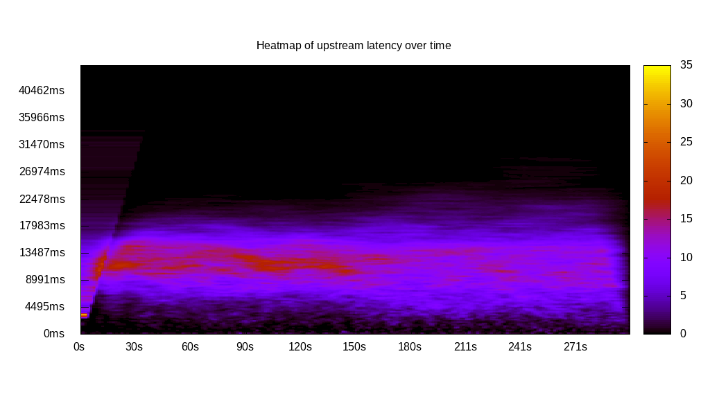
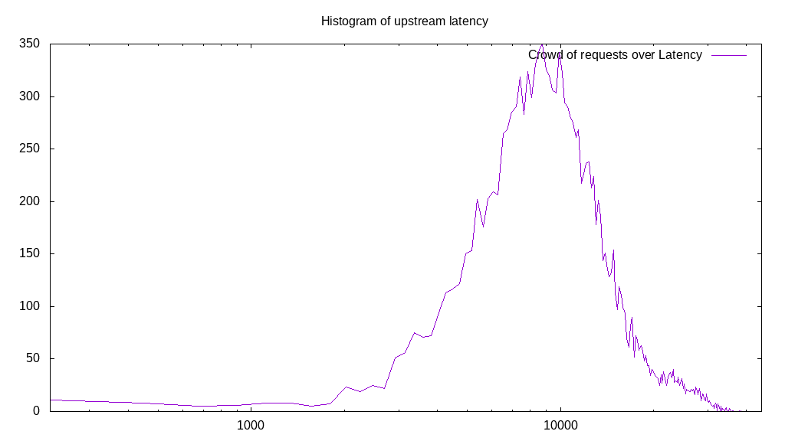

# Latency benchmark report. Crowd is 5000

## Populate workload

## Object Size is 0.00kiB

### PUT Latency in ms over time

Evolution of PUT Latency over time

| Parameter | Value |
| --- | --- |
| Y Coordinate | PUT Latency in ms |
| X Coordinate | time in s since begining of workload |

### PUT Latency distribution in ms

Distribution of the PUT Latency in ms

| Parameter | Value |
| --- | --- |
| Y Coordinate | Number of PUT |
| X Coordinate | Latency in ms |
| Workload duration | 300.00s |
| Workload volume | NaNMiB|
| Workload bandwidth | NaNMiB/s |
| Request count | InfinityPUT |
| Request per second (avg.) | InfinityPUT/s |
| Client time spent | Infinitys |
| C.time/W.duration | Infinity |
| Reduced Latency | |
| Highest Latency | 44733.00ms |
| 95th percentile Latency | 224.79ms |
| 68th percentile Latency | 224.79ms |
| 50th percentile Latency | 224.79ms |
| 32nd percentile Latency | 224.79ms |
| 5th percentile Latency | 224.79ms |
| Lowest Latency | 224.79ms |

## Read workload

## Object Size is 0.00kiB

### GET Latency in ms over time

Evolution of GET Latency over time

| Parameter | Value |
| --- | --- |
| Y Coordinate | GET Latency in ms |
| X Coordinate | time in s since begining of workload |

### GET Latency distribution in ms

Distribution of the GET Latency in ms

| Parameter | Value |
| --- | --- |
| Y Coordinate | Number of GET |
| X Coordinate | Latency in ms |
| Workload duration | 64.48s |
| Workload volume | 0.000MiB|
| Workload bandwidth | 0.000MiB/s |
| Request count | 0GET |
| Request per second (avg.) | 0.00GET/s |
| Client time spent | 0.00s |
| C.time/W.duration | 0.00 |
| Reduced Latency | |
| Highest Latency | 0.00ms |
| 95th percentile Latency | 0.00ms |
| 68th percentile Latency | 0.00ms |
| 50th percentile Latency | 0.00ms |
| 32nd percentile Latency | 0.00ms |
| 5th percentile Latency | 0.00ms |
| Lowest Latency | 0.00ms |

## Mixed workload

## Object Size is 0.00kiB

### PUT Latency in ms over time

Evolution of PUT Latency over time

| Parameter | Value |
| --- | --- |
| Y Coordinate | PUT Latency in ms |
| X Coordinate | time in s since begining of workload |

### GET Latency in ms over time

Evolution of GET Latency over time

| Parameter | Value |
| --- | --- |
| Y Coordinate | GET Latency in ms |
| X Coordinate | time in s since begining of workload |

### PUT Latency distribution in ms

Distribution of the PUT Latency in ms

| Parameter | Value |
| --- | --- |
| Y Coordinate | Number of PUT |
| X Coordinate | Latency in ms |
| Workload duration | 100.00s |
| Workload volume | NaNMiB|
| Workload bandwidth | NaNMiB/s |
| Request count | InfinityPUT |
| Request per second (avg.) | InfinityPUT/s |
| Client time spent | Infinitys |
| C.time/W.duration | Infinity |
| Reduced Latency | |
| Highest Latency | 38438.91ms |
| 95th percentile Latency | 224.79ms |
| 68th percentile Latency | 224.79ms |
| 50th percentile Latency | 224.79ms |
| 32nd percentile Latency | 224.79ms |
| 5th percentile Latency | 224.79ms |
| Lowest Latency | 224.79ms |

### GET Latency distribution in ms

Distribution of the GET Latency in ms

| Parameter | Value |
| --- | --- |
| Y Coordinate | Number of GET |
| X Coordinate | Latency in ms |
| Workload duration | 100.00s |
| Workload volume | 0.000MiB|
| Workload bandwidth | 0.000MiB/s |
| Request count | 0GET |
| Request per second (avg.) | 0.00GET/s |
| Client time spent | 0.00s |
| C.time/W.duration | 0.00 |
| Reduced Latency | |
| Highest Latency | 0.00ms |
| 95th percentile Latency | 0.00ms |
| 68th percentile Latency | 0.00ms |
| 50th percentile Latency | 0.00ms |
| 32nd percentile Latency | 0.00ms |
| 5th percentile Latency | 0.00ms |
| Lowest Latency | 0.00ms |

## Cleanup workload

## Object Size is 0.00kiB

### DELETE Latency in ms over time

Evolution of DELETE Latency over time

| Parameter | Value |
| --- | --- |
| Y Coordinate | DELETE Latency in ms |
| X Coordinate | time in s since begining of workload |

### DELETE Latency distribution in ms

Distribution of the DELETE Latency in ms

| Parameter | Value |
| --- | --- |
| Y Coordinate | Number of DELETE |
| X Coordinate | Latency in ms |
| Workload duration | 333.09s |
| Workload volume | NaNMiB|
| Workload bandwidth | NaNMiB/s |
| Request count | InfinityDELETE |
| Request per second (avg.) | InfinityDELETE/s |
| Client time spent | Infinitys |
| C.time/W.duration | Infinity |
| Reduced Latency | |
| Highest Latency | 38888.49ms |
| 95th percentile Latency | 224.79ms |
| 68th percentile Latency | 224.79ms |
| 50th percentile Latency | 224.79ms |
| 32nd percentile Latency | 224.79ms |
| 5th percentile Latency | 224.79ms |
| Lowest Latency | 224.79ms |

