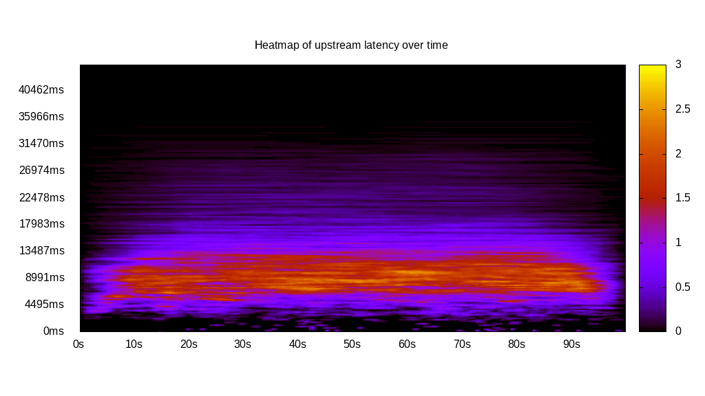

# Latency benchmark report. Crowd is 5000

## Populate workload

## Object Size is 0.00kiB

### PUT Latency in ms over time

Evolution of PUT Latency over time

| Parameter | Value |
| --- | --- |
| Y Coordinate | PUT Latency in ms |
| X Coordinate | time in s since begining of workload |

### PUT Latency distribution in ms

Distribution of the PUT Latency in ms

| Parameter | Value |
| --- | --- |
| Y Coordinate | Number of PUT |
| X Coordinate | Latency in ms |
| Server volume | 0.000MiB|
| Server bandwidth | 0.000MiB/s |
| Server time | 299997.00s |
| Server load | 0.00 |
| Server responses | 126838PUT |
| Server IOps | 0.42PUT/s |
| Client bandwidth | 0.000MiB/s |
| Client volume | 0.000MiB|
| Client time | 0.00s |
| Client IOps |  InfinityPUT/s  |
| Client Latency | 0.00ms/PUT |
| Client Limbo | 299997.00ms/PUT |
| Crowd time | 1499985000.00s |
| Crowd efficiency | 0.00% |
| Highest Latency | 44733.00ms |
| 95th percentile Latency | 19107.06ms |
| 68th percentile Latency | 13712.13ms |
| 50th percentile Latency | 11689.03ms |
| 32nd percentile Latency | 9665.92ms |
| 5th percentile Latency | 4270.99ms |
| Lowest Latency | 224.79ms |

## Read workload

## Object Size is 0.00kiB

### GET Latency in ms over time

Evolution of GET Latency over time

| Parameter | Value |
| --- | --- |
| Y Coordinate | GET Latency in ms |
| X Coordinate | time in s since begining of workload |

### GET Latency distribution in ms

Distribution of the GET Latency in ms

| Parameter | Value |
| --- | --- |
| Y Coordinate | Number of GET |
| X Coordinate | Latency in ms |
| Server volume | 0.000MiB|
| Server bandwidth | 0.000MiB/s |
| Server time | 64483.00s |
| Server load | 0.00 |
| Server responses | 0GET |
| Server IOps | 0.00GET/s |
| Client bandwidth | 0.000MiB/s |
| Client volume | 0.000MiB|
| Client time | 0.00s |
| Client IOps |  NaNGET/s  |
| Client Latency | NaNms/GET |
| Client Limbo | 64483.00ms/GET |
| Crowd time | 322415000.00s |
| Crowd efficiency | 0.00% |
| Highest Latency | 0.00ms |
| 95th percentile Latency | 0.00ms |
| 68th percentile Latency | 0.00ms |
| 50th percentile Latency | 0.00ms |
| 32nd percentile Latency | 0.00ms |
| 5th percentile Latency | 0.00ms |
| Lowest Latency | 0.00ms |

## Mixed workload

## Object Size is 0.00kiB

### PUT Latency in ms over time

Evolution of PUT Latency over time

| Parameter | Value |
| --- | --- |
| Y Coordinate | PUT Latency in ms |
| X Coordinate | time in s since begining of workload |

### GET Latency in ms over time

Evolution of GET Latency over time

| Parameter | Value |
| --- | --- |
| Y Coordinate | GET Latency in ms |
| X Coordinate | time in s since begining of workload |

### PUT Latency distribution in ms

Distribution of the PUT Latency in ms

| Parameter | Value |
| --- | --- |
| Y Coordinate | Number of PUT |
| X Coordinate | Latency in ms |
| Server volume | 0.000MiB|
| Server bandwidth | 0.000MiB/s |
| Server time | 99997.00s |
| Server load | 0.00 |
| Server responses | 14706PUT |
| Server IOps | 0.15PUT/s |
| Client bandwidth | 0.000MiB/s |
| Client volume | 0.000MiB|
| Client time | 0.00s |
| Client IOps |  InfinityPUT/s  |
| Client Latency | 0.00ms/PUT |
| Client Limbo | 99997.00ms/PUT |
| Crowd time | 499985000.00s |
| Crowd efficiency | 0.00% |
| Highest Latency | 38438.91ms |
| 95th percentile Latency | 23378.05ms |
| 68th percentile Latency | 12588.18ms |
| 50th percentile Latency | 10340.29ms |
| 32nd percentile Latency | 8317.19ms |
| 5th percentile Latency | 4495.78ms |
| Lowest Latency | 224.79ms |

### GET Latency distribution in ms

Distribution of the GET Latency in ms

| Parameter | Value |
| --- | --- |
| Y Coordinate | Number of GET |
| X Coordinate | Latency in ms |
| Server volume | 0.000MiB|
| Server bandwidth | 0.000MiB/s |
| Server time | 99997.00s |
| Server load | 0.00 |
| Server responses | 0GET |
| Server IOps | 0.00GET/s |
| Client bandwidth | 0.000MiB/s |
| Client volume | 0.000MiB|
| Client time | 0.00s |
| Client IOps |  NaNGET/s  |
| Client Latency | NaNms/GET |
| Client Limbo | 99997.00ms/GET |
| Crowd time | 499985000.00s |
| Crowd efficiency | 0.00% |
| Highest Latency | 0.00ms |
| 95th percentile Latency | 0.00ms |
| 68th percentile Latency | 0.00ms |
| 50th percentile Latency | 0.00ms |
| 32nd percentile Latency | 0.00ms |
| 5th percentile Latency | 0.00ms |
| Lowest Latency | 0.00ms |

## Cleanup workload

## Object Size is 0.00kiB

### DELETE Latency in ms over time

Evolution of DELETE Latency over time

| Parameter | Value |
| --- | --- |
| Y Coordinate | DELETE Latency in ms |
| X Coordinate | time in s since begining of workload |

### DELETE Latency distribution in ms

Distribution of the DELETE Latency in ms

| Parameter | Value |
| --- | --- |
| Y Coordinate | Number of DELETE |
| X Coordinate | Latency in ms |
| Server volume | 0.000MiB|
| Server bandwidth | 0.000MiB/s |
| Server time | 333092.00s |
| Server load | 0.00 |
| Server responses | 126846DELETE |
| Server IOps | 0.38DELETE/s |
| Client bandwidth | 0.000MiB/s |
| Client volume | 0.000MiB|
| Client time | 0.00s |
| Client IOps |  InfinityDELETE/s  |
| Client Latency | 0.00ms/DELETE |
| Client Limbo | 333092.00ms/DELETE |
| Crowd time | 1665460000.00s |
| Crowd efficiency | 0.00% |
| Highest Latency | 38888.49ms |
| 95th percentile Latency | 19556.64ms |
| 68th percentile Latency | 12588.18ms |
| 50th percentile Latency | 10789.87ms |
| 32nd percentile Latency | 8991.56ms |
| 5th percentile Latency | 4495.78ms |
| Lowest Latency | 224.79ms |

