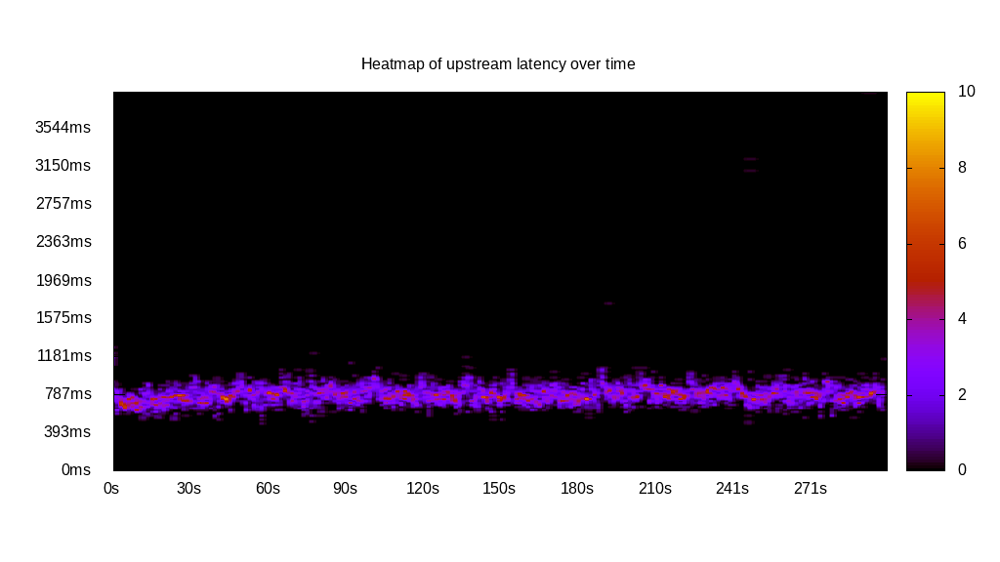
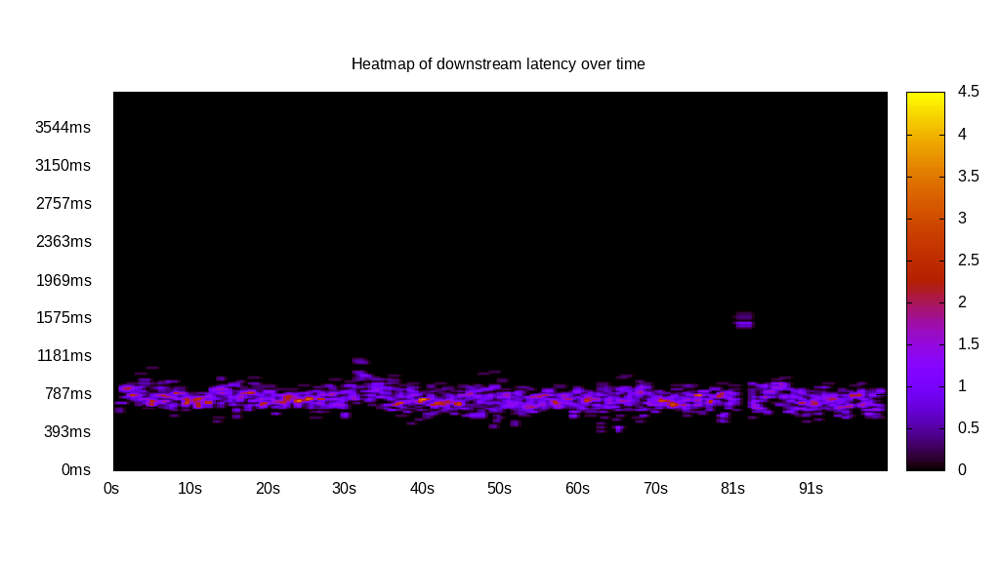
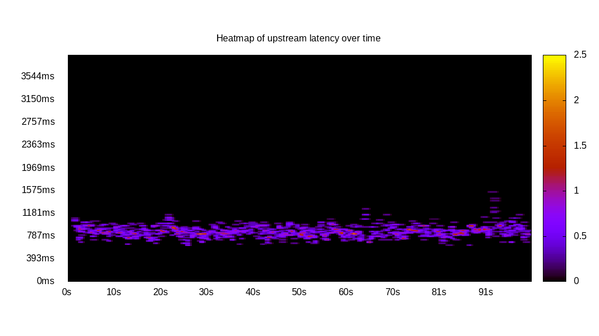
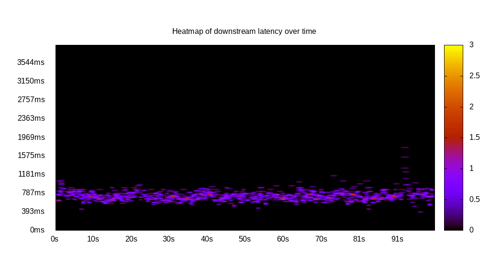
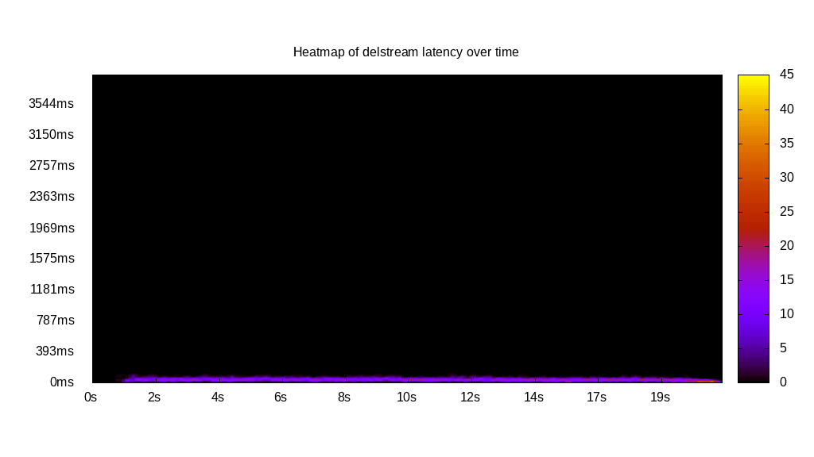

# Latency benchmark report. Crowd is 16

## Populate workload

## Object Size is 10240.00kiB

### PUT Latency in ms over time

Evolution of PUT Latency over time

| Parameter | Value |
| --- | --- |
| Y Coordinate | PUT Latency in ms |
| X Coordinate | time in s since begining of workload |

### PUT Latency distribution in ms

Distribution of the PUT Latency in ms

| Parameter | Value |
| --- | --- |
| Y Coordinate | Number of PUT |
| X Coordinate | Latency in ms |
| Workload duration | 299.87s |
| Workload volume | 59880.000MiB|
| Workload bandwidth | 199.687MiB/s |
| Client time spent | 3135.52s |
| C.time/W.duration | 10.46 |
| Request count | 5988PUT |
| Request per second (avg.) | 19.97PUT/s |
| Highest Latency | 3919.00ms |
| 95th percentile Latency | 945.29ms |
| 68th percentile Latency | 846.82ms |
| 50th percentile Latency | 807.43ms |
| 32nd percentile Latency | 768.05ms |
| 5th percentile Latency | 669.58ms |
| Lowest Latency | 492.34ms |

## Read workload

## Object Size is 10240.00kiB

### GET Latency in ms over time

Evolution of GET Latency over time

| Parameter | Value |
| --- | --- |
| Y Coordinate | GET Latency in ms |
| X Coordinate | time in s since begining of workload |

### GET Latency distribution in ms

Distribution of the GET Latency in ms

| Parameter | Value |
| --- | --- |
| Y Coordinate | Number of GET |
| X Coordinate | Latency in ms |
| Workload duration | 100.77s |
| Workload volume | 20870.000MiB|
| Workload bandwidth | 207.111MiB/s |
| Client time spent | 1070.77s |
| C.time/W.duration | 10.63 |
| Request count | 2087GET |
| Request per second (avg.) | 20.71GET/s |
| Highest Latency | 1634.56ms |
| 95th percentile Latency | 905.90ms |
| 68th percentile Latency | 807.43ms |
| 50th percentile Latency | 768.05ms |
| 32nd percentile Latency | 728.66ms |
| 5th percentile Latency | 630.19ms |
| Lowest Latency | 413.56ms |

## Mixed workload

## Object Size is 10240.00kiB

### PUT Latency in ms over time

Evolution of PUT Latency over time

| Parameter | Value |
| --- | --- |
| Y Coordinate | PUT Latency in ms |
| X Coordinate | time in s since begining of workload |

### GET Latency in ms over time

Evolution of GET Latency over time

| Parameter | Value |
| --- | --- |
| Y Coordinate | GET Latency in ms |
| X Coordinate | time in s since begining of workload |

### PUT Latency distribution in ms

Distribution of the PUT Latency in ms

| Parameter | Value |
| --- | --- |
| Y Coordinate | Number of PUT |
| X Coordinate | Latency in ms |
| Workload duration | 100.75s |
| Workload volume | 9820.000MiB|
| Workload bandwidth | 97.466MiB/s |
| Client time spent | 518.17s |
| C.time/W.duration | 5.14 |
| Request count | 982PUT |
| Request per second (avg.) | 9.75PUT/s |
| Highest Latency | 1536.09ms |
| 95th percentile Latency | 1024.06ms |
| 68th percentile Latency | 905.90ms |
| 50th percentile Latency | 866.51ms |
| 32nd percentile Latency | 827.13ms |
| 5th percentile Latency | 728.66ms |
| Lowest Latency | 610.50ms |

### GET Latency distribution in ms

Distribution of the GET Latency in ms

| Parameter | Value |
| --- | --- |
| Y Coordinate | Number of GET |
| X Coordinate | Latency in ms |
| Workload duration | 100.75s |
| Workload volume | 10200.000MiB|
| Workload bandwidth | 101.238MiB/s |
| Client time spent | 480.32s |
| C.time/W.duration | 4.77 |
| Request count | 1020GET |
| Request per second (avg.) | 10.12GET/s |
| Highest Latency | 1733.03ms |
| 95th percentile Latency | 886.21ms |
| 68th percentile Latency | 768.05ms |
| 50th percentile Latency | 728.66ms |
| 32nd percentile Latency | 689.27ms |
| 5th percentile Latency | 610.50ms |
| Lowest Latency | 374.18ms |

## Cleanup workload

## Object Size is 10240.00kiB

### DELETE Latency in ms over time

Evolution of DELETE Latency over time

| Parameter | Value |
| --- | --- |
| Y Coordinate | DELETE Latency in ms |
| X Coordinate | time in s since begining of workload |

### DELETE Latency distribution in ms

Distribution of the DELETE Latency in ms

| Parameter | Value |
| --- | --- |
| Y Coordinate | Number of DELETE |
| X Coordinate | Latency in ms |
| Workload duration | 21.27s |
| Workload volume | 59960.000MiB|
| Workload bandwidth | 2818.596MiB/s |
| Client time spent | 409.62s |
| C.time/W.duration | 19.26 |
| Request count | 5996DELETE |
| Request per second (avg.) | 281.86DELETE/s |
| Highest Latency | 118.16ms |
| 95th percentile Latency | 98.47ms |
| 68th percentile Latency | 59.08ms |
| 50th percentile Latency | 59.08ms |
| 32nd percentile Latency | 59.08ms |
| 5th percentile Latency | 39.39ms |
| Lowest Latency | 19.69ms |

