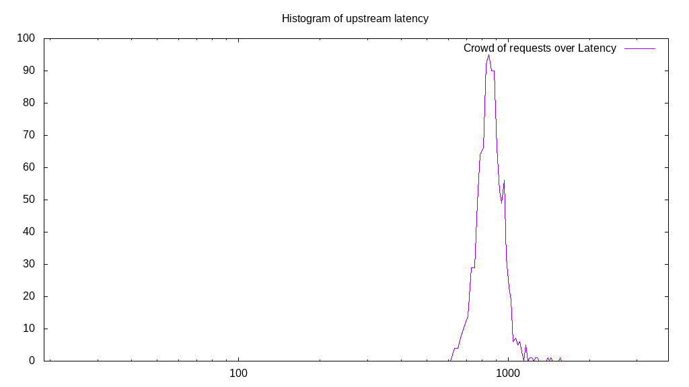

# Latency benchmark report. Crowd is 16

## Populate workload

## Object Size is 10240.00kiB

### PUT Latency in ms over time

Evolution of PUT Latency over time

| Parameter | Value |
| --- | --- |
| Y Coordinate | PUT Latency in ms |
| X Coordinate | time in s since begining of workload |

### PUT Latency distribution in ms

Distribution of the PUT Latency in ms

| Parameter | Value |
| --- | --- |
| Y Coordinate | Number of PUT |
| X Coordinate | Latency in ms |
| Server volume | 59880.000MiB|
| Server bandwidth | 0.200MiB/s |
| Server time | 299870.00s |
| Server load | 15.98 |
| Server responses | 5988PUT |
| Server IOps | 0.02PUT/s |
| Client bandwidth | 0.012MiB/s |
| Client volume | 3742.500MiB|
| Client time | 4791556.00s |
| Client IOps |  0.00PUT/s  |
| Client Latency | 800193.05ms/PUT |
| Client Limbo | 397.75ms/PUT |
| Crowd time | 4797920.00s |
| Crowd efficiency | 99.87% |
| Highest Latency | 3919.00ms |
| 95th percentile Latency | 945.29ms |
| 68th percentile Latency | 846.82ms |
| 50th percentile Latency | 807.43ms |
| 32nd percentile Latency | 768.05ms |
| 5th percentile Latency | 669.58ms |
| Lowest Latency | 492.34ms |

## Read workload

## Object Size is 10240.00kiB

### GET Latency in ms over time

Evolution of GET Latency over time

| Parameter | Value |
| --- | --- |
| Y Coordinate | GET Latency in ms |
| X Coordinate | time in s since begining of workload |

### GET Latency distribution in ms

Distribution of the GET Latency in ms

| Parameter | Value |
| --- | --- |
| Y Coordinate | Number of GET |
| X Coordinate | Latency in ms |
| Server volume | 20870.000MiB|
| Server bandwidth | 0.207MiB/s |
| Server time | 100767.00s |
| Server load | 15.77 |
| Server responses | 2087GET |
| Server IOps | 0.02GET/s |
| Client bandwidth | 0.013MiB/s |
| Client volume | 1304.375MiB|
| Client time | 1588651.00s |
| Client IOps |  0.00GET/s  |
| Client Latency | 761212.75ms/GET |
| Client Limbo | 1476.31ms/GET |
| Crowd time | 1612272.00s |
| Crowd efficiency | 98.53% |
| Highest Latency | 1634.56ms |
| 95th percentile Latency | 905.90ms |
| 68th percentile Latency | 807.43ms |
| 50th percentile Latency | 768.05ms |
| 32nd percentile Latency | 728.66ms |
| 5th percentile Latency | 630.19ms |
| Lowest Latency | 413.56ms |

## Mixed workload

## Object Size is 10240.00kiB

### PUT Latency in ms over time

Evolution of PUT Latency over time

| Parameter | Value |
| --- | --- |
| Y Coordinate | PUT Latency in ms |
| X Coordinate | time in s since begining of workload |

### GET Latency in ms over time

Evolution of GET Latency over time

| Parameter | Value |
| --- | --- |
| Y Coordinate | GET Latency in ms |
| X Coordinate | time in s since begining of workload |

### PUT Latency distribution in ms

Distribution of the PUT Latency in ms

| Parameter | Value |
| --- | --- |
| Y Coordinate | Number of PUT |
| X Coordinate | Latency in ms |
| Server volume | 9820.000MiB|
| Server bandwidth | 0.097MiB/s |
| Server time | 100753.00s |
| Server load | 8.48 |
| Server responses | 982PUT |
| Server IOps | 0.01PUT/s |
| Client bandwidth | 0.006MiB/s |
| Client volume | 613.750MiB|
| Client time | 853993.00s |
| Client IOps |  0.00PUT/s  |
| Client Latency | 869646.64ms/PUT |
| Client Limbo | 47378.44ms/PUT |
| Crowd time | 1612048.00s |
| Crowd efficiency | 52.98% |
| Highest Latency | 1536.09ms |
| 95th percentile Latency | 1024.06ms |
| 68th percentile Latency | 905.90ms |
| 50th percentile Latency | 866.51ms |
| 32nd percentile Latency | 827.13ms |
| 5th percentile Latency | 728.66ms |
| Lowest Latency | 610.50ms |

### GET Latency distribution in ms

Distribution of the GET Latency in ms

| Parameter | Value |
| --- | --- |
| Y Coordinate | Number of GET |
| X Coordinate | Latency in ms |
| Server volume | 10200.000MiB|
| Server bandwidth | 0.101MiB/s |
| Server time | 100753.00s |
| Server load | 7.38 |
| Server responses | 1020GET |
| Server IOps | 0.01GET/s |
| Client bandwidth | 0.006MiB/s |
| Client volume | 637.500MiB|
| Client time | 743838.00s |
| Client IOps |  0.00GET/s  |
| Client Latency | 729252.94ms/GET |
| Client Limbo | 54263.13ms/GET |
| Crowd time | 1612048.00s |
| Crowd efficiency | 46.14% |
| Highest Latency | 1733.03ms |
| 95th percentile Latency | 886.21ms |
| 68th percentile Latency | 768.05ms |
| 50th percentile Latency | 728.66ms |
| 32nd percentile Latency | 689.27ms |
| 5th percentile Latency | 610.50ms |
| Lowest Latency | 374.18ms |

## Cleanup workload

## Object Size is 10240.00kiB

### DELETE Latency in ms over time

Evolution of DELETE Latency over time

| Parameter | Value |
| --- | --- |
| Y Coordinate | DELETE Latency in ms |
| X Coordinate | time in s since begining of workload |

### DELETE Latency distribution in ms

Distribution of the DELETE Latency in ms

| Parameter | Value |
| --- | --- |
| Y Coordinate | Number of DELETE |
| X Coordinate | Latency in ms |
| Server volume | 59960.000MiB|
| Server bandwidth | 2.819MiB/s |
| Server time | 21273.00s |
| Server load | 14.96 |
| Server responses | 5996DELETE |
| Server IOps | 0.28DELETE/s |
| Client bandwidth | 0.176MiB/s |
| Client volume | 3747.500MiB|
| Client time | 318219.00s |
| Client IOps |  0.02DELETE/s  |
| Client Latency | 53071.88ms/DELETE |
| Client Limbo | 1384.31ms/DELETE |
| Crowd time | 340368.00s |
| Crowd efficiency | 93.49% |
| Highest Latency | 118.16ms |
| 95th percentile Latency | 98.47ms |
| 68th percentile Latency | 59.08ms |
| 50th percentile Latency | 59.08ms |
| 32nd percentile Latency | 59.08ms |
| 5th percentile Latency | 39.39ms |
| Lowest Latency | 19.69ms |

