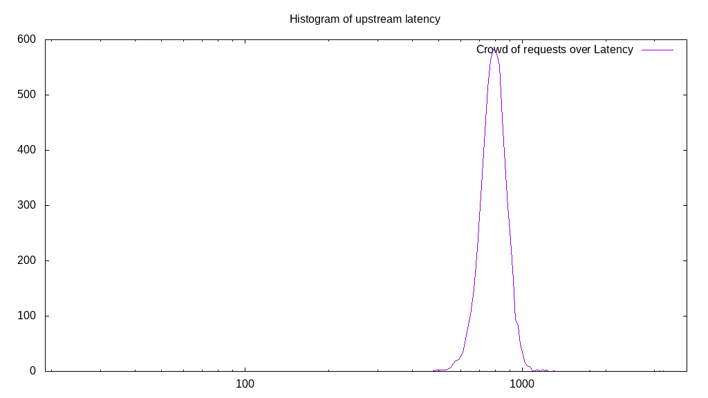
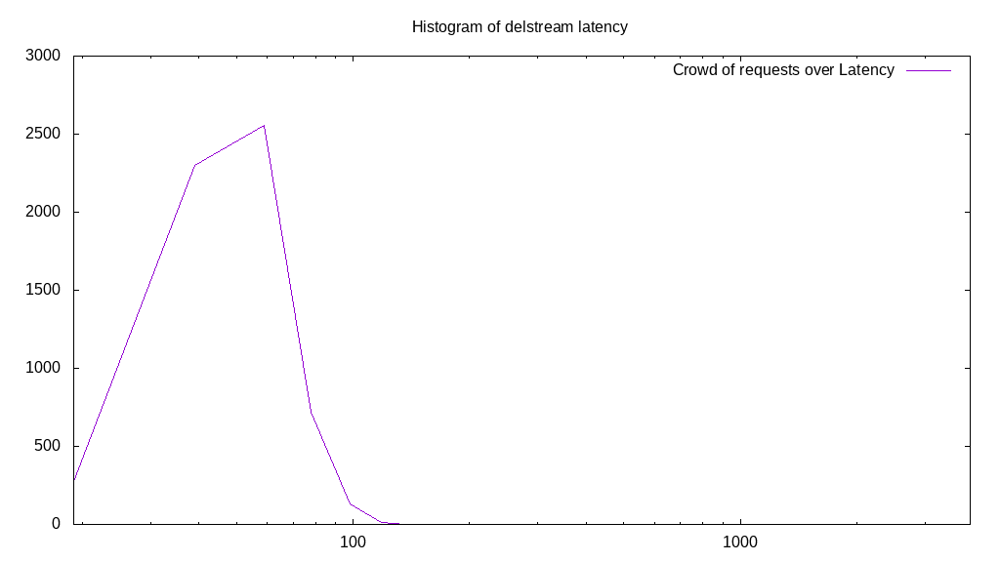

# Latency benchmark report. Crowd is 16

## Populate workload

## Object Size is 10240.00kiB

### PUT Latency in ms over time

Evolution of PUT Latency over time

| Parameter | Value |
| --- | --- |
| Y Coordinate | PUT Latency in ms |
| X Coordinate | time in s since begining of workload |

### PUT Latency distribution in ms

Distribution of the PUT Latency in ms

| Parameter | Value |
| --- | --- |
| Y Coordinate | Number of PUT |
| X Coordinate | Latency in ms |
| Server volume | 59880.000MiB|
| Server bandwidth | 199.687MiB/s |
| Server time | 299.87s |
| Server load | 15.98 |
| Server responses | 5988PUT |
| Server IOps | 19.97PUT/s |
| Client bandwidth | 12.480MiB/s |
| Client volume | 3742.500MiB|
| Client time | 4791.56s |
| Client IOps |  1.25PUT/s  |
| Client Latency | 800.19ms/PUT |
| Client Limbo | 0.40ms/PUT |
| Crowd time | 4797.92s |
| Crowd efficiency | 99.87% |
| Highest Latency | 3919.00ms |
| 95th percentile Latency | 964.98ms |
| 68th percentile Latency | 846.82ms |
| 50th percentile Latency | 807.43ms |
| 32nd percentile Latency | 787.74ms |
| 5th percentile Latency | 689.27ms |
| Lowest Latency | 492.34ms |

## Read workload

## Object Size is 10240.00kiB

### GET Latency in ms over time

Evolution of GET Latency over time

| Parameter | Value |
| --- | --- |
| Y Coordinate | GET Latency in ms |
| X Coordinate | time in s since begining of workload |

### GET Latency distribution in ms

Distribution of the GET Latency in ms

| Parameter | Value |
| --- | --- |
| Y Coordinate | Number of GET |
| X Coordinate | Latency in ms |
| Server volume | 20870.000MiB|
| Server bandwidth | 207.111MiB/s |
| Server time | 100.77s |
| Server load | 15.77 |
| Server responses | 2087GET |
| Server IOps | 20.71GET/s |
| Client bandwidth | 12.944MiB/s |
| Client volume | 1304.375MiB|
| Client time | 1588.65s |
| Client IOps |  1.31GET/s  |
| Client Latency | 761.21ms/GET |
| Client Limbo | 1.48ms/GET |
| Crowd time | 1612.27s |
| Crowd efficiency | 98.53% |
| Highest Latency | 1654.25ms |
| 95th percentile Latency | 925.59ms |
| 68th percentile Latency | 807.43ms |
| 50th percentile Latency | 768.05ms |
| 32nd percentile Latency | 728.66ms |
| 5th percentile Latency | 630.19ms |
| Lowest Latency | 413.56ms |

## Mixed workload

## Object Size is 10240.00kiB

### PUT Latency in ms over time

Evolution of PUT Latency over time

| Parameter | Value |
| --- | --- |
| Y Coordinate | PUT Latency in ms |
| X Coordinate | time in s since begining of workload |

### GET Latency in ms over time

Evolution of GET Latency over time

| Parameter | Value |
| --- | --- |
| Y Coordinate | GET Latency in ms |
| X Coordinate | time in s since begining of workload |

### PUT Latency distribution in ms

Distribution of the PUT Latency in ms

| Parameter | Value |
| --- | --- |
| Y Coordinate | Number of PUT |
| X Coordinate | Latency in ms |
| Server volume | 9820.000MiB|
| Server bandwidth | 97.466MiB/s |
| Server time | 100.75s |
| Server load | 8.48 |
| Server responses | 982PUT |
| Server IOps | 9.75PUT/s |
| Client bandwidth | 6.092MiB/s |
| Client volume | 613.750MiB|
| Client time | 853.99s |
| Client IOps |  1.15PUT/s  |
| Client Latency | 869.65ms/PUT |
| Client Limbo | 47.38ms/PUT |
| Crowd time | 1612.05s |
| Crowd efficiency | 52.98% |
| Highest Latency | 1555.78ms |
| 95th percentile Latency | 1043.75ms |
| 68th percentile Latency | 925.59ms |
| 50th percentile Latency | 886.21ms |
| 32nd percentile Latency | 846.82ms |
| 5th percentile Latency | 748.35ms |
| Lowest Latency | 630.19ms |

### GET Latency distribution in ms

Distribution of the GET Latency in ms

| Parameter | Value |
| --- | --- |
| Y Coordinate | Number of GET |
| X Coordinate | Latency in ms |
| Server volume | 10200.000MiB|
| Server bandwidth | 101.238MiB/s |
| Server time | 100.75s |
| Server load | 7.38 |
| Server responses | 1020GET |
| Server IOps | 10.12GET/s |
| Client bandwidth | 6.327MiB/s |
| Client volume | 637.500MiB|
| Client time | 743.84s |
| Client IOps |  1.37GET/s  |
| Client Latency | 729.25ms/GET |
| Client Limbo | 54.26ms/GET |
| Crowd time | 1612.05s |
| Crowd efficiency | 46.14% |
| Highest Latency | 1752.72ms |
| 95th percentile Latency | 886.21ms |
| 68th percentile Latency | 787.74ms |
| 50th percentile Latency | 748.35ms |
| 32nd percentile Latency | 708.96ms |
| 5th percentile Latency | 610.50ms |
| Lowest Latency | 393.87ms |

## Cleanup workload

## Object Size is 10240.00kiB

### DELETE Latency in ms over time

Evolution of DELETE Latency over time

| Parameter | Value |
| --- | --- |
| Y Coordinate | DELETE Latency in ms |
| X Coordinate | time in s since begining of workload |

### DELETE Latency distribution in ms

Distribution of the DELETE Latency in ms

| Parameter | Value |
| --- | --- |
| Y Coordinate | Number of DELETE |
| X Coordinate | Latency in ms |
| Server volume | 59960.000MiB|
| Server bandwidth | 2818.596MiB/s |
| Server time | 21.27s |
| Server load | 14.96 |
| Server responses | 5996DELETE |
| Server IOps | 281.86DELETE/s |
| Client bandwidth | 176.162MiB/s |
| Client volume | 3747.500MiB|
| Client time | 318.22s |
| Client IOps |  18.84DELETE/s  |
| Client Latency | 53.07ms/DELETE |
| Client Limbo | 1.38ms/DELETE |
| Crowd time | 340.37s |
| Crowd efficiency | 93.49% |
| Highest Latency | 118.16ms |
| 95th percentile Latency | 98.47ms |
| 68th percentile Latency | 78.77ms |
| 50th percentile Latency | 78.77ms |
| 32nd percentile Latency | 59.08ms |
| 5th percentile Latency | 59.08ms |
| Lowest Latency | 19.69ms |

