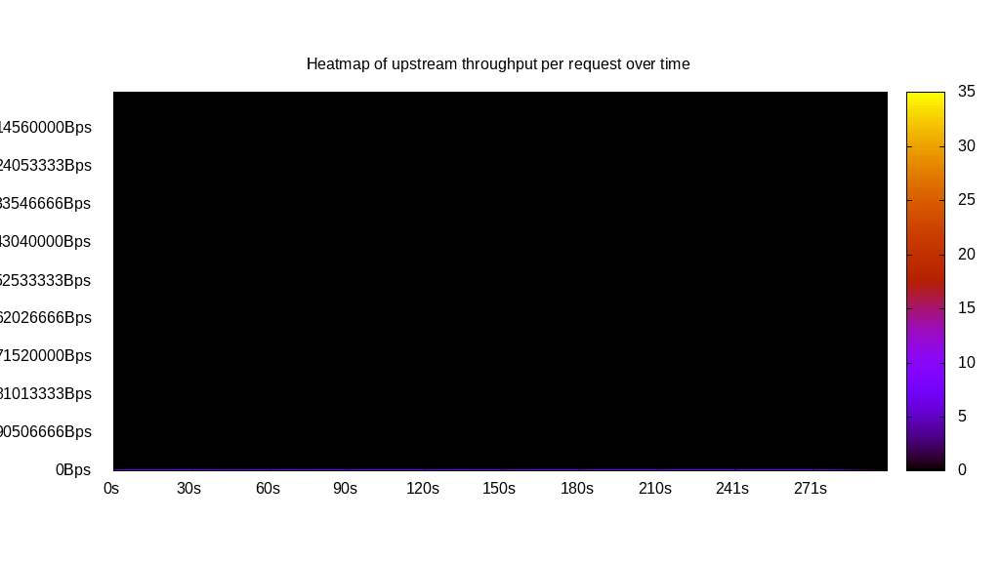
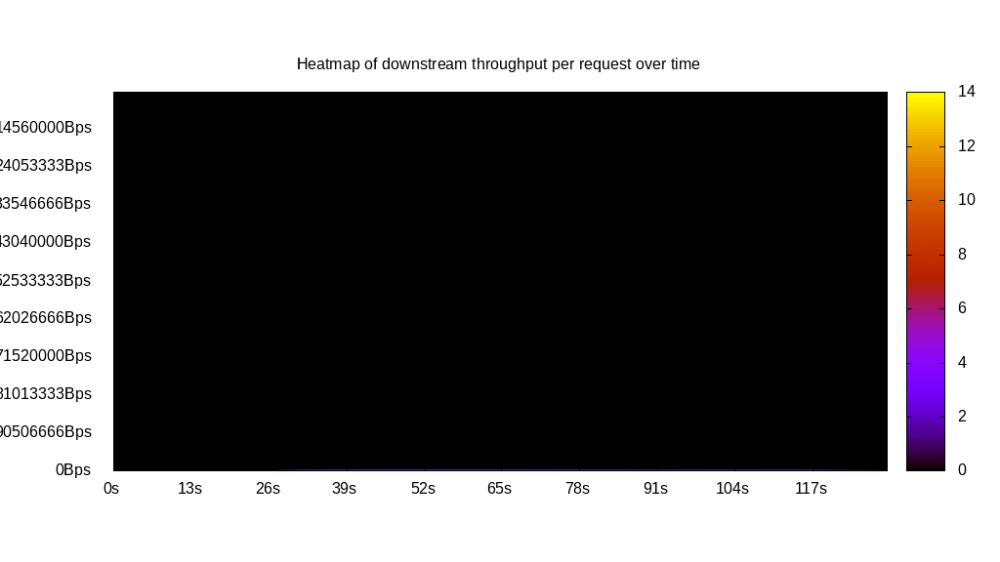
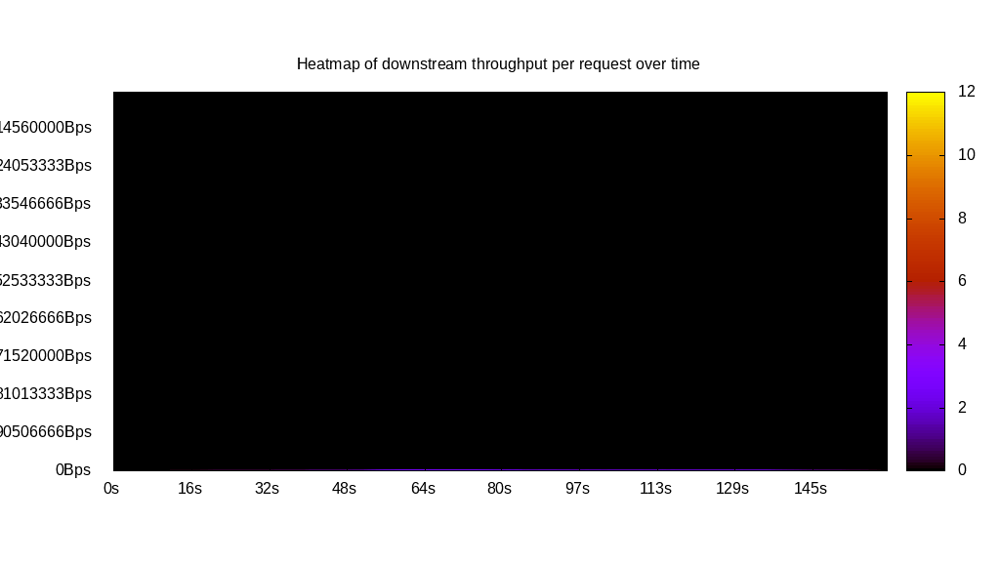
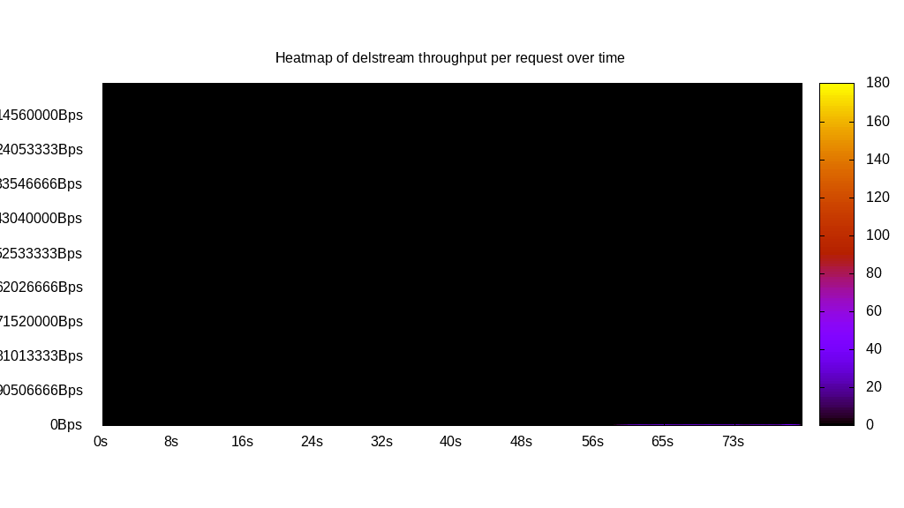

# Client bandwidth benchmark report. Crowd is 512

## Populate workload

## Object Size is 10240.00kiB

### PUT Client bandwidth in B over time

Evolution of PUT Client bandwidth over time

| Parameter | Value |
| --- | --- |
| Y Coordinate | PUT Client bandwidth in B |
| X Coordinate | time in s since begining of workload |

### PUT Client bandwidth distribution in B

Distribution of the PUT Client bandwidth in B

| Parameter | Value |
| --- | --- |
| Y Coordinate | Number of PUT |
| X Coordinate | Client bandwidth in B |
| Server volume | 48700.000MiB|
| Server bandwidth | 162.377MiB/s |
| Server time | 299.92s |
| Server load | 455.74 |
| Server responses | 4870PUT |
| Server IOps | 16.24PUT/s |
| Client bandwidth | 0.317MiB/s |
| Client volume | 95.117MiB|
| Client time | 136684.95s |
| Client IOps |  0.04PUT/s  |
| Client Latency | 28066.72ms/PUT |
| Client Limbo | 32.96ms/PUT |
| Crowd time | 153558.53s |
| Crowd efficiency | 89.01% |
| Highest Client bandwidth | 0.00B |
| 95th percentile Client bandwidth | 349525333.33B |
| 68th percentile Client bandwidth | 349525333.33B |
| 50th percentile Client bandwidth | 349525333.33B |
| 32nd percentile Client bandwidth | 349525333.33B |
| 5th percentile Client bandwidth | 349525333.33B |
| Lowest Client bandwidth | 0.00B |

## Read workload

## Object Size is 10240.00kiB

### GET Client bandwidth in B over time

Evolution of GET Client bandwidth over time

| Parameter | Value |
| --- | --- |
| Y Coordinate | GET Client bandwidth in B |
| X Coordinate | time in s since begining of workload |

### GET Client bandwidth distribution in B

Distribution of the GET Client bandwidth in B

| Parameter | Value |
| --- | --- |
| Y Coordinate | Number of GET |
| X Coordinate | Client bandwidth in B |
| Server volume | 13140.000MiB|
| Server bandwidth | 101.434MiB/s |
| Server time | 129.54s |
| Server load | 286.26 |
| Server responses | 1314GET |
| Server IOps | 10.14GET/s |
| Client bandwidth | 0.198MiB/s |
| Client volume | 25.664MiB|
| Client time | 37082.35s |
| Client IOps |  0.04GET/s  |
| Client Latency | 28220.97ms/GET |
| Client Limbo | 57.12ms/GET |
| Crowd time | 66325.50s |
| Crowd efficiency | 55.91% |
| Highest Client bandwidth | 0.00B |
| 95th percentile Client bandwidth | 349525333.33B |
| 68th percentile Client bandwidth | 349525333.33B |
| 50th percentile Client bandwidth | 349525333.33B |
| 32nd percentile Client bandwidth | 349525333.33B |
| 5th percentile Client bandwidth | 349525333.33B |
| Lowest Client bandwidth | 0.00B |

## Mixed workload

## Object Size is 10240.00kiB

### PUT Client bandwidth in B over time

Evolution of PUT Client bandwidth over time

| Parameter | Value |
| --- | --- |
| Y Coordinate | PUT Client bandwidth in B |
| X Coordinate | time in s since begining of workload |

### GET Client bandwidth in B over time

Evolution of GET Client bandwidth over time

| Parameter | Value |
| --- | --- |
| Y Coordinate | GET Client bandwidth in B |
| X Coordinate | time in s since begining of workload |

### PUT Client bandwidth distribution in B

Distribution of the PUT Client bandwidth in B

| Parameter | Value |
| --- | --- |
| Y Coordinate | Number of PUT |
| X Coordinate | Client bandwidth in B |
| Server volume | 4930.000MiB|
| Server bandwidth | 30.606MiB/s |
| Server time | 161.08s |
| Server load | 86.78 |
| Server responses | 493PUT |
| Server IOps | 3.06PUT/s |
| Client bandwidth | 0.060MiB/s |
| Client volume | 9.629MiB|
| Client time | 13978.77s |
| Client IOps |  0.04PUT/s  |
| Client Latency | 28354.51ms/PUT |
| Client Limbo | 133.78ms/PUT |
| Crowd time | 82473.98s |
| Crowd efficiency | 16.95% |
| Highest Client bandwidth | 0.00B |
| 95th percentile Client bandwidth | 349525333.33B |
| 68th percentile Client bandwidth | 349525333.33B |
| 50th percentile Client bandwidth | 349525333.33B |
| 32nd percentile Client bandwidth | 349525333.33B |
| 5th percentile Client bandwidth | 349525333.33B |
| Lowest Client bandwidth | 0.00B |

### GET Client bandwidth distribution in B

Distribution of the GET Client bandwidth in B

| Parameter | Value |
| --- | --- |
| Y Coordinate | Number of GET |
| X Coordinate | Client bandwidth in B |
| Server volume | 9710.000MiB|
| Server bandwidth | 60.280MiB/s |
| Server time | 161.08s |
| Server load | 220.99 |
| Server responses | 971GET |
| Server IOps | 6.03GET/s |
| Client bandwidth | 0.118MiB/s |
| Client volume | 18.965MiB|
| Client time | 35598.15s |
| Client IOps |  0.03GET/s  |
| Client Latency | 36661.32ms/GET |
| Client Limbo | 91.55ms/GET |
| Crowd time | 82473.98s |
| Crowd efficiency | 43.16% |
| Highest Client bandwidth | 0.00B |
| 95th percentile Client bandwidth | 349525333.33B |
| 68th percentile Client bandwidth | 349525333.33B |
| 50th percentile Client bandwidth | 349525333.33B |
| 32nd percentile Client bandwidth | 349525333.33B |
| 5th percentile Client bandwidth | 349525333.33B |
| Lowest Client bandwidth | 0.00B |

## Cleanup workload

## Object Size is 10240.00kiB

### DELETE Client bandwidth in B over time

Evolution of DELETE Client bandwidth over time

| Parameter | Value |
| --- | --- |
| Y Coordinate | DELETE Client bandwidth in B |
| X Coordinate | time in s since begining of workload |

### DELETE Client bandwidth distribution in B

Distribution of the DELETE Client bandwidth in B

| Parameter | Value |
| --- | --- |
| Y Coordinate | Number of DELETE |
| X Coordinate | Client bandwidth in B |
| Server volume | 49330.000MiB|
| Server bandwidth | 608.907MiB/s |
| Server time | 81.01s |
| Server load | 43.35 |
| Server responses | 4933DELETE |
| Server IOps | 60.89DELETE/s |
| Client bandwidth | 1.189MiB/s |
| Client volume | 96.348MiB|
| Client time | 3511.79s |
| Client IOps |  1.40DELETE/s  |
| Client Latency | 711.90ms/DELETE |
| Client Limbo | 74.16ms/DELETE |
| Crowd time | 41479.17s |
| Crowd efficiency | 8.47% |
| Highest Client bandwidth | 349525333.33B |
| 95th percentile Client bandwidth | 349525333.33B |
| 68th percentile Client bandwidth | 349525333.33B |
| 50th percentile Client bandwidth | 349525333.33B |
| 32nd percentile Client bandwidth | 349525333.33B |
| 5th percentile Client bandwidth | 349525333.33B |
| Lowest Client bandwidth | 349525333.33B |

