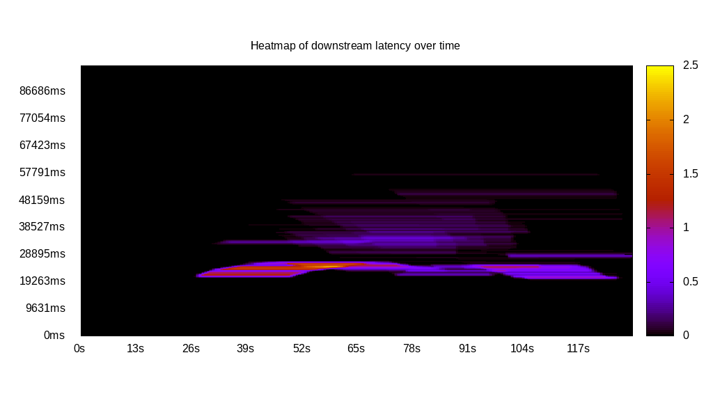
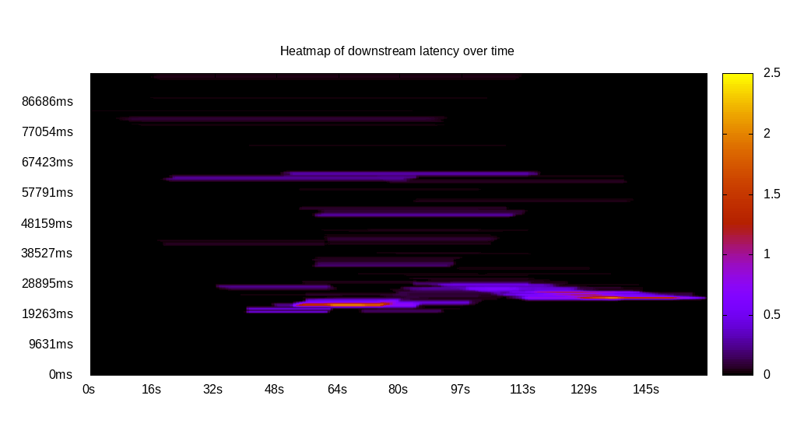

# Latency benchmark report. Crowd is 512

## Populate workload

## Object Size is 10240.00kiB

### PUT Latency in ms over time

Evolution of PUT Latency over time

| Parameter | Value |
| --- | --- |
| Y Coordinate | PUT Latency in ms |
| X Coordinate | time in s since begining of workload |

### PUT Latency distribution in ms

Distribution of the PUT Latency in ms

| Parameter | Value |
| --- | --- |
| Y Coordinate | Number of PUT |
| X Coordinate | Latency in ms |
| Workload duration | 299.92s |
| Workload volume | 48700.000MiB|
| Workload bandwidth | 162.377MiB/s |
| Request count | 4870PUT |
| Request per second (avg.) | 16.24PUT/s |
| Client time spent | 93856.69s |
| C.time/W.duration | 312.94 |
| Reduced Latency | |
| Highest Latency | 38527.44ms |
| 95th percentile Latency | 32748.32ms |
| 68th percentile Latency | 28413.98ms |
| 50th percentile Latency | 27932.39ms |
| 32nd percentile Latency | 27450.80ms |
| 5th percentile Latency | 25524.43ms |
| Lowest Latency | 5297.52ms |

## Read workload

## Object Size is 10240.00kiB

### GET Latency in ms over time

Evolution of GET Latency over time

| Parameter | Value |
| --- | --- |
| Y Coordinate | GET Latency in ms |
| X Coordinate | time in s since begining of workload |

### GET Latency distribution in ms

Distribution of the GET Latency in ms

| Parameter | Value |
| --- | --- |
| Y Coordinate | Number of GET |
| X Coordinate | Latency in ms |
| Workload duration | 129.54s |
| Workload volume | 13140.000MiB|
| Workload bandwidth | 101.434MiB/s |
| Request count | 1314GET |
| Request per second (avg.) | 10.14GET/s |
| Client time spent | 32874.50s |
| C.time/W.duration | 253.77 |
| Reduced Latency | |
| Highest Latency | 57309.56ms |
| 95th percentile Latency | 44788.15ms |
| 68th percentile Latency | 28413.98ms |
| 50th percentile Latency | 25042.83ms |
| 32nd percentile Latency | 24079.65ms |
| 5th percentile Latency | 21671.68ms |
| Lowest Latency | 20226.90ms |

## Mixed workload

## Object Size is 10240.00kiB

### PUT Latency in ms over time

Evolution of PUT Latency over time

| Parameter | Value |
| --- | --- |
| Y Coordinate | PUT Latency in ms |
| X Coordinate | time in s since begining of workload |

### GET Latency in ms over time

Evolution of GET Latency over time

| Parameter | Value |
| --- | --- |
| Y Coordinate | GET Latency in ms |
| X Coordinate | time in s since begining of workload |

### PUT Latency distribution in ms

Distribution of the PUT Latency in ms

| Parameter | Value |
| --- | --- |
| Y Coordinate | Number of PUT |
| X Coordinate | Latency in ms |
| Workload duration | 161.08s |
| Workload volume | 4930.000MiB|
| Workload bandwidth | 30.606MiB/s |
| Request count | 493PUT |
| Request per second (avg.) | 3.06PUT/s |
| Client time spent | 14068.29s |
| C.time/W.duration | 87.34 |
| Reduced Latency | |
| Highest Latency | 68386.20ms |
| 95th percentile Latency | 52493.63ms |
| 68th percentile Latency | 27450.80ms |
| 50th percentile Latency | 26487.61ms |
| 32nd percentile Latency | 26006.02ms |
| 5th percentile Latency | 23116.46ms |
| Lowest Latency | 20708.50ms |

### GET Latency distribution in ms

Distribution of the GET Latency in ms

| Parameter | Value |
| --- | --- |
| Y Coordinate | Number of GET |
| X Coordinate | Latency in ms |
| Workload duration | 161.08s |
| Workload volume | 9710.000MiB|
| Workload bandwidth | 60.280MiB/s |
| Request count | 971GET |
| Request per second (avg.) | 6.03GET/s |
| Client time spent | 42078.22s |
| C.time/W.duration | 261.22 |
| Reduced Latency | |
| Highest Latency | 95837.00ms |
| 95th percentile Latency | 81389.21ms |
| 68th percentile Latency | 35156.29ms |
| 50th percentile Latency | 26969.21ms |
| 32nd percentile Latency | 25042.83ms |
| 5th percentile Latency | 22153.28ms |
| Lowest Latency | 19745.31ms |

## Cleanup workload

## Object Size is 10240.00kiB

### DELETE Latency in ms over time

Evolution of DELETE Latency over time

| Parameter | Value |
| --- | --- |
| Y Coordinate | DELETE Latency in ms |
| X Coordinate | time in s since begining of workload |

### DELETE Latency distribution in ms

Distribution of the DELETE Latency in ms

| Parameter | Value |
| --- | --- |
| Y Coordinate | Number of DELETE |
| X Coordinate | Latency in ms |
| Workload duration | 81.01s |
| Workload volume | 49330.000MiB|
| Workload bandwidth | 608.907MiB/s |
| Request count | 4933DELETE |
| Request per second (avg.) | 60.89DELETE/s |
| Client time spent | 6954.20s |
| C.time/W.duration | 85.84 |
| Reduced Latency | |
| Highest Latency | 3371.15ms |
| 95th percentile Latency | 1926.37ms |
| 68th percentile Latency | 963.19ms |
| 50th percentile Latency | 963.19ms |
| 32nd percentile Latency | 481.59ms |
| 5th percentile Latency | 481.59ms |
| Lowest Latency | 481.59ms |

