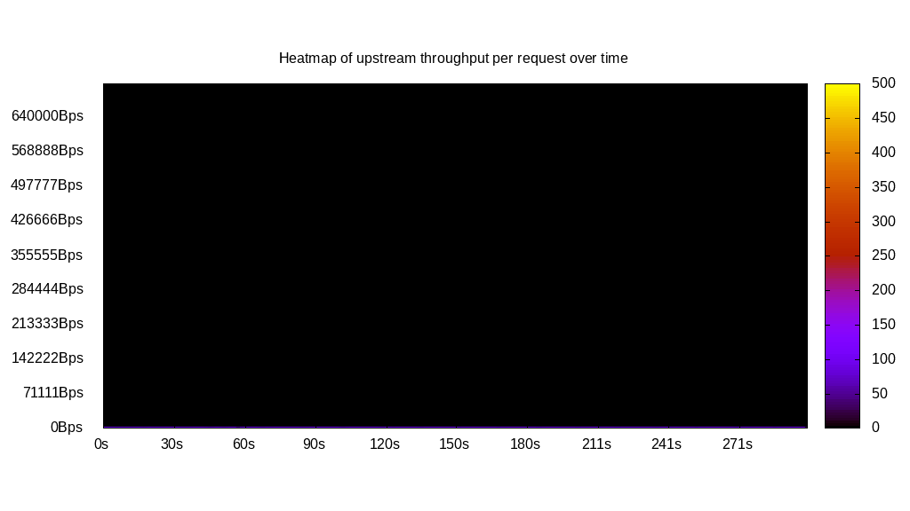
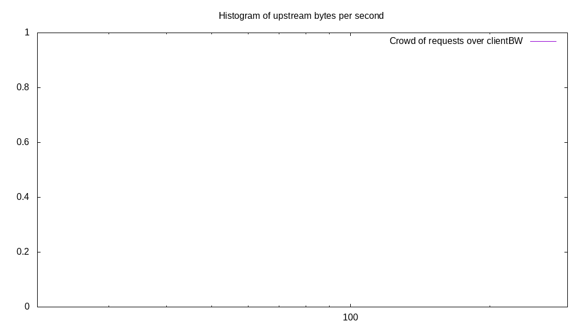
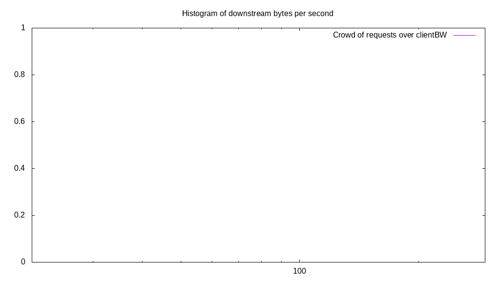
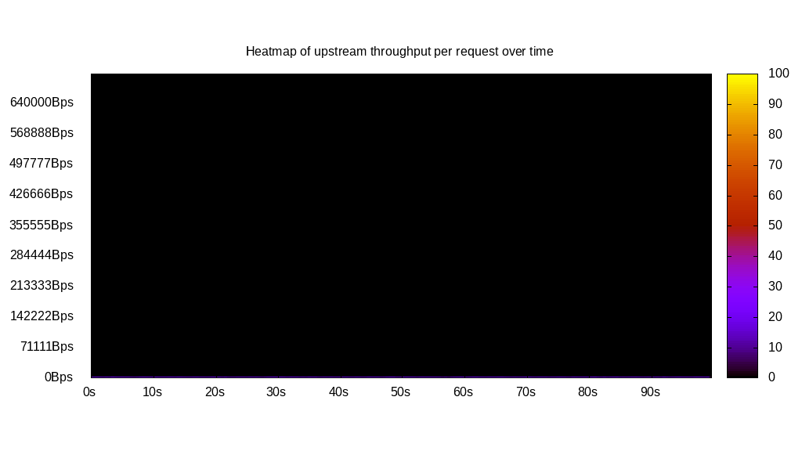
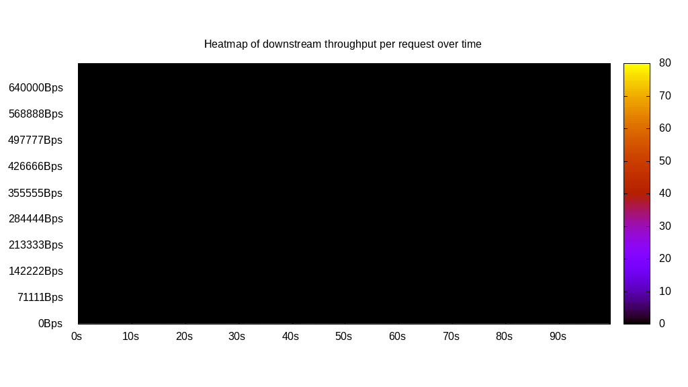
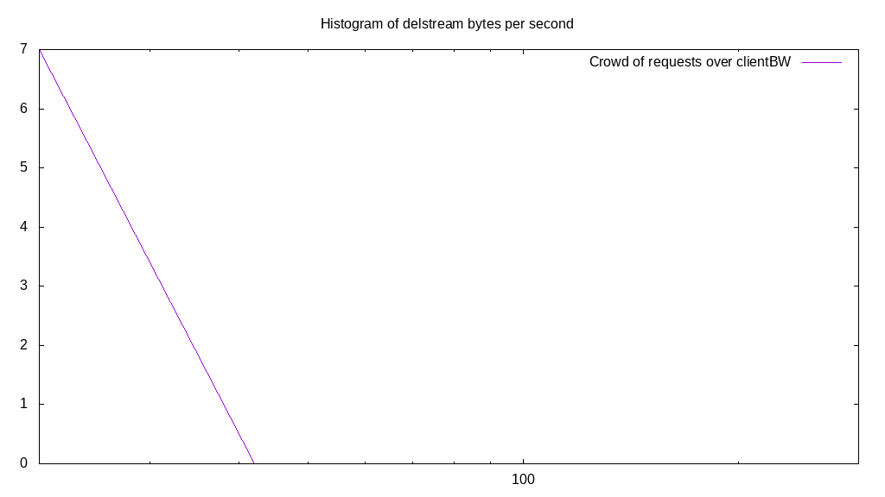

# Client bandwidth benchmark report. Crowd is 16

## Populate workload

## Object Size is 0.03kiB

### PUT Client bandwidth in B over time

Evolution of PUT Client bandwidth over time

| Parameter | Value |
| --- | --- |
| Y Coordinate | PUT Client bandwidth in B |
| X Coordinate | time in s since begining of workload |

### PUT Client bandwidth distribution in B

Distribution of the PUT Client bandwidth in B

| Parameter | Value |
| --- | --- |
| Y Coordinate | Number of PUT |
| X Coordinate | Client bandwidth in B |
| Server volume | 2.685MiB|
| Server bandwidth | 0.009MiB/s |
| Server time | 299.98s |
| Server load | 15.92 |
| Server responses | 87996PUT |
| Server IOps | 293.34PUT/s |
| Client bandwidth | 0.001MiB/s |
| Client volume | 0.168MiB|
| Client time | 4774.27s |
| Client IOps |  18.43PUT/s  |
| Client Latency | 54.26ms/PUT |
| Client Limbo | 1.59ms/PUT |
| Crowd time | 4799.70s |
| Crowd efficiency | 99.47% |
| Highest Client bandwidth | 0.00B |
| 95th percentile Client bandwidth | 3555.56B |
| 68th percentile Client bandwidth | 3555.56B |
| 50th percentile Client bandwidth | 3555.56B |
| 32nd percentile Client bandwidth | 3555.56B |
| 5th percentile Client bandwidth | 3555.56B |
| Lowest Client bandwidth | 0.00B |

## Read workload

## Object Size is 0.03kiB

### GET Client bandwidth in B over time

Evolution of GET Client bandwidth over time

| Parameter | Value |
| --- | --- |
| Y Coordinate | GET Client bandwidth in B |
| X Coordinate | time in s since begining of workload |

### GET Client bandwidth distribution in B

Distribution of the GET Client bandwidth in B

| Parameter | Value |
| --- | --- |
| Y Coordinate | Number of GET |
| X Coordinate | Client bandwidth in B |
| Server volume | 0.708MiB|
| Server bandwidth | 0.007MiB/s |
| Server time | 100.05s |
| Server load | 15.80 |
| Server responses | 23201GET |
| Server IOps | 231.89GET/s |
| Client bandwidth | 0.000MiB/s |
| Client volume | 0.044MiB|
| Client time | 1580.79s |
| Client IOps |  14.68GET/s  |
| Client Latency | 68.13ms/GET |
| Client Limbo | 1.25ms/GET |
| Crowd time | 1600.85s |
| Crowd efficiency | 98.75% |
| Highest Client bandwidth | 0.00B |
| 95th percentile Client bandwidth | 3555.56B |
| 68th percentile Client bandwidth | 3555.56B |
| 50th percentile Client bandwidth | 3555.56B |
| 32nd percentile Client bandwidth | 3555.56B |
| 5th percentile Client bandwidth | 3555.56B |
| Lowest Client bandwidth | 0.00B |

## Mixed workload

## Object Size is 0.03kiB

### PUT Client bandwidth in B over time

Evolution of PUT Client bandwidth over time

| Parameter | Value |
| --- | --- |
| Y Coordinate | PUT Client bandwidth in B |
| X Coordinate | time in s since begining of workload |

### GET Client bandwidth in B over time

Evolution of GET Client bandwidth over time

| Parameter | Value |
| --- | --- |
| Y Coordinate | GET Client bandwidth in B |
| X Coordinate | time in s since begining of workload |

### PUT Client bandwidth distribution in B

Distribution of the PUT Client bandwidth in B

| Parameter | Value |
| --- | --- |
| Y Coordinate | Number of PUT |
| X Coordinate | Client bandwidth in B |
| Server volume | 0.387MiB|
| Server bandwidth | 0.004MiB/s |
| Server time | 100.11s |
| Server load | 8.74 |
| Server responses | 12686PUT |
| Server IOps | 126.72PUT/s |
| Client bandwidth | 0.000MiB/s |
| Client volume | 0.024MiB|
| Client time | 875.03s |
| Client IOps |  14.50PUT/s  |
| Client Latency | 68.98ms/PUT |
| Client Limbo | 45.42ms/PUT |
| Crowd time | 1601.76s |
| Crowd efficiency | 54.63% |
| Highest Client bandwidth | 0.00B |
| 95th percentile Client bandwidth | 3555.56B |
| 68th percentile Client bandwidth | 3555.56B |
| 50th percentile Client bandwidth | 3555.56B |
| 32nd percentile Client bandwidth | 3555.56B |
| 5th percentile Client bandwidth | 3555.56B |
| Lowest Client bandwidth | 0.00B |

### GET Client bandwidth distribution in B

Distribution of the GET Client bandwidth in B

| Parameter | Value |
| --- | --- |
| Y Coordinate | Number of GET |
| X Coordinate | Client bandwidth in B |
| Server volume | 0.384MiB|
| Server bandwidth | 0.004MiB/s |
| Server time | 100.11s |
| Server load | 7.15 |
| Server responses | 12579GET |
| Server IOps | 125.65GET/s |
| Client bandwidth | 0.000MiB/s |
| Client volume | 0.024MiB|
| Client time | 715.95s |
| Client IOps |  17.57GET/s  |
| Client Latency | 56.92ms/GET |
| Client Limbo | 55.36ms/GET |
| Crowd time | 1601.76s |
| Crowd efficiency | 44.70% |
| Highest Client bandwidth | 0.00B |
| 95th percentile Client bandwidth | 3555.56B |
| 68th percentile Client bandwidth | 3555.56B |
| 50th percentile Client bandwidth | 3555.56B |
| 32nd percentile Client bandwidth | 3555.56B |
| 5th percentile Client bandwidth | 3555.56B |
| Lowest Client bandwidth | 0.00B |

## Cleanup workload

## Object Size is 0.03kiB

### DELETE Client bandwidth in B over time

Evolution of DELETE Client bandwidth over time

| Parameter | Value |
| --- | --- |
| Y Coordinate | DELETE Client bandwidth in B |
| X Coordinate | time in s since begining of workload |

### DELETE Client bandwidth distribution in B

Distribution of the DELETE Client bandwidth in B

| Parameter | Value |
| --- | --- |
| Y Coordinate | Number of DELETE |
| X Coordinate | Client bandwidth in B |
| Server volume | 2.686MiB|
| Server bandwidth | 0.010MiB/s |
| Server time | 263.99s |
| Server load | 15.92 |
| Server responses | 88004DELETE |
| Server IOps | 333.36DELETE/s |
| Client bandwidth | 0.001MiB/s |
| Client volume | 0.168MiB|
| Client time | 4203.78s |
| Client IOps |  20.93DELETE/s  |
| Client Latency | 47.77ms/DELETE |
| Client Limbo | 1.26ms/DELETE |
| Crowd time | 4223.89s |
| Crowd efficiency | 99.52% |
| Highest Client bandwidth | 3555.56B |
| 95th percentile Client bandwidth | 3555.56B |
| 68th percentile Client bandwidth | 3555.56B |
| 50th percentile Client bandwidth | 3555.56B |
| 32nd percentile Client bandwidth | 3555.56B |
| 5th percentile Client bandwidth | 3555.56B |
| Lowest Client bandwidth | 3555.56B |

