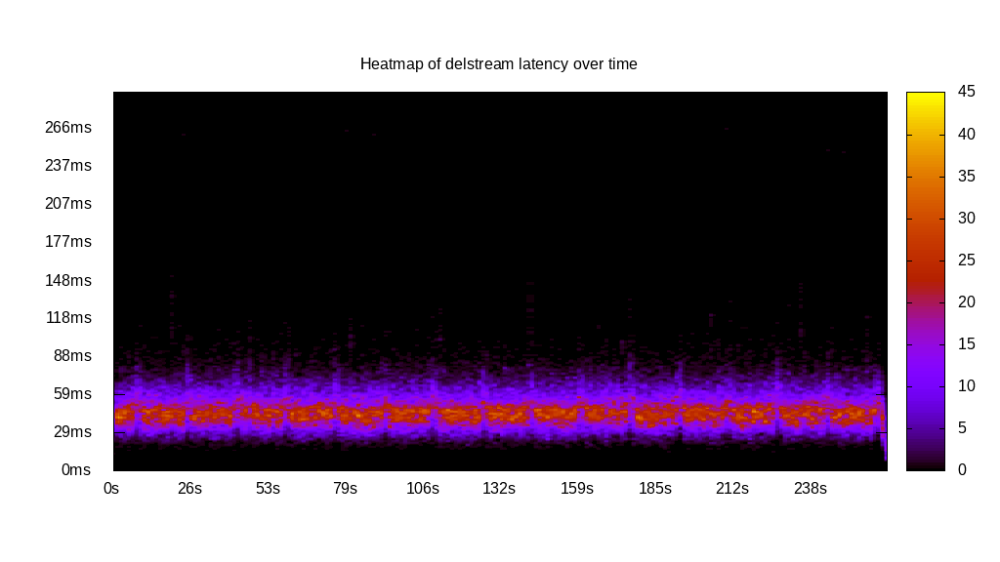
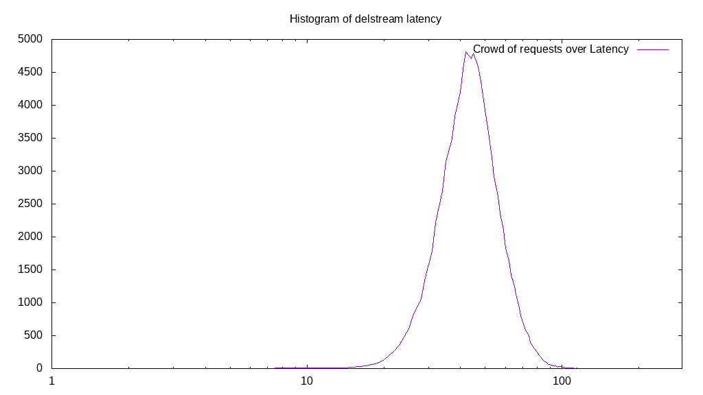

# Latency benchmark report. Crowd is 16

## Populate workload

## Object Size is 0.03kiB

### PUT Latency in ms over time

Evolution of PUT Latency over time

| Parameter | Value |
| --- | --- |
| Y Coordinate | PUT Latency in ms |
| X Coordinate | time in s since begining of workload |

### PUT Latency distribution in ms

Distribution of the PUT Latency in ms

| Parameter | Value |
| --- | --- |
| Y Coordinate | Number of PUT |
| X Coordinate | Latency in ms |
| Workload duration | 299.98s |
| Workload volume | 2.685MiB|
| Workload bandwidth | 0.009MiB/s |
| Client time spent | 3723.62s |
| C.time/W.duration | 12.41 |
| Request count | 87996PUT |
| Request per second (avg.) | 293.34PUT/s |
| Highest Latency | 247.56ms |
| 95th percentile Latency | 80.05ms |
| 68th percentile Latency | 59.30ms |
| 50th percentile Latency | 53.37ms |
| 32nd percentile Latency | 47.44ms |
| 5th percentile Latency | 35.58ms |
| Lowest Latency | 16.31ms |

## Read workload

## Object Size is 0.03kiB

### GET Latency in ms over time

Evolution of GET Latency over time

| Parameter | Value |
| --- | --- |
| Y Coordinate | GET Latency in ms |
| X Coordinate | time in s since begining of workload |

### GET Latency distribution in ms

Distribution of the GET Latency in ms

| Parameter | Value |
| --- | --- |
| Y Coordinate | Number of GET |
| X Coordinate | Latency in ms |
| Workload duration | 100.05s |
| Workload volume | 0.708MiB|
| Workload bandwidth | 0.007MiB/s |
| Client time spent | 1275.54s |
| C.time/W.duration | 12.75 |
| Request count | 23201GET |
| Request per second (avg.) | 231.89GET/s |
| Highest Latency | 295.00ms |
| 95th percentile Latency | 108.22ms |
| 68th percentile Latency | 75.60ms |
| 50th percentile Latency | 65.23ms |
| 32nd percentile Latency | 56.33ms |
| 5th percentile Latency | 40.03ms |
| Lowest Latency | 20.75ms |

## Mixed workload

## Object Size is 0.03kiB

### PUT Latency in ms over time

Evolution of PUT Latency over time

| Parameter | Value |
| --- | --- |
| Y Coordinate | PUT Latency in ms |
| X Coordinate | time in s since begining of workload |

### GET Latency in ms over time

Evolution of GET Latency over time

| Parameter | Value |
| --- | --- |
| Y Coordinate | GET Latency in ms |
| X Coordinate | time in s since begining of workload |

### PUT Latency distribution in ms

Distribution of the PUT Latency in ms

| Parameter | Value |
| --- | --- |
| Y Coordinate | Number of PUT |
| X Coordinate | Latency in ms |
| Workload duration | 100.11s |
| Workload volume | 0.387MiB|
| Workload bandwidth | 0.004MiB/s |
| Client time spent | 715.29s |
| C.time/W.duration | 7.15 |
| Request count | 12686PUT |
| Request per second (avg.) | 126.72PUT/s |
| Highest Latency | 281.66ms |
| 95th percentile Latency | 105.25ms |
| 68th percentile Latency | 77.09ms |
| 50th percentile Latency | 68.19ms |
| 32nd percentile Latency | 59.30ms |
| 5th percentile Latency | 40.03ms |
| Lowest Latency | 17.79ms |

### GET Latency distribution in ms

Distribution of the GET Latency in ms

| Parameter | Value |
| --- | --- |
| Y Coordinate | Number of GET |
| X Coordinate | Latency in ms |
| Workload duration | 100.11s |
| Workload volume | 0.384MiB|
| Workload bandwidth | 0.004MiB/s |
| Client time spent | 564.98s |
| C.time/W.duration | 5.64 |
| Request count | 12579GET |
| Request per second (avg.) | 125.65GET/s |
| Highest Latency | 207.54ms |
| 95th percentile Latency | 88.94ms |
| 68th percentile Latency | 62.26ms |
| 50th percentile Latency | 54.85ms |
| 32nd percentile Latency | 47.44ms |
| 5th percentile Latency | 35.58ms |
| Lowest Latency | 20.75ms |

## Cleanup workload

## Object Size is 0.03kiB

### DELETE Latency in ms over time

Evolution of DELETE Latency over time

| Parameter | Value |
| --- | --- |
| Y Coordinate | DELETE Latency in ms |
| X Coordinate | time in s since begining of workload |

### DELETE Latency distribution in ms

Distribution of the DELETE Latency in ms

| Parameter | Value |
| --- | --- |
| Y Coordinate | Number of DELETE |
| X Coordinate | Latency in ms |
| Workload duration | 263.99s |
| Workload volume | 2.686MiB|
| Workload bandwidth | 0.010MiB/s |
| Client time spent | 3386.09s |
| C.time/W.duration | 12.83 |
| Request count | 88004DELETE |
| Request per second (avg.) | 333.36DELETE/s |
| Highest Latency | 266.83ms |
| 95th percentile Latency | 71.16ms |
| 68th percentile Latency | 53.37ms |
| 50th percentile Latency | 47.44ms |
| 32nd percentile Latency | 41.51ms |
| 5th percentile Latency | 31.13ms |
| Lowest Latency | 8.89ms |

