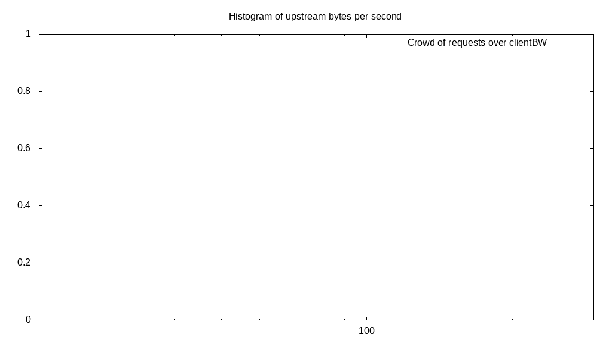

# Client bandwidth benchmark report. Crowd is 512

## Populate workload

## Object Size is 0.03kiB

### PUT Client bandwidth in B over time

Evolution of PUT Client bandwidth over time

| Parameter | Value |
| --- | --- |
| Y Coordinate | PUT Client bandwidth in B |
| X Coordinate | time in s since begining of workload |

### PUT Client bandwidth distribution in B

Distribution of the PUT Client bandwidth in B

| Parameter | Value |
| --- | --- |
| Y Coordinate | Number of PUT |
| X Coordinate | Client bandwidth in B |
| Server volume | 3.605MiB|
| Server bandwidth | 0.012MiB/s |
| Server time | 300.00s |
| Server load | 510.66 |
| Server responses | 118120PUT |
| Server IOps | 393.74PUT/s |
| Client bandwidth | 0.000MiB/s |
| Client volume | 0.007MiB|
| Client time | 153195.91s |
| Client IOps |  0.77PUT/s  |
| Client Latency | 1296.95ms/PUT |
| Client Limbo | 0.79ms/PUT |
| Crowd time | 153597.95s |
| Crowd efficiency | 99.74% |
| Highest Client bandwidth | 0.00B |
| 95th percentile Client bandwidth | 1066.67B |
| 68th percentile Client bandwidth | 1066.67B |
| 50th percentile Client bandwidth | 1066.67B |
| 32nd percentile Client bandwidth | 1066.67B |
| 5th percentile Client bandwidth | 1066.67B |
| Lowest Client bandwidth | 0.00B |

## Read workload

## Object Size is 0.03kiB

### GET Client bandwidth in B over time

Evolution of GET Client bandwidth over time

| Parameter | Value |
| --- | --- |
| Y Coordinate | GET Client bandwidth in B |
| X Coordinate | time in s since begining of workload |

### GET Client bandwidth distribution in B

Distribution of the GET Client bandwidth in B

| Parameter | Value |
| --- | --- |
| Y Coordinate | Number of GET |
| X Coordinate | Client bandwidth in B |
| Server volume | 0.824MiB|
| Server bandwidth | 0.008MiB/s |
| Server time | 103.91s |
| Server load | 483.12 |
| Server responses | 26987GET |
| Server IOps | 259.72GET/s |
| Client bandwidth | 0.000MiB/s |
| Client volume | 0.002MiB|
| Client time | 50200.84s |
| Client IOps |  0.54GET/s  |
| Client Latency | 1860.19ms/GET |
| Client Limbo | 5.86ms/GET |
| Crowd time | 53201.92s |
| Crowd efficiency | 94.36% |
| Highest Client bandwidth | 0.00B |
| 95th percentile Client bandwidth | 1066.67B |
| 68th percentile Client bandwidth | 1066.67B |
| 50th percentile Client bandwidth | 1066.67B |
| 32nd percentile Client bandwidth | 1066.67B |
| 5th percentile Client bandwidth | 1066.67B |
| Lowest Client bandwidth | 0.00B |

## Mixed workload

## Object Size is 0.03kiB

### PUT Client bandwidth in B over time

Evolution of PUT Client bandwidth over time

| Parameter | Value |
| --- | --- |
| Y Coordinate | PUT Client bandwidth in B |
| X Coordinate | time in s since begining of workload |

### GET Client bandwidth in B over time

Evolution of GET Client bandwidth over time

| Parameter | Value |
| --- | --- |
| Y Coordinate | GET Client bandwidth in B |
| X Coordinate | time in s since begining of workload |

### PUT Client bandwidth distribution in B

Distribution of the PUT Client bandwidth in B

| Parameter | Value |
| --- | --- |
| Y Coordinate | Number of PUT |
| X Coordinate | Client bandwidth in B |
| Server volume | 0.487MiB|
| Server bandwidth | 0.005MiB/s |
| Server time | 104.63s |
| Server load | 202.12 |
| Server responses | 15967PUT |
| Server IOps | 152.60PUT/s |
| Client bandwidth | 0.000MiB/s |
| Client volume | 0.001MiB|
| Client time | 21148.71s |
| Client IOps |  0.75PUT/s  |
| Client Latency | 1324.53ms/PUT |
| Client Limbo | 63.33ms/PUT |
| Crowd time | 53572.10s |
| Crowd efficiency | 39.48% |
| Highest Client bandwidth | 0.00B |
| 95th percentile Client bandwidth | 1066.67B |
| 68th percentile Client bandwidth | 1066.67B |
| 50th percentile Client bandwidth | 1066.67B |
| 32nd percentile Client bandwidth | 1066.67B |
| 5th percentile Client bandwidth | 1066.67B |
| Lowest Client bandwidth | 0.00B |

### GET Client bandwidth distribution in B

Distribution of the GET Client bandwidth in B

| Parameter | Value |
| --- | --- |
| Y Coordinate | Number of GET |
| X Coordinate | Client bandwidth in B |
| Server volume | 0.499MiB|
| Server bandwidth | 0.005MiB/s |
| Server time | 104.63s |
| Server load | 287.87 |
| Server responses | 16348GET |
| Server IOps | 156.24GET/s |
| Client bandwidth | 0.000MiB/s |
| Client volume | 0.001MiB|
| Client time | 30120.27s |
| Client IOps |  0.54GET/s  |
| Client Latency | 1842.44ms/GET |
| Client Limbo | 45.80ms/GET |
| Crowd time | 53572.10s |
| Crowd efficiency | 56.22% |
| Highest Client bandwidth | 0.00B |
| 95th percentile Client bandwidth | 1066.67B |
| 68th percentile Client bandwidth | 1066.67B |
| 50th percentile Client bandwidth | 1066.67B |
| 32nd percentile Client bandwidth | 1066.67B |
| 5th percentile Client bandwidth | 1066.67B |
| Lowest Client bandwidth | 0.00B |

## Cleanup workload

## Object Size is 0.03kiB

### DELETE Client bandwidth in B over time

Evolution of DELETE Client bandwidth over time

| Parameter | Value |
| --- | --- |
| Y Coordinate | DELETE Client bandwidth in B |
| X Coordinate | time in s since begining of workload |

### DELETE Client bandwidth distribution in B

Distribution of the DELETE Client bandwidth in B

| Parameter | Value |
| --- | --- |
| Y Coordinate | Number of DELETE |
| X Coordinate | Client bandwidth in B |
| Server volume | 3.605MiB|
| Server bandwidth | 0.013MiB/s |
| Server time | 281.95s |
| Server load | 501.40 |
| Server responses | 118128DELETE |
| Server IOps | 418.96DELETE/s |
| Client bandwidth | 0.000MiB/s |
| Client volume | 0.007MiB|
| Client time | 141370.32s |
| Client IOps |  0.84DELETE/s  |
| Client Latency | 1196.76ms/DELETE |
| Client Limbo | 5.84ms/DELETE |
| Crowd time | 144359.94s |
| Crowd efficiency | 97.93% |
| Highest Client bandwidth | 1066.67B |
| 95th percentile Client bandwidth | 1066.67B |
| 68th percentile Client bandwidth | 1066.67B |
| 50th percentile Client bandwidth | 1066.67B |
| 32nd percentile Client bandwidth | 1066.67B |
| 5th percentile Client bandwidth | 1066.67B |
| Lowest Client bandwidth | 1066.67B |

