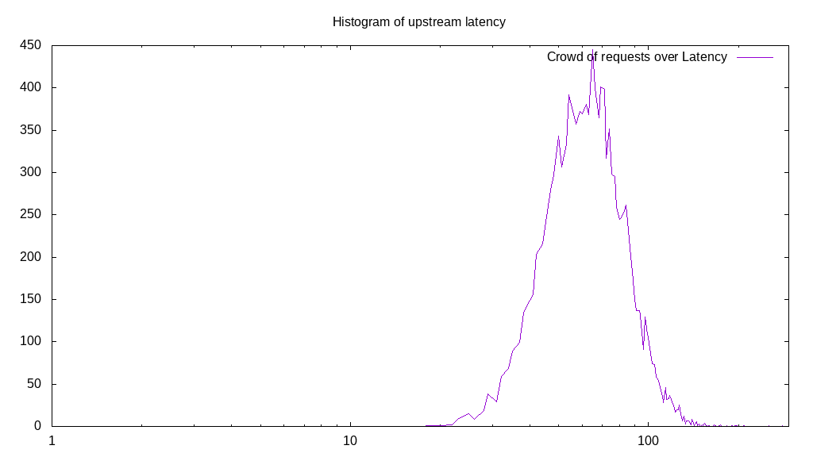
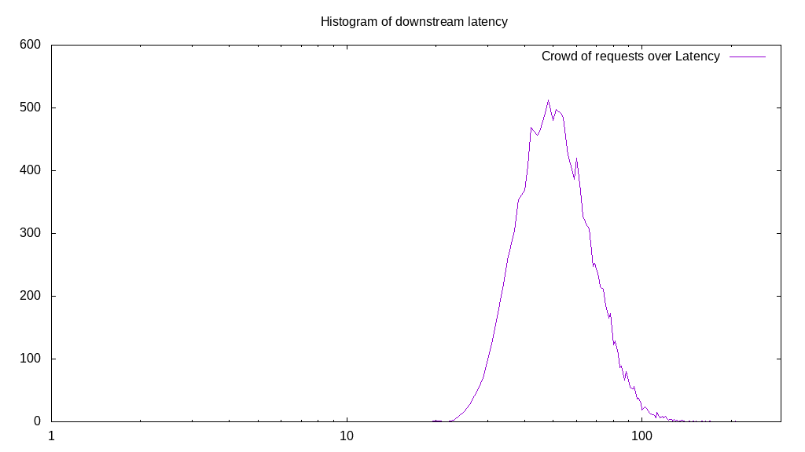

# Latency benchmark report. Crowd is 512

## Populate workload

## Object Size is 0.03kiB

### PUT Latency in ms over time

Evolution of PUT Latency over time

| Parameter | Value |
| --- | --- |
| Y Coordinate | PUT Latency in ms |
| X Coordinate | time in s since begining of workload |

### PUT Latency distribution in ms

Distribution of the PUT Latency in ms

| Parameter | Value |
| --- | --- |
| Y Coordinate | Number of PUT |
| X Coordinate | Latency in ms |
| Workload duration | 300.00s |
| Workload volume | 3.605MiB|
| Workload bandwidth | 0.012MiB/s |
| Client time spent | 144383.95s |
| C.time/W.duration | 481.29 |
| Request count | 118120PUT |
| Request per second (avg.) | 393.74PUT/s |
| Highest Latency | 5780.50ms |
| 95th percentile Latency | 2360.37ms |
| 68th percentile Latency | 1493.30ms |
| 50th percentile Latency | 1252.44ms |
| 32nd percentile Latency | 1011.59ms |
| 5th percentile Latency | 481.71ms |
| Lowest Latency | 48.17ms |

## Read workload

## Object Size is 0.03kiB

### GET Latency in ms over time

Evolution of GET Latency over time

| Parameter | Value |
| --- | --- |
| Y Coordinate | GET Latency in ms |
| X Coordinate | time in s since begining of workload |

### GET Latency distribution in ms

Distribution of the GET Latency in ms

| Parameter | Value |
| --- | --- |
| Y Coordinate | Number of GET |
| X Coordinate | Latency in ms |
| Workload duration | 103.91s |
| Workload volume | 0.824MiB|
| Workload bandwidth | 0.008MiB/s |
| Client time spent | 54905.14s |
| C.time/W.duration | 528.39 |
| Request count | 26987GET |
| Request per second (avg.) | 259.72GET/s |
| Highest Latency | 7032.94ms |
| 95th percentile Latency | 3950.01ms |
| 68th percentile Latency | 2312.20ms |
| 50th percentile Latency | 1734.15ms |
| 32nd percentile Latency | 1204.27ms |
| 5th percentile Latency | 433.54ms |
| Lowest Latency | 48.17ms |

## Mixed workload

## Object Size is 0.03kiB

### PUT Latency in ms over time

Evolution of PUT Latency over time

| Parameter | Value |
| --- | --- |
| Y Coordinate | PUT Latency in ms |
| X Coordinate | time in s since begining of workload |

### GET Latency in ms over time

Evolution of GET Latency over time

| Parameter | Value |
| --- | --- |
| Y Coordinate | GET Latency in ms |
| X Coordinate | time in s since begining of workload |

### PUT Latency distribution in ms

Distribution of the PUT Latency in ms

| Parameter | Value |
| --- | --- |
| Y Coordinate | Number of PUT |
| X Coordinate | Latency in ms |
| Workload duration | 104.63s |
| Workload volume | 0.487MiB|
| Workload bandwidth | 0.005MiB/s |
| Client time spent | 20587.65s |
| C.time/W.duration | 196.76 |
| Request count | 15967PUT |
| Request per second (avg.) | 152.60PUT/s |
| Highest Latency | 9152.46ms |
| 95th percentile Latency | 2504.88ms |
| 68th percentile Latency | 1541.47ms |
| 50th percentile Latency | 1252.44ms |
| 32nd percentile Latency | 1011.59ms |
| 5th percentile Latency | 481.71ms |
| Lowest Latency | 48.17ms |

### GET Latency distribution in ms

Distribution of the GET Latency in ms

| Parameter | Value |
| --- | --- |
| Y Coordinate | Number of GET |
| X Coordinate | Latency in ms |
| Workload duration | 104.63s |
| Workload volume | 0.499MiB|
| Workload bandwidth | 0.005MiB/s |
| Client time spent | 26900.77s |
| C.time/W.duration | 257.10 |
| Request count | 16348GET |
| Request per second (avg.) | 156.24GET/s |
| Highest Latency | 9586.00ms |
| 95th percentile Latency | 3227.45ms |
| 68th percentile Latency | 2167.69ms |
| 50th percentile Latency | 1782.32ms |
| 32nd percentile Latency | 1445.13ms |
| 5th percentile Latency | 770.73ms |
| Lowest Latency | 48.17ms |

## Cleanup workload

## Object Size is 0.03kiB

### DELETE Latency in ms over time

Evolution of DELETE Latency over time

| Parameter | Value |
| --- | --- |
| Y Coordinate | DELETE Latency in ms |
| X Coordinate | time in s since begining of workload |

### DELETE Latency distribution in ms

Distribution of the DELETE Latency in ms

| Parameter | Value |
| --- | --- |
| Y Coordinate | Number of DELETE |
| X Coordinate | Latency in ms |
| Workload duration | 281.95s |
| Workload volume | 3.605MiB|
| Workload bandwidth | 0.013MiB/s |
| Client time spent | 135601.82s |
| C.time/W.duration | 480.94 |
| Request count | 118128DELETE |
| Request per second (avg.) | 418.96DELETE/s |
| Highest Latency | 5684.16ms |
| 95th percentile Latency | 2264.03ms |
| 68th percentile Latency | 1445.13ms |
| 50th percentile Latency | 1156.10ms |
| 32nd percentile Latency | 915.25ms |
| 5th percentile Latency | 337.20ms |
| Lowest Latency | 48.17ms |

