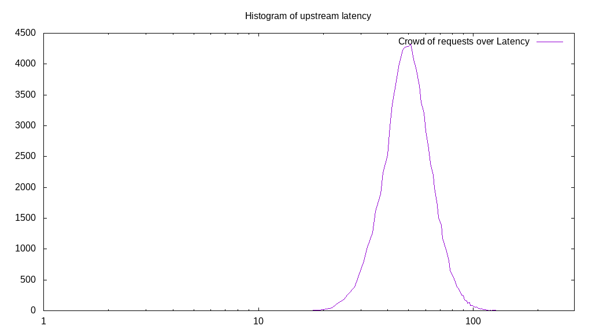
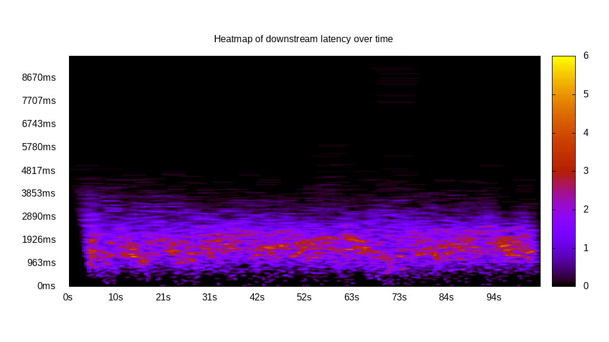
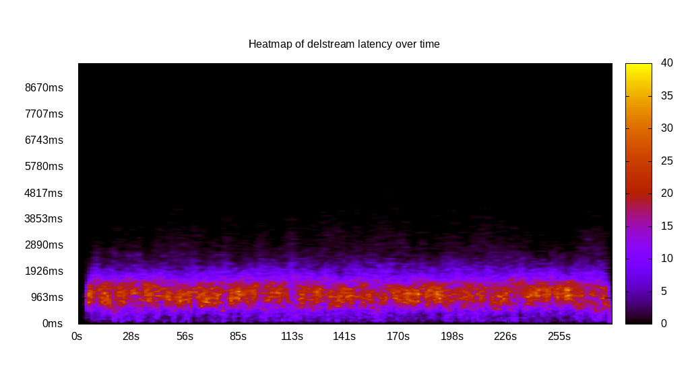

# Latency benchmark report. Crowd is 512

## Populate workload

## Object Size is 0.03kiB

### PUT Latency in ms over time

Evolution of PUT Latency over time

| Parameter | Value |
| --- | --- |
| Y Coordinate | PUT Latency in ms |
| X Coordinate | time in s since begining of workload |

### PUT Latency distribution in ms

Distribution of the PUT Latency in ms

| Parameter | Value |
| --- | --- |
| Y Coordinate | Number of PUT |
| X Coordinate | Latency in ms |
| Server volume | 3.605MiB|
| Server bandwidth | 0.000MiB/s |
| Server time | 299996.00s |
| Server load | 510.66 |
| Server responses | 118120PUT |
| Server IOps | 0.39PUT/s |
| Client bandwidth | 0.000MiB/s |
| Client volume | 0.007MiB|
| Client time | 153195907.00s |
| Client IOps |  0.00PUT/s  |
| Client Latency | 1296951.46ms/PUT |
| Client Limbo | 785.24ms/PUT |
| Crowd time | 153597952.00s |
| Crowd efficiency | 99.74% |
| Highest Latency | 5780.50ms |
| 95th percentile Latency | 2360.37ms |
| 68th percentile Latency | 1493.30ms |
| 50th percentile Latency | 1252.44ms |
| 32nd percentile Latency | 1011.59ms |
| 5th percentile Latency | 481.71ms |
| Lowest Latency | 48.17ms |

## Read workload

## Object Size is 0.03kiB

### GET Latency in ms over time

Evolution of GET Latency over time

| Parameter | Value |
| --- | --- |
| Y Coordinate | GET Latency in ms |
| X Coordinate | time in s since begining of workload |

### GET Latency distribution in ms

Distribution of the GET Latency in ms

| Parameter | Value |
| --- | --- |
| Y Coordinate | Number of GET |
| X Coordinate | Latency in ms |
| Server volume | 0.824MiB|
| Server bandwidth | 0.000MiB/s |
| Server time | 103910.00s |
| Server load | 483.12 |
| Server responses | 26987GET |
| Server IOps | 0.26GET/s |
| Client bandwidth | 0.000MiB/s |
| Client volume | 0.002MiB|
| Client time | 50200839.00s |
| Client IOps |  0.00GET/s  |
| Client Latency | 1860185.98ms/GET |
| Client Limbo | 5861.49ms/GET |
| Crowd time | 53201920.00s |
| Crowd efficiency | 94.36% |
| Highest Latency | 7032.94ms |
| 95th percentile Latency | 3950.01ms |
| 68th percentile Latency | 2312.20ms |
| 50th percentile Latency | 1734.15ms |
| 32nd percentile Latency | 1204.27ms |
| 5th percentile Latency | 433.54ms |
| Lowest Latency | 48.17ms |

## Mixed workload

## Object Size is 0.03kiB

### PUT Latency in ms over time

Evolution of PUT Latency over time

| Parameter | Value |
| --- | --- |
| Y Coordinate | PUT Latency in ms |
| X Coordinate | time in s since begining of workload |

### GET Latency in ms over time

Evolution of GET Latency over time

| Parameter | Value |
| --- | --- |
| Y Coordinate | GET Latency in ms |
| X Coordinate | time in s since begining of workload |

### PUT Latency distribution in ms

Distribution of the PUT Latency in ms

| Parameter | Value |
| --- | --- |
| Y Coordinate | Number of PUT |
| X Coordinate | Latency in ms |
| Server volume | 0.487MiB|
| Server bandwidth | 0.000MiB/s |
| Server time | 104633.00s |
| Server load | 202.12 |
| Server responses | 15967PUT |
| Server IOps | 0.15PUT/s |
| Client bandwidth | 0.000MiB/s |
| Client volume | 0.001MiB|
| Client time | 21148711.00s |
| Client IOps |  0.00PUT/s  |
| Client Latency | 1324526.27ms/PUT |
| Client Limbo | 63326.92ms/PUT |
| Crowd time | 53572096.00s |
| Crowd efficiency | 39.48% |
| Highest Latency | 9152.46ms |
| 95th percentile Latency | 2504.88ms |
| 68th percentile Latency | 1541.47ms |
| 50th percentile Latency | 1252.44ms |
| 32nd percentile Latency | 1011.59ms |
| 5th percentile Latency | 481.71ms |
| Lowest Latency | 48.17ms |

### GET Latency distribution in ms

Distribution of the GET Latency in ms

| Parameter | Value |
| --- | --- |
| Y Coordinate | Number of GET |
| X Coordinate | Latency in ms |
| Server volume | 0.499MiB|
| Server bandwidth | 0.000MiB/s |
| Server time | 104633.00s |
| Server load | 287.87 |
| Server responses | 16348GET |
| Server IOps | 0.16GET/s |
| Client bandwidth | 0.000MiB/s |
| Client volume | 0.001MiB|
| Client time | 30120268.00s |
| Client IOps |  0.00GET/s  |
| Client Latency | 1842443.60ms/GET |
| Client Limbo | 45804.35ms/GET |
| Crowd time | 53572096.00s |
| Crowd efficiency | 56.22% |
| Highest Latency | 9586.00ms |
| 95th percentile Latency | 3227.45ms |
| 68th percentile Latency | 2167.69ms |
| 50th percentile Latency | 1782.32ms |
| 32nd percentile Latency | 1445.13ms |
| 5th percentile Latency | 770.73ms |
| Lowest Latency | 48.17ms |

## Cleanup workload

## Object Size is 0.03kiB

### DELETE Latency in ms over time

Evolution of DELETE Latency over time

| Parameter | Value |
| --- | --- |
| Y Coordinate | DELETE Latency in ms |
| X Coordinate | time in s since begining of workload |

### DELETE Latency distribution in ms

Distribution of the DELETE Latency in ms

| Parameter | Value |
| --- | --- |
| Y Coordinate | Number of DELETE |
| X Coordinate | Latency in ms |
| Server volume | 3.605MiB|
| Server bandwidth | 0.000MiB/s |
| Server time | 281953.00s |
| Server load | 501.40 |
| Server responses | 118128DELETE |
| Server IOps | 0.42DELETE/s |
| Client bandwidth | 0.000MiB/s |
| Client volume | 0.007MiB|
| Client time | 141370324.00s |
| Client IOps |  0.00DELETE/s  |
| Client Latency | 1196755.42ms/DELETE |
| Client Limbo | 5839.09ms/DELETE |
| Crowd time | 144359936.00s |
| Crowd efficiency | 97.93% |
| Highest Latency | 5684.16ms |
| 95th percentile Latency | 2264.03ms |
| 68th percentile Latency | 1445.13ms |
| 50th percentile Latency | 1156.10ms |
| 32nd percentile Latency | 915.25ms |
| 5th percentile Latency | 337.20ms |
| Lowest Latency | 48.17ms |

