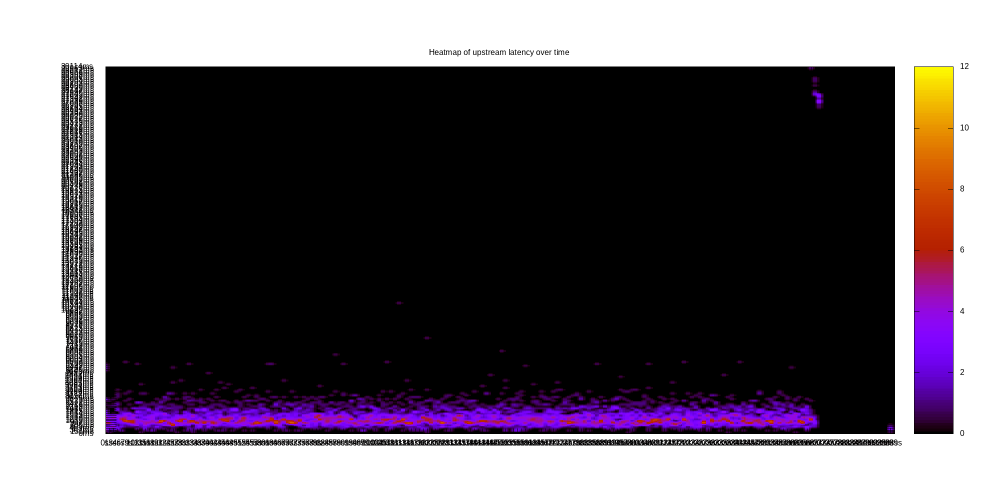
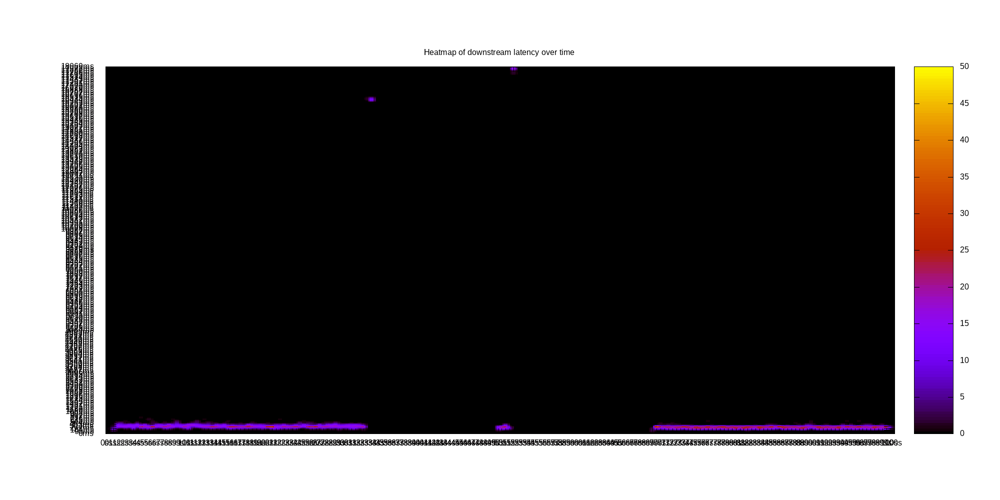
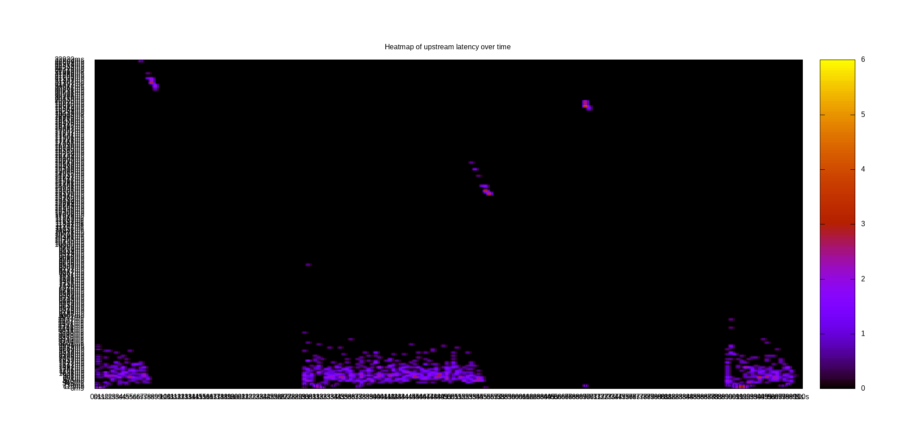
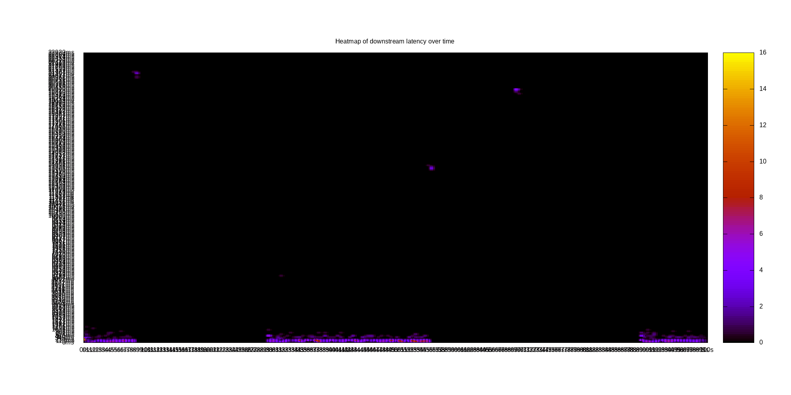

# Benchmark report for Latency fixed nClients of 32

## Workload populate

## objectSize = 32768

/home/ggim/src/Malice/opal.zenko.io/./malice/32768/32/samples.loot

### Latency for Operation up over time

Heatmap of request count, Y:Latency X:time

### Latency for Operation up over objectSize

Avg, Median and percentile, Y:Latency X:objectSize

### Distribution of Latency for operation up

Latency histogram for objectSize = 32768

## Workload read

## objectSize = 32768

/home/ggim/src/Malice/opal.zenko.io/./malice/32768/32/samples.loot

### Latency for Operation down over time

Heatmap of request count, Y:Latency X:time

### Latency for Operation down over objectSize

Avg, Median and percentile, Y:Latency X:objectSize

### Distribution of Latency for operation down

Latency histogram for objectSize = 32768

## Workload mixed

## objectSize = 32768

/home/ggim/src/Malice/opal.zenko.io/./malice/32768/32/samples.loot

### Latency for Operation up over time

Heatmap of request count, Y:Latency X:time

### Latency for Operation down over time

Heatmap of request count, Y:Latency X:time

### Latency for Operation up over objectSize

Avg, Median and percentile, Y:Latency X:objectSize

### Latency for Operation down over objectSize

Avg, Median and percentile, Y:Latency X:objectSize

### Distribution of Latency for operation up

Latency histogram for objectSize = 32768

### Distribution of Latency for operation down

Latency histogram for objectSize = 32768

## Workload delete

## objectSize = 32768

/home/ggim/src/Malice/opal.zenko.io/./malice/32768/32/samples.loot

### Latency for Operation del over time

Heatmap of request count, Y:Latency X:time

### Latency for Operation del over objectSize

Avg, Median and percentile, Y:Latency X:objectSize

### Distribution of Latency for operation del

Latency histogram for objectSize = 32768

