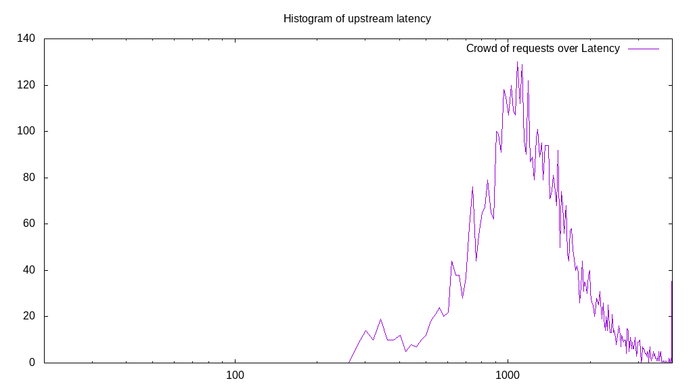
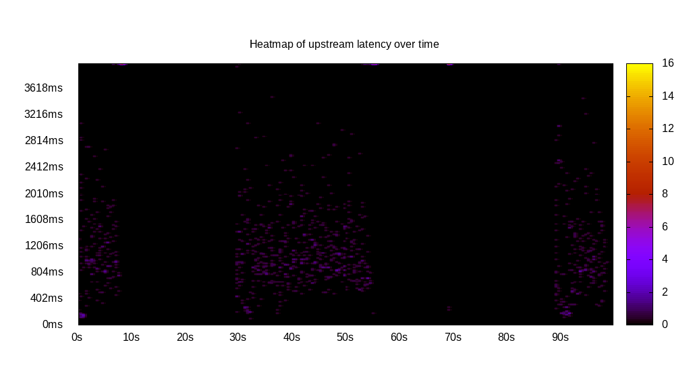
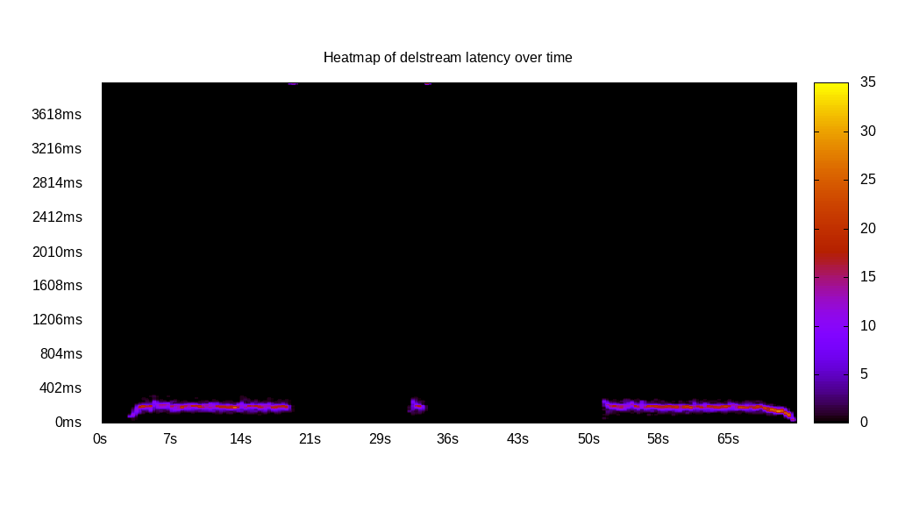

# Latency benchmark report. Crowd is 32

## Populate workload

## Object Size is 32.00kiB

### PUT Latency in ms over time

Evolution of PUT Latency over time

| Parameter | Value |
| --- | --- |
| Y | Latency in ms |
| X | time in s since begining of workload |

### PUT Latency distribution in ms

| Parameter | Value |
| --- | --- |
| Y   | Number of requests |
| X   | Latency in ms |
| Test duration | 299.95s |
| Client time | 9583.38s |
| c.time/duration | 31.95x |
| PUT count | 6073 |
| PUT volume | 189.781MiB|
| PUT throughput | 0.633MiB/s |
| 95th percentile Latency | 2875.30ms |
| 68th percentile Latency | 1664.65ms |
| 50th percentile Latency | 1361.98ms |
| 32nd percentile Latency | 1210.65ms |
| 05th percentile Latency | 756.66ms |

## Read workload

## Object Size is 32.00kiB

### GET Latency in ms over time

Evolution of GET Latency over time

| Parameter | Value |
| --- | --- |
| Y | Latency in ms |
| X | time in s since begining of workload |

### GET Latency distribution in ms

| Parameter | Value |
| --- | --- |
| Y   | Number of requests |
| X   | Latency in ms |
| Test duration | 100.76s |
| Client time | 2596.25s |
| c.time/duration | 25.77x |
| GET count | 5169 |
| GET volume | 161.531MiB|
| GET throughput | 1.603MiB/s |
| 95th percentile Latency | 605.33ms |
| 68th percentile Latency | 453.99ms |
| 50th percentile Latency | 453.99ms |
| 32nd percentile Latency | 453.99ms |
| 05th percentile Latency | 453.99ms |

## Mixed workload

## Object Size is 32.00kiB

### PUT Latency in ms over time

Evolution of PUT Latency over time

| Parameter | Value |
| --- | --- |
| Y | Latency in ms |
| X | time in s since begining of workload |

### GET Latency in ms over time

Evolution of GET Latency over time

| Parameter | Value |
| --- | --- |
| Y | Latency in ms |
| X | time in s since begining of workload |

### PUT Latency distribution in ms

| Parameter | Value |
| --- | --- |
| Y   | Number of requests |
| X   | Latency in ms |
| Test duration | 100.40s |
| Client time | 8179.48s |
| c.time/duration | 81.47x |
| PUT count | 999 |
| PUT volume | 31.219MiB|
| PUT throughput | 0.311MiB/s |
| 95th percentile Latency | 14225.18ms |
| 68th percentile Latency | 1513.32ms |
| 50th percentile Latency | 1210.65ms |
| 32nd percentile Latency | 907.99ms |
| 05th percentile Latency | 302.66ms |

### GET Latency distribution in ms

| Parameter | Value |
| --- | --- |
| Y   | Number of requests |
| X   | Latency in ms |
| Test duration | 100.40s |
| Client time | 730.93s |
| c.time/duration | 7.28x |
| GET count | 1045 |
| GET volume | 32.656MiB|
| GET throughput | 0.325MiB/s |
| 95th percentile Latency | 907.99ms |
| 68th percentile Latency | 302.66ms |
| 50th percentile Latency | 302.66ms |
| 32nd percentile Latency | 302.66ms |
| 05th percentile Latency | 302.66ms |

## Cleanup workload

## Object Size is 32.00kiB

### DELETE Latency in ms over time

Evolution of DELETE Latency over time

| Parameter | Value |
| --- | --- |
| Y | Latency in ms |
| X | time in s since begining of workload |

### DELETE Latency distribution in ms

| Parameter | Value |
| --- | --- |
| Y   | Number of requests |
| X   | Latency in ms |
| Test duration | 72.47s |
| Client time | 1798.43s |
| c.time/duration | 24.82x |
| DELETE count | 6017 |
| DELETE volume | 188.031MiB|
| DELETE throughput | 2.595MiB/s |
| 95th percentile Latency | 302.66ms |
| 68th percentile Latency | 302.66ms |
| 50th percentile Latency | 302.66ms |
| 32nd percentile Latency | 302.66ms |
| 05th percentile Latency | 151.33ms |

