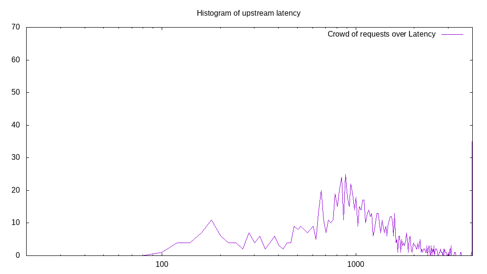

# Latency benchmark report. Crowd is 32

## Populate workload

## Object Size is 32.00kiB

### PUT Latency in ms over time

Evolution of PUT Latency over time

| Parameter | Value |
| --- | --- |
| Y Coordinate | PUT Latency in ms |
| X Coordinate | time in s since begining of workload |

### PUT Latency distribution in ms

Distribution of the PUT Latency in ms

| Parameter | Value |
| --- | --- |
| Y Coordinate | Number of PUT |
| X Coordinate | Latency in ms |
| Workload duration | 299.95s |
| Workload volume | 189.781MiB|
| Workload bandwidth | 0.633MiB/s |
| Client time spent | 8495.38s |
| C.time/W.duration | 28.32 |
| Request count | 6073PUT |
| Request per second (avg.) | 20.25PUT/s |
| Highest Latency | 4000.00ms |
| 95th percentile Latency | 2753.77ms |
| 68th percentile Latency | 1567.84ms |
| 50th percentile Latency | 1306.53ms |
| 32nd percentile Latency | 1085.43ms |
| 5th percentile Latency | 663.32ms |
| Lowest Latency | 281.41ms |

## Read workload

## Object Size is 32.00kiB

### GET Latency in ms over time

Evolution of GET Latency over time

| Parameter | Value |
| --- | --- |
| Y Coordinate | GET Latency in ms |
| X Coordinate | time in s since begining of workload |

### GET Latency distribution in ms

Distribution of the GET Latency in ms

| Parameter | Value |
| --- | --- |
| Y Coordinate | Number of GET |
| X Coordinate | Latency in ms |
| Workload duration | 100.76s |
| Workload volume | 161.531MiB|
| Workload bandwidth | 1.603MiB/s |
| Client time spent | 1476.90s |
| C.time/W.duration | 14.66 |
| Request count | 5169GET |
| Request per second (avg.) | 51.30GET/s |
| Highest Latency | 4000.00ms |
| 95th percentile Latency | 522.61ms |
| 68th percentile Latency | 442.21ms |
| 50th percentile Latency | 402.01ms |
| 32nd percentile Latency | 381.91ms |
| 5th percentile Latency | 321.61ms |
| Lowest Latency | 100.50ms |

## Mixed workload

## Object Size is 32.00kiB

### PUT Latency in ms over time

Evolution of PUT Latency over time

| Parameter | Value |
| --- | --- |
| Y Coordinate | PUT Latency in ms |
| X Coordinate | time in s since begining of workload |

### GET Latency in ms over time

Evolution of GET Latency over time

| Parameter | Value |
| --- | --- |
| Y Coordinate | GET Latency in ms |
| X Coordinate | time in s since begining of workload |

### PUT Latency distribution in ms

Distribution of the PUT Latency in ms

| Parameter | Value |
| --- | --- |
| Y Coordinate | Number of PUT |
| X Coordinate | Latency in ms |
| Workload duration | 100.40s |
| Workload volume | 31.219MiB|
| Workload bandwidth | 0.311MiB/s |
| Client time spent | 0.00s |
| C.time/W.duration | 0.00 |
| Request count | 999PUT |
| Request per second (avg.) | 9.95PUT/s |
| Highest Latency | 4000.00ms |
| 95th percentile Latency | 0.00ms |
| 68th percentile Latency | 1447.24ms |
| 50th percentile Latency | 1105.53ms |
| 32nd percentile Latency | 884.42ms |
| 5th percentile Latency | 301.51ms |
| Lowest Latency | 100.50ms |

### GET Latency distribution in ms

Distribution of the GET Latency in ms

| Parameter | Value |
| --- | --- |
| Y Coordinate | Number of GET |
| X Coordinate | Latency in ms |
| Workload duration | 100.40s |
| Workload volume | 32.656MiB|
| Workload bandwidth | 0.325MiB/s |
| Client time spent | 420.86s |
| C.time/W.duration | 4.19 |
| Request count | 1045GET |
| Request per second (avg.) | 10.41GET/s |
| Highest Latency | 4000.00ms |
| 95th percentile Latency | 763.82ms |
| 68th percentile Latency | 281.41ms |
| 50th percentile Latency | 261.31ms |
| 32nd percentile Latency | 201.01ms |
| 5th percentile Latency | 180.90ms |
| Lowest Latency | 100.50ms |

## Cleanup workload

## Object Size is 32.00kiB

### DELETE Latency in ms over time

Evolution of DELETE Latency over time

| Parameter | Value |
| --- | --- |
| Y Coordinate | DELETE Latency in ms |
| X Coordinate | time in s since begining of workload |

### DELETE Latency distribution in ms

Distribution of the DELETE Latency in ms

| Parameter | Value |
| --- | --- |
| Y Coordinate | Number of DELETE |
| X Coordinate | Latency in ms |
| Workload duration | 72.47s |
| Workload volume | 188.031MiB|
| Workload bandwidth | 2.595MiB/s |
| Client time spent | 794.37s |
| C.time/W.duration | 10.96 |
| Request count | 6017DELETE |
| Request per second (avg.) | 83.03DELETE/s |
| Highest Latency | 4000.00ms |
| 95th percentile Latency | 261.31ms |
| 68th percentile Latency | 221.11ms |
| 50th percentile Latency | 201.01ms |
| 32nd percentile Latency | 201.01ms |
| 5th percentile Latency | 140.70ms |
| Lowest Latency | 40.20ms |

