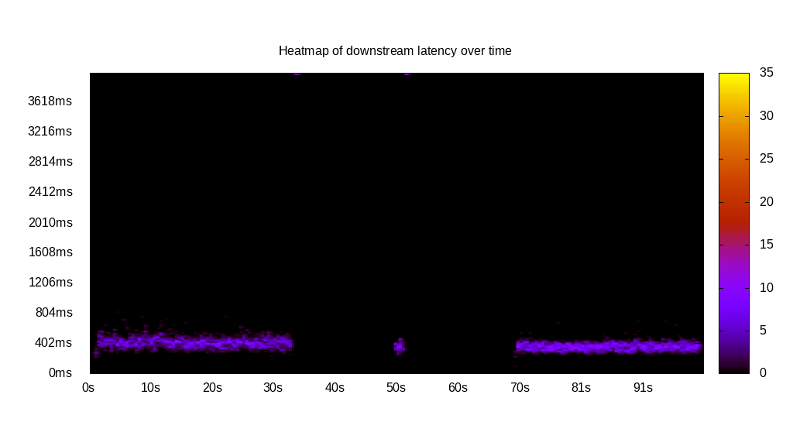
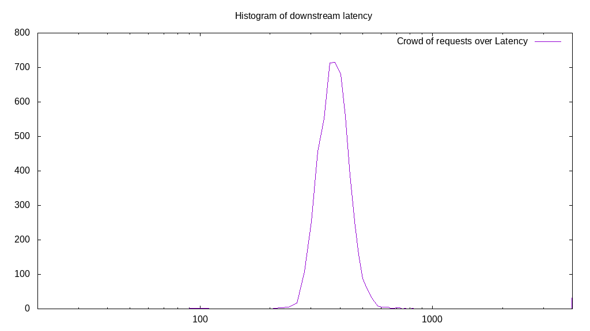
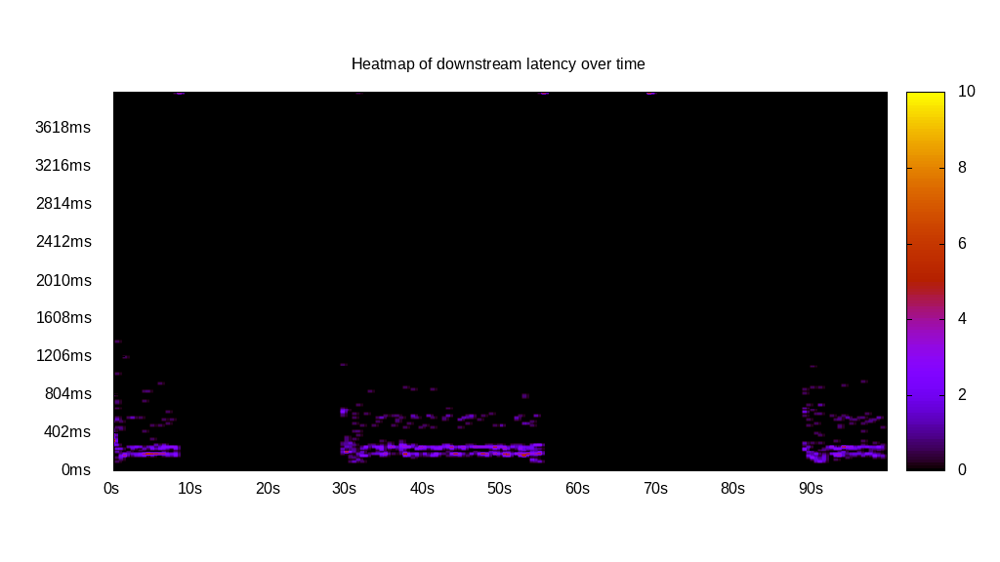

# Latency benchmark report. Crowd is 32

## Populate workload

## Object Size is 32.00kiB

### PUT Latency in ms over time

Evolution of PUT Latency over time

| Parameter | Value |
| --- | --- |
| Y | Latency in ms |
| X | time in s since begining of workload |

### PUT Latency distribution in ms

| Parameter | Value |
| --- | --- |
| Y   | Number of requests |
| X   | Latency in ms |
| Test duration | 299.95s |
| Client time | 8495.38s |
| c.time/duration | 28.32x |
| PUT count | 6073 |
| PUT volume | 189.781MiB|
| PUT throughput | 0.633MiB/s |
| 95th percentile Latency | 2753.77ms |
| 68th percentile Latency | 1567.84ms |
| 50th percentile Latency | 1306.53ms |
| 32nd percentile Latency | 1085.43ms |
| 05th percentile Latency | 663.32ms |

## Read workload

## Object Size is 32.00kiB

### GET Latency in ms over time

Evolution of GET Latency over time

| Parameter | Value |
| --- | --- |
| Y | Latency in ms |
| X | time in s since begining of workload |

### GET Latency distribution in ms

| Parameter | Value |
| --- | --- |
| Y   | Number of requests |
| X   | Latency in ms |
| Test duration | 100.76s |
| Client time | 1476.90s |
| c.time/duration | 14.66x |
| GET count | 5169 |
| GET volume | 161.531MiB|
| GET throughput | 1.603MiB/s |
| 95th percentile Latency | 522.61ms |
| 68th percentile Latency | 442.21ms |
| 50th percentile Latency | 402.01ms |
| 32nd percentile Latency | 381.91ms |
| 05th percentile Latency | 321.61ms |

## Mixed workload

## Object Size is 32.00kiB

### PUT Latency in ms over time

Evolution of PUT Latency over time

| Parameter | Value |
| --- | --- |
| Y | Latency in ms |
| X | time in s since begining of workload |

### GET Latency in ms over time

Evolution of GET Latency over time

| Parameter | Value |
| --- | --- |
| Y | Latency in ms |
| X | time in s since begining of workload |

### PUT Latency distribution in ms

| Parameter | Value |
| --- | --- |
| Y   | Number of requests |
| X   | Latency in ms |
| Test duration | 100.40s |
| Client time | 0.00s |
| c.time/duration | 0.00x |
| PUT count | 999 |
| PUT volume | 31.219MiB|
| PUT throughput | 0.311MiB/s |
| 95th percentile Latency | 0.00ms |
| 68th percentile Latency | 1447.24ms |
| 50th percentile Latency | 1105.53ms |
| 32nd percentile Latency | 884.42ms |
| 05th percentile Latency | 301.51ms |

### GET Latency distribution in ms

| Parameter | Value |
| --- | --- |
| Y   | Number of requests |
| X   | Latency in ms |
| Test duration | 100.40s |
| Client time | 420.86s |
| c.time/duration | 4.19x |
| GET count | 1045 |
| GET volume | 32.656MiB|
| GET throughput | 0.325MiB/s |
| 95th percentile Latency | 763.82ms |
| 68th percentile Latency | 281.41ms |
| 50th percentile Latency | 261.31ms |
| 32nd percentile Latency | 201.01ms |
| 05th percentile Latency | 180.90ms |

## Cleanup workload

## Object Size is 32.00kiB

### DELETE Latency in ms over time

Evolution of DELETE Latency over time

| Parameter | Value |
| --- | --- |
| Y | Latency in ms |
| X | time in s since begining of workload |

### DELETE Latency distribution in ms

| Parameter | Value |
| --- | --- |
| Y   | Number of requests |
| X   | Latency in ms |
| Test duration | 72.47s |
| Client time | 794.37s |
| c.time/duration | 10.96x |
| DELETE count | 6017 |
| DELETE volume | 188.031MiB|
| DELETE throughput | 2.595MiB/s |
| 95th percentile Latency | 261.31ms |
| 68th percentile Latency | 221.11ms |
| 50th percentile Latency | 201.01ms |
| 32nd percentile Latency | 201.01ms |
| 05th percentile Latency | 140.70ms |

