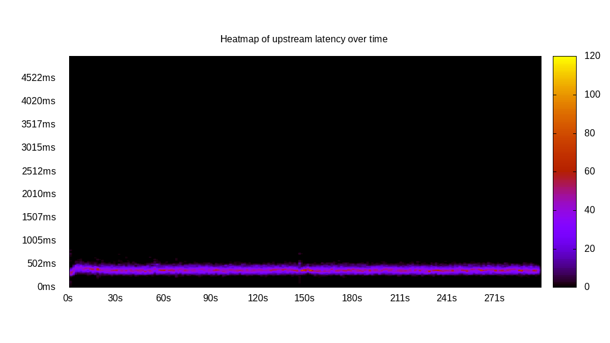
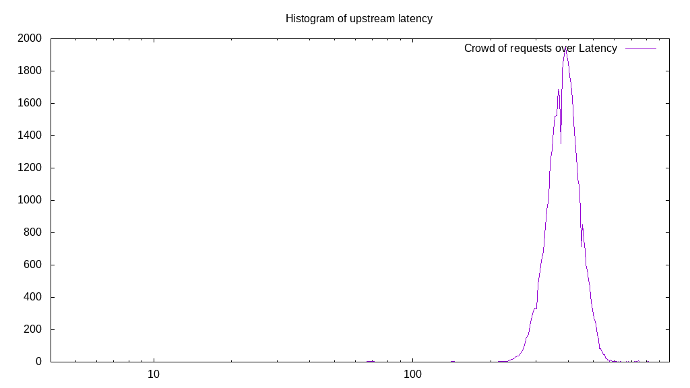
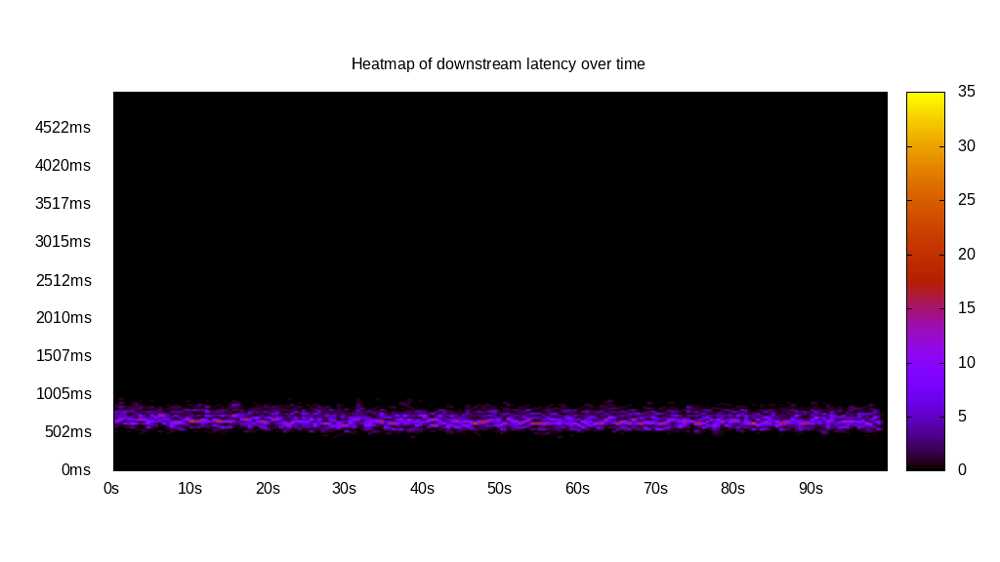
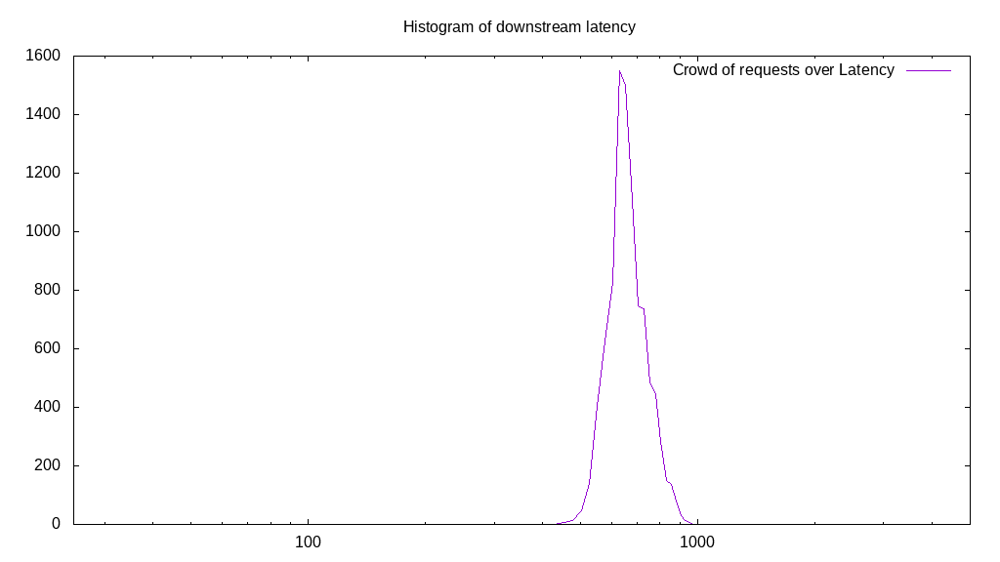
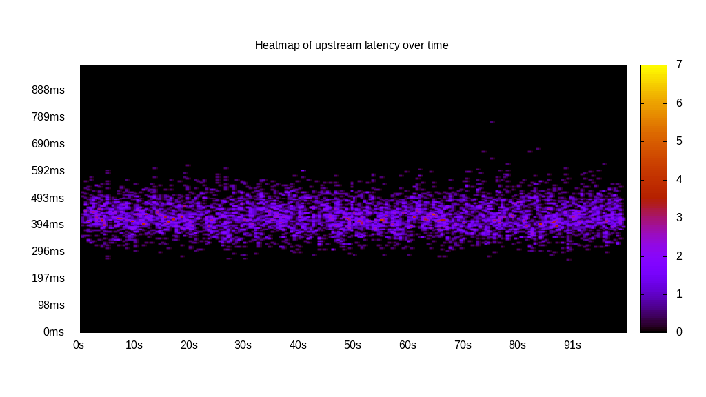
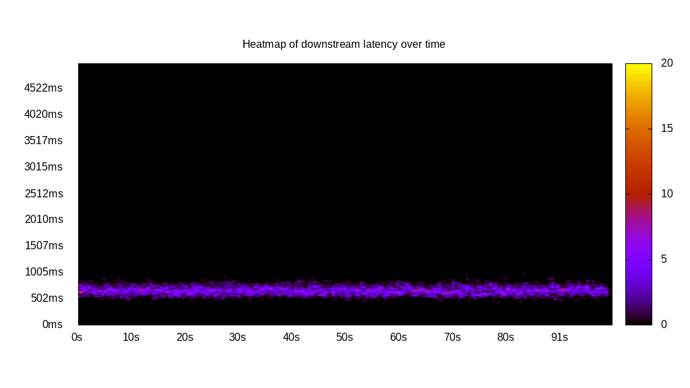
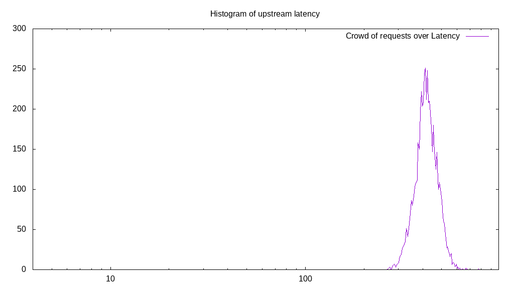
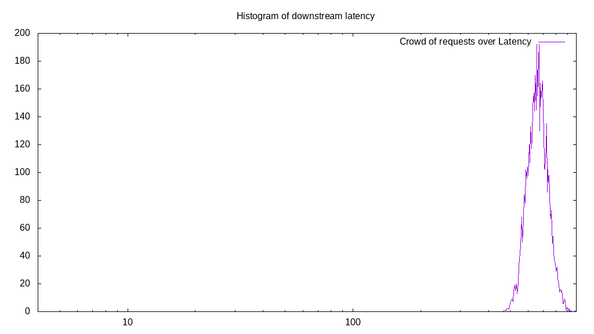
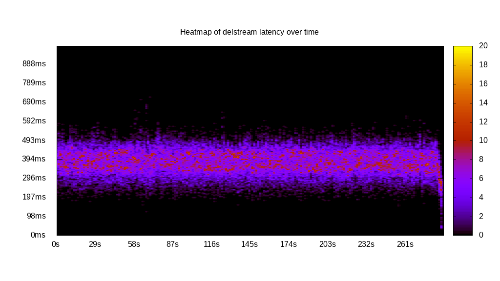
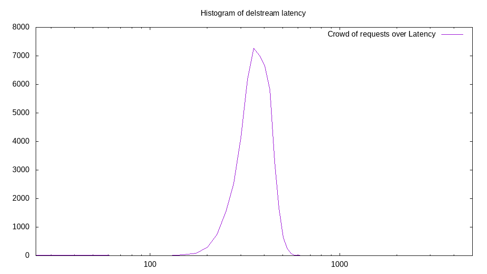

# Latency benchmark report. Crowd is 64

## Populate workload

## Object Size is 1.00kiB

### PUT Latency in ms over time

Evolution of PUT Latency over time

| Parameter | Value |
| --- | --- |
| Y | Latency in ms |
| X | time in s since begining of workload |

### PUT Latency distribution in ms

| Parameter | Value |
| --- | --- |
| Y   | Number of requests |
| X   | Latency in ms |
| Test duration | 300.00s |
| Client time | 12051.952763819096s |
| PUT count | 48381 |
| PUT volume | 47.247MiB|
| PUT throughput | 0.157MiB/s |
| 95th percentile Latency | 493.47ms |
| 68th percentile Latency | 419.45ms |
| 50th percentile Latency | 394.77ms |
| 32nd percentile Latency | 370.10ms |
| 05th percentile Latency | 315.82ms |

## Read workload

## Object Size is 1.00kiB

### GET Latency in ms over time

Evolution of GET Latency over time

| Parameter | Value |
| --- | --- |
| Y | Latency in ms |
| X | time in s since begining of workload |

### GET Latency distribution in ms

| Parameter | Value |
| --- | --- |
| Y   | Number of requests |
| X   | Latency in ms |
| Test duration | 100.34s |
| Client time | 3888.12783919598s |
| GET count | 9325 |
| GET volume | 9.106MiB|
| GET throughput | 0.091MiB/s |
| 95th percentile Latency | 829.03ms |
| 68th percentile Latency | 710.59ms |
| 50th percentile Latency | 671.12ms |
| 32nd percentile Latency | 646.44ms |
| 05th percentile Latency | 572.42ms |

## Mixed workload

## Object Size is 1.00kiB

### PUT Latency in ms over time

Evolution of PUT Latency over time

| Parameter | Value |
| --- | --- |
| Y | Latency in ms |
| X | time in s since begining of workload |

### GET Latency in ms over time

Evolution of GET Latency over time

| Parameter | Value |
| --- | --- |
| Y | Latency in ms |
| X | time in s since begining of workload |

### PUT Latency distribution in ms

| Parameter | Value |
| --- | --- |
| Y   | Number of requests |
| X   | Latency in ms |
| Test duration | 100.69s |
| Client time | 1609.3746331658292s |
| PUT count | 5802 |
| PUT volume | 5.666MiB|
| PUT throughput | 0.056MiB/s |
| 95th percentile Latency | 528.01ms |
| 68th percentile Latency | 453.99ms |
| 50th percentile Latency | 429.32ms |
| 32nd percentile Latency | 404.64ms |
| 05th percentile Latency | 345.43ms |

### GET Latency distribution in ms

| Parameter | Value |
| --- | --- |
| Y   | Number of requests |
| X   | Latency in ms |
| Test duration | 100.69s |
| Client time | 2334.2288040201006s |
| GET count | 5788 |
| GET volume | 5.652MiB|
| GET throughput | 0.056MiB/s |
| 95th percentile Latency | 804.35ms |
| 68th percentile Latency | 705.66ms |
| 50th percentile Latency | 671.12ms |
| 32nd percentile Latency | 641.51ms |
| 05th percentile Latency | 567.49ms |

## Cleanup workload

## Object Size is 1.00kiB

### DELETE Latency in ms over time

Evolution of DELETE Latency over time

| Parameter | Value |
| --- | --- |
| Y | Latency in ms |
| X | time in s since begining of workload |

### DELETE Latency distribution in ms

| Parameter | Value |
| --- | --- |
| Y   | Number of requests |
| X   | Latency in ms |
| Test duration | 289.04s |
| Client time | 12176.513788944723s |
| DELETE count | 48389 |
| DELETE volume | 47.255MiB|
| DELETE throughput | 0.163MiB/s |
| 95th percentile Latency | 483.60ms |
| 68th percentile Latency | 414.51ms |
| 50th percentile Latency | 384.90ms |
| 32nd percentile Latency | 355.30ms |
| 05th percentile Latency | 276.34ms |

