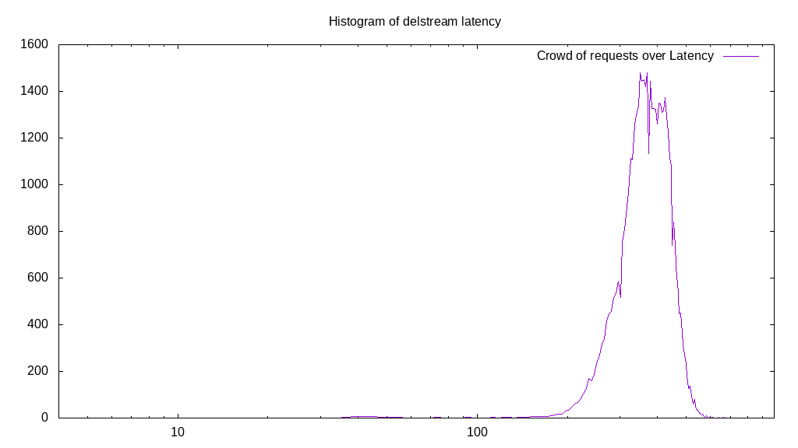

# Latency benchmark report. Crowd is 64

## Populate workload

## Object Size is 1.00kiB

### PUT Latency in ms over time

Evolution of PUT Latency over time

| Parameter | Value |
| --- | --- |
| Y Coordinate | PUT Latency in ms |
| X Coordinate | time in s since begining of workload |

### PUT Latency distribution in ms

Distribution of the PUT Latency in ms

| Parameter | Value |
| --- | --- |
| Y Coordinate | Number of PUT |
| X Coordinate | Latency in ms |
| Workload duration | 300.00s |
| Workload volume | 47.247MiB|
| Workload bandwidth | 0.157MiB/s |
| Client time spent | 12051.95s |
| C.time/W.duration | 40.17 |
| Request count | 48381PUT |
| Request per second (avg.) | 161.27PUT/s |
| Lowest Latency | 54.28ms |
| 95th percentile Latency | 493.47ms |
| 68th percentile Latency | 419.45ms |
| 50th percentile Latency | 394.77ms |
| 32nd percentile Latency | 370.10ms |
| 5th percentile Latency | 315.82ms |
| Highest Latency | 824.09ms |

## Read workload

## Object Size is 1.00kiB

### GET Latency in ms over time

Evolution of GET Latency over time

| Parameter | Value |
| --- | --- |
| Y Coordinate | GET Latency in ms |
| X Coordinate | time in s since begining of workload |

### GET Latency distribution in ms

Distribution of the GET Latency in ms

| Parameter | Value |
| --- | --- |
| Y Coordinate | Number of GET |
| X Coordinate | Latency in ms |
| Workload duration | 100.34s |
| Workload volume | 9.106MiB|
| Workload bandwidth | 0.091MiB/s |
| Client time spent | 3888.13s |
| C.time/W.duration | 38.75 |
| Request count | 9325GET |
| Request per second (avg.) | 92.94GET/s |
| Lowest Latency | 463.86ms |
| 95th percentile Latency | 829.03ms |
| 68th percentile Latency | 710.59ms |
| 50th percentile Latency | 671.12ms |
| 32nd percentile Latency | 646.44ms |
| 5th percentile Latency | 572.42ms |
| Highest Latency | 972.13ms |

## Mixed workload

## Object Size is 1.00kiB

### PUT Latency in ms over time

Evolution of PUT Latency over time

| Parameter | Value |
| --- | --- |
| Y Coordinate | PUT Latency in ms |
| X Coordinate | time in s since begining of workload |

### GET Latency in ms over time

Evolution of GET Latency over time

| Parameter | Value |
| --- | --- |
| Y Coordinate | GET Latency in ms |
| X Coordinate | time in s since begining of workload |

### PUT Latency distribution in ms

Distribution of the PUT Latency in ms

| Parameter | Value |
| --- | --- |
| Y Coordinate | Number of PUT |
| X Coordinate | Latency in ms |
| Workload duration | 100.69s |
| Workload volume | 5.666MiB|
| Workload bandwidth | 0.056MiB/s |
| Client time spent | 1609.37s |
| C.time/W.duration | 15.98 |
| Request count | 5802PUT |
| Request per second (avg.) | 57.62PUT/s |
| Lowest Latency | 266.47ms |
| 95th percentile Latency | 528.01ms |
| 68th percentile Latency | 453.99ms |
| 50th percentile Latency | 429.32ms |
| 32nd percentile Latency | 404.64ms |
| 5th percentile Latency | 345.43ms |
| Highest Latency | 774.74ms |

### GET Latency distribution in ms

Distribution of the GET Latency in ms

| Parameter | Value |
| --- | --- |
| Y Coordinate | Number of GET |
| X Coordinate | Latency in ms |
| Workload duration | 100.69s |
| Workload volume | 5.652MiB|
| Workload bandwidth | 0.056MiB/s |
| Client time spent | 2334.23s |
| C.time/W.duration | 23.18 |
| Request count | 5788GET |
| Request per second (avg.) | 57.48GET/s |
| Lowest Latency | 468.79ms |
| 95th percentile Latency | 804.35ms |
| 68th percentile Latency | 705.66ms |
| 50th percentile Latency | 671.12ms |
| 32nd percentile Latency | 641.51ms |
| 5th percentile Latency | 567.49ms |
| Highest Latency | 982.00ms |

## Cleanup workload

## Object Size is 1.00kiB

### DELETE Latency in ms over time

Evolution of DELETE Latency over time

| Parameter | Value |
| --- | --- |
| Y Coordinate | DELETE Latency in ms |
| X Coordinate | time in s since begining of workload |

### DELETE Latency distribution in ms

Distribution of the DELETE Latency in ms

| Parameter | Value |
| --- | --- |
| Y Coordinate | Number of DELETE |
| X Coordinate | Latency in ms |
| Workload duration | 289.04s |
| Workload volume | 47.255MiB|
| Workload bandwidth | 0.163MiB/s |
| Client time spent | 12176.51s |
| C.time/W.duration | 42.13 |
| Request count | 48389DELETE |
| Request per second (avg.) | 167.42DELETE/s |
| Lowest Latency | 34.54ms |
| 95th percentile Latency | 483.60ms |
| 68th percentile Latency | 414.51ms |
| 50th percentile Latency | 384.90ms |
| 32nd percentile Latency | 355.30ms |
| 5th percentile Latency | 276.34ms |
| Highest Latency | 720.46ms |

