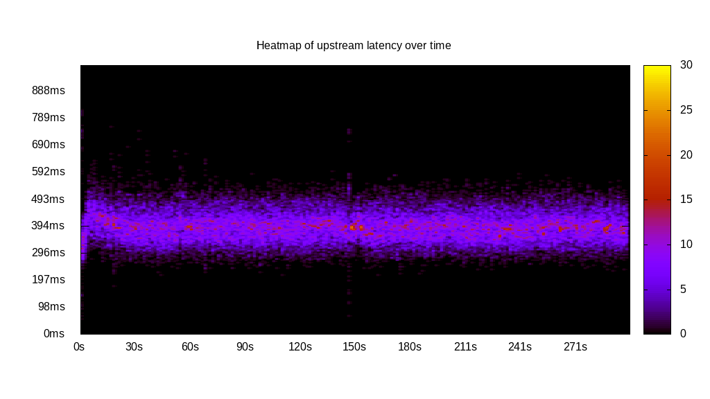
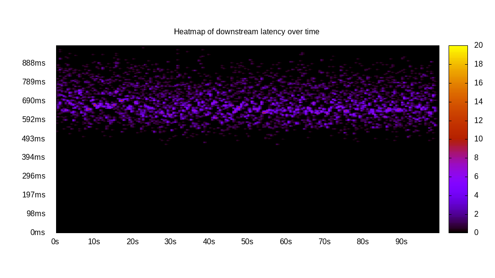
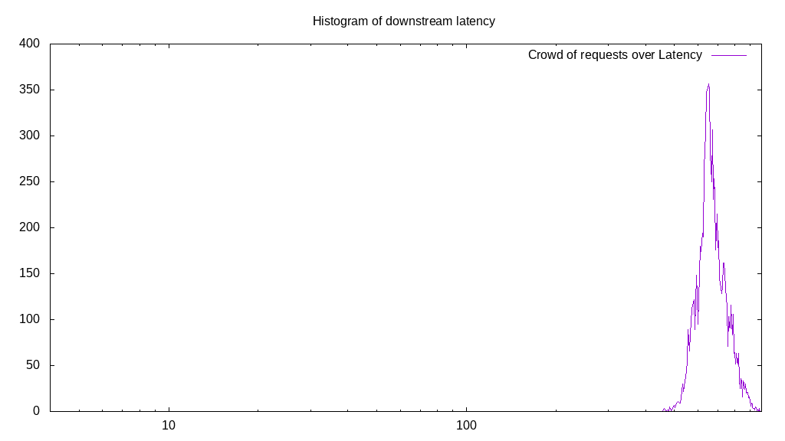
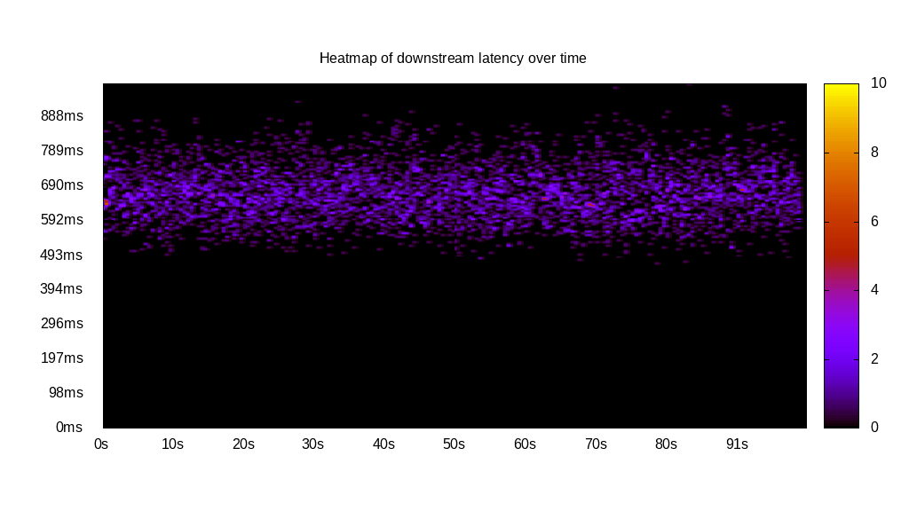

# Latency benchmark report. Crowd is 64

## Populate workload

## Object Size is 1.00kiB

### PUT Latency in ms over time

Evolution of PUT Latency over time

| Parameter | Value |
| --- | --- |
| Y | Latency in ms |
| X | time in s since begining of workload |

### PUT Latency distribution in ms

| Parameter | Value |
| --- | --- |
| Y   | Number of requests |
| X   | Latency in ms |
| PUT count | 48381 |
| PUT volume | 47.247MiB|
| 95th percentile Latency | 502.51ms |
| 68th percentile Latency | 427.14ms |
| 50th percentile Latency | 402.01ms |
| 32nd percentile Latency | 376.88ms |
| 05th percentile Latency | 326.63ms |

## Read workload

## Object Size is 1.00kiB

### GET Latency in ms over time

Evolution of GET Latency over time

| Parameter | Value |
| --- | --- |
| Y | Latency in ms |
| X | time in s since begining of workload |

### GET Latency distribution in ms

| Parameter | Value |
| --- | --- |
| Y   | Number of requests |
| X   | Latency in ms |
| GET count | 9325 |
| GET volume | 9.106MiB|
| 95th percentile Latency | 829.15ms |
| 68th percentile Latency | 728.64ms |
| 50th percentile Latency | 678.39ms |
| 32nd percentile Latency | 653.27ms |
| 05th percentile Latency | 577.89ms |

## Mixed workload

## Object Size is 1.00kiB

### PUT Latency in ms over time

Evolution of PUT Latency over time

| Parameter | Value |
| --- | --- |
| Y | Latency in ms |
| X | time in s since begining of workload |

### GET Latency in ms over time

Evolution of GET Latency over time

| Parameter | Value |
| --- | --- |
| Y | Latency in ms |
| X | time in s since begining of workload |

### PUT Latency distribution in ms

| Parameter | Value |
| --- | --- |
| Y   | Number of requests |
| X   | Latency in ms |
| PUT count | 5802 |
| PUT volume | 5.666MiB|
| 95th percentile Latency | 527.64ms |
| 68th percentile Latency | 452.26ms |
| 50th percentile Latency | 427.14ms |
| 32nd percentile Latency | 427.14ms |
| 05th percentile Latency | 351.76ms |

### GET Latency distribution in ms

| Parameter | Value |
| --- | --- |
| Y   | Number of requests |
| X   | Latency in ms |
| GET count | 5788 |
| GET volume | 5.652MiB|
| 95th percentile Latency | 804.02ms |
| 68th percentile Latency | 703.52ms |
| 50th percentile Latency | 678.39ms |
| 32nd percentile Latency | 653.27ms |
| 05th percentile Latency | 577.89ms |

## Cleanup workload

## Object Size is 1.00kiB

### DELETE Latency in ms over time

Evolution of DELETE Latency over time

| Parameter | Value |
| --- | --- |
| Y | Latency in ms |
| X | time in s since begining of workload |

### DELETE Latency distribution in ms

| Parameter | Value |
| --- | --- |
| Y   | Number of requests |
| X   | Latency in ms |
| DELETE count | 48389 |
| DELETE volume | 47.255MiB|
| 95th percentile Latency | 502.51ms |
| 68th percentile Latency | 427.14ms |
| 50th percentile Latency | 402.01ms |
| 32nd percentile Latency | 351.76ms |
| 05th percentile Latency | 276.38ms |

