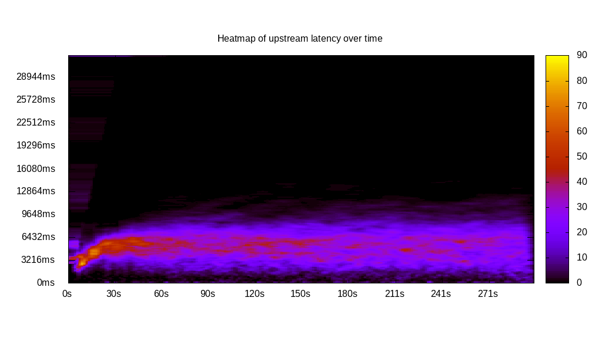
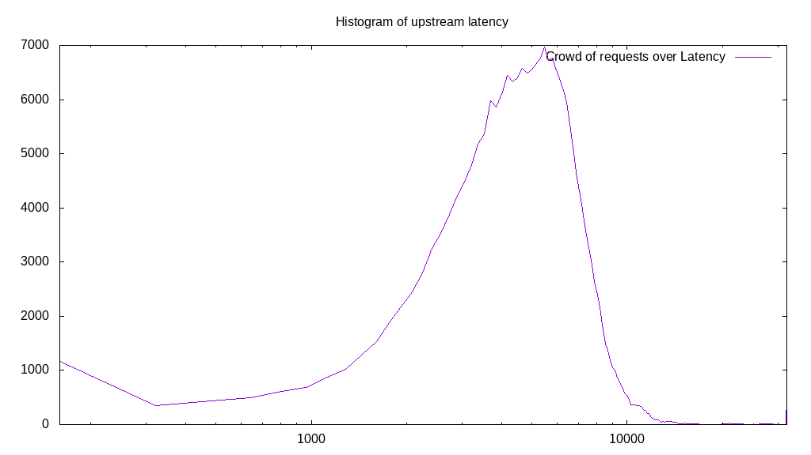
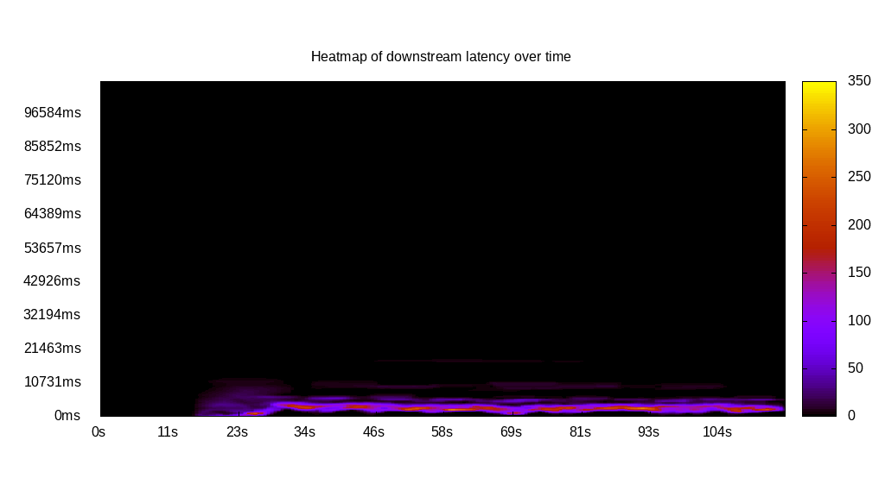
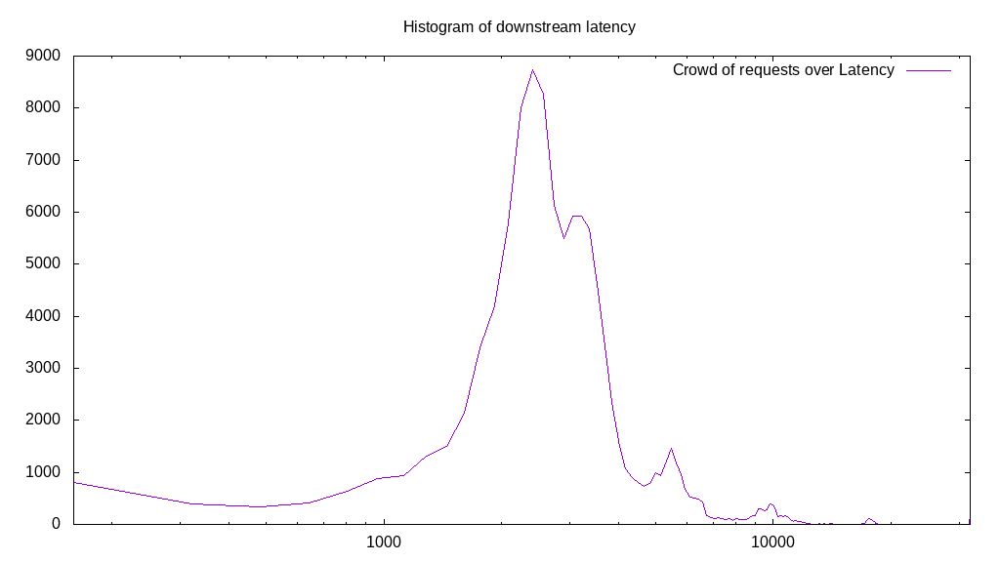
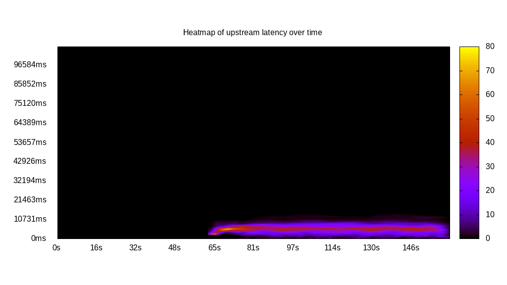
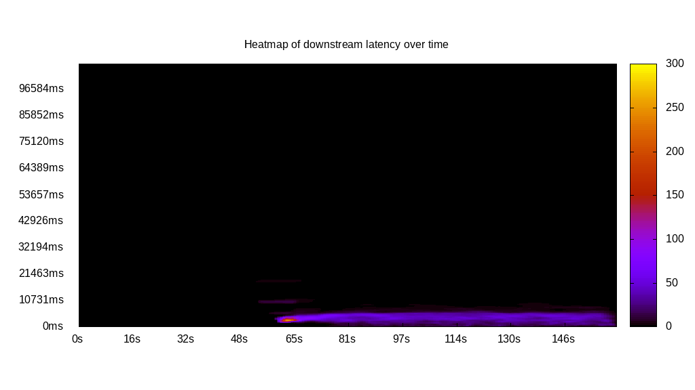
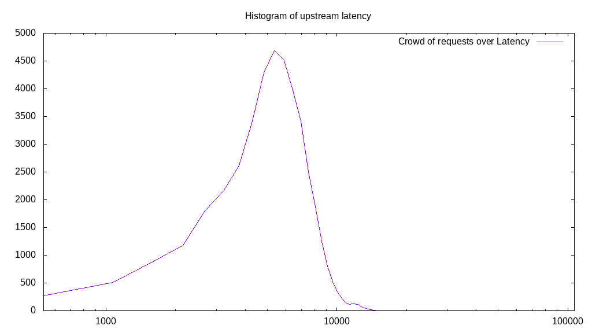
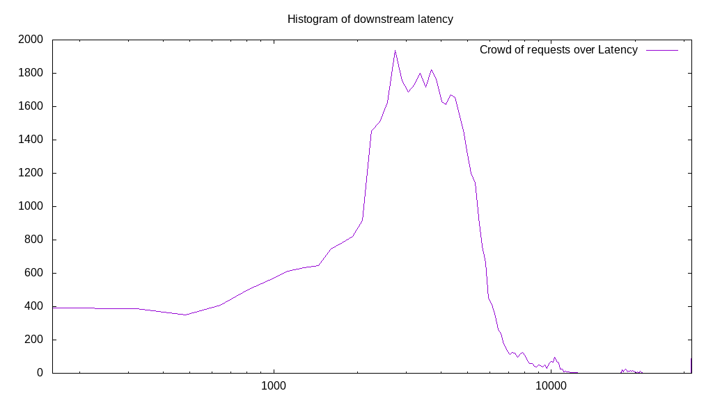
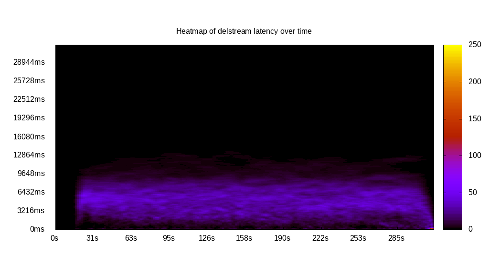
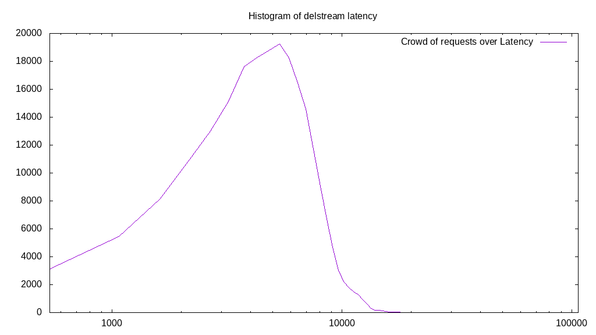

# Latency benchmark report. Crowd is 4096

## Populate workload

## Object Size is 0.00kiB

### PUT Latency in ms over time

Evolution of PUT Latency over time

| Parameter | Value |
| --- | --- |
| Y Coordinate | PUT Latency in ms |
| X Coordinate | time in s since begining of workload |

### PUT Latency distribution in ms

Distribution of the PUT Latency in ms

| Parameter | Value |
| --- | --- |
| Y Coordinate | Number of PUT |
| X Coordinate | Latency in ms |
| Server volume | 0.000MiB|
| Server bandwidth | 0.000MiB/s |
| Server time | 300.00s |
| Server load | 4041.07 |
| Server responses | 226566PUT |
| Server IOps | 755.23PUT/s |
| Client bandwidth | 0.000MiB/s |
| Client volume | 0.000MiB|
| Client time | 1212303.56s |
| Client IOps |  0.19PUT/s  |
| Client Latency | 5350.77ms/PUT |
| Client Limbo | 4.02ms/PUT |
| Crowd time | 1228783.62s |
| Crowd efficiency | 98.66% |
| Highest Latency | 106779.00ms |
| 95th percentile Latency | 9658.40ms |
| 68th percentile Latency | 6438.93ms |
| 50th percentile Latency | 5902.36ms |
| 32nd percentile Latency | 4829.20ms |
| 5th percentile Latency | 2682.89ms |
| Lowest Latency | 536.58ms |

## Read workload

## Object Size is 0.00kiB

### GET Latency in ms over time

Evolution of GET Latency over time

| Parameter | Value |
| --- | --- |
| Y Coordinate | GET Latency in ms |
| X Coordinate | time in s since begining of workload |

### GET Latency distribution in ms

Distribution of the GET Latency in ms

| Parameter | Value |
| --- | --- |
| Y Coordinate | Number of GET |
| X Coordinate | Latency in ms |
| Server volume | 0.000MiB|
| Server bandwidth | 0.000MiB/s |
| Server time | 115.96s |
| Server load | 0.00 |
| Server responses | 0GET |
| Server IOps | 0.00GET/s |
| Client bandwidth | 0.000MiB/s |
| Client volume | 0.000MiB|
| Client time | 0.00s |
| Client IOps |  NaNGET/s  |
| Client Latency | NaNms/GET |
| Client Limbo | 115.96ms/GET |
| Crowd time | 474968.06s |
| Crowd efficiency | 0.00% |
| Highest Latency | 0.00ms |
| 95th percentile Latency | 0.00ms |
| 68th percentile Latency | 0.00ms |
| 50th percentile Latency | 0.00ms |
| 32nd percentile Latency | 0.00ms |
| 5th percentile Latency | 0.00ms |
| Lowest Latency | 0.00ms |

## Mixed workload

## Object Size is 0.00kiB

### PUT Latency in ms over time

Evolution of PUT Latency over time

| Parameter | Value |
| --- | --- |
| Y Coordinate | PUT Latency in ms |
| X Coordinate | time in s since begining of workload |

### GET Latency in ms over time

Evolution of GET Latency over time

| Parameter | Value |
| --- | --- |
| Y Coordinate | GET Latency in ms |
| X Coordinate | time in s since begining of workload |

### PUT Latency distribution in ms

Distribution of the PUT Latency in ms

| Parameter | Value |
| --- | --- |
| Y Coordinate | Number of PUT |
| X Coordinate | Latency in ms |
| Server volume | 0.000MiB|
| Server bandwidth | 0.000MiB/s |
| Server time | 162.46s |
| Server load | 1418.70 |
| Server responses | 41973PUT |
| Server IOps | 258.35PUT/s |
| Client bandwidth | 0.000MiB/s |
| Client volume | 0.000MiB|
| Client time | 230486.94s |
| Client IOps |  0.18PUT/s  |
| Client Latency | 5491.31ms/PUT |
| Client Limbo | 106.19ms/PUT |
| Crowd time | 665448.45s |
| Crowd efficiency | 34.64% |
| Highest Latency | 17170.49ms |
| 95th percentile Latency | 9658.40ms |
| 68th percentile Latency | 6975.51ms |
| 50th percentile Latency | 5902.36ms |
| 32nd percentile Latency | 5365.78ms |
| 5th percentile Latency | 2682.89ms |
| Lowest Latency | 536.58ms |

### GET Latency distribution in ms

Distribution of the GET Latency in ms

| Parameter | Value |
| --- | --- |
| Y Coordinate | Number of GET |
| X Coordinate | Latency in ms |
| Server volume | 0.000MiB|
| Server bandwidth | 0.000MiB/s |
| Server time | 162.46s |
| Server load | 0.00 |
| Server responses | 0GET |
| Server IOps | 0.00GET/s |
| Client bandwidth | 0.000MiB/s |
| Client volume | 0.000MiB|
| Client time | 0.00s |
| Client IOps |  NaNGET/s  |
| Client Latency | NaNms/GET |
| Client Limbo | 162.46ms/GET |
| Crowd time | 665448.45s |
| Crowd efficiency | 0.00% |
| Highest Latency | 0.00ms |
| 95th percentile Latency | 0.00ms |
| 68th percentile Latency | 0.00ms |
| 50th percentile Latency | 0.00ms |
| 32nd percentile Latency | 0.00ms |
| 5th percentile Latency | 0.00ms |
| Lowest Latency | 0.00ms |

## Cleanup workload

## Object Size is 0.00kiB

### DELETE Latency in ms over time

Evolution of DELETE Latency over time

| Parameter | Value |
| --- | --- |
| Y Coordinate | DELETE Latency in ms |
| X Coordinate | time in s since begining of workload |

### DELETE Latency distribution in ms

Distribution of the DELETE Latency in ms

| Parameter | Value |
| --- | --- |
| Y Coordinate | Number of DELETE |
| X Coordinate | Latency in ms |
| Server volume | 0.000MiB|
| Server bandwidth | 0.000MiB/s |
| Server time | 315.64s |
| Server load | 3738.82 |
| Server responses | 226574DELETE |
| Server IOps | 717.83DELETE/s |
| Client bandwidth | 0.000MiB/s |
| Client volume | 0.000MiB|
| Client time | 1180107.53s |
| Client IOps |  0.19DELETE/s  |
| Client Latency | 5208.49ms/DELETE |
| Client Limbo | 27.52ms/DELETE |
| Crowd time | 1292845.06s |
| Crowd efficiency | 91.28% |
| Highest Latency | 19316.80ms |
| 95th percentile Latency | 10194.98ms |
| 68th percentile Latency | 6975.51ms |
| 50th percentile Latency | 5365.78ms |
| 32nd percentile Latency | 4292.62ms |
| 5th percentile Latency | 1609.73ms |
| Lowest Latency | 536.58ms |

