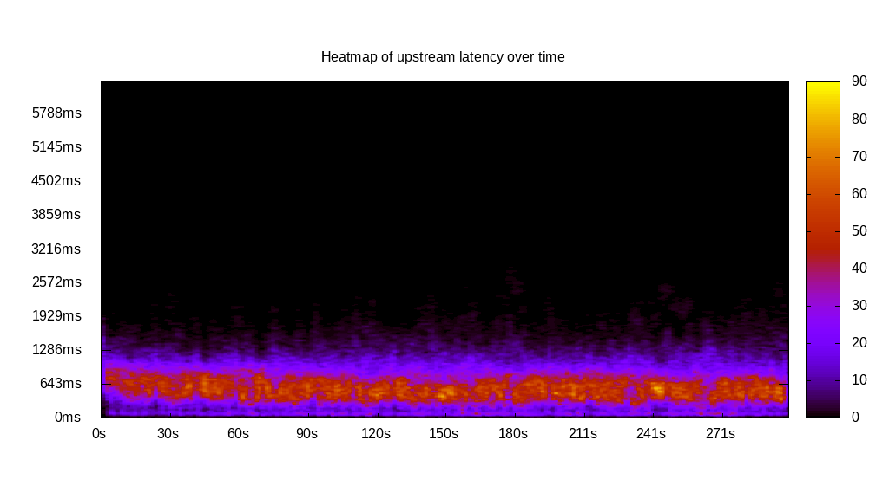
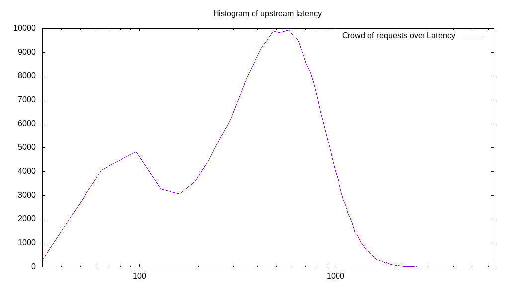
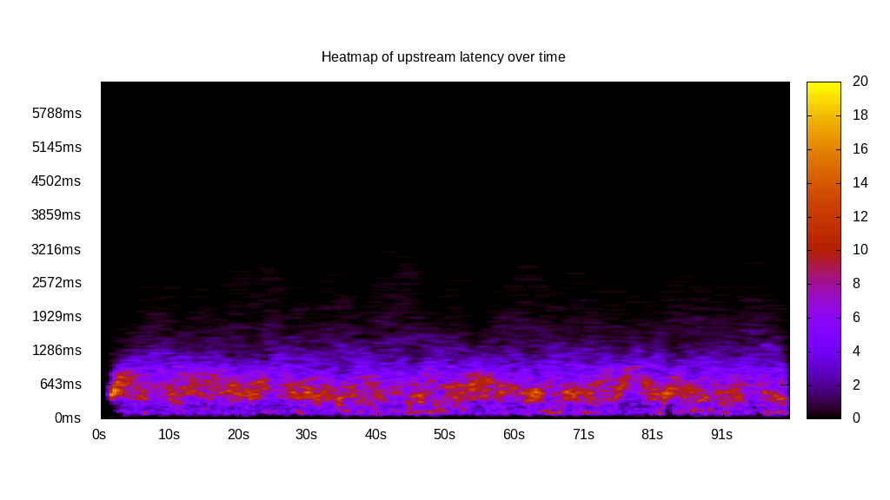

# Latency benchmark report. Crowd is 512

## Populate workload

## Object Size is 0.00kiB

### PUT Latency in ms over time

Evolution of PUT Latency over time

| Parameter | Value |
| --- | --- |
| Y Coordinate | PUT Latency in ms |
| X Coordinate | time in s since begining of workload |

### PUT Latency distribution in ms

Distribution of the PUT Latency in ms

| Parameter | Value |
| --- | --- |
| Y Coordinate | Number of PUT |
| X Coordinate | Latency in ms |
| Server volume | 0.000MiB|
| Server bandwidth | 0.000MiB/s |
| Server time | 300.00s |
| Server load | 510.89 |
| Server responses | 238872PUT |
| Server IOps | 796.25PUT/s |
| Client bandwidth | 0.000MiB/s |
| Client volume | 0.000MiB|
| Client time | 153264.04s |
| Client IOps |  1.56PUT/s  |
| Client Latency | 641.62ms/PUT |
| Client Limbo | 0.65ms/PUT |
| Crowd time | 153598.46s |
| Crowd efficiency | 99.78% |
| Highest Latency | 3762.81ms |
| 95th percentile Latency | 1286.43ms |
| 68th percentile Latency | 804.02ms |
| 50th percentile Latency | 643.22ms |
| 32nd percentile Latency | 482.41ms |
| 5th percentile Latency | 160.80ms |
| Lowest Latency | 32.16ms |

## Read workload

## Object Size is 0.00kiB

### GET Latency in ms over time

Evolution of GET Latency over time

| Parameter | Value |
| --- | --- |
| Y Coordinate | GET Latency in ms |
| X Coordinate | time in s since begining of workload |

### GET Latency distribution in ms

Distribution of the GET Latency in ms

| Parameter | Value |
| --- | --- |
| Y Coordinate | Number of GET |
| X Coordinate | Latency in ms |
| Server volume | 0.000MiB|
| Server bandwidth | 0.000MiB/s |
| Server time | 102.26s |
| Server load | 496.34 |
| Server responses | 116510GET |
| Server IOps | 1139.38GET/s |
| Client bandwidth | 0.000MiB/s |
| Client volume | 0.000MiB|
| Client time | 50754.15s |
| Client IOps |  2.30GET/s  |
| Client Latency | 435.62ms/GET |
| Client Limbo | 3.13ms/GET |
| Crowd time | 52355.58s |
| Crowd efficiency | 96.94% |
| Highest Latency | 3634.17ms |
| 95th percentile Latency | 707.54ms |
| 68th percentile Latency | 514.57ms |
| 50th percentile Latency | 450.25ms |
| 32nd percentile Latency | 385.93ms |
| 5th percentile Latency | 257.29ms |
| Lowest Latency | 32.16ms |

## Mixed workload

## Object Size is 0.00kiB

### PUT Latency in ms over time

Evolution of PUT Latency over time

| Parameter | Value |
| --- | --- |
| Y Coordinate | PUT Latency in ms |
| X Coordinate | time in s since begining of workload |

### GET Latency in ms over time

Evolution of GET Latency over time

| Parameter | Value |
| --- | --- |
| Y Coordinate | GET Latency in ms |
| X Coordinate | time in s since begining of workload |

### PUT Latency distribution in ms

Distribution of the PUT Latency in ms

| Parameter | Value |
| --- | --- |
| Y Coordinate | Number of PUT |
| X Coordinate | Latency in ms |
| Server volume | 0.000MiB|
| Server bandwidth | 0.000MiB/s |
| Server time | 101.02s |
| Server load | 308.11 |
| Server responses | 45878PUT |
| Server IOps | 454.13PUT/s |
| Client bandwidth | 0.000MiB/s |
| Client volume | 0.000MiB|
| Client time | 31126.63s |
| Client IOps |  1.47PUT/s  |
| Client Latency | 678.47ms/PUT |
| Client Limbo | 40.23ms/PUT |
| Crowd time | 51724.29s |
| Crowd efficiency | 60.18% |
| Highest Latency | 3859.30ms |
| 95th percentile Latency | 1479.40ms |
| 68th percentile Latency | 836.18ms |
| 50th percentile Latency | 643.22ms |
| 32nd percentile Latency | 482.41ms |
| 5th percentile Latency | 160.80ms |
| Lowest Latency | 32.16ms |

### GET Latency distribution in ms

Distribution of the GET Latency in ms

| Parameter | Value |
| --- | --- |
| Y Coordinate | Number of GET |
| X Coordinate | Latency in ms |
| Server volume | 0.000MiB|
| Server bandwidth | 0.000MiB/s |
| Server time | 101.02s |
| Server load | 197.42 |
| Server responses | 46392GET |
| Server IOps | 459.22GET/s |
| Client bandwidth | 0.000MiB/s |
| Client volume | 0.000MiB|
| Client time | 19944.13s |
| Client IOps |  2.33GET/s  |
| Client Latency | 429.90ms/GET |
| Client Limbo | 62.07ms/GET |
| Crowd time | 51724.29s |
| Crowd efficiency | 38.56% |
| Highest Latency | 2765.83ms |
| 95th percentile Latency | 1029.15ms |
| 68th percentile Latency | 546.73ms |
| 50th percentile Latency | 418.09ms |
| 32nd percentile Latency | 289.45ms |
| 5th percentile Latency | 96.48ms |
| Lowest Latency | 32.16ms |

## Cleanup workload

## Object Size is 0.00kiB

### DELETE Latency in ms over time

Evolution of DELETE Latency over time

| Parameter | Value |
| --- | --- |
| Y Coordinate | DELETE Latency in ms |
| X Coordinate | time in s since begining of workload |

### DELETE Latency distribution in ms

Distribution of the DELETE Latency in ms

| Parameter | Value |
| --- | --- |
| Y Coordinate | Number of DELETE |
| X Coordinate | Latency in ms |
| Server volume | 0.000MiB|
| Server bandwidth | 0.000MiB/s |
| Server time | 301.41s |
| Server load | 506.33 |
| Server responses | 238880DELETE |
| Server IOps | 792.55DELETE/s |
| Client bandwidth | 0.000MiB/s |
| Client volume | 0.000MiB|
| Client time | 152611.32s |
| Client IOps |  1.57DELETE/s  |
| Client Latency | 638.86ms/DELETE |
| Client Limbo | 3.34ms/DELETE |
| Crowd time | 154319.87s |
| Crowd efficiency | 98.89% |
| Highest Latency | 3923.62ms |
| 95th percentile Latency | 1318.59ms |
| 68th percentile Latency | 771.86ms |
| 50th percentile Latency | 611.06ms |
| 32nd percentile Latency | 482.41ms |
| 5th percentile Latency | 160.80ms |
| Lowest Latency | 32.16ms |

