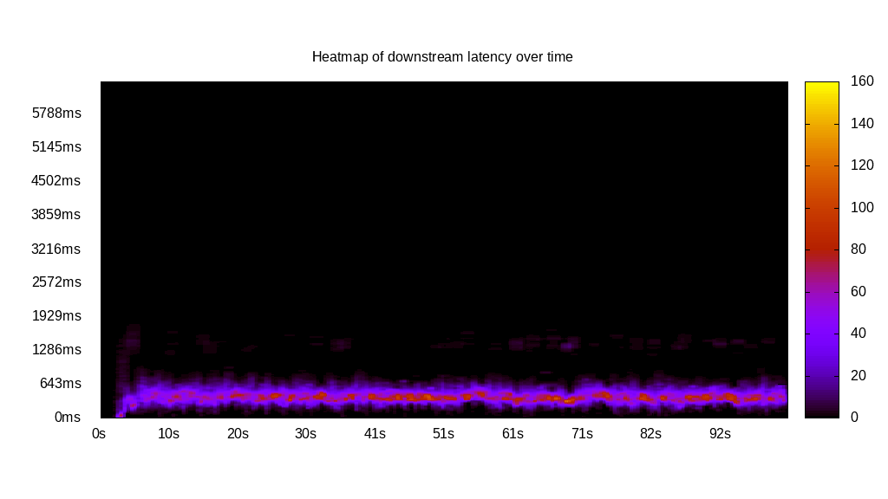
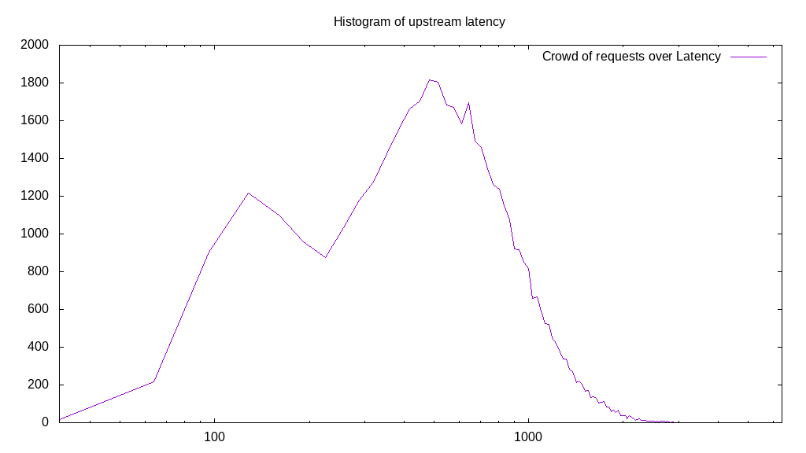

# Latency benchmark report. Crowd is 512

## Populate workload

## Object Size is 0.00kiB

### PUT Latency in ms over time

Evolution of PUT Latency over time

| Parameter | Value |
| --- | --- |
| Y Coordinate | PUT Latency in ms |
| X Coordinate | time in s since begining of workload |

### PUT Latency distribution in ms

Distribution of the PUT Latency in ms

| Parameter | Value |
| --- | --- |
| Y Coordinate | Number of PUT |
| X Coordinate | Latency in ms |
| Server volume | 0.000MiB|
| Server bandwidth | 0.000MiB/s |
| Server time | 300.00s |
| Server load | 510.89 |
| Server responses | 238872PUT |
| Server IOps | 796.25PUT/s |
| Client bandwidth | 0.000MiB/s |
| Client volume | 0.000MiB|
| Client time | 153264.04s |
| Client IOps |  1.56PUT/s  |
| Client Latency | 641.62ms/PUT |
| Client Limbo | 0.65ms/PUT |
| Crowd time | 153598.46s |
| Crowd efficiency | 99.78% |
| Highest Latency | 3774.89ms |
| 95th percentile Latency | 1264.88ms |
| 68th percentile Latency | 770.79ms |
| 50th percentile Latency | 632.44ms |
| 32nd percentile Latency | 474.33ms |
| 5th percentile Latency | 158.11ms |
| Lowest Latency | 19.76ms |

## Read workload

## Object Size is 0.00kiB

### GET Latency in ms over time

Evolution of GET Latency over time

| Parameter | Value |
| --- | --- |
| Y Coordinate | GET Latency in ms |
| X Coordinate | time in s since begining of workload |

### GET Latency distribution in ms

Distribution of the GET Latency in ms

| Parameter | Value |
| --- | --- |
| Y Coordinate | Number of GET |
| X Coordinate | Latency in ms |
| Server volume | 0.000MiB|
| Server bandwidth | 0.000MiB/s |
| Server time | 102.26s |
| Server load | 0.00 |
| Server responses | 0GET |
| Server IOps | 0.00GET/s |
| Client bandwidth | 0.000MiB/s |
| Client volume | 0.000MiB|
| Client time | 0.00s |
| Client IOps |  NaNGET/s  |
| Client Latency | NaNms/GET |
| Client Limbo | 102.26ms/GET |
| Crowd time | 52355.58s |
| Crowd efficiency | 0.00% |
| Highest Latency | 0.00ms |
| 95th percentile Latency | 0.00ms |
| 68th percentile Latency | 0.00ms |
| 50th percentile Latency | 0.00ms |
| 32nd percentile Latency | 0.00ms |
| 5th percentile Latency | 0.00ms |
| Lowest Latency | 0.00ms |

## Mixed workload

## Object Size is 0.00kiB

### PUT Latency in ms over time

Evolution of PUT Latency over time

| Parameter | Value |
| --- | --- |
| Y Coordinate | PUT Latency in ms |
| X Coordinate | time in s since begining of workload |

### GET Latency in ms over time

Evolution of GET Latency over time

| Parameter | Value |
| --- | --- |
| Y Coordinate | GET Latency in ms |
| X Coordinate | time in s since begining of workload |

### PUT Latency distribution in ms

Distribution of the PUT Latency in ms

| Parameter | Value |
| --- | --- |
| Y Coordinate | Number of PUT |
| X Coordinate | Latency in ms |
| Server volume | 0.000MiB|
| Server bandwidth | 0.000MiB/s |
| Server time | 101.02s |
| Server load | 308.11 |
| Server responses | 45878PUT |
| Server IOps | 454.13PUT/s |
| Client bandwidth | 0.000MiB/s |
| Client volume | 0.000MiB|
| Client time | 31126.63s |
| Client IOps |  1.47PUT/s  |
| Client Latency | 678.47ms/PUT |
| Client Limbo | 40.23ms/PUT |
| Crowd time | 51724.29s |
| Crowd efficiency | 60.18% |
| Highest Latency | 3853.94ms |
| 95th percentile Latency | 1462.52ms |
| 68th percentile Latency | 810.32ms |
| 50th percentile Latency | 632.44ms |
| 32nd percentile Latency | 474.33ms |
| 5th percentile Latency | 158.11ms |
| Lowest Latency | 19.76ms |

### GET Latency distribution in ms

Distribution of the GET Latency in ms

| Parameter | Value |
| --- | --- |
| Y Coordinate | Number of GET |
| X Coordinate | Latency in ms |
| Server volume | 0.000MiB|
| Server bandwidth | 0.000MiB/s |
| Server time | 101.02s |
| Server load | 0.00 |
| Server responses | 0GET |
| Server IOps | 0.00GET/s |
| Client bandwidth | 0.000MiB/s |
| Client volume | 0.000MiB|
| Client time | 0.00s |
| Client IOps |  NaNGET/s  |
| Client Latency | NaNms/GET |
| Client Limbo | 101.02ms/GET |
| Crowd time | 51724.29s |
| Crowd efficiency | 0.00% |
| Highest Latency | 0.00ms |
| 95th percentile Latency | 0.00ms |
| 68th percentile Latency | 0.00ms |
| 50th percentile Latency | 0.00ms |
| 32nd percentile Latency | 0.00ms |
| 5th percentile Latency | 0.00ms |
| Lowest Latency | 0.00ms |

## Cleanup workload

## Object Size is 0.00kiB

### DELETE Latency in ms over time

Evolution of DELETE Latency over time

| Parameter | Value |
| --- | --- |
| Y Coordinate | DELETE Latency in ms |
| X Coordinate | time in s since begining of workload |

### DELETE Latency distribution in ms

Distribution of the DELETE Latency in ms

| Parameter | Value |
| --- | --- |
| Y Coordinate | Number of DELETE |
| X Coordinate | Latency in ms |
| Server volume | 0.000MiB|
| Server bandwidth | 0.000MiB/s |
| Server time | 301.41s |
| Server load | 506.33 |
| Server responses | 238880DELETE |
| Server IOps | 792.55DELETE/s |
| Client bandwidth | 0.000MiB/s |
| Client volume | 0.000MiB|
| Client time | 152611.32s |
| Client IOps |  1.57DELETE/s  |
| Client Latency | 638.86ms/DELETE |
| Client Limbo | 3.34ms/DELETE |
| Crowd time | 154319.87s |
| Crowd efficiency | 98.89% |
| Highest Latency | 3933.00ms |
| 95th percentile Latency | 1304.41ms |
| 68th percentile Latency | 770.79ms |
| 50th percentile Latency | 612.68ms |
| 32nd percentile Latency | 474.33ms |
| 5th percentile Latency | 138.35ms |
| Lowest Latency | 19.76ms |

