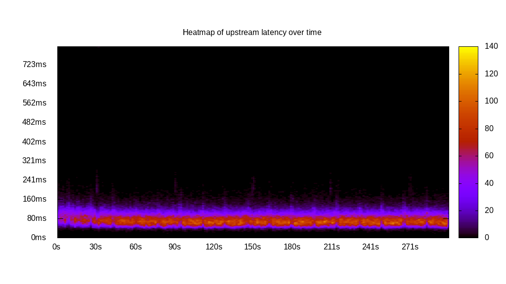
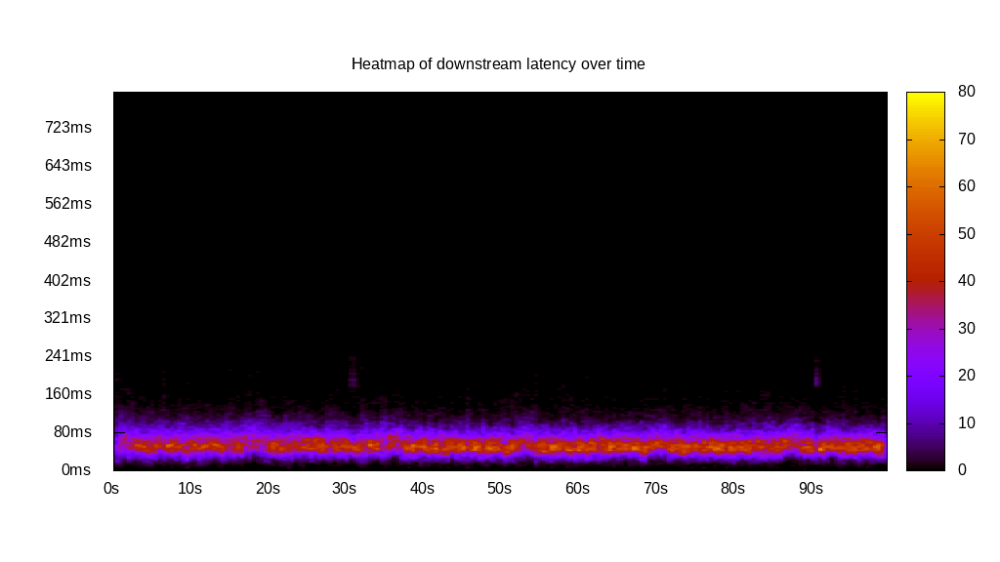
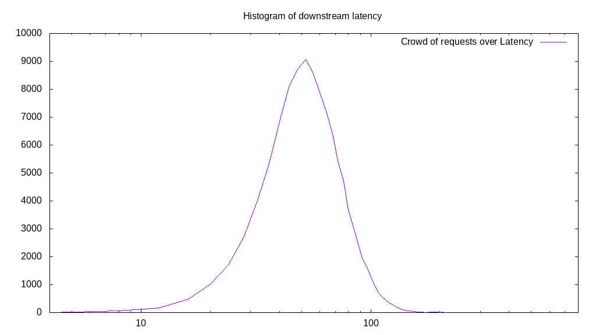
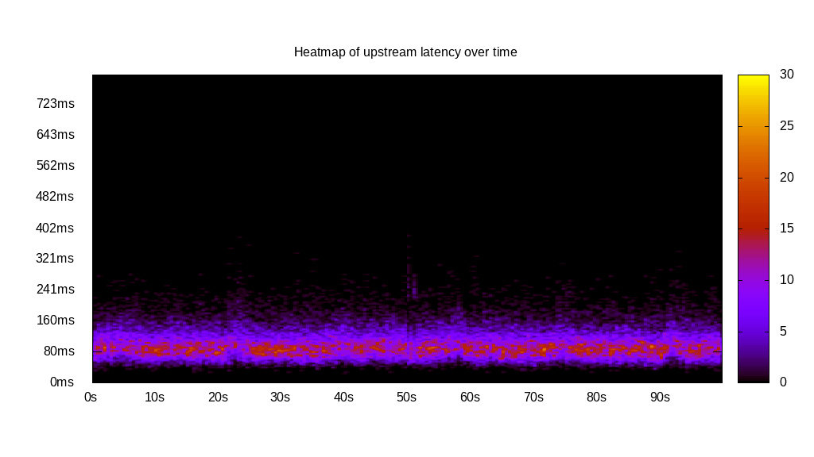
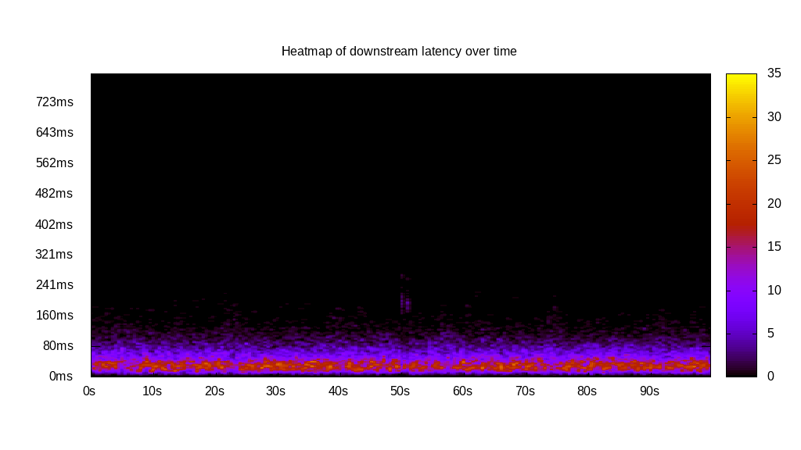
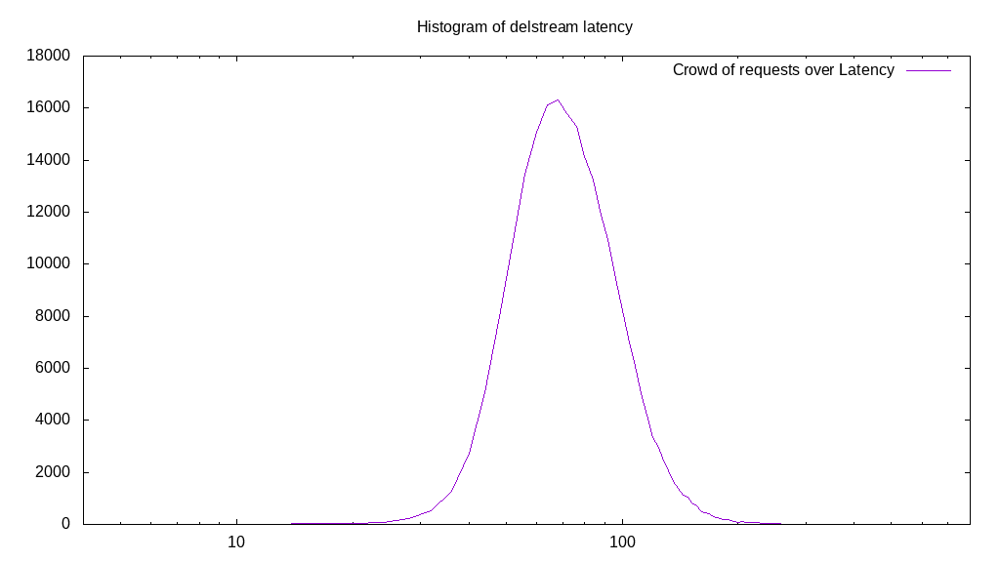

# Latency benchmark report. Crowd is 64

## Populate workload

## Object Size is 0.00kiB

### PUT Latency in ms over time

Evolution of PUT Latency over time

| Parameter | Value |
| --- | --- |
| Y Coordinate | PUT Latency in ms |
| X Coordinate | time in s since begining of workload |

### PUT Latency distribution in ms

Distribution of the PUT Latency in ms

| Parameter | Value |
| --- | --- |
| Y Coordinate | Number of PUT |
| X Coordinate | Latency in ms |
| Server volume | 0.000MiB|
| Server bandwidth | 0.000MiB/s |
| Server time | 300.00s |
| Server load | 63.82 |
| Server responses | 232402PUT |
| Server IOps | 774.67PUT/s |
| Client bandwidth | 0.000MiB/s |
| Client volume | 0.000MiB|
| Client time | 19146.82s |
| Client IOps |  12.14PUT/s  |
| Client Latency | 82.39ms/PUT |
| Client Limbo | 0.83ms/PUT |
| Crowd time | 19200.13s |
| Crowd efficiency | 99.72% |
| Highest Latency | 1172.00ms |
| 95th percentile Latency | 141.35ms |
| 68th percentile Latency | 94.23ms |
| 50th percentile Latency | 82.45ms |
| 32nd percentile Latency | 70.67ms |
| 5th percentile Latency | 53.01ms |
| Lowest Latency | 11.78ms |

## Read workload

## Object Size is 0.00kiB

### GET Latency in ms over time

Evolution of GET Latency over time

| Parameter | Value |
| --- | --- |
| Y Coordinate | GET Latency in ms |
| X Coordinate | time in s since begining of workload |

### GET Latency distribution in ms

Distribution of the GET Latency in ms

| Parameter | Value |
| --- | --- |
| Y Coordinate | Number of GET |
| X Coordinate | Latency in ms |
| Server volume | 0.000MiB|
| Server bandwidth | 0.000MiB/s |
| Server time | 100.19s |
| Server load | 0.00 |
| Server responses | 0GET |
| Server IOps | 0.00GET/s |
| Client bandwidth | 0.000MiB/s |
| Client volume | 0.000MiB|
| Client time | 0.00s |
| Client IOps |  NaNGET/s  |
| Client Latency | NaNms/GET |
| Client Limbo | 100.19ms/GET |
| Crowd time | 6411.90s |
| Crowd efficiency | 0.00% |
| Highest Latency | 0.00ms |
| 95th percentile Latency | 0.00ms |
| 68th percentile Latency | 0.00ms |
| 50th percentile Latency | 0.00ms |
| 32nd percentile Latency | 0.00ms |
| 5th percentile Latency | 0.00ms |
| Lowest Latency | 0.00ms |

## Mixed workload

## Object Size is 0.00kiB

### PUT Latency in ms over time

Evolution of PUT Latency over time

| Parameter | Value |
| --- | --- |
| Y Coordinate | PUT Latency in ms |
| X Coordinate | time in s since begining of workload |

### GET Latency in ms over time

Evolution of GET Latency over time

| Parameter | Value |
| --- | --- |
| Y Coordinate | GET Latency in ms |
| X Coordinate | time in s since begining of workload |

### PUT Latency distribution in ms

Distribution of the PUT Latency in ms

| Parameter | Value |
| --- | --- |
| Y Coordinate | Number of PUT |
| X Coordinate | Latency in ms |
| Server volume | 0.000MiB|
| Server bandwidth | 0.000MiB/s |
| Server time | 100.10s |
| Server load | 44.23 |
| Server responses | 43538PUT |
| Server IOps | 434.93PUT/s |
| Client bandwidth | 0.000MiB/s |
| Client volume | 0.000MiB|
| Client time | 4428.00s |
| Client IOps |  9.83PUT/s  |
| Client Latency | 101.70ms/PUT |
| Client Limbo | 30.92ms/PUT |
| Crowd time | 6406.66s |
| Crowd efficiency | 69.12% |
| Highest Latency | 382.81ms |
| 95th percentile Latency | 170.79ms |
| 68th percentile Latency | 117.79ms |
| 50th percentile Latency | 100.12ms |
| 32nd percentile Latency | 88.34ms |
| 5th percentile Latency | 64.78ms |
| Lowest Latency | 23.56ms |

### GET Latency distribution in ms

Distribution of the GET Latency in ms

| Parameter | Value |
| --- | --- |
| Y Coordinate | Number of GET |
| X Coordinate | Latency in ms |
| Server volume | 0.000MiB|
| Server bandwidth | 0.000MiB/s |
| Server time | 100.10s |
| Server load | 0.00 |
| Server responses | 0GET |
| Server IOps | 0.00GET/s |
| Client bandwidth | 0.000MiB/s |
| Client volume | 0.000MiB|
| Client time | 0.00s |
| Client IOps |  NaNGET/s  |
| Client Latency | NaNms/GET |
| Client Limbo | 100.10ms/GET |
| Crowd time | 6406.66s |
| Crowd efficiency | 0.00% |
| Highest Latency | 0.00ms |
| 95th percentile Latency | 0.00ms |
| 68th percentile Latency | 0.00ms |
| 50th percentile Latency | 0.00ms |
| 32nd percentile Latency | 0.00ms |
| 5th percentile Latency | 0.00ms |
| Lowest Latency | 0.00ms |

## Cleanup workload

## Object Size is 0.00kiB

### DELETE Latency in ms over time

Evolution of DELETE Latency over time

| Parameter | Value |
| --- | --- |
| Y Coordinate | DELETE Latency in ms |
| X Coordinate | time in s since begining of workload |

### DELETE Latency distribution in ms

Distribution of the DELETE Latency in ms

| Parameter | Value |
| --- | --- |
| Y Coordinate | Number of DELETE |
| X Coordinate | Latency in ms |
| Server volume | 0.000MiB|
| Server bandwidth | 0.000MiB/s |
| Server time | 298.66s |
| Server load | 63.68 |
| Server responses | 232410DELETE |
| Server IOps | 778.18DELETE/s |
| Client bandwidth | 0.000MiB/s |
| Client volume | 0.000MiB|
| Client time | 19017.63s |
| Client IOps |  12.22DELETE/s  |
| Client Latency | 81.83ms/DELETE |
| Client Limbo | 1.51ms/DELETE |
| Crowd time | 19114.24s |
| Crowd efficiency | 99.49% |
| Highest Latency | 1101.33ms |
| 95th percentile Latency | 135.46ms |
| 68th percentile Latency | 94.23ms |
| 50th percentile Latency | 82.45ms |
| 32nd percentile Latency | 70.67ms |
| 5th percentile Latency | 53.01ms |
| Lowest Latency | 11.78ms |

