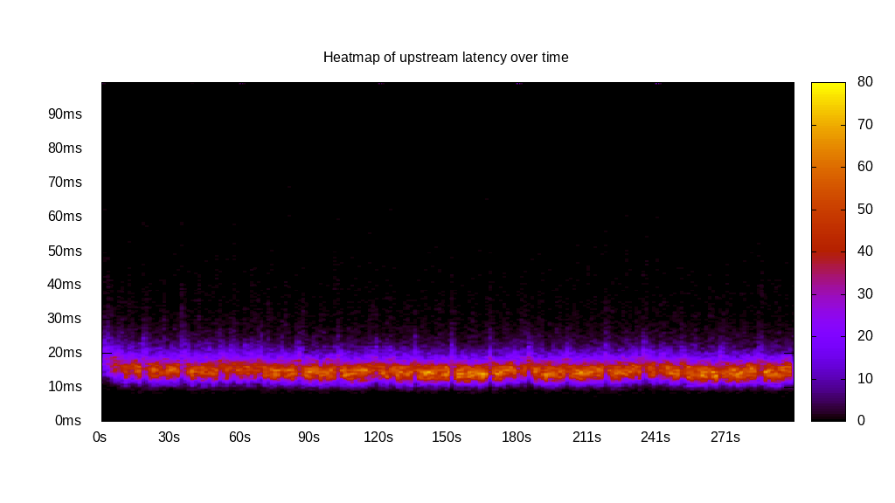
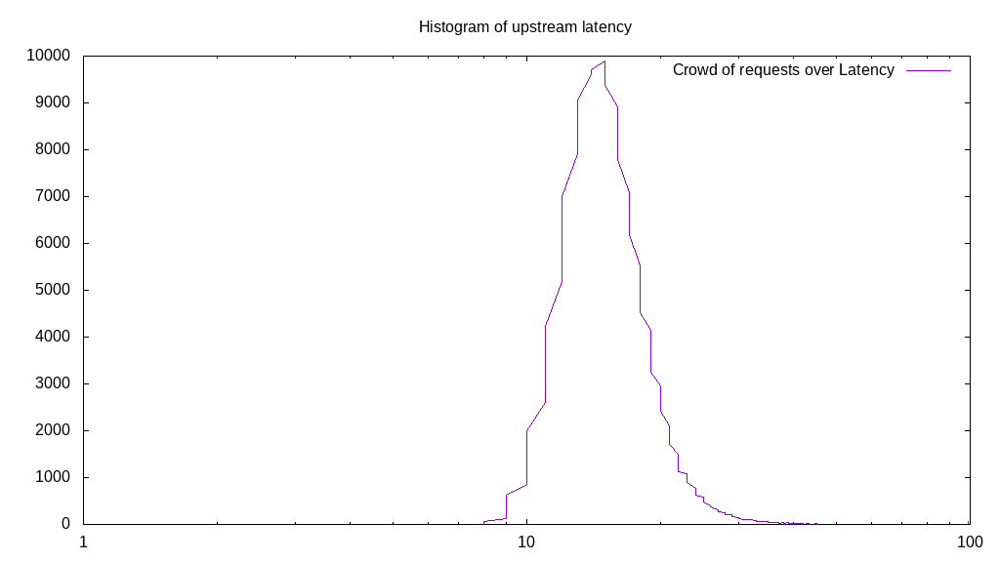
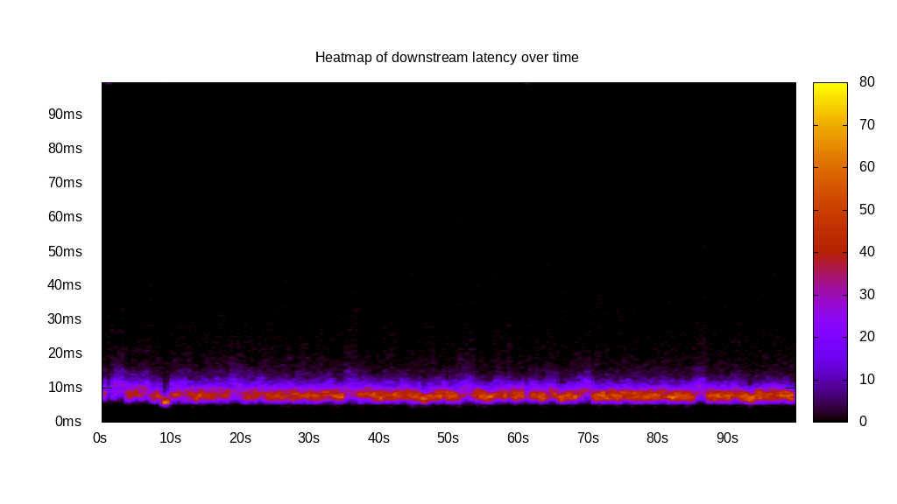
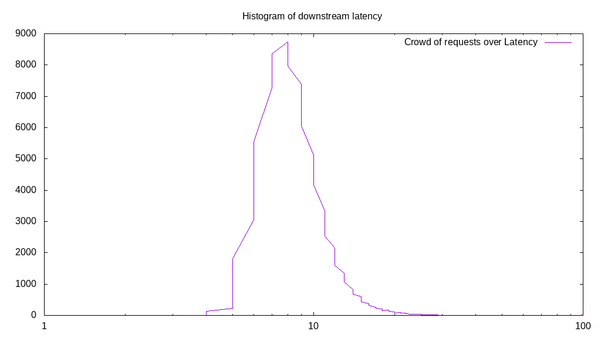
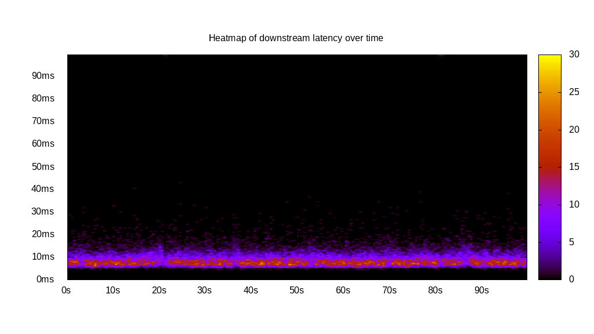
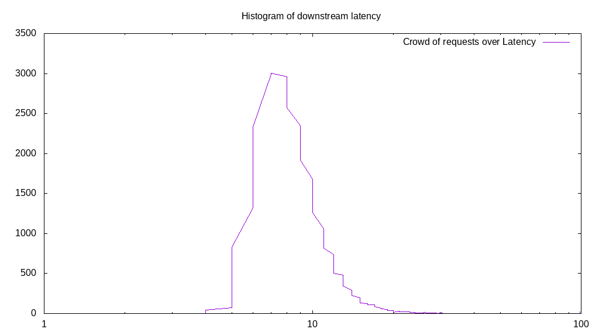
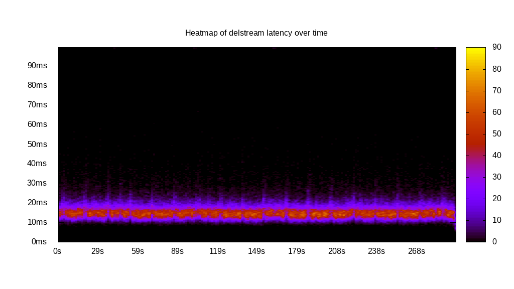

# Latency benchmark report. Crowd is 8

## Populate workload

## Object Size is 0.00kiB

### PUT Latency in ms over time

Evolution of PUT Latency over time

| Parameter | Value |
| --- | --- |
| Y Coordinate | PUT Latency in ms |
| X Coordinate | time in s since begining of workload |

### PUT Latency distribution in ms

Distribution of the PUT Latency in ms

| Parameter | Value |
| --- | --- |
| Y Coordinate | Number of PUT |
| X Coordinate | Latency in ms |
| Server volume | 0.000MiB|
| Server bandwidth | 0.000MiB/s |
| Server time | 300.00s |
| Server load | 7.93 |
| Server responses | 145737PUT |
| Server IOps | 485.80PUT/s |
| Client bandwidth | 0.000MiB/s |
| Client volume | 0.000MiB|
| Client time | 2378.05s |
| Client IOps |  61.28PUT/s  |
| Client Latency | 16.32ms/PUT |
| Client Limbo | 2.74ms/PUT |
| Crowd time | 2399.97s |
| Crowd efficiency | 99.09% |
| Highest Latency | 1019.72ms |
| 95th percentile Latency | 26.28ms |
| 68th percentile Latency | 21.03ms |
| 50th percentile Latency | 21.03ms |
| 32nd percentile Latency | 21.03ms |
| 5th percentile Latency | 15.77ms |
| Lowest Latency | 5.26ms |

## Read workload

## Object Size is 0.00kiB

### GET Latency in ms over time

Evolution of GET Latency over time

| Parameter | Value |
| --- | --- |
| Y Coordinate | GET Latency in ms |
| X Coordinate | time in s since begining of workload |

### GET Latency distribution in ms

Distribution of the GET Latency in ms

| Parameter | Value |
| --- | --- |
| Y Coordinate | Number of GET |
| X Coordinate | Latency in ms |
| Server volume | 0.000MiB|
| Server bandwidth | 0.000MiB/s |
| Server time | 100.01s |
| Server load | 7.88 |
| Server responses | 83206GET |
| Server IOps | 831.94GET/s |
| Client bandwidth | 0.000MiB/s |
| Client volume | 0.000MiB|
| Client time | 788.57s |
| Client IOps |  105.52GET/s  |
| Client Latency | 9.48ms/GET |
| Client Limbo | 1.44ms/GET |
| Crowd time | 800.11s |
| Crowd efficiency | 98.56% |
| Highest Latency | 1046.00ms |
| 95th percentile Latency | 21.03ms |
| 68th percentile Latency | 15.77ms |
| 50th percentile Latency | 15.77ms |
| 32nd percentile Latency | 10.51ms |
| 5th percentile Latency | 10.51ms |
| Lowest Latency | 5.26ms |

## Mixed workload

## Object Size is 0.00kiB

### PUT Latency in ms over time

Evolution of PUT Latency over time

| Parameter | Value |
| --- | --- |
| Y Coordinate | PUT Latency in ms |
| X Coordinate | time in s since begining of workload |

### GET Latency in ms over time

Evolution of GET Latency over time

| Parameter | Value |
| --- | --- |
| Y Coordinate | GET Latency in ms |
| X Coordinate | time in s since begining of workload |

### PUT Latency distribution in ms

Distribution of the PUT Latency in ms

| Parameter | Value |
| --- | --- |
| Y Coordinate | Number of PUT |
| X Coordinate | Latency in ms |
| Server volume | 0.000MiB|
| Server bandwidth | 0.000MiB/s |
| Server time | 100.01s |
| Server load | 5.23 |
| Server responses | 28893PUT |
| Server IOps | 288.91PUT/s |
| Client bandwidth | 0.000MiB/s |
| Client volume | 0.000MiB|
| Client time | 523.08s |
| Client IOps |  55.24PUT/s  |
| Client Latency | 18.10ms/PUT |
| Client Limbo | 34.62ms/PUT |
| Crowd time | 800.06s |
| Crowd efficiency | 65.38% |
| Highest Latency | 231.28ms |
| 95th percentile Latency | 31.54ms |
| 68th percentile Latency | 26.28ms |
| 50th percentile Latency | 21.03ms |
| 32nd percentile Latency | 21.03ms |
| 5th percentile Latency | 15.77ms |
| Lowest Latency | 10.51ms |

### GET Latency distribution in ms

Distribution of the GET Latency in ms

| Parameter | Value |
| --- | --- |
| Y Coordinate | Number of GET |
| X Coordinate | Latency in ms |
| Server volume | 0.000MiB|
| Server bandwidth | 0.000MiB/s |
| Server time | 100.01s |
| Server load | 2.69 |
| Server responses | 29054GET |
| Server IOps | 290.52GET/s |
| Client bandwidth | 0.000MiB/s |
| Client volume | 0.000MiB|
| Client time | 268.59s |
| Client IOps |  108.17GET/s  |
| Client Latency | 9.24ms/GET |
| Client Limbo | 66.43ms/GET |
| Crowd time | 800.06s |
| Crowd efficiency | 33.57% |
| Highest Latency | 231.28ms |
| 95th percentile Latency | 21.03ms |
| 68th percentile Latency | 15.77ms |
| 50th percentile Latency | 15.77ms |
| 32nd percentile Latency | 10.51ms |
| 5th percentile Latency | 10.51ms |
| Lowest Latency | 5.26ms |

## Cleanup workload

## Object Size is 0.00kiB

### DELETE Latency in ms over time

Evolution of DELETE Latency over time

| Parameter | Value |
| --- | --- |
| Y Coordinate | DELETE Latency in ms |
| X Coordinate | time in s since begining of workload |

### DELETE Latency distribution in ms

Distribution of the DELETE Latency in ms

| Parameter | Value |
| --- | --- |
| Y Coordinate | Number of DELETE |
| X Coordinate | Latency in ms |
| Server volume | 0.000MiB|
| Server bandwidth | 0.000MiB/s |
| Server time | 297.04s |
| Server load | 7.91 |
| Server responses | 145745DELETE |
| Server IOps | 490.66DELETE/s |
| Client bandwidth | 0.000MiB/s |
| Client volume | 0.000MiB|
| Client time | 2349.70s |
| Client IOps |  62.03DELETE/s  |
| Client Latency | 16.12ms/DELETE |
| Client Limbo | 3.33ms/DELETE |
| Crowd time | 2376.30s |
| Crowd efficiency | 98.88% |
| Highest Latency | 1035.49ms |
| 95th percentile Latency | 26.28ms |
| 68th percentile Latency | 21.03ms |
| 50th percentile Latency | 21.03ms |
| 32nd percentile Latency | 21.03ms |
| 5th percentile Latency | 15.77ms |
| Lowest Latency | 5.26ms |

