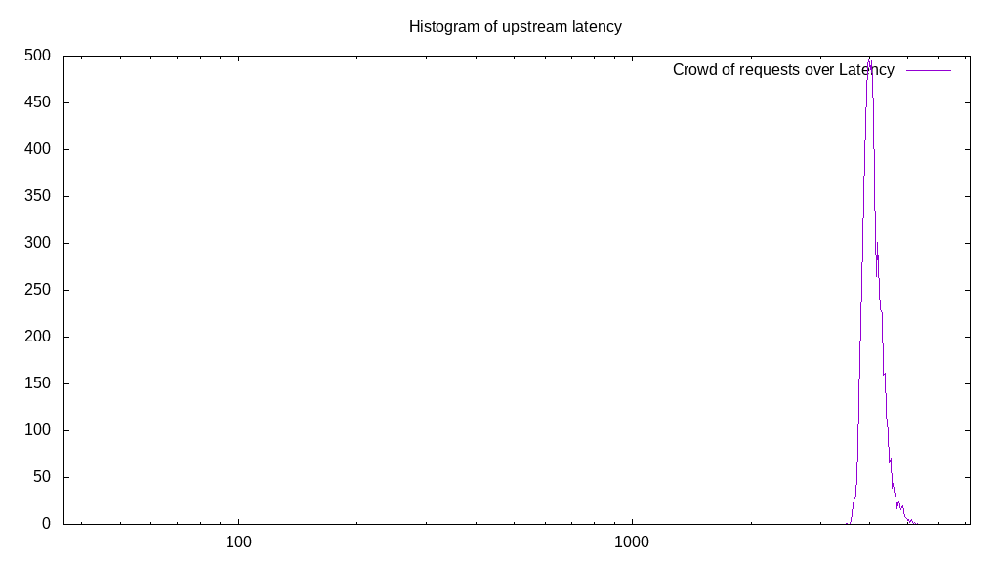

# Latency benchmark report. Crowd is 512

## Populate workload

## Object Size is 1024.00kiB

### PUT Latency in ms over time

Evolution of PUT Latency over time

| Parameter | Value |
| --- | --- |
| Y Coordinate | PUT Latency in ms |
| X Coordinate | time in s since begining of workload |

### PUT Latency distribution in ms

Distribution of the PUT Latency in ms

| Parameter | Value |
| --- | --- |
| Y Coordinate | Number of PUT |
| X Coordinate | Latency in ms |
| Server volume | 38268.000MiB|
| Server bandwidth | 127.572MiB/s |
| Server time | 299.97s |
| Server load | 508.09 |
| Server responses | 38268PUT |
| Server IOps | 127.57PUT/s |
| Client bandwidth | 0.249MiB/s |
| Client volume | 74.742MiB|
| Client time | 152411.15s |
| Client IOps |  0.25PUT/s  |
| Client Latency | 3982.73ms/PUT |
| Client Limbo | 2.29ms/PUT |
| Crowd time | 153585.15s |
| Crowd efficiency | 99.24% |
| Highest Latency | 6946.73ms |
| 95th percentile Latency | 4486.43ms |
| 68th percentile Latency | 4124.62ms |
| 50th percentile Latency | 4016.08ms |
| 32nd percentile Latency | 3871.36ms |
| 5th percentile Latency | 3581.91ms |
| Lowest Latency | 2098.49ms |

## Read workload

## Object Size is 1024.00kiB

### GET Latency in ms over time

Evolution of GET Latency over time

| Parameter | Value |
| --- | --- |
| Y Coordinate | GET Latency in ms |
| X Coordinate | time in s since begining of workload |

### GET Latency distribution in ms

Distribution of the GET Latency in ms

| Parameter | Value |
| --- | --- |
| Y Coordinate | Number of GET |
| X Coordinate | Latency in ms |
| Server volume | 15401.000MiB|
| Server bandwidth | 147.870MiB/s |
| Server time | 104.15s |
| Server load | 475.84 |
| Server responses | 15401GET |
| Server IOps | 147.87GET/s |
| Client bandwidth | 0.289MiB/s |
| Client volume | 30.080MiB|
| Client time | 49559.41s |
| Client IOps |  0.31GET/s  |
| Client Latency | 3217.93ms/GET |
| Client Limbo | 7.36ms/GET |
| Crowd time | 53325.82s |
| Crowd efficiency | 92.94% |
| Highest Latency | 3907.54ms |
| 95th percentile Latency | 3545.73ms |
| 68th percentile Latency | 3328.64ms |
| 50th percentile Latency | 3256.28ms |
| 32nd percentile Latency | 3183.92ms |
| 5th percentile Latency | 2966.83ms |
| Lowest Latency | 2641.21ms |

## Mixed workload

## Object Size is 1024.00kiB

### PUT Latency in ms over time

Evolution of PUT Latency over time

| Parameter | Value |
| --- | --- |
| Y Coordinate | PUT Latency in ms |
| X Coordinate | time in s since begining of workload |

### GET Latency in ms over time

Evolution of GET Latency over time

| Parameter | Value |
| --- | --- |
| Y Coordinate | GET Latency in ms |
| X Coordinate | time in s since begining of workload |

### PUT Latency distribution in ms

Distribution of the PUT Latency in ms

| Parameter | Value |
| --- | --- |
| Y Coordinate | Number of PUT |
| X Coordinate | Latency in ms |
| Server volume | 6587.000MiB|
| Server bandwidth | 63.693MiB/s |
| Server time | 103.42s |
| Server load | 260.59 |
| Server responses | 6587PUT |
| Server IOps | 63.69PUT/s |
| Client bandwidth | 0.124MiB/s |
| Client volume | 12.865MiB|
| Client time | 26949.47s |
| Client IOps |  0.24PUT/s  |
| Client Latency | 4091.31ms/PUT |
| Client Limbo | 50.78ms/PUT |
| Crowd time | 52950.02s |
| Crowd efficiency | 50.90% |
| Highest Latency | 5282.41ms |
| 95th percentile Latency | 4558.79ms |
| 68th percentile Latency | 4196.98ms |
| 50th percentile Latency | 4088.44ms |
| 32nd percentile Latency | 4016.08ms |
| 5th percentile Latency | 3835.18ms |
| Lowest Latency | 3509.55ms |

### GET Latency distribution in ms

Distribution of the GET Latency in ms

| Parameter | Value |
| --- | --- |
| Y Coordinate | Number of GET |
| X Coordinate | Latency in ms |
| Server volume | 7074.000MiB|
| Server bandwidth | 68.402MiB/s |
| Server time | 103.42s |
| Server load | 233.54 |
| Server responses | 7074GET |
| Server IOps | 68.40GET/s |
| Client bandwidth | 0.134MiB/s |
| Client volume | 13.816MiB|
| Client time | 24152.11s |
| Client IOps |  0.29GET/s  |
| Client Latency | 3414.21ms/GET |
| Client Limbo | 56.25ms/GET |
| Crowd time | 52950.02s |
| Crowd efficiency | 45.61% |
| Highest Latency | 6440.20ms |
| 95th percentile Latency | 3762.81ms |
| 68th percentile Latency | 3509.55ms |
| 50th percentile Latency | 3437.19ms |
| 32nd percentile Latency | 3364.82ms |
| 5th percentile Latency | 3220.10ms |
| Lowest Latency | 2966.83ms |

## Cleanup workload

## Object Size is 1024.00kiB

### DELETE Latency in ms over time

Evolution of DELETE Latency over time

| Parameter | Value |
| --- | --- |
| Y Coordinate | DELETE Latency in ms |
| X Coordinate | time in s since begining of workload |

### DELETE Latency distribution in ms

Distribution of the DELETE Latency in ms

| Parameter | Value |
| --- | --- |
| Y Coordinate | Number of DELETE |
| X Coordinate | Latency in ms |
| Server volume | 38276.000MiB|
| Server bandwidth | 612.073MiB/s |
| Server time | 62.53s |
| Server load | 460.63 |
| Server responses | 38276DELETE |
| Server IOps | 612.07DELETE/s |
| Client bandwidth | 1.195MiB/s |
| Client volume | 74.758MiB|
| Client time | 28805.68s |
| Client IOps |  1.33DELETE/s  |
| Client Latency | 752.58ms/DELETE |
| Client Limbo | 6.27ms/DELETE |
| Crowd time | 32017.92s |
| Crowd efficiency | 89.97% |
| Highest Latency | 3075.38ms |
| 95th percentile Latency | 1374.87ms |
| 68th percentile Latency | 940.70ms |
| 50th percentile Latency | 759.80ms |
| 32nd percentile Latency | 615.08ms |
| 5th percentile Latency | 217.09ms |
| Lowest Latency | 36.18ms |

