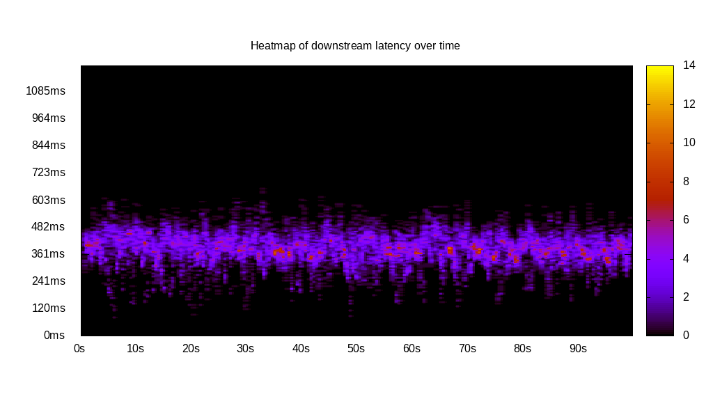
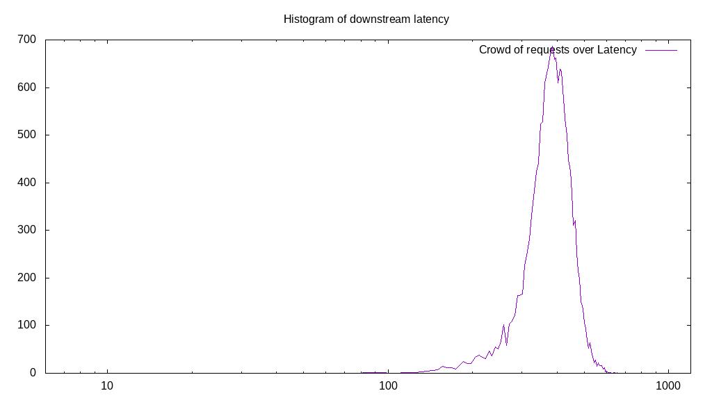
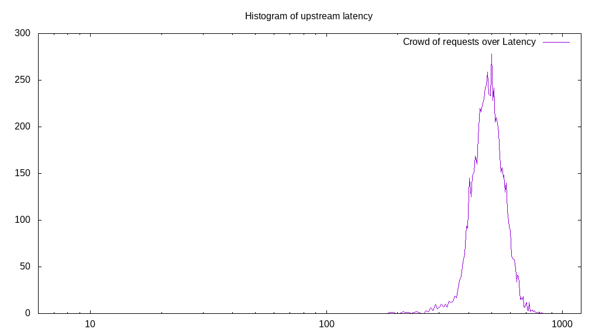
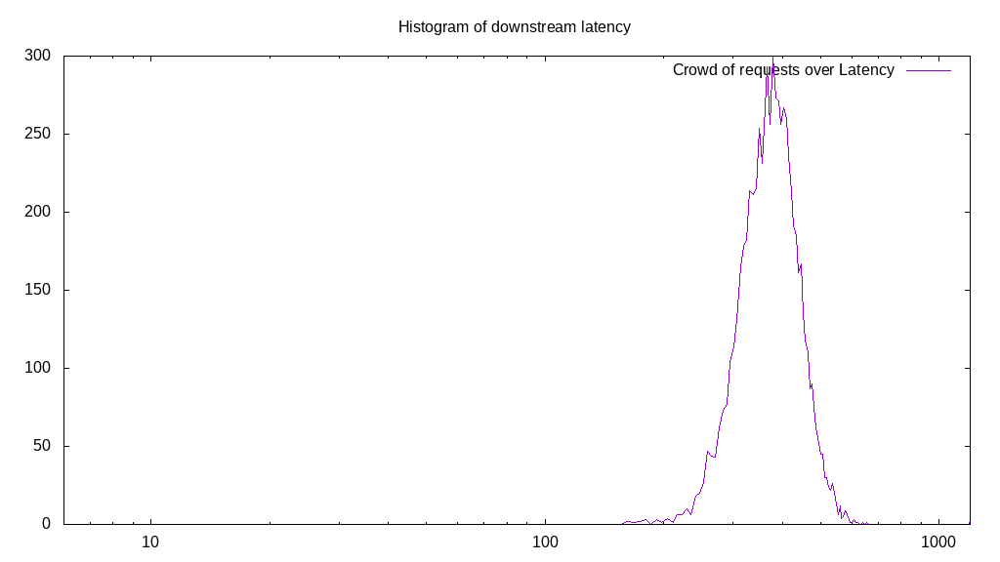
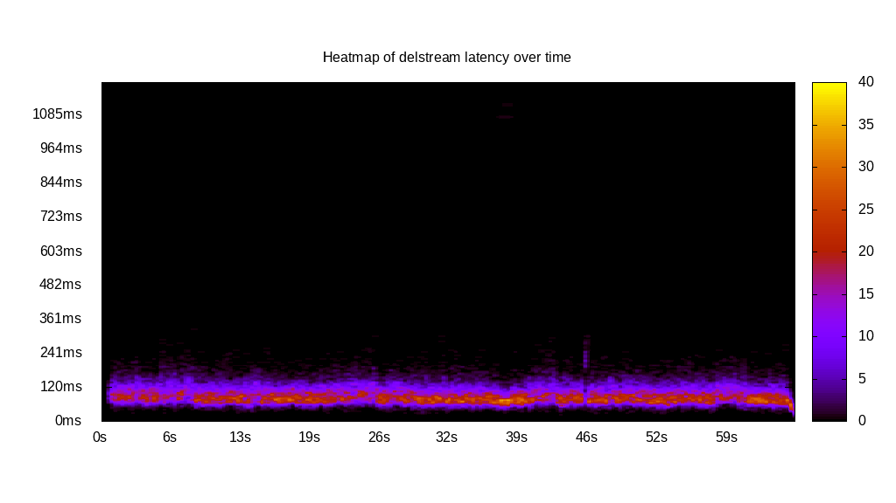

# Latency benchmark report. Crowd is 64

## Populate workload

## Object Size is 1024.00kiB

### PUT Latency in ms over time

Evolution of PUT Latency over time

| Parameter | Value |
| --- | --- |
| Y Coordinate | PUT Latency in ms |
| X Coordinate | time in s since begining of workload |

### PUT Latency distribution in ms

Distribution of the PUT Latency in ms

| Parameter | Value |
| --- | --- |
| Y Coordinate | Number of PUT |
| X Coordinate | Latency in ms |
| Server volume | 43009.000MiB|
| Server bandwidth | 143.375MiB/s |
| Server time | 299.98s |
| Server load | 63.90 |
| Server responses | 43009PUT |
| Server IOps | 143.38PUT/s |
| Client bandwidth | 2.240MiB/s |
| Client volume | 672.016MiB|
| Client time | 19167.53s |
| Client IOps |  2.24PUT/s  |
| Client Latency | 445.66ms/PUT |
| Client Limbo | 0.48ms/PUT |
| Crowd time | 19198.40s |
| Crowd efficiency | 99.84% |
| Highest Latency | 892.46ms |
| 95th percentile Latency | 584.92ms |
| 68th percentile Latency | 482.41ms |
| 50th percentile Latency | 446.23ms |
| 32nd percentile Latency | 416.08ms |
| 5th percentile Latency | 325.63ms |
| Lowest Latency | 144.72ms |

## Read workload

## Object Size is 1024.00kiB

### GET Latency in ms over time

Evolution of GET Latency over time

| Parameter | Value |
| --- | --- |
| Y Coordinate | GET Latency in ms |
| X Coordinate | time in s since begining of workload |

### GET Latency distribution in ms

Distribution of the GET Latency in ms

| Parameter | Value |
| --- | --- |
| Y Coordinate | Number of GET |
| X Coordinate | Latency in ms |
| Server volume | 16434.000MiB|
| Server bandwidth | 163.728MiB/s |
| Server time | 100.37s |
| Server load | 63.46 |
| Server responses | 16434GET |
| Server IOps | 163.73GET/s |
| Client bandwidth | 2.558MiB/s |
| Client volume | 256.781MiB|
| Client time | 6369.93s |
| Client IOps |  2.58GET/s  |
| Client Latency | 387.61ms/GET |
| Client Limbo | 0.84ms/GET |
| Crowd time | 6423.94s |
| Crowd efficiency | 99.16% |
| Highest Latency | 657.29ms |
| 95th percentile Latency | 494.47ms |
| 68th percentile Latency | 422.11ms |
| 50th percentile Latency | 397.99ms |
| 32nd percentile Latency | 367.84ms |
| 5th percentile Latency | 283.42ms |
| Lowest Latency | 84.42ms |

## Mixed workload

## Object Size is 1024.00kiB

### PUT Latency in ms over time

Evolution of PUT Latency over time

| Parameter | Value |
| --- | --- |
| Y Coordinate | PUT Latency in ms |
| X Coordinate | time in s since begining of workload |

### GET Latency in ms over time

Evolution of GET Latency over time

| Parameter | Value |
| --- | --- |
| Y Coordinate | GET Latency in ms |
| X Coordinate | time in s since begining of workload |

### PUT Latency distribution in ms

Distribution of the PUT Latency in ms

| Parameter | Value |
| --- | --- |
| Y Coordinate | Number of PUT |
| X Coordinate | Latency in ms |
| Server volume | 7318.000MiB|
| Server bandwidth | 72.918MiB/s |
| Server time | 100.36s |
| Server load | 36.38 |
| Server responses | 7318PUT |
| Server IOps | 72.92PUT/s |
| Client bandwidth | 1.139MiB/s |
| Client volume | 114.344MiB|
| Client time | 3650.81s |
| Client IOps |  2.00PUT/s  |
| Client Latency | 498.88ms/PUT |
| Client Limbo | 43.32ms/PUT |
| Crowd time | 6422.98s |
| Crowd efficiency | 56.84% |
| Highest Latency | 820.10ms |
| 95th percentile Latency | 633.17ms |
| 68th percentile Latency | 536.68ms |
| 50th percentile Latency | 500.50ms |
| 32nd percentile Latency | 470.35ms |
| 5th percentile Latency | 391.96ms |
| Lowest Latency | 186.93ms |

### GET Latency distribution in ms

Distribution of the GET Latency in ms

| Parameter | Value |
| --- | --- |
| Y Coordinate | Number of GET |
| X Coordinate | Latency in ms |
| Server volume | 7092.000MiB|
| Server bandwidth | 70.666MiB/s |
| Server time | 100.36s |
| Server load | 27.30 |
| Server responses | 7092GET |
| Server IOps | 70.67GET/s |
| Client bandwidth | 1.104MiB/s |
| Client volume | 110.813MiB|
| Client time | 2739.63s |
| Client IOps |  2.59GET/s  |
| Client Latency | 386.30ms/GET |
| Client Limbo | 57.55ms/GET |
| Crowd time | 6422.98s |
| Crowd efficiency | 42.65% |
| Highest Latency | 1200.00ms |
| 95th percentile Latency | 500.50ms |
| 68th percentile Latency | 416.08ms |
| 50th percentile Latency | 385.93ms |
| 32nd percentile Latency | 361.81ms |
| 5th percentile Latency | 289.45ms |
| Lowest Latency | 162.81ms |

## Cleanup workload

## Object Size is 1024.00kiB

### DELETE Latency in ms over time

Evolution of DELETE Latency over time

| Parameter | Value |
| --- | --- |
| Y Coordinate | DELETE Latency in ms |
| X Coordinate | time in s since begining of workload |

### DELETE Latency distribution in ms

Distribution of the DELETE Latency in ms

| Parameter | Value |
| --- | --- |
| Y Coordinate | Number of DELETE |
| X Coordinate | Latency in ms |
| Server volume | 43017.000MiB|
| Server bandwidth | 655.407MiB/s |
| Server time | 65.63s |
| Server load | 62.82 |
| Server responses | 43017DELETE |
| Server IOps | 655.41DELETE/s |
| Client bandwidth | 10.241MiB/s |
| Client volume | 672.141MiB|
| Client time | 4123.18s |
| Client IOps |  10.43DELETE/s  |
| Client Latency | 95.85ms/DELETE |
| Client Limbo | 1.21ms/DELETE |
| Crowd time | 4200.58s |
| Crowd efficiency | 98.16% |
| Highest Latency | 1127.64ms |
| 95th percentile Latency | 156.78ms |
| 68th percentile Latency | 108.54ms |
| 50th percentile Latency | 96.48ms |
| 32nd percentile Latency | 84.42ms |
| 5th percentile Latency | 60.30ms |
| Lowest Latency | 18.09ms |

