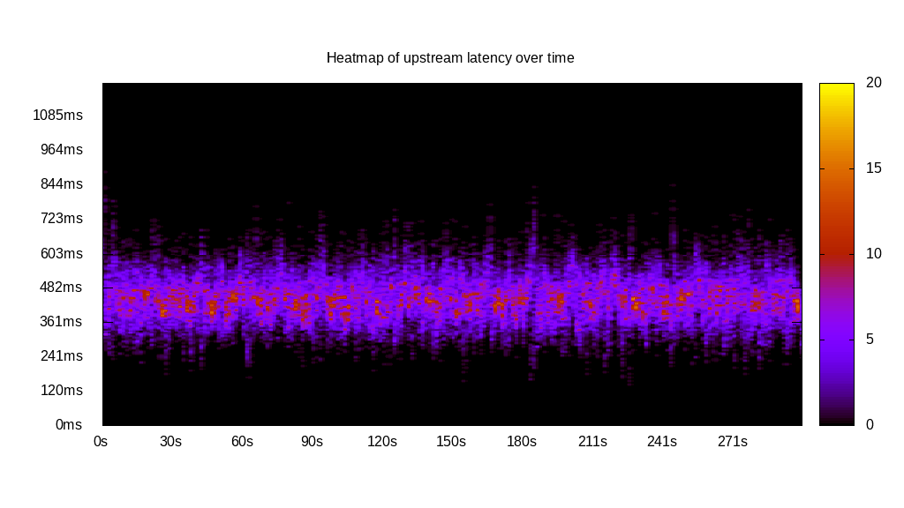
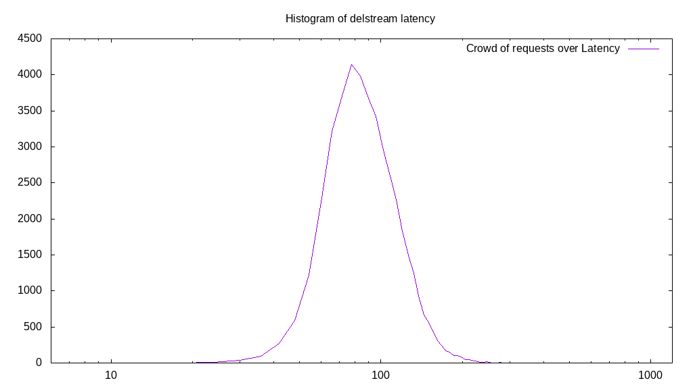

# Latency benchmark report. Crowd is 64

## Populate workload

## Object Size is 1024.00kiB

### PUT Latency in ms over time

Evolution of PUT Latency over time

| Parameter | Value |
| --- | --- |
| Y Coordinate | PUT Latency in ms |
| X Coordinate | time in s since begining of workload |

### PUT Latency distribution in ms

Distribution of the PUT Latency in ms

| Parameter | Value |
| --- | --- |
| Y Coordinate | Number of PUT |
| X Coordinate | Latency in ms |
| Server volume | 43009.000MiB|
| Server bandwidth | 143.375MiB/s |
| Server time | 299.98s |
| Server load | 63.90 |
| Server responses | 43009PUT |
| Server IOps | 143.38PUT/s |
| Client bandwidth | 2.240MiB/s |
| Client volume | 672.016MiB|
| Client time | 19167.53s |
| Client IOps |  2.24PUT/s  |
| Client Latency | 445.66ms/PUT |
| Client Limbo | 0.48ms/PUT |
| Crowd time | 19198.40s |
| Crowd efficiency | 99.84% |
| Highest Latency | 905.13ms |
| 95th percentile Latency | 603.42ms |
| 68th percentile Latency | 527.99ms |
| 50th percentile Latency | 490.28ms |
| 32nd percentile Latency | 452.56ms |
| 5th percentile Latency | 377.14ms |
| Lowest Latency | 150.85ms |

## Read workload

## Object Size is 1024.00kiB

### GET Latency in ms over time

Evolution of GET Latency over time

| Parameter | Value |
| --- | --- |
| Y Coordinate | GET Latency in ms |
| X Coordinate | time in s since begining of workload |

### GET Latency distribution in ms

Distribution of the GET Latency in ms

| Parameter | Value |
| --- | --- |
| Y Coordinate | Number of GET |
| X Coordinate | Latency in ms |
| Server volume | 0.000MiB|
| Server bandwidth | 0.000MiB/s |
| Server time | 100.37s |
| Server load | 0.00 |
| Server responses | 0GET |
| Server IOps | 0.00GET/s |
| Client bandwidth | 0.000MiB/s |
| Client volume | 0.000MiB|
| Client time | 0.00s |
| Client IOps |  NaNGET/s  |
| Client Latency | NaNms/GET |
| Client Limbo | 100.37ms/GET |
| Crowd time | 6423.94s |
| Crowd efficiency | 0.00% |
| Highest Latency | 0.00ms |
| 95th percentile Latency | 0.00ms |
| 68th percentile Latency | 0.00ms |
| 50th percentile Latency | 0.00ms |
| 32nd percentile Latency | 0.00ms |
| 5th percentile Latency | 0.00ms |
| Lowest Latency | 0.00ms |

## Mixed workload

## Object Size is 1024.00kiB

### PUT Latency in ms over time

Evolution of PUT Latency over time

| Parameter | Value |
| --- | --- |
| Y Coordinate | PUT Latency in ms |
| X Coordinate | time in s since begining of workload |

### GET Latency in ms over time

Evolution of GET Latency over time

| Parameter | Value |
| --- | --- |
| Y Coordinate | GET Latency in ms |
| X Coordinate | time in s since begining of workload |

### PUT Latency distribution in ms

Distribution of the PUT Latency in ms

| Parameter | Value |
| --- | --- |
| Y Coordinate | Number of PUT |
| X Coordinate | Latency in ms |
| Server volume | 7318.000MiB|
| Server bandwidth | 72.918MiB/s |
| Server time | 100.36s |
| Server load | 36.38 |
| Server responses | 7318PUT |
| Server IOps | 72.92PUT/s |
| Client bandwidth | 1.139MiB/s |
| Client volume | 114.344MiB|
| Client time | 3650.81s |
| Client IOps |  2.00PUT/s  |
| Client Latency | 498.88ms/PUT |
| Client Limbo | 43.32ms/PUT |
| Crowd time | 6422.98s |
| Crowd efficiency | 56.84% |
| Highest Latency | 829.70ms |
| 95th percentile Latency | 678.84ms |
| 68th percentile Latency | 565.70ms |
| 50th percentile Latency | 527.99ms |
| 32nd percentile Latency | 490.28ms |
| 5th percentile Latency | 414.85ms |
| Lowest Latency | 188.57ms |

### GET Latency distribution in ms

Distribution of the GET Latency in ms

| Parameter | Value |
| --- | --- |
| Y Coordinate | Number of GET |
| X Coordinate | Latency in ms |
| Server volume | 0.000MiB|
| Server bandwidth | 0.000MiB/s |
| Server time | 100.36s |
| Server load | 0.00 |
| Server responses | 0GET |
| Server IOps | 0.00GET/s |
| Client bandwidth | 0.000MiB/s |
| Client volume | 0.000MiB|
| Client time | 0.00s |
| Client IOps |  NaNGET/s  |
| Client Latency | NaNms/GET |
| Client Limbo | 100.36ms/GET |
| Crowd time | 6422.98s |
| Crowd efficiency | 0.00% |
| Highest Latency | 0.00ms |
| 95th percentile Latency | 0.00ms |
| 68th percentile Latency | 0.00ms |
| 50th percentile Latency | 0.00ms |
| 32nd percentile Latency | 0.00ms |
| 5th percentile Latency | 0.00ms |
| Lowest Latency | 0.00ms |

## Cleanup workload

## Object Size is 1024.00kiB

### DELETE Latency in ms over time

Evolution of DELETE Latency over time

| Parameter | Value |
| --- | --- |
| Y Coordinate | DELETE Latency in ms |
| X Coordinate | time in s since begining of workload |

### DELETE Latency distribution in ms

Distribution of the DELETE Latency in ms

| Parameter | Value |
| --- | --- |
| Y Coordinate | Number of DELETE |
| X Coordinate | Latency in ms |
| Server volume | 43017.000MiB|
| Server bandwidth | 655.407MiB/s |
| Server time | 65.63s |
| Server load | 62.82 |
| Server responses | 43017DELETE |
| Server IOps | 655.41DELETE/s |
| Client bandwidth | 10.241MiB/s |
| Client volume | 672.141MiB|
| Client time | 4123.18s |
| Client IOps |  10.43DELETE/s  |
| Client Latency | 95.85ms/DELETE |
| Client Limbo | 1.21ms/DELETE |
| Crowd time | 4200.58s |
| Crowd efficiency | 98.16% |
| Highest Latency | 1131.41ms |
| 95th percentile Latency | 188.57ms |
| 68th percentile Latency | 150.85ms |
| 50th percentile Latency | 113.14ms |
| 32nd percentile Latency | 113.14ms |
| 5th percentile Latency | 113.14ms |
| Lowest Latency | 37.71ms |

