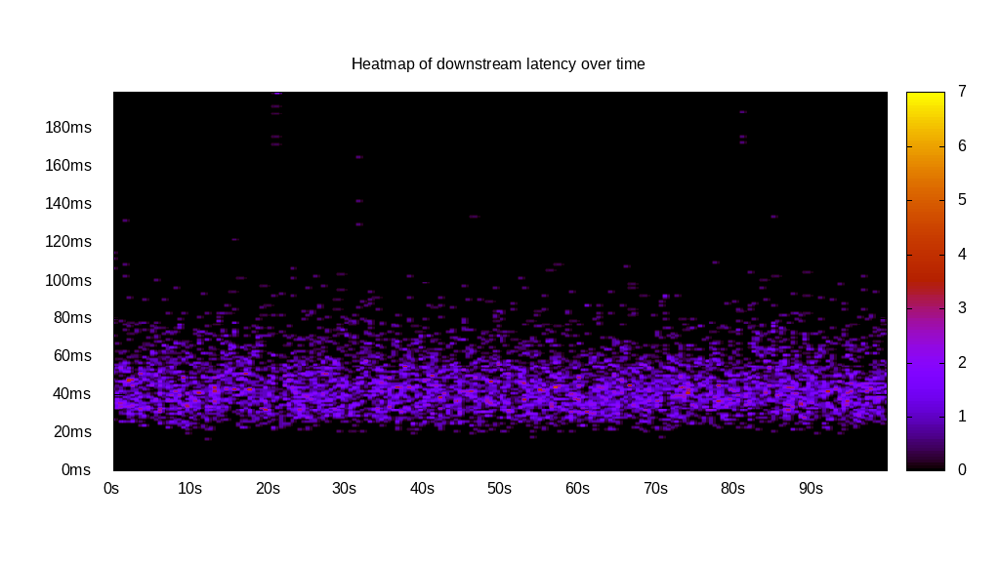
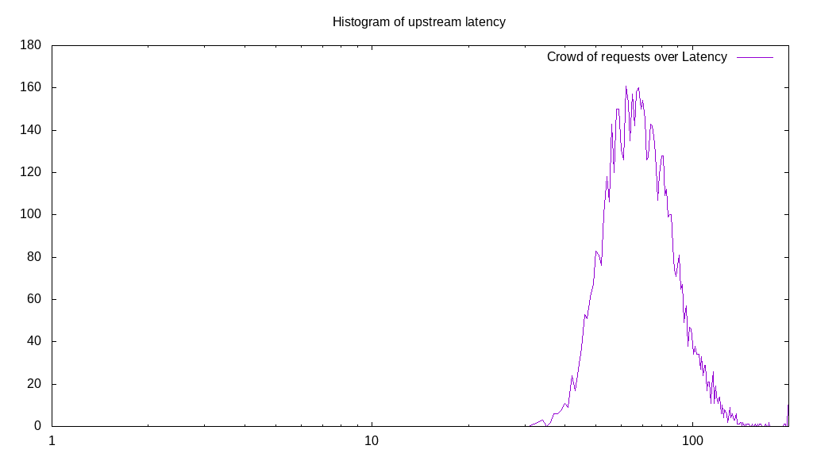
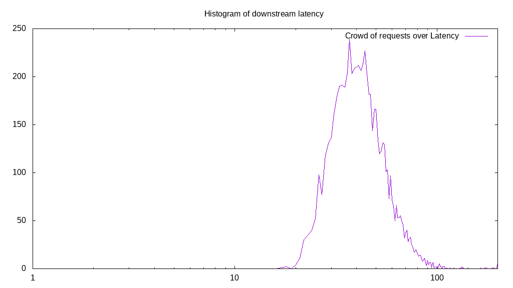
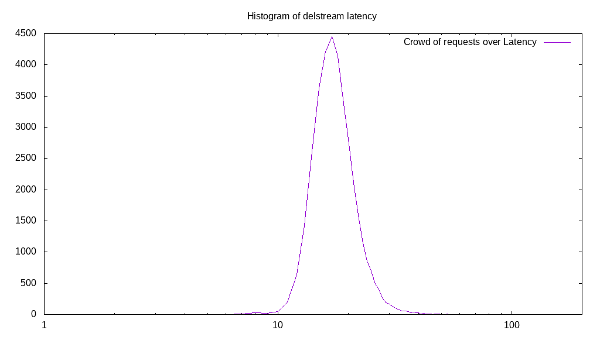

# Latency benchmark report. Crowd is 8

## Populate workload

## Object Size is 1024.00kiB

### PUT Latency in ms over time

Evolution of PUT Latency over time

| Parameter | Value |
| --- | --- |
| Y Coordinate | PUT Latency in ms |
| X Coordinate | time in s since begining of workload |

### PUT Latency distribution in ms

Distribution of the PUT Latency in ms

| Parameter | Value |
| --- | --- |
| Y Coordinate | Number of PUT |
| X Coordinate | Latency in ms |
| Server volume | 36290.000MiB|
| Server bandwidth | 120.980MiB/s |
| Server time | 299.97s |
| Server load | 7.97 |
| Server responses | 36290PUT |
| Server IOps | 120.98PUT/s |
| Client bandwidth | 15.123MiB/s |
| Client volume | 4536.250MiB|
| Client time | 2391.96s |
| Client IOps |  15.17PUT/s  |
| Client Latency | 65.91ms/PUT |
| Client Limbo | 0.97ms/PUT |
| Crowd time | 2399.73s |
| Crowd efficiency | 99.68% |
| Highest Latency | 200.00ms |
| 95th percentile Latency | 98.49ms |
| 68th percentile Latency | 72.36ms |
| 50th percentile Latency | 64.32ms |
| 32nd percentile Latency | 57.29ms |
| 5th percentile Latency | 44.22ms |
| Lowest Latency | 24.12ms |

## Read workload

## Object Size is 1024.00kiB

### GET Latency in ms over time

Evolution of GET Latency over time

| Parameter | Value |
| --- | --- |
| Y Coordinate | GET Latency in ms |
| X Coordinate | time in s since begining of workload |

### GET Latency distribution in ms

Distribution of the GET Latency in ms

| Parameter | Value |
| --- | --- |
| Y Coordinate | Number of GET |
| X Coordinate | Latency in ms |
| Server volume | 15654.000MiB|
| Server bandwidth | 156.409MiB/s |
| Server time | 100.08s |
| Server load | 7.95 |
| Server responses | 15654GET |
| Server IOps | 156.41GET/s |
| Client bandwidth | 19.551MiB/s |
| Client volume | 1956.750MiB|
| Client time | 795.86s |
| Client IOps |  19.67GET/s  |
| Client Latency | 50.84ms/GET |
| Client Limbo | 0.60ms/GET |
| Crowd time | 800.67s |
| Crowd efficiency | 99.40% |
| Highest Latency | 200.00ms |
| 95th percentile Latency | 79.40ms |
| 68th percentile Latency | 56.28ms |
| 50th percentile Latency | 49.25ms |
| 32nd percentile Latency | 43.22ms |
| 5th percentile Latency | 32.16ms |
| Lowest Latency | 19.10ms |

## Mixed workload

## Object Size is 1024.00kiB

### PUT Latency in ms over time

Evolution of PUT Latency over time

| Parameter | Value |
| --- | --- |
| Y Coordinate | PUT Latency in ms |
| X Coordinate | time in s since begining of workload |

### GET Latency in ms over time

Evolution of GET Latency over time

| Parameter | Value |
| --- | --- |
| Y Coordinate | GET Latency in ms |
| X Coordinate | time in s since begining of workload |

### PUT Latency distribution in ms

Distribution of the PUT Latency in ms

| Parameter | Value |
| --- | --- |
| Y Coordinate | Number of PUT |
| X Coordinate | Latency in ms |
| Server volume | 6562.000MiB|
| Server bandwidth | 65.596MiB/s |
| Server time | 100.04s |
| Server load | 4.91 |
| Server responses | 6562PUT |
| Server IOps | 65.60PUT/s |
| Client bandwidth | 8.199MiB/s |
| Client volume | 820.250MiB|
| Client time | 491.36s |
| Client IOps |  13.35PUT/s  |
| Client Latency | 74.88ms/PUT |
| Client Limbo | 38.62ms/PUT |
| Crowd time | 800.30s |
| Crowd efficiency | 61.40% |
| Highest Latency | 200.00ms |
| 95th percentile Latency | 111.56ms |
| 68th percentile Latency | 82.41ms |
| 50th percentile Latency | 72.36ms |
| 32nd percentile Latency | 65.33ms |
| 5th percentile Latency | 50.25ms |
| Lowest Latency | 32.16ms |

### GET Latency distribution in ms

Distribution of the GET Latency in ms

| Parameter | Value |
| --- | --- |
| Y Coordinate | Number of GET |
| X Coordinate | Latency in ms |
| Server volume | 6620.000MiB|
| Server bandwidth | 66.176MiB/s |
| Server time | 100.04s |
| Server load | 3.06 |
| Server responses | 6620GET |
| Server IOps | 66.18GET/s |
| Client bandwidth | 8.272MiB/s |
| Client volume | 827.500MiB|
| Client time | 305.71s |
| Client IOps |  21.65GET/s  |
| Client Latency | 46.18ms/GET |
| Client Limbo | 61.82ms/GET |
| Crowd time | 800.30s |
| Crowd efficiency | 38.20% |
| Highest Latency | 200.00ms |
| 95th percentile Latency | 74.37ms |
| 68th percentile Latency | 51.26ms |
| 50th percentile Latency | 44.22ms |
| 32nd percentile Latency | 39.20ms |
| 5th percentile Latency | 28.14ms |
| Lowest Latency | 17.09ms |

## Cleanup workload

## Object Size is 1024.00kiB

### DELETE Latency in ms over time

Evolution of DELETE Latency over time

| Parameter | Value |
| --- | --- |
| Y Coordinate | DELETE Latency in ms |
| X Coordinate | time in s since begining of workload |

### DELETE Latency distribution in ms

Distribution of the DELETE Latency in ms

| Parameter | Value |
| --- | --- |
| Y Coordinate | Number of DELETE |
| X Coordinate | Latency in ms |
| Server volume | 36298.000MiB|
| Server bandwidth | 422.453MiB/s |
| Server time | 85.92s |
| Server load | 7.87 |
| Server responses | 36298DELETE |
| Server IOps | 422.45DELETE/s |
| Client bandwidth | 52.807MiB/s |
| Client volume | 4537.250MiB|
| Client time | 676.40s |
| Client IOps |  53.66DELETE/s  |
| Client Latency | 18.63ms/DELETE |
| Client Limbo | 1.37ms/DELETE |
| Crowd time | 687.38s |
| Crowd efficiency | 98.40% |
| Highest Latency | 200.00ms |
| 95th percentile Latency | 27.14ms |
| 68th percentile Latency | 20.10ms |
| 50th percentile Latency | 19.10ms |
| 32nd percentile Latency | 17.09ms |
| 5th percentile Latency | 14.07ms |
| Lowest Latency | 7.04ms |

