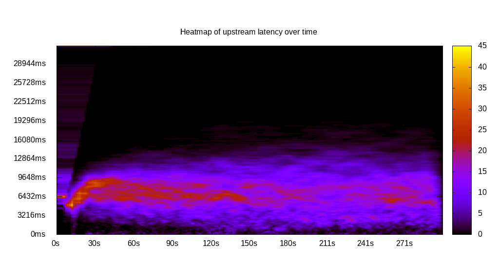
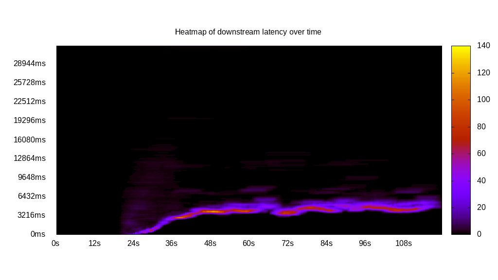
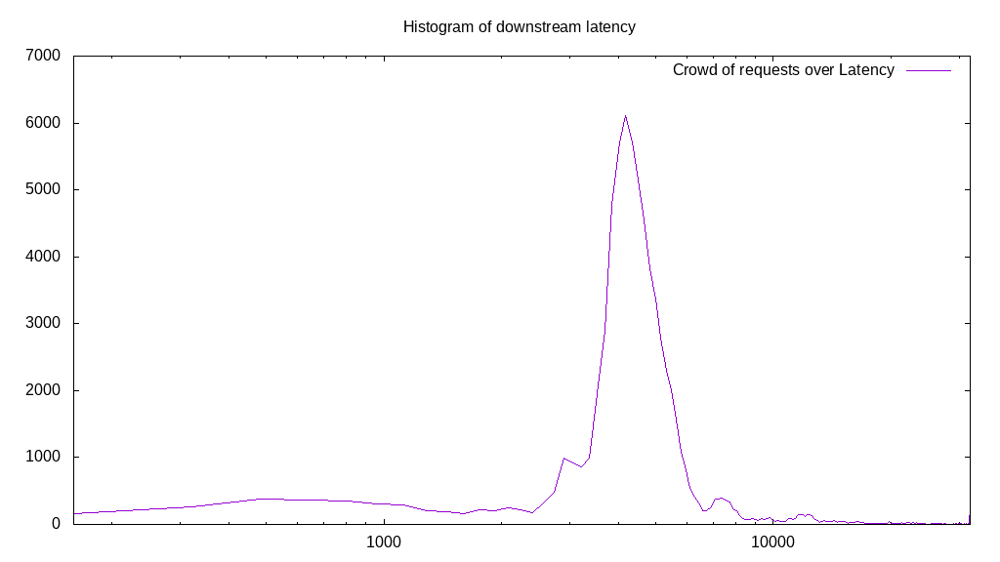
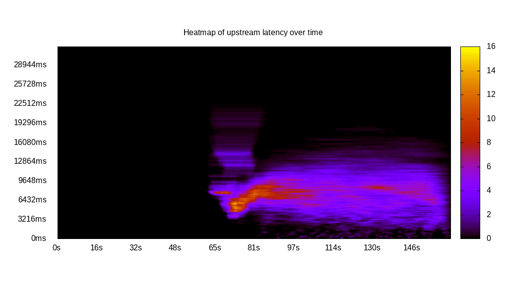
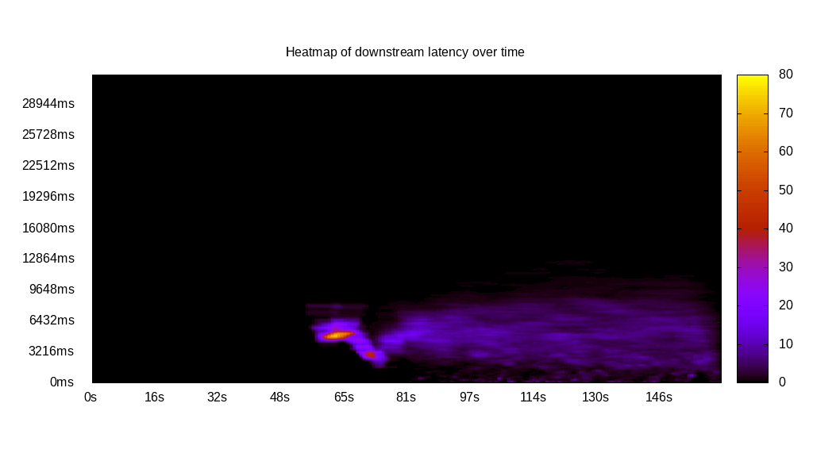
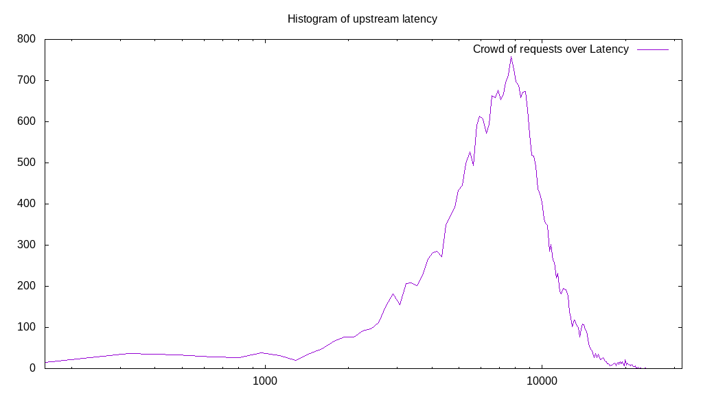
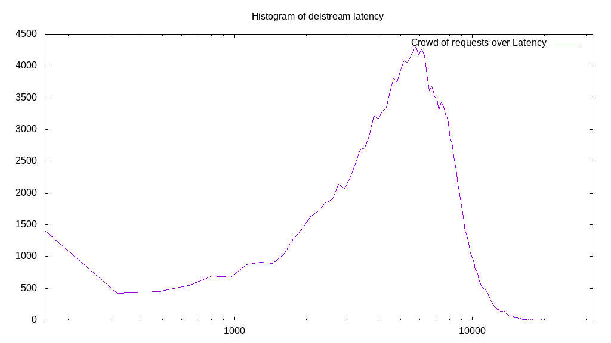

# Latency benchmark report. Crowd is 4096

## Populate workload

## Object Size is 32.00kiB

### PUT Latency in ms over time

Evolution of PUT Latency over time

| Parameter | Value |
| --- | --- |
| Y Coordinate | PUT Latency in ms |
| X Coordinate | time in s since begining of workload |

### PUT Latency distribution in ms

Distribution of the PUT Latency in ms

| Parameter | Value |
| --- | --- |
| Y Coordinate | Number of PUT |
| X Coordinate | Latency in ms |
| Server volume | 5156.719MiB|
| Server bandwidth | 17.189MiB/s |
| Server time | 300.00s |
| Server load | 4027.69 |
| Server responses | 165015PUT |
| Server IOps | 550.06PUT/s |
| Client bandwidth | 0.004MiB/s |
| Client volume | 1.259MiB|
| Client time | 1208289.70s |
| Client IOps |  0.14PUT/s  |
| Client Latency | 7322.30ms/PUT |
| Client Limbo | 5.00ms/PUT |
| Crowd time | 1228783.62s |
| Crowd efficiency | 98.33% |
| Highest Latency | 77492.09ms |
| 95th percentile Latency | 13476.88ms |
| 68th percentile Latency | 9433.82ms |
| 50th percentile Latency | 7412.29ms |
| 32nd percentile Latency | 6064.60ms |
| 5th percentile Latency | 2695.38ms |
| Lowest Latency | 673.84ms |

## Read workload

## Object Size is 32.00kiB

### GET Latency in ms over time

Evolution of GET Latency over time

| Parameter | Value |
| --- | --- |
| Y Coordinate | GET Latency in ms |
| X Coordinate | time in s since begining of workload |

### GET Latency distribution in ms

Distribution of the GET Latency in ms

| Parameter | Value |
| --- | --- |
| Y Coordinate | Number of GET |
| X Coordinate | Latency in ms |
| Server volume | 2262.563MiB|
| Server bandwidth | 18.902MiB/s |
| Server time | 119.70s |
| Server load | 3133.33 |
| Server responses | 72402GET |
| Server IOps | 604.85GET/s |
| Client bandwidth | 0.005MiB/s |
| Client volume | 0.552MiB|
| Client time | 375065.77s |
| Client IOps |  0.19GET/s  |
| Client Latency | 5180.32ms/GET |
| Client Limbo | 28.13ms/GET |
| Crowd time | 490299.39s |
| Crowd efficiency | 76.50% |
| Highest Latency | 86252.06ms |
| 95th percentile Latency | 12129.20ms |
| 68th percentile Latency | 5390.75ms |
| 50th percentile Latency | 5390.75ms |
| 32nd percentile Latency | 4716.91ms |
| 5th percentile Latency | 2695.38ms |
| Lowest Latency | 673.84ms |

## Mixed workload

## Object Size is 32.00kiB

### PUT Latency in ms over time

Evolution of PUT Latency over time

| Parameter | Value |
| --- | --- |
| Y Coordinate | PUT Latency in ms |
| X Coordinate | time in s since begining of workload |

### GET Latency in ms over time

Evolution of GET Latency over time

| Parameter | Value |
| --- | --- |
| Y Coordinate | GET Latency in ms |
| X Coordinate | time in s since begining of workload |

### PUT Latency distribution in ms

Distribution of the PUT Latency in ms

| Parameter | Value |
| --- | --- |
| Y Coordinate | Number of PUT |
| X Coordinate | Latency in ms |
| Server volume | 916.156MiB|
| Server bandwidth | 5.643MiB/s |
| Server time | 162.34s |
| Server load | 1426.35 |
| Server responses | 29317PUT |
| Server IOps | 180.59PUT/s |
| Client bandwidth | 0.001MiB/s |
| Client volume | 0.224MiB|
| Client time | 231559.51s |
| Client IOps |  0.13PUT/s  |
| Client Latency | 7898.47ms/PUT |
| Client Limbo | 105.81ms/PUT |
| Crowd time | 664961.02s |
| Crowd efficiency | 34.82% |
| Highest Latency | 23584.55ms |
| 95th percentile Latency | 14150.73ms |
| 68th percentile Latency | 9433.82ms |
| 50th percentile Latency | 8086.13ms |
| 32nd percentile Latency | 7412.29ms |
| 5th percentile Latency | 4043.07ms |
| Lowest Latency | 673.84ms |

### GET Latency distribution in ms

Distribution of the GET Latency in ms

| Parameter | Value |
| --- | --- |
| Y Coordinate | Number of GET |
| X Coordinate | Latency in ms |
| Server volume | 1071.906MiB|
| Server bandwidth | 6.603MiB/s |
| Server time | 162.34s |
| Server load | 1070.06 |
| Server responses | 34301GET |
| Server IOps | 211.29GET/s |
| Client bandwidth | 0.002MiB/s |
| Client volume | 0.262MiB|
| Client time | 173717.12s |
| Client IOps |  0.20GET/s  |
| Client Latency | 5064.49ms/GET |
| Client Limbo | 119.93ms/GET |
| Crowd time | 664961.02s |
| Crowd efficiency | 26.12% |
| Highest Latency | 134095.00ms |
| 95th percentile Latency | 9433.82ms |
| 68th percentile Latency | 6738.44ms |
| 50th percentile Latency | 5390.75ms |
| 32nd percentile Latency | 4716.91ms |
| 5th percentile Latency | 2021.53ms |
| Lowest Latency | 673.84ms |

## Cleanup workload

## Object Size is 32.00kiB

### DELETE Latency in ms over time

Evolution of DELETE Latency over time

| Parameter | Value |
| --- | --- |
| Y Coordinate | DELETE Latency in ms |
| X Coordinate | time in s since begining of workload |

### DELETE Latency distribution in ms

Distribution of the DELETE Latency in ms

| Parameter | Value |
| --- | --- |
| Y Coordinate | Number of DELETE |
| X Coordinate | Latency in ms |
| Server volume | 5156.813MiB|
| Server bandwidth | 19.322MiB/s |
| Server time | 266.88s |
| Server load | 3637.90 |
| Server responses | 165018DELETE |
| Server IOps | 618.31DELETE/s |
| Client bandwidth | 0.005MiB/s |
| Client volume | 1.259MiB|
| Client time | 970900.44s |
| Client IOps |  0.17DELETE/s  |
| Client Latency | 5883.60ms/DELETE |
| Client Limbo | 29.85ms/DELETE |
| Crowd time | 1093160.96s |
| Crowd efficiency | 88.82% |
| Highest Latency | 22236.86ms |
| 95th percentile Latency | 10781.51ms |
| 68th percentile Latency | 7412.29ms |
| 50th percentile Latency | 6738.44ms |
| 32nd percentile Latency | 5390.75ms |
| 5th percentile Latency | 2695.38ms |
| Lowest Latency | 673.84ms |

