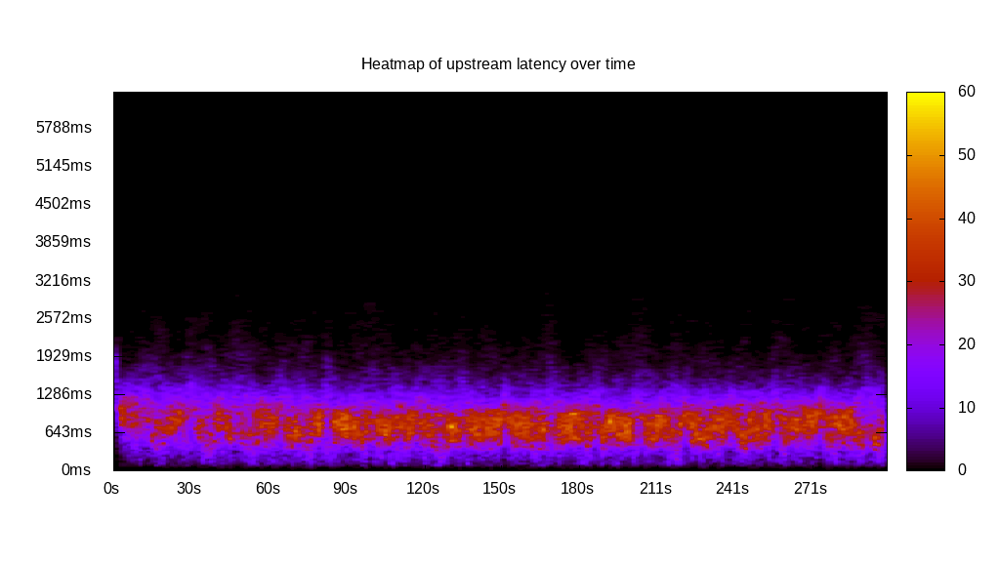
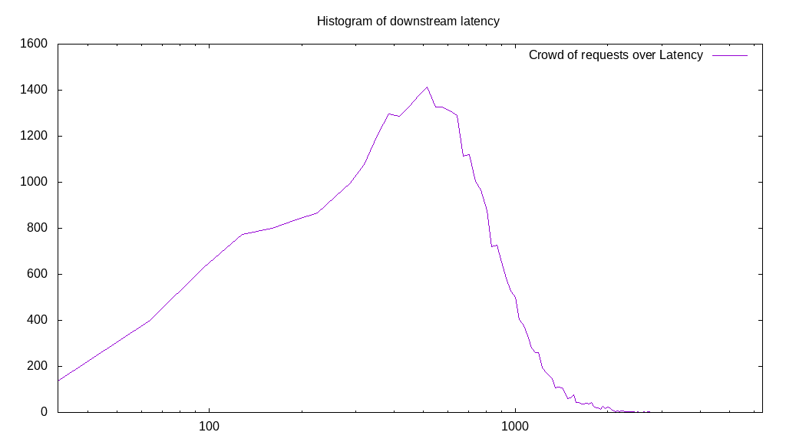

# Latency benchmark report. Crowd is 512

## Populate workload

## Object Size is 32.00kiB

### PUT Latency in ms over time

Evolution of PUT Latency over time

| Parameter | Value |
| --- | --- |
| Y Coordinate | PUT Latency in ms |
| X Coordinate | time in s since begining of workload |

### PUT Latency distribution in ms

Distribution of the PUT Latency in ms

| Parameter | Value |
| --- | --- |
| Y Coordinate | Number of PUT |
| X Coordinate | Latency in ms |
| Server volume | 5621.156MiB|
| Server bandwidth | 18.737MiB/s |
| Server time | 300.00s |
| Server load | 510.78 |
| Server responses | 179877PUT |
| Server IOps | 599.59PUT/s |
| Client bandwidth | 0.037MiB/s |
| Client volume | 10.979MiB|
| Client time | 153233.22s |
| Client IOps |  1.17PUT/s  |
| Client Latency | 851.88ms/PUT |
| Client Limbo | 0.72ms/PUT |
| Crowd time | 153599.49s |
| Crowd efficiency | 99.76% |
| Highest Latency | 3569.85ms |
| 95th percentile Latency | 1575.88ms |
| 68th percentile Latency | 1029.15ms |
| 50th percentile Latency | 836.18ms |
| 32nd percentile Latency | 675.38ms |
| 5th percentile Latency | 289.45ms |
| Lowest Latency | 32.16ms |

## Read workload

## Object Size is 32.00kiB

### GET Latency in ms over time

Evolution of GET Latency over time

| Parameter | Value |
| --- | --- |
| Y Coordinate | GET Latency in ms |
| X Coordinate | time in s since begining of workload |

### GET Latency distribution in ms

Distribution of the GET Latency in ms

| Parameter | Value |
| --- | --- |
| Y Coordinate | Number of GET |
| X Coordinate | Latency in ms |
| Server volume | 2561.688MiB|
| Server bandwidth | 25.045MiB/s |
| Server time | 102.28s |
| Server load | 495.16 |
| Server responses | 81974GET |
| Server IOps | 801.44GET/s |
| Client bandwidth | 0.049MiB/s |
| Client volume | 5.003MiB|
| Client time | 50647.11s |
| Client IOps |  1.62GET/s  |
| Client Latency | 617.84ms/GET |
| Client Limbo | 3.36ms/GET |
| Crowd time | 52369.41s |
| Crowd efficiency | 96.71% |
| Highest Latency | 2444.22ms |
| 95th percentile Latency | 900.50ms |
| 68th percentile Latency | 675.38ms |
| 50th percentile Latency | 611.06ms |
| 32nd percentile Latency | 578.89ms |
| 5th percentile Latency | 418.09ms |
| Lowest Latency | 32.16ms |

## Mixed workload

## Object Size is 32.00kiB

### PUT Latency in ms over time

Evolution of PUT Latency over time

| Parameter | Value |
| --- | --- |
| Y Coordinate | PUT Latency in ms |
| X Coordinate | time in s since begining of workload |

### GET Latency in ms over time

Evolution of GET Latency over time

| Parameter | Value |
| --- | --- |
| Y Coordinate | GET Latency in ms |
| X Coordinate | time in s since begining of workload |

### PUT Latency distribution in ms

Distribution of the PUT Latency in ms

| Parameter | Value |
| --- | --- |
| Y Coordinate | Number of PUT |
| X Coordinate | Latency in ms |
| Server volume | 1007.250MiB|
| Server bandwidth | 9.986MiB/s |
| Server time | 100.87s |
| Server load | 308.47 |
| Server responses | 32232PUT |
| Server IOps | 319.54PUT/s |
| Client bandwidth | 0.020MiB/s |
| Client volume | 1.967MiB|
| Client time | 31114.93s |
| Client IOps |  1.04PUT/s  |
| Client Latency | 965.34ms/PUT |
| Client Limbo | 40.10ms/PUT |
| Crowd time | 51645.44s |
| Crowd efficiency | 60.25% |
| Highest Latency | 3794.97ms |
| 95th percentile Latency | 1736.68ms |
| 68th percentile Latency | 1125.63ms |
| 50th percentile Latency | 932.66ms |
| 32nd percentile Latency | 771.86ms |
| 5th percentile Latency | 418.09ms |
| Lowest Latency | 96.48ms |

### GET Latency distribution in ms

Distribution of the GET Latency in ms

| Parameter | Value |
| --- | --- |
| Y Coordinate | Number of GET |
| X Coordinate | Latency in ms |
| Server volume | 1035.406MiB|
| Server bandwidth | 10.265MiB/s |
| Server time | 100.87s |
| Server load | 198.66 |
| Server responses | 33133GET |
| Server IOps | 328.47GET/s |
| Client bandwidth | 0.020MiB/s |
| Client volume | 2.022MiB|
| Client time | 20039.26s |
| Client IOps |  1.65GET/s  |
| Client Latency | 604.81ms/GET |
| Client Limbo | 61.73ms/GET |
| Crowd time | 51645.44s |
| Crowd efficiency | 38.80% |
| Highest Latency | 4148.74ms |
| 95th percentile Latency | 1254.27ms |
| 68th percentile Latency | 739.70ms |
| 50th percentile Latency | 578.89ms |
| 32nd percentile Latency | 450.25ms |
| 5th percentile Latency | 160.80ms |
| Lowest Latency | 32.16ms |

## Cleanup workload

## Object Size is 32.00kiB

### DELETE Latency in ms over time

Evolution of DELETE Latency over time

| Parameter | Value |
| --- | --- |
| Y Coordinate | DELETE Latency in ms |
| X Coordinate | time in s since begining of workload |

### DELETE Latency distribution in ms

Distribution of the DELETE Latency in ms

| Parameter | Value |
| --- | --- |
| Y Coordinate | Number of DELETE |
| X Coordinate | Latency in ms |
| Server volume | 5621.406MiB|
| Server bandwidth | 22.187MiB/s |
| Server time | 253.36s |
| Server load | 505.10 |
| Server responses | 179885DELETE |
| Server IOps | 710.00DELETE/s |
| Client bandwidth | 0.043MiB/s |
| Client volume | 10.979MiB|
| Client time | 127971.09s |
| Client IOps |  1.41DELETE/s  |
| Client Latency | 711.41ms/DELETE |
| Client Limbo | 3.42ms/DELETE |
| Crowd time | 129720.32s |
| Crowd efficiency | 98.65% |
| Highest Latency | 6400.00ms |
| 95th percentile Latency | 1415.08ms |
| 68th percentile Latency | 868.34ms |
| 50th percentile Latency | 707.54ms |
| 32nd percentile Latency | 546.73ms |
| 5th percentile Latency | 192.96ms |
| Lowest Latency | 32.16ms |

