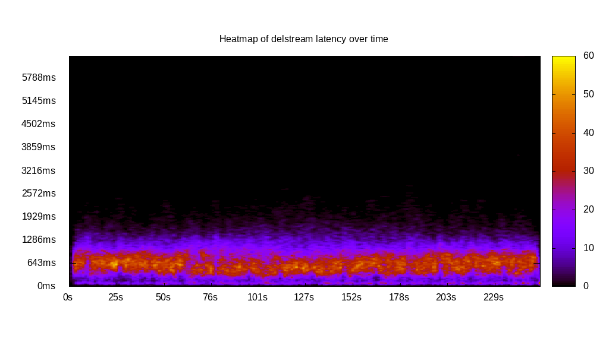
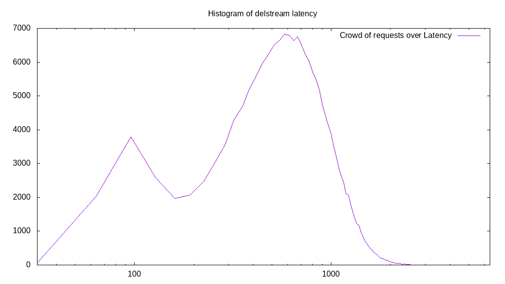

# Latency benchmark report. Crowd is 512

## Populate workload

## Object Size is 32.00kiB

### PUT Latency in ms over time

Evolution of PUT Latency over time

| Parameter | Value |
| --- | --- |
| Y Coordinate | PUT Latency in ms |
| X Coordinate | time in s since begining of workload |

### PUT Latency distribution in ms

Distribution of the PUT Latency in ms

| Parameter | Value |
| --- | --- |
| Y Coordinate | Number of PUT |
| X Coordinate | Latency in ms |
| Server volume | 5621.156MiB|
| Server bandwidth | 18.737MiB/s |
| Server time | 300.00s |
| Server load | 510.78 |
| Server responses | 179877PUT |
| Server IOps | 599.59PUT/s |
| Client bandwidth | 0.037MiB/s |
| Client volume | 10.979MiB|
| Client time | 153233.22s |
| Client IOps |  1.17PUT/s  |
| Client Latency | 851.88ms/PUT |
| Client Limbo | 0.72ms/PUT |
| Crowd time | 153599.49s |
| Crowd efficiency | 99.76% |
| Highest Latency | 3562.46ms |
| 95th percentile Latency | 1583.32ms |
| 68th percentile Latency | 1029.16ms |
| 50th percentile Latency | 870.82ms |
| 32nd percentile Latency | 672.91ms |
| 5th percentile Latency | 316.66ms |
| Lowest Latency | 39.58ms |

## Read workload

## Object Size is 32.00kiB

### GET Latency in ms over time

Evolution of GET Latency over time

| Parameter | Value |
| --- | --- |
| Y Coordinate | GET Latency in ms |
| X Coordinate | time in s since begining of workload |

### GET Latency distribution in ms

Distribution of the GET Latency in ms

| Parameter | Value |
| --- | --- |
| Y Coordinate | Number of GET |
| X Coordinate | Latency in ms |
| Server volume | 0.000MiB|
| Server bandwidth | 0.000MiB/s |
| Server time | 102.28s |
| Server load | 0.00 |
| Server responses | 0GET |
| Server IOps | 0.00GET/s |
| Client bandwidth | 0.000MiB/s |
| Client volume | 0.000MiB|
| Client time | 0.00s |
| Client IOps |  NaNGET/s  |
| Client Latency | NaNms/GET |
| Client Limbo | 102.28ms/GET |
| Crowd time | 52369.41s |
| Crowd efficiency | 0.00% |
| Highest Latency | 0.00ms |
| 95th percentile Latency | 0.00ms |
| 68th percentile Latency | 0.00ms |
| 50th percentile Latency | 0.00ms |
| 32nd percentile Latency | 0.00ms |
| 5th percentile Latency | 0.00ms |
| Lowest Latency | 0.00ms |

## Mixed workload

## Object Size is 32.00kiB

### PUT Latency in ms over time

Evolution of PUT Latency over time

| Parameter | Value |
| --- | --- |
| Y Coordinate | PUT Latency in ms |
| X Coordinate | time in s since begining of workload |

### GET Latency in ms over time

Evolution of GET Latency over time

| Parameter | Value |
| --- | --- |
| Y Coordinate | GET Latency in ms |
| X Coordinate | time in s since begining of workload |

### PUT Latency distribution in ms

Distribution of the PUT Latency in ms

| Parameter | Value |
| --- | --- |
| Y Coordinate | Number of PUT |
| X Coordinate | Latency in ms |
| Server volume | 1007.250MiB|
| Server bandwidth | 9.986MiB/s |
| Server time | 100.87s |
| Server load | 308.47 |
| Server responses | 32232PUT |
| Server IOps | 319.54PUT/s |
| Client bandwidth | 0.020MiB/s |
| Client volume | 1.967MiB|
| Client time | 31114.93s |
| Client IOps |  1.04PUT/s  |
| Client Latency | 965.34ms/PUT |
| Client Limbo | 40.10ms/PUT |
| Crowd time | 51645.44s |
| Crowd efficiency | 60.25% |
| Highest Latency | 3799.96ms |
| 95th percentile Latency | 1741.65ms |
| 68th percentile Latency | 1147.90ms |
| 50th percentile Latency | 949.99ms |
| 32nd percentile Latency | 791.66ms |
| 5th percentile Latency | 435.41ms |
| Lowest Latency | 79.17ms |

### GET Latency distribution in ms

Distribution of the GET Latency in ms

| Parameter | Value |
| --- | --- |
| Y Coordinate | Number of GET |
| X Coordinate | Latency in ms |
| Server volume | 0.000MiB|
| Server bandwidth | 0.000MiB/s |
| Server time | 100.87s |
| Server load | 0.00 |
| Server responses | 0GET |
| Server IOps | 0.00GET/s |
| Client bandwidth | 0.000MiB/s |
| Client volume | 0.000MiB|
| Client time | 0.00s |
| Client IOps |  NaNGET/s  |
| Client Latency | NaNms/GET |
| Client Limbo | 100.87ms/GET |
| Crowd time | 51645.44s |
| Crowd efficiency | 0.00% |
| Highest Latency | 0.00ms |
| 95th percentile Latency | 0.00ms |
| 68th percentile Latency | 0.00ms |
| 50th percentile Latency | 0.00ms |
| 32nd percentile Latency | 0.00ms |
| 5th percentile Latency | 0.00ms |
| Lowest Latency | 0.00ms |

## Cleanup workload

## Object Size is 32.00kiB

### DELETE Latency in ms over time

Evolution of DELETE Latency over time

| Parameter | Value |
| --- | --- |
| Y Coordinate | DELETE Latency in ms |
| X Coordinate | time in s since begining of workload |

### DELETE Latency distribution in ms

Distribution of the DELETE Latency in ms

| Parameter | Value |
| --- | --- |
| Y Coordinate | Number of DELETE |
| X Coordinate | Latency in ms |
| Server volume | 5621.406MiB|
| Server bandwidth | 22.187MiB/s |
| Server time | 253.36s |
| Server load | 505.10 |
| Server responses | 179885DELETE |
| Server IOps | 710.00DELETE/s |
| Client bandwidth | 0.043MiB/s |
| Client volume | 10.979MiB|
| Client time | 127971.09s |
| Client IOps |  1.41DELETE/s  |
| Client Latency | 711.41ms/DELETE |
| Client Limbo | 3.42ms/DELETE |
| Crowd time | 129720.32s |
| Crowd efficiency | 98.65% |
| Highest Latency | 7877.00ms |
| 95th percentile Latency | 1424.98ms |
| 68th percentile Latency | 870.82ms |
| 50th percentile Latency | 712.49ms |
| 32nd percentile Latency | 554.16ms |
| 5th percentile Latency | 197.91ms |
| Lowest Latency | 39.58ms |

