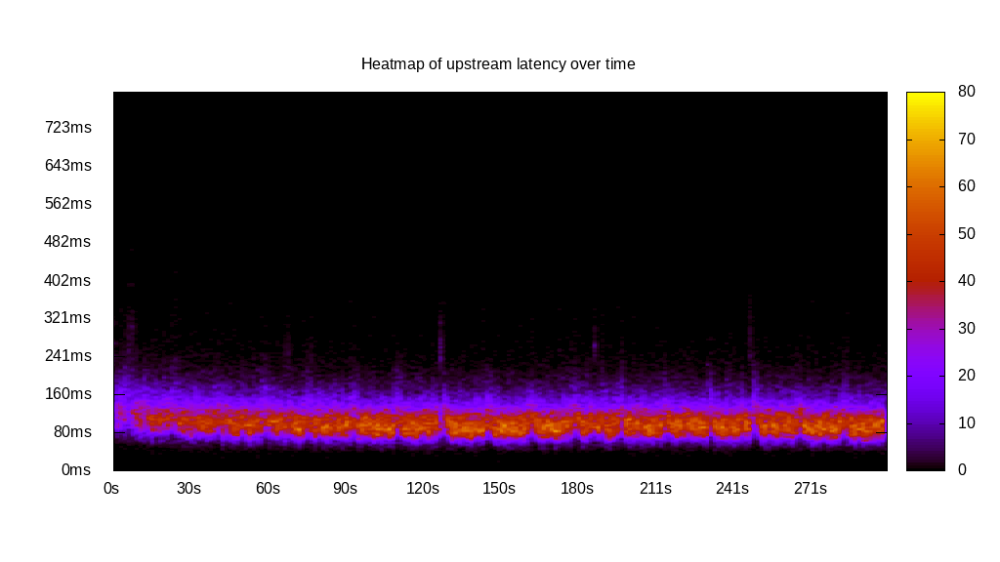
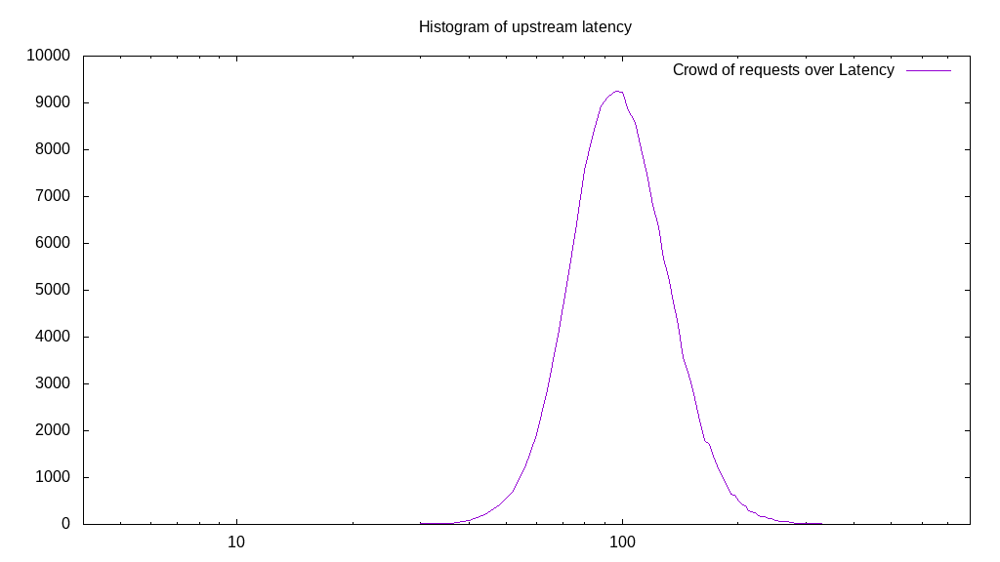
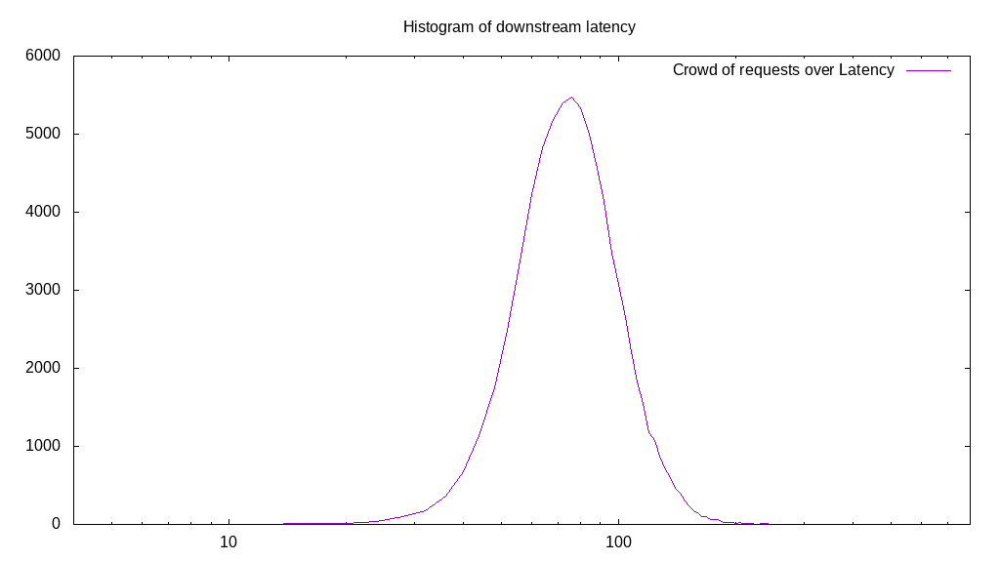
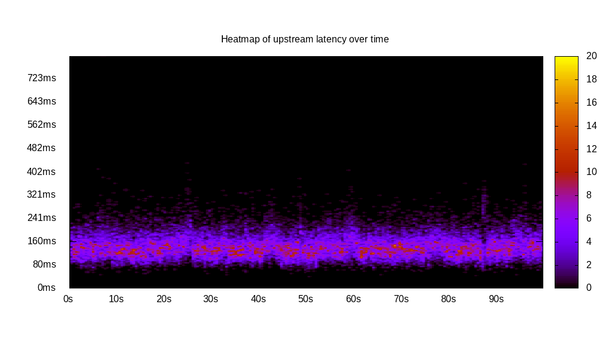
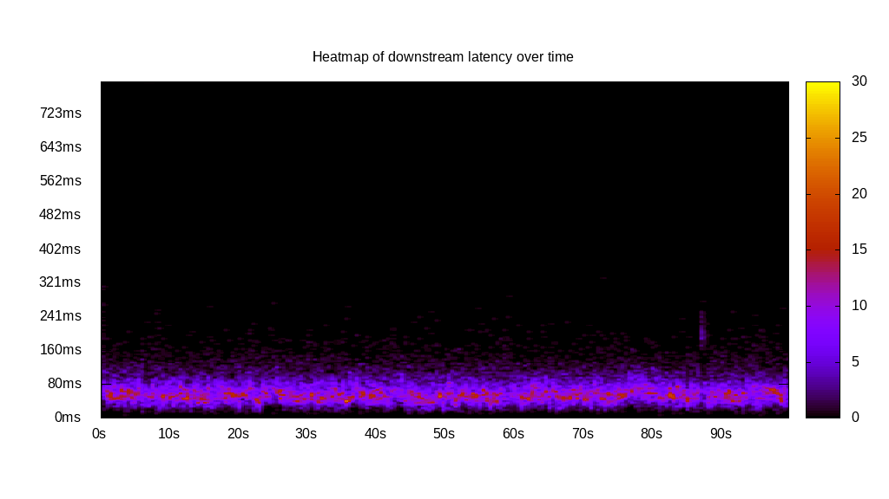

# Latency benchmark report. Crowd is 64

## Populate workload

## Object Size is 32.00kiB

### PUT Latency in ms over time

Evolution of PUT Latency over time

| Parameter | Value |
| --- | --- |
| Y Coordinate | PUT Latency in ms |
| X Coordinate | time in s since begining of workload |

### PUT Latency distribution in ms

Distribution of the PUT Latency in ms

| Parameter | Value |
| --- | --- |
| Y Coordinate | Number of PUT |
| X Coordinate | Latency in ms |
| Server volume | 5315.219MiB|
| Server bandwidth | 17.717MiB/s |
| Server time | 300.01s |
| Server load | 63.86 |
| Server responses | 170087PUT |
| Server IOps | 566.94PUT/s |
| Client bandwidth | 0.277MiB/s |
| Client volume | 83.050MiB|
| Client time | 19157.57s |
| Client IOps |  8.88PUT/s  |
| Client Latency | 112.63ms/PUT |
| Client Limbo | 0.67ms/PUT |
| Crowd time | 19200.64s |
| Crowd efficiency | 99.78% |
| Highest Latency | 468.19ms |
| 95th percentile Latency | 182.41ms |
| 68th percentile Latency | 127.69ms |
| 50th percentile Latency | 115.53ms |
| 32nd percentile Latency | 97.29ms |
| 5th percentile Latency | 72.96ms |
| Lowest Latency | 24.32ms |

## Read workload

## Object Size is 32.00kiB

### GET Latency in ms over time

Evolution of GET Latency over time

| Parameter | Value |
| --- | --- |
| Y Coordinate | GET Latency in ms |
| X Coordinate | time in s since begining of workload |

### GET Latency distribution in ms

Distribution of the GET Latency in ms

| Parameter | Value |
| --- | --- |
| Y Coordinate | Number of GET |
| X Coordinate | Latency in ms |
| Server volume | 2371.938MiB|
| Server bandwidth | 23.673MiB/s |
| Server time | 100.19s |
| Server load | 63.58 |
| Server responses | 75902GET |
| Server IOps | 757.55GET/s |
| Client bandwidth | 0.370MiB/s |
| Client volume | 37.062MiB|
| Client time | 6370.42s |
| Client IOps |  11.91GET/s  |
| Client Latency | 83.93ms/GET |
| Client Limbo | 0.66ms/GET |
| Crowd time | 6412.42s |
| Crowd efficiency | 99.35% |
| Highest Latency | 1100.55ms |
| 95th percentile Latency | 133.77ms |
| 68th percentile Latency | 97.29ms |
| 50th percentile Latency | 85.13ms |
| 32nd percentile Latency | 79.05ms |
| 5th percentile Latency | 54.72ms |
| Lowest Latency | 12.16ms |

## Mixed workload

## Object Size is 32.00kiB

### PUT Latency in ms over time

Evolution of PUT Latency over time

| Parameter | Value |
| --- | --- |
| Y Coordinate | PUT Latency in ms |
| X Coordinate | time in s since begining of workload |

### GET Latency in ms over time

Evolution of GET Latency over time

| Parameter | Value |
| --- | --- |
| Y Coordinate | GET Latency in ms |
| X Coordinate | time in s since begining of workload |

### PUT Latency distribution in ms

Distribution of the PUT Latency in ms

| Parameter | Value |
| --- | --- |
| Y Coordinate | Number of PUT |
| X Coordinate | Latency in ms |
| Server volume | 937.906MiB|
| Server bandwidth | 9.355MiB/s |
| Server time | 100.26s |
| Server load | 43.71 |
| Server responses | 30013PUT |
| Server IOps | 299.35PUT/s |
| Client bandwidth | 0.146MiB/s |
| Client volume | 14.655MiB|
| Client time | 4382.49s |
| Client IOps |  6.85PUT/s  |
| Client Latency | 146.02ms/PUT |
| Client Limbo | 31.78ms/PUT |
| Crowd time | 6416.64s |
| Crowd efficiency | 68.30% |
| Highest Latency | 1179.60ms |
| 95th percentile Latency | 224.97ms |
| 68th percentile Latency | 164.17ms |
| 50th percentile Latency | 145.93ms |
| 32nd percentile Latency | 133.77ms |
| 5th percentile Latency | 97.29ms |
| Lowest Latency | 42.56ms |

### GET Latency distribution in ms

Distribution of the GET Latency in ms

| Parameter | Value |
| --- | --- |
| Y Coordinate | Number of GET |
| X Coordinate | Latency in ms |
| Server volume | 952.875MiB|
| Server bandwidth | 9.504MiB/s |
| Server time | 100.26s |
| Server load | 20.00 |
| Server responses | 30492GET |
| Server IOps | 304.13GET/s |
| Client bandwidth | 0.149MiB/s |
| Client volume | 14.889MiB|
| Client time | 2005.14s |
| Client IOps |  15.21GET/s  |
| Client Latency | 65.76ms/GET |
| Client Limbo | 68.93ms/GET |
| Crowd time | 6416.64s |
| Crowd efficiency | 31.25% |
| Highest Latency | 1082.31ms |
| 95th percentile Latency | 127.69ms |
| 68th percentile Latency | 79.05ms |
| 50th percentile Latency | 66.88ms |
| 32nd percentile Latency | 54.72ms |
| 5th percentile Latency | 36.48ms |
| Lowest Latency | 12.16ms |

## Cleanup workload

## Object Size is 32.00kiB

### DELETE Latency in ms over time

Evolution of DELETE Latency over time

| Parameter | Value |
| --- | --- |
| Y Coordinate | DELETE Latency in ms |
| X Coordinate | time in s since begining of workload |

### DELETE Latency distribution in ms

Distribution of the DELETE Latency in ms

| Parameter | Value |
| --- | --- |
| Y Coordinate | Number of DELETE |
| X Coordinate | Latency in ms |
| Server volume | 5315.469MiB|
| Server bandwidth | 21.944MiB/s |
| Server time | 242.23s |
| Server load | 63.68 |
| Server responses | 170095DELETE |
| Server IOps | 702.21DELETE/s |
| Client bandwidth | 0.343MiB/s |
| Client volume | 83.054MiB|
| Client time | 15425.64s |
| Client IOps |  11.03DELETE/s  |
| Client Latency | 90.69ms/DELETE |
| Client Limbo | 1.20ms/DELETE |
| Crowd time | 15502.59s |
| Crowd efficiency | 99.50% |
| Highest Latency | 1210.00ms |
| 95th percentile Latency | 152.01ms |
| 68th percentile Latency | 103.37ms |
| 50th percentile Latency | 91.21ms |
| 32nd percentile Latency | 79.05ms |
| 5th percentile Latency | 60.80ms |
| Lowest Latency | 18.24ms |

