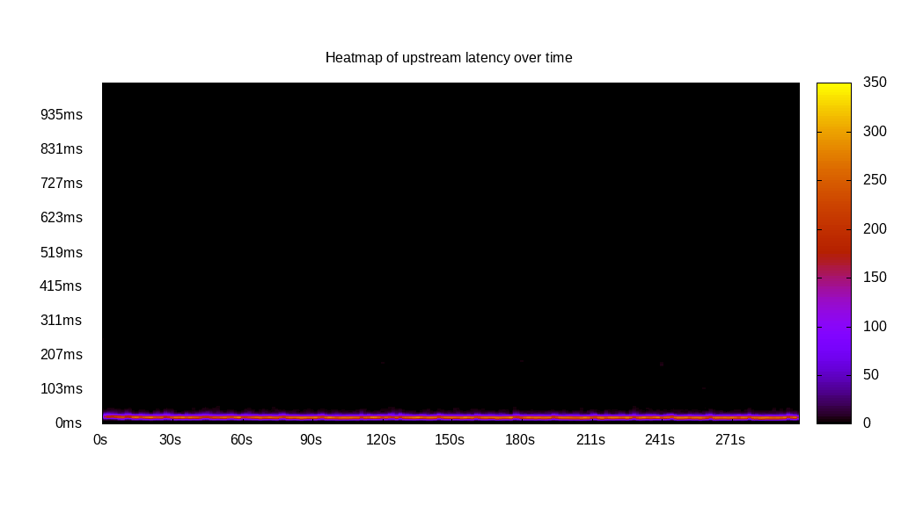
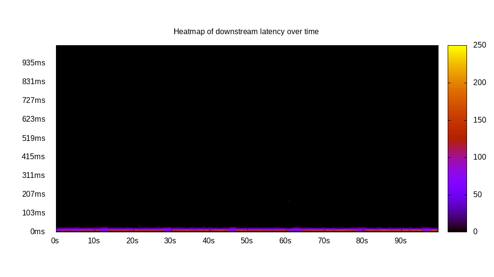
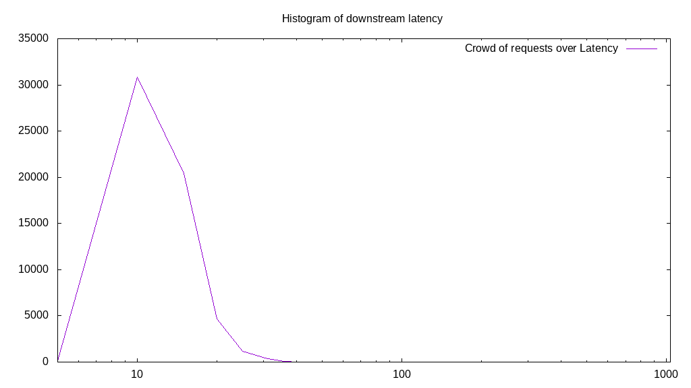
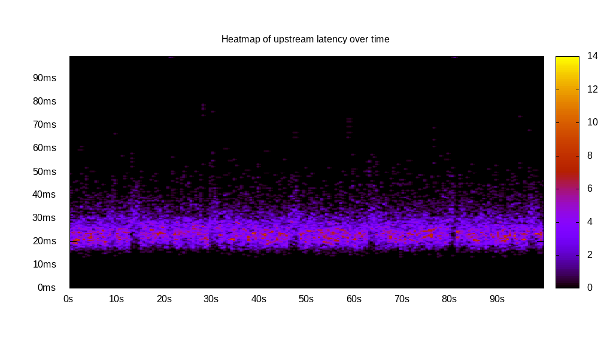
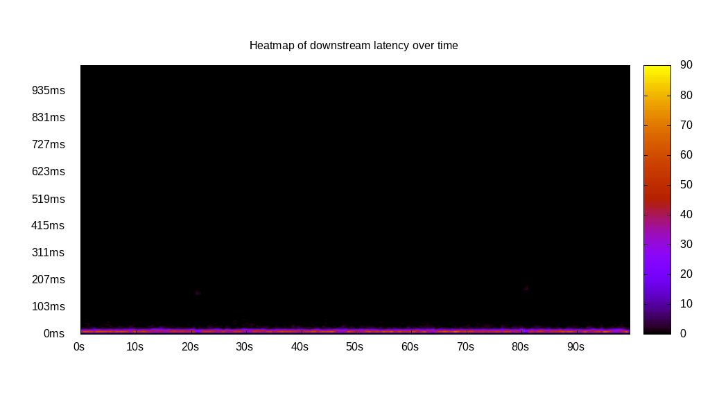
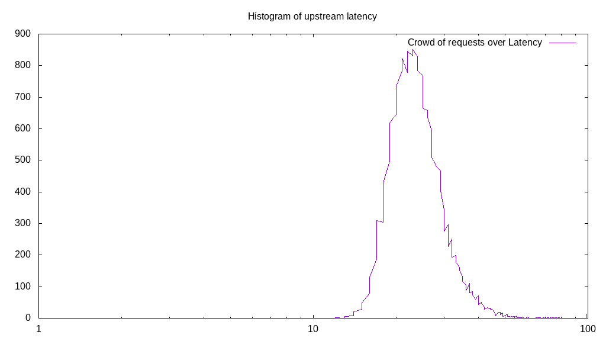
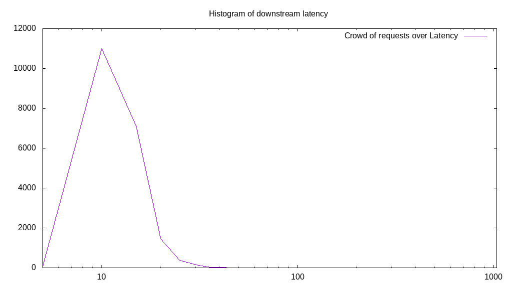
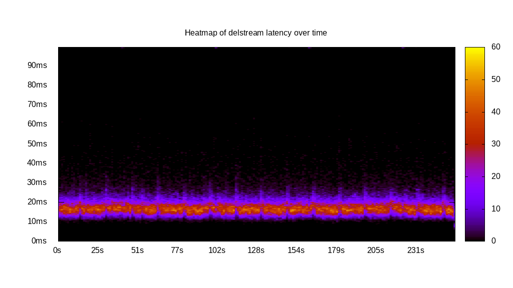
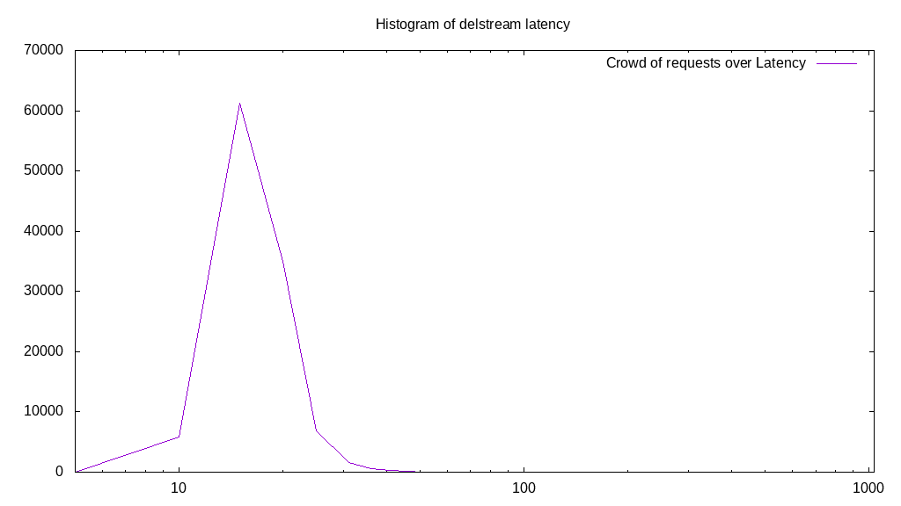

# Latency benchmark report. Crowd is 8

## Populate workload

## Object Size is 32.00kiB

### PUT Latency in ms over time

Evolution of PUT Latency over time

| Parameter | Value |
| --- | --- |
| Y Coordinate | PUT Latency in ms |
| X Coordinate | time in s since begining of workload |

### PUT Latency distribution in ms

Distribution of the PUT Latency in ms

| Parameter | Value |
| --- | --- |
| Y Coordinate | Number of PUT |
| X Coordinate | Latency in ms |
| Server volume | 3488.438MiB|
| Server bandwidth | 11.628MiB/s |
| Server time | 300.00s |
| Server load | 7.94 |
| Server responses | 111630PUT |
| Server IOps | 372.10PUT/s |
| Client bandwidth | 1.454MiB/s |
| Client volume | 436.055MiB|
| Client time | 2381.44s |
| Client IOps |  46.88PUT/s  |
| Client Latency | 21.33ms/PUT |
| Client Limbo | 2.32ms/PUT |
| Crowd time | 2399.99s |
| Crowd efficiency | 99.23% |
| Highest Latency | 259.80ms |
| 95th percentile Latency | 36.37ms |
| 68th percentile Latency | 25.98ms |
| 50th percentile Latency | 25.98ms |
| 32nd percentile Latency | 25.98ms |
| 5th percentile Latency | 20.78ms |
| Lowest Latency | 10.39ms |

## Read workload

## Object Size is 32.00kiB

### GET Latency in ms over time

Evolution of GET Latency over time

| Parameter | Value |
| --- | --- |
| Y Coordinate | GET Latency in ms |
| X Coordinate | time in s since begining of workload |

### GET Latency distribution in ms

Distribution of the GET Latency in ms

| Parameter | Value |
| --- | --- |
| Y Coordinate | Number of GET |
| X Coordinate | Latency in ms |
| Server volume | 0.000MiB|
| Server bandwidth | 0.000MiB/s |
| Server time | 100.02s |
| Server load | 0.00 |
| Server responses | 0GET |
| Server IOps | 0.00GET/s |
| Client bandwidth | 0.000MiB/s |
| Client volume | 0.000MiB|
| Client time | 0.00s |
| Client IOps |  NaNGET/s  |
| Client Latency | NaNms/GET |
| Client Limbo | 100.02ms/GET |
| Crowd time | 800.16s |
| Crowd efficiency | 0.00% |
| Highest Latency | 0.00ms |
| 95th percentile Latency | 0.00ms |
| 68th percentile Latency | 0.00ms |
| 50th percentile Latency | 0.00ms |
| 32nd percentile Latency | 0.00ms |
| 5th percentile Latency | 0.00ms |
| Lowest Latency | 0.00ms |

## Mixed workload

## Object Size is 32.00kiB

### PUT Latency in ms over time

Evolution of PUT Latency over time

| Parameter | Value |
| --- | --- |
| Y Coordinate | PUT Latency in ms |
| X Coordinate | time in s since begining of workload |

### GET Latency in ms over time

Evolution of GET Latency over time

| Parameter | Value |
| --- | --- |
| Y Coordinate | GET Latency in ms |
| X Coordinate | time in s since begining of workload |

### PUT Latency distribution in ms

Distribution of the PUT Latency in ms

| Parameter | Value |
| --- | --- |
| Y Coordinate | Number of PUT |
| X Coordinate | Latency in ms |
| Server volume | 628.156MiB|
| Server bandwidth | 6.281MiB/s |
| Server time | 100.01s |
| Server load | 5.19 |
| Server responses | 20101PUT |
| Server IOps | 200.98PUT/s |
| Client bandwidth | 0.785MiB/s |
| Client volume | 78.520MiB|
| Client time | 519.20s |
| Client IOps |  38.72PUT/s  |
| Client Latency | 25.83ms/PUT |
| Client Limbo | 35.11ms/PUT |
| Crowd time | 800.11s |
| Crowd efficiency | 64.89% |
| Highest Latency | 192.25ms |
| 95th percentile Latency | 41.57ms |
| 68th percentile Latency | 31.18ms |
| 50th percentile Latency | 31.18ms |
| 32nd percentile Latency | 25.98ms |
| 5th percentile Latency | 20.78ms |
| Lowest Latency | 10.39ms |

### GET Latency distribution in ms

Distribution of the GET Latency in ms

| Parameter | Value |
| --- | --- |
| Y Coordinate | Number of GET |
| X Coordinate | Latency in ms |
| Server volume | 0.000MiB|
| Server bandwidth | 0.000MiB/s |
| Server time | 100.01s |
| Server load | 0.00 |
| Server responses | 0GET |
| Server IOps | 0.00GET/s |
| Client bandwidth | 0.000MiB/s |
| Client volume | 0.000MiB|
| Client time | 0.00s |
| Client IOps |  NaNGET/s  |
| Client Latency | NaNms/GET |
| Client Limbo | 100.01ms/GET |
| Crowd time | 800.11s |
| Crowd efficiency | 0.00% |
| Highest Latency | 0.00ms |
| 95th percentile Latency | 0.00ms |
| 68th percentile Latency | 0.00ms |
| 50th percentile Latency | 0.00ms |
| 32nd percentile Latency | 0.00ms |
| 5th percentile Latency | 0.00ms |
| Lowest Latency | 0.00ms |

## Cleanup workload

## Object Size is 32.00kiB

### DELETE Latency in ms over time

Evolution of DELETE Latency over time

| Parameter | Value |
| --- | --- |
| Y Coordinate | DELETE Latency in ms |
| X Coordinate | time in s since begining of workload |

### DELETE Latency distribution in ms

Distribution of the DELETE Latency in ms

| Parameter | Value |
| --- | --- |
| Y Coordinate | Number of DELETE |
| X Coordinate | Latency in ms |
| Server volume | 3488.688MiB|
| Server bandwidth | 13.641MiB/s |
| Server time | 255.75s |
| Server load | 7.92 |
| Server responses | 111638DELETE |
| Server IOps | 436.51DELETE/s |
| Client bandwidth | 1.705MiB/s |
| Client volume | 436.086MiB|
| Client time | 2024.75s |
| Client IOps |  55.14DELETE/s  |
| Client Latency | 18.14ms/DELETE |
| Client Limbo | 2.66ms/DELETE |
| Crowd time | 2046.02s |
| Crowd efficiency | 98.96% |
| Highest Latency | 1034.00ms |
| 95th percentile Latency | 31.18ms |
| 68th percentile Latency | 25.98ms |
| 50th percentile Latency | 20.78ms |
| 32nd percentile Latency | 20.78ms |
| 5th percentile Latency | 15.59ms |
| Lowest Latency | 5.20ms |

