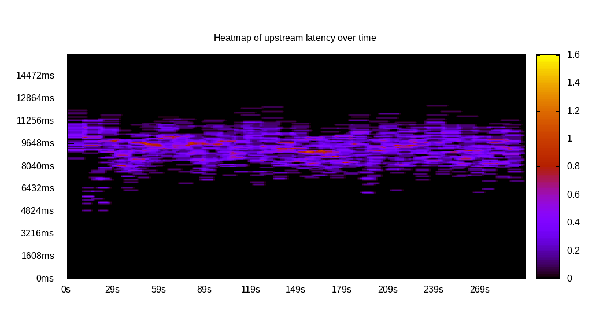
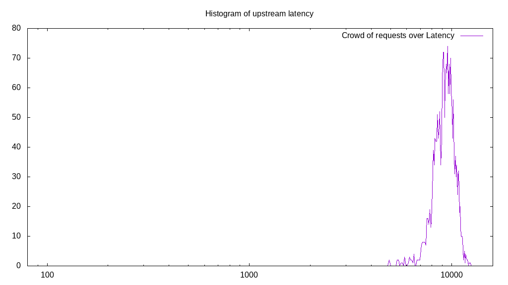
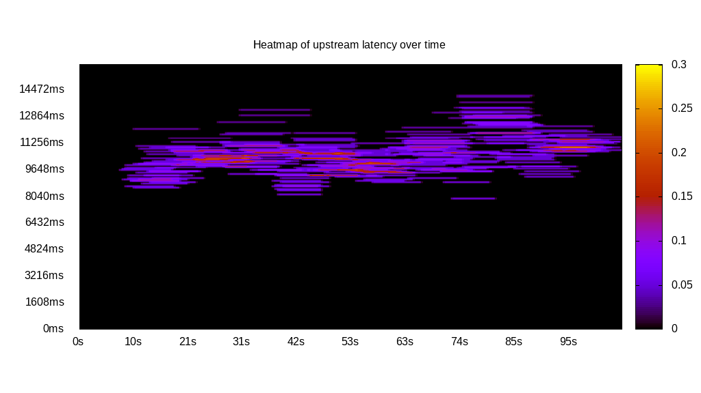
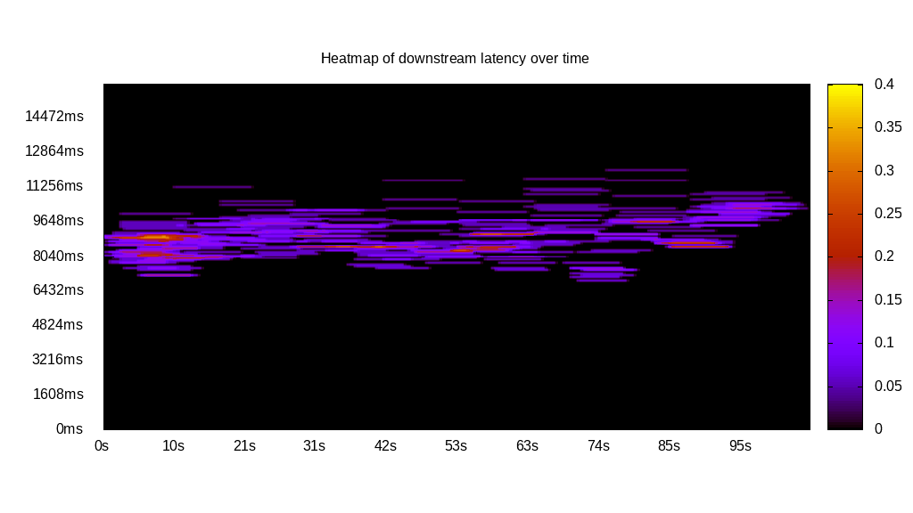
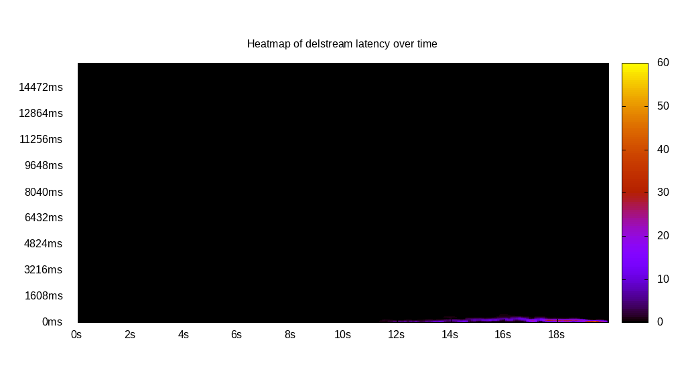
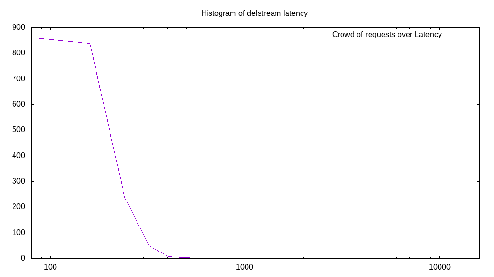

# Latency benchmark report. Crowd is 64

## Populate workload

## Object Size is 32768.00kiB

### PUT Latency in ms over time

Evolution of PUT Latency over time

| Parameter | Value |
| --- | --- |
| Y Coordinate | PUT Latency in ms |
| X Coordinate | time in s since begining of workload |

### PUT Latency distribution in ms

Distribution of the PUT Latency in ms

| Parameter | Value |
| --- | --- |
| Y Coordinate | Number of PUT |
| X Coordinate | Latency in ms |
| Server volume | 64576.000MiB|
| Server bandwidth | 216.420MiB/s |
| Server time | 298.38s |
| Server load | 63.18 |
| Server responses | 2018PUT |
| Server IOps | 6.76PUT/s |
| Client bandwidth | 3.382MiB/s |
| Client volume | 1009.000MiB|
| Client time | 18852.23s |
| Client IOps |  0.11PUT/s  |
| Client Latency | 9342.04ms/PUT |
| Client Limbo | 3.82ms/PUT |
| Crowd time | 19096.51s |
| Crowd efficiency | 98.72% |
| Highest Latency | 12319.51ms |
| 95th percentile Latency | 10966.50ms |
| 68th percentile Latency | 9898.34ms |
| 50th percentile Latency | 9471.07ms |
| 32nd percentile Latency | 8972.59ms |
| 5th percentile Latency | 7690.79ms |
| Lowest Latency | 4913.56ms |

## Read workload

## Object Size is 32768.00kiB

### GET Latency in ms over time

Evolution of GET Latency over time

| Parameter | Value |
| --- | --- |
| Y Coordinate | GET Latency in ms |
| X Coordinate | time in s since begining of workload |

### GET Latency distribution in ms

Distribution of the GET Latency in ms

| Parameter | Value |
| --- | --- |
| Y Coordinate | Number of GET |
| X Coordinate | Latency in ms |
| Server volume | 21248.000MiB|
| Server bandwidth | 197.590MiB/s |
| Server time | 107.54s |
| Server load | 54.54 |
| Server responses | 664GET |
| Server IOps | 6.17GET/s |
| Client bandwidth | 3.087MiB/s |
| Client volume | 332.000MiB|
| Client time | 5864.78s |
| Client IOps |  0.11GET/s  |
| Client Latency | 8832.50ms/GET |
| Client Limbo | 15.90ms/GET |
| Crowd time | 6882.30s |
| Crowd efficiency | 85.22% |
| Highest Latency | 10539.24ms |
| 95th percentile Latency | 9755.91ms |
| 68th percentile Latency | 9043.80ms |
| 50th percentile Latency | 8830.17ms |
| 32nd percentile Latency | 8687.75ms |
| 5th percentile Latency | 8260.48ms |
| Lowest Latency | 7548.37ms |

## Mixed workload

## Object Size is 32768.00kiB

### PUT Latency in ms over time

Evolution of PUT Latency over time

| Parameter | Value |
| --- | --- |
| Y Coordinate | PUT Latency in ms |
| X Coordinate | time in s since begining of workload |

### GET Latency in ms over time

Evolution of GET Latency over time

| Parameter | Value |
| --- | --- |
| Y Coordinate | GET Latency in ms |
| X Coordinate | time in s since begining of workload |

### PUT Latency distribution in ms

Distribution of the PUT Latency in ms

| Parameter | Value |
| --- | --- |
| Y Coordinate | Number of PUT |
| X Coordinate | Latency in ms |
| Server volume | 10144.000MiB|
| Server bandwidth | 95.834MiB/s |
| Server time | 105.85s |
| Server load | 31.82 |
| Server responses | 317PUT |
| Server IOps | 2.99PUT/s |
| Client bandwidth | 1.497MiB/s |
| Client volume | 158.500MiB|
| Client time | 3368.58s |
| Client IOps |  0.09PUT/s  |
| Client Latency | 10626.44ms/PUT |
| Client Limbo | 53.22ms/PUT |
| Crowd time | 6774.40s |
| Crowd efficiency | 49.73% |
| Highest Latency | 14171.00ms |
| 95th percentile Latency | 12889.20ms |
| 68th percentile Latency | 11037.71ms |
| 50th percentile Latency | 10610.45ms |
| 32nd percentile Latency | 10183.18ms |
| 5th percentile Latency | 9043.80ms |
| Lowest Latency | 7833.22ms |

### GET Latency distribution in ms

Distribution of the GET Latency in ms

| Parameter | Value |
| --- | --- |
| Y Coordinate | Number of GET |
| X Coordinate | Latency in ms |
| Server volume | 10880.000MiB|
| Server bandwidth | 102.787MiB/s |
| Server time | 105.85s |
| Server load | 28.92 |
| Server responses | 340GET |
| Server IOps | 3.21GET/s |
| Client bandwidth | 1.606MiB/s |
| Client volume | 170.000MiB|
| Client time | 3061.16s |
| Client IOps |  0.11GET/s  |
| Client Latency | 9003.42ms/GET |
| Client Limbo | 58.02ms/GET |
| Crowd time | 6774.40s |
| Crowd efficiency | 45.19% |
| Highest Latency | 12034.67ms |
| 95th percentile Latency | 10539.24ms |
| 68th percentile Latency | 9471.07ms |
| 50th percentile Latency | 8972.59ms |
| 32nd percentile Latency | 8545.33ms |
| 5th percentile Latency | 7619.58ms |
| Lowest Latency | 6907.47ms |

## Cleanup workload

## Object Size is 32768.00kiB

### DELETE Latency in ms over time

Evolution of DELETE Latency over time

| Parameter | Value |
| --- | --- |
| Y Coordinate | DELETE Latency in ms |
| X Coordinate | time in s since begining of workload |

### DELETE Latency distribution in ms

Distribution of the DELETE Latency in ms

| Parameter | Value |
| --- | --- |
| Y Coordinate | Number of DELETE |
| X Coordinate | Latency in ms |
| Server volume | 64640.000MiB|
| Server bandwidth | 3239.451MiB/s |
| Server time | 19.95s |
| Server load | 14.31 |
| Server responses | 2020DELETE |
| Server IOps | 101.23DELETE/s |
| Client bandwidth | 50.616MiB/s |
| Client volume | 1010.000MiB|
| Client time | 285.63s |
| Client IOps |  7.07DELETE/s  |
| Client Latency | 141.40ms/DELETE |
| Client Limbo | 15.49ms/DELETE |
| Crowd time | 1277.06s |
| Crowd efficiency | 22.37% |
| Highest Latency | 569.69ms |
| 95th percentile Latency | 356.06ms |
| 68th percentile Latency | 213.63ms |
| 50th percentile Latency | 213.63ms |
| 32nd percentile Latency | 142.42ms |
| 5th percentile Latency | 142.42ms |
| Lowest Latency | 71.21ms |

