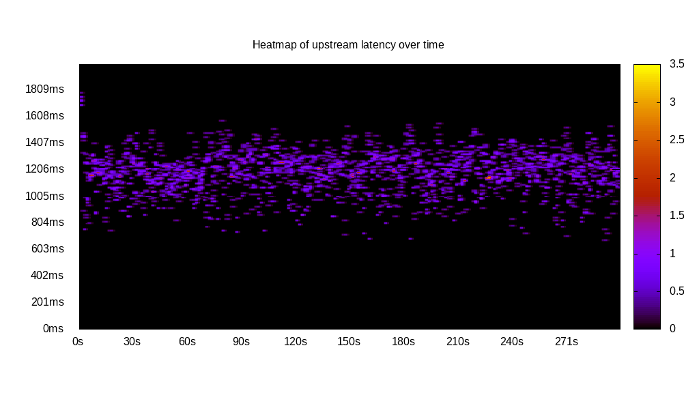
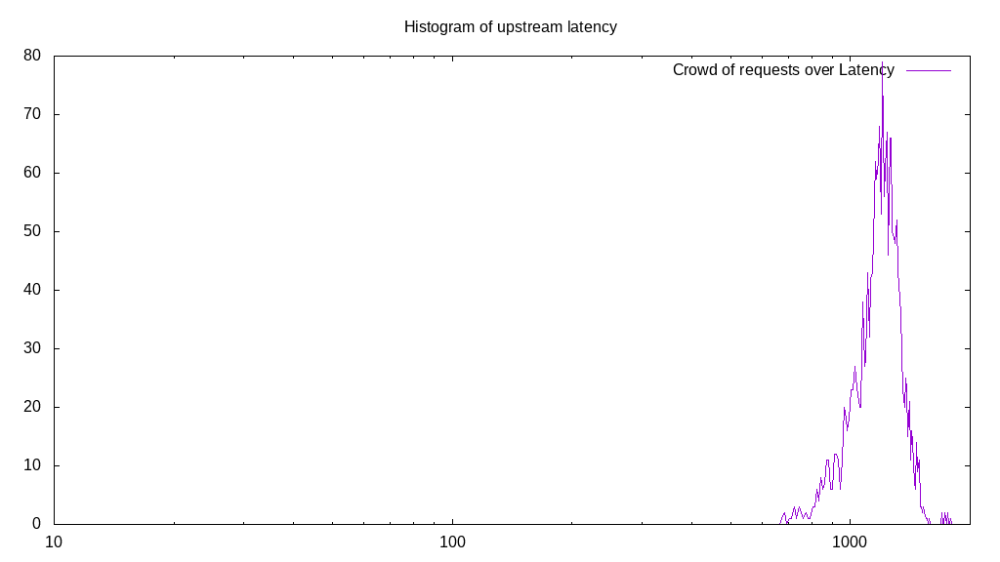
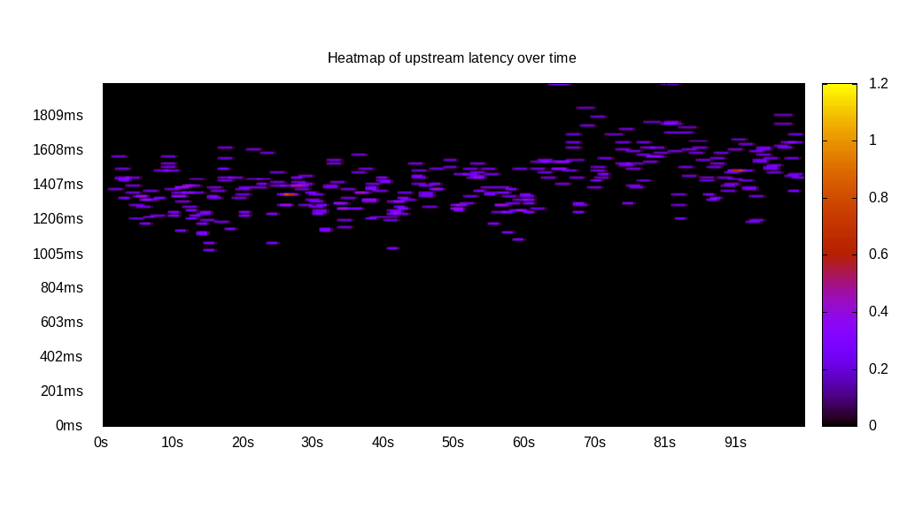
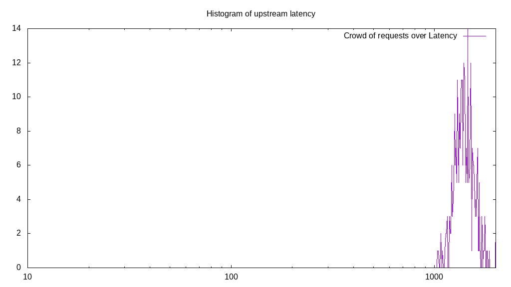

# Latency benchmark report. Crowd is 8

## Populate workload

## Object Size is 32768.00kiB

### PUT Latency in ms over time

Evolution of PUT Latency over time

| Parameter | Value |
| --- | --- |
| Y Coordinate | PUT Latency in ms |
| X Coordinate | time in s since begining of workload |

### PUT Latency distribution in ms

Distribution of the PUT Latency in ms

| Parameter | Value |
| --- | --- |
| Y Coordinate | Number of PUT |
| X Coordinate | Latency in ms |
| Server volume | 64256.000MiB|
| Server bandwidth | 214.462MiB/s |
| Server time | 299.62s |
| Server load | 7.99 |
| Server responses | 2008PUT |
| Server IOps | 6.70PUT/s |
| Client bandwidth | 26.808MiB/s |
| Client volume | 8032.000MiB|
| Client time | 2394.83s |
| Client IOps |  0.84PUT/s  |
| Client Latency | 1192.64ms/PUT |
| Client Limbo | 0.26ms/PUT |
| Crowd time | 2396.92s |
| Crowd efficiency | 99.91% |
| Highest Latency | 1788.94ms |
| 95th percentile Latency | 1437.19ms |
| 68th percentile Latency | 1276.38ms |
| 50th percentile Latency | 1216.08ms |
| 32nd percentile Latency | 1155.78ms |
| 5th percentile Latency | 924.62ms |
| Lowest Latency | 673.37ms |

## Read workload

## Object Size is 32768.00kiB

### GET Latency in ms over time

Evolution of GET Latency over time

| Parameter | Value |
| --- | --- |
| Y Coordinate | GET Latency in ms |
| X Coordinate | time in s since begining of workload |

### GET Latency distribution in ms

Distribution of the GET Latency in ms

| Parameter | Value |
| --- | --- |
| Y Coordinate | Number of GET |
| X Coordinate | Latency in ms |
| Server volume | 23328.000MiB|
| Server bandwidth | 231.188MiB/s |
| Server time | 100.91s |
| Server load | 7.83 |
| Server responses | 729GET |
| Server IOps | 7.22GET/s |
| Client bandwidth | 28.898MiB/s |
| Client volume | 2916.000MiB|
| Client time | 789.91s |
| Client IOps |  0.92GET/s  |
| Client Latency | 1083.56ms/GET |
| Client Limbo | 2.17ms/GET |
| Crowd time | 807.24s |
| Crowd efficiency | 97.85% |
| Highest Latency | 1457.29ms |
| 95th percentile Latency | 1246.23ms |
| 68th percentile Latency | 1135.68ms |
| 50th percentile Latency | 1085.43ms |
| 32nd percentile Latency | 1055.28ms |
| 5th percentile Latency | 934.67ms |
| Lowest Latency | 773.87ms |

## Mixed workload

## Object Size is 32768.00kiB

### PUT Latency in ms over time

Evolution of PUT Latency over time

| Parameter | Value |
| --- | --- |
| Y Coordinate | PUT Latency in ms |
| X Coordinate | time in s since begining of workload |

### GET Latency in ms over time

Evolution of GET Latency over time

| Parameter | Value |
| --- | --- |
| Y Coordinate | GET Latency in ms |
| X Coordinate | time in s since begining of workload |

### PUT Latency distribution in ms

Distribution of the PUT Latency in ms

| Parameter | Value |
| --- | --- |
| Y Coordinate | Number of PUT |
| X Coordinate | Latency in ms |
| Server volume | 10784.000MiB|
| Server bandwidth | 106.887MiB/s |
| Server time | 100.89s |
| Server load | 4.76 |
| Server responses | 337PUT |
| Server IOps | 3.34PUT/s |
| Client bandwidth | 13.361MiB/s |
| Client volume | 1348.000MiB|
| Client time | 480.26s |
| Client IOps |  0.70PUT/s  |
| Client Latency | 1425.10ms/PUT |
| Client Limbo | 40.86ms/PUT |
| Crowd time | 807.14s |
| Crowd efficiency | 59.50% |
| Highest Latency | 2000.00ms |
| 95th percentile Latency | 1718.59ms |
| 68th percentile Latency | 1497.49ms |
| 50th percentile Latency | 1417.09ms |
| 32nd percentile Latency | 1356.78ms |
| 5th percentile Latency | 1206.03ms |
| Lowest Latency | 1035.18ms |

### GET Latency distribution in ms

Distribution of the GET Latency in ms

| Parameter | Value |
| --- | --- |
| Y Coordinate | Number of GET |
| X Coordinate | Latency in ms |
| Server volume | 11552.000MiB|
| Server bandwidth | 114.499MiB/s |
| Server time | 100.89s |
| Server load | 3.50 |
| Server responses | 361GET |
| Server IOps | 3.58GET/s |
| Client bandwidth | 14.312MiB/s |
| Client volume | 1444.000MiB|
| Client time | 353.16s |
| Client IOps |  1.02GET/s  |
| Client Latency | 978.29ms/GET |
| Client Limbo | 56.75ms/GET |
| Crowd time | 807.14s |
| Crowd efficiency | 43.76% |
| Highest Latency | 1487.44ms |
| 95th percentile Latency | 1236.18ms |
| 68th percentile Latency | 1035.18ms |
| 50th percentile Latency | 974.87ms |
| 32nd percentile Latency | 914.57ms |
| 5th percentile Latency | 804.02ms |
| Lowest Latency | 693.47ms |

## Cleanup workload

## Object Size is 32768.00kiB

### DELETE Latency in ms over time

Evolution of DELETE Latency over time

| Parameter | Value |
| --- | --- |
| Y Coordinate | DELETE Latency in ms |
| X Coordinate | time in s since begining of workload |

### DELETE Latency distribution in ms

Distribution of the DELETE Latency in ms

| Parameter | Value |
| --- | --- |
| Y Coordinate | Number of DELETE |
| X Coordinate | Latency in ms |
| Server volume | 64480.000MiB|
| Server bandwidth | 8345.845MiB/s |
| Server time | 7.73s |
| Server load | 6.13 |
| Server responses | 2015DELETE |
| Server IOps | 260.81DELETE/s |
| Client bandwidth | 1043.231MiB/s |
| Client volume | 8060.000MiB|
| Client time | 47.35s |
| Client IOps |  42.56DELETE/s  |
| Client Latency | 23.50ms/DELETE |
| Client Limbo | 1.81ms/DELETE |
| Crowd time | 61.81s |
| Crowd efficiency | 76.61% |
| Highest Latency | 160.80ms |
| 95th percentile Latency | 40.20ms |
| 68th percentile Latency | 40.20ms |
| 50th percentile Latency | 30.15ms |
| 32nd percentile Latency | 30.15ms |
| 5th percentile Latency | 20.10ms |
| Lowest Latency | 10.05ms |

